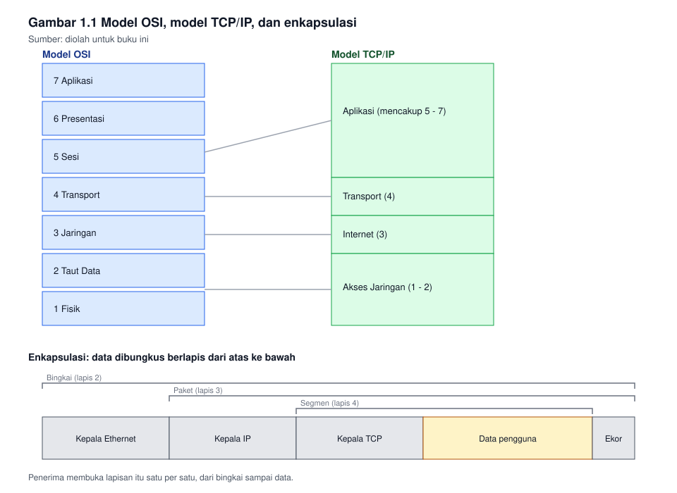
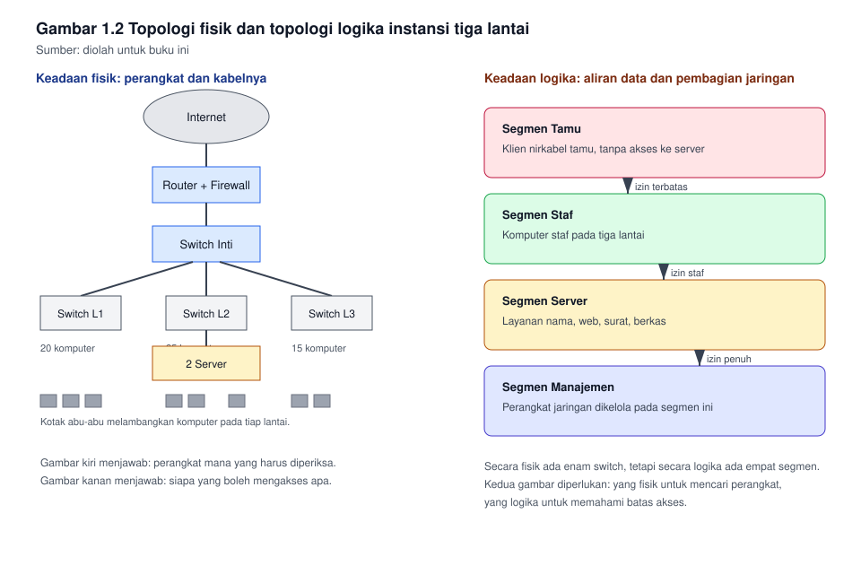

# Bab 1. Peran dan Ruang Lingkup Administrator Jaringan

## Capaian pembelajaran bab

Sesudah mempelajari bab ini mahasiswa mampu:

1. Menjelaskan ruang lingkup pekerjaan administrator jaringan pada organisasi
   kecil dan menengah. *(Sub-CPMK pertemuan 1, menuju CPMK-1)*
2. Menjelaskan fungsi tiap lapisan pada model referensi OSI dan model
   TCP/IP, serta mengaitkannya dengan gejala gangguan.
3. Membedakan topologi fisik dan topologi logika, lalu menggambar keduanya
   untuk satu instansi.
4. Menyusun dokumentasi jaringan paling dasar: daftar perangkat, tabel
   inventaris, dan diagram topologi.
5. Menjelaskan alur pengelolaan perubahan dan penanganan tiket.

## Peta konsep

```
Bab 1 Peran dan Ruang Lingkup
|-- 1.1 Pekerjaan administrator jaringan
|-- 1.2 Model referensi
|   |-- Model OSI tujuh lapis
|   |-- Model TCP/IP
|   |-- Enkapsulasi
|   `-- Satuan data tiap lapis
|-- 1.3 Perangkat dan fungsinya
|-- 1.4 Topologi fisik dan topologi logika
|-- 1.5 Identitas di dalam jaringan
|-- 1.6 Dokumentasi jaringan
|-- 1.7 Perubahan dan tiket
`-- 1.8 Mengukur mutu layanan
```

---

## 1.1 Pekerjaan administrator jaringan

Pekerjaan ini sering disangka hanya menangani komputer yang tidak dapat
menyambung ke internet. Kenyataannya lebih luas, dan dapat dipetakan menurut
berapa kali pekerjaan itu dilakukan.

| Kekerapan | Pekerjaan | Hasil yang diharapkan |
|---|---|---|
| Harian | Memeriksa mutu layanan, membaca catatan kejadian, menangani tiket | Gangguan tertangani sebelum menjadi keluhan |
| Mingguan | Memeriksa cadangan konfigurasi, memperbarui perangkat, merapikan dokumentasi | Keadaan jaringan tetap tercatat |
| Bulanan | Meninjau kapasitas, menguji pemulihan, meninjau hak akses | Kapasitas dan keamanan tidak kedaluwarsa |
| Tahunan | Menyusun rencana pengembangan, menyusun anggaran, mengevaluasi perangkat | Keputusan pengadaan berdasar data |
| Insidental | Menangani gangguan besar, memulihkan layanan, merespons insiden keamanan | Layanan pulih, dan sebabnya diketahui |

Perhatikan bahwa empat dari lima baris di atas tidak berhubungan dengan
memasang kabel. Pekerjaan yang paling sering, justru pekerjaan yang paling
jarang terlihat: membaca catatan, merapikan dokumentasi, dan memastikan
cadangan benar-benar ada.

### Tiga peran yang sering bercampur

Di organisasi kecil, satu orang sering merangkap tiga peran sekaligus.
Mencampurnya tanpa sadar adalah sumber kesalahan yang paling umum.

| Peran | Pertanyaannya | Batasnya |
|---|---|---|
| Perancang | Jaringan seperti apa yang dibutuhkan? | Tidak mengubah perangkat produksi seenaknya |
| Pengelola | Apakah layanan berjalan sesuai rencana? | Tidak mengubah rancangan tanpa pencatatan |
| Pemadam | Bagaimana layanan hidup kembali secepatnya? | Tidak meninggalkan perubahan tanpa laporan |

Bila kalian sedang memadamkan gangguan, jangan sekalian merancang ulang.
Keadaan darurat menghasilkan keputusan yang buruk untuk jangka panjang.

## 1.2 Model referensi

### Mengapa model referensi perlu dipelajari

Model referensi bukan teori yang menghiasi buku. Ia adalah alat untuk
membagi persoalan. Bila sebuah layanan tidak dapat diakses, persoalannya
mungkin pada kabel, pada alamat, pada layanan, atau pada izin akses.
Tanpa model, kalian akan memeriksa keempatnya secara acak. Dengan model,
kalian memeriksa secara berurutan dan berhenti pada lapisan yang
bermasalah.

### Model OSI tujuh lapis

| Lapis | Nama | Yang dikerjakannya | Contoh pada jaringan kampus |
|---|---|---|---|
| 7 | Aplikasi | Menyediakan layanan kepada pengguna | Peramban, surel, berkas bersama |
| 6 | Presentasi | Menyajikan data agar dapat dibaca bersama | Enkripsi TLS, format berkas |
| 5 | Sesi | Mengatur percakapan antar aplikasi | Sesi masuk, sambungan yang dijaga |
| 4 | Transport | Mengantar data antar aplikasi, mengatur keandalan | TCP dan UDP, nomor port |
| 3 | Jaringan | Mengantar paket antar jaringan yang berbeda | IP, routing, alamat logika |
| 2 | Taut Data | Mengantar bingkai dalam satu jaringan | Switch, alamat MAC, VLAN |
| 1 | Fisik | Mengantar bit melalui medium | Kabel, serat optik, radio, tegangan |

### Model TCP/IP

Model TCP/IP lebih tua dan lebih sederhana. Ia dipergunakan pada keseharian,
sebab cocok dengan kenyataan perangkat lunak.

| Lapis TCP/IP | Lapisan OSI yang dicakup | Contoh |
|---|---|---|
| Aplikasi | 5, 6, 7 | HTTP, DNS, DHCP, SSH, SMTP |
| Transport | 4 | TCP, UDP |
| Internet | 3 | IP, ICMP, OSPF |
| Akses Jaringan | 1, 2 | Ethernet, Wi-Fi, ARP |

Perbedaan yang perlu kalian ingat: model OSI memisahkan presentasi dan
sesi, sedangkan model TCP/IP menggabungkannya ke dalam aplikasi.
Perbedaan ini tidak mengubah cara kerja jaringan, hanya mengubah cara
kita membicarakannya.

### Enkapsulasi

Data yang dikirim tidak dikirim utuh. Ia dibungkus berlapis, dan tiap
lapis menambahkan kepala sendiri.

```
Data pengguna
  +--- kepala TCP     -> segmen
        +--- kepala IP -> paket
              +--- kepala Ethernet -> bingkai
                    -> dikirim sebagai bit di atas kabel
```

Proses sebaliknya terjadi di penerima: bingkai dibuka, paket dibuka,
segmen dibuka, dan data sampailah ke aplikasi.

Kegunaan praktisnya: bila kalian memeriksa lalu lintas dengan alat
pengamat paket, kalian dapat menentukan lapisan mana yang bermasalah
dari lapisan pembungkus yang tidak terbentuk. Bingkai yang tidak pernah
sampai berarti persoalan pada lapis 1 atau 2. Paket yang sampai tetapi
tidak dijawab berarti persoalan pada lapis 3. Sambungan terbentuk tetapi
langsung putus berarti persoalan pada lapis 4 ke atas.

### Satuan data tiap lapis

| Lapis | Satuan datanya |
|---|---|
| Aplikasi | Pesan atau data |
| Transport | Segmen (TCP) atau datagram (UDP) |
| Internet | Paket |
| Akses jaringan | Bingkai |
| Fisik | Bit |

**Gambar 1.1** memperlihatkan kedua model secara berdampingan beserta
enkapsulasinya.



*Gambar 1.1* Perbandingan model referensi dan proses enkapsulasi. Sumber:
diolah untuk buku ini.

## 1.3 Perangkat dan fungsinya

| Perangkat | Lapisan utama | Fungsinya | Yang sering disalahpahami |
|---|---|---|---|
| Kartu jaringan | 2 | Mengubah data menjadi sinyal | Bukan penentu kecepatan akhir, sebab kecepatan ditentukan jalur terlambat |
| Hub | 1 | Mengulang sinyal ke semua port | Sudah jarang dipergunakan, sebab membanjiri jaringan |
| Switch | 2 | Mengantar bingkai berdasar alamatan MAC | Tidak membatasi siaran, hanya membatasi tabrakan |
| Switch lapis 3 | 2 dan 3 | Menambah kemampuan routing | Tidak otomatis menggantikan router pada tepi jaringan |
| Router | 3 | Menghubungkan jaringan yang berbeda | Tidak mempercepat jaringan, hanya memilih jalur |
| Titik akses nirkabel | 1 dan 2 | Menjembatani klien nirkabel | Bukan pengganti switch, ia hanya mengubah medium |
| Tembok api | 3 dan 4 | Menyaring lalu lintas | Tidak menggantikan pengetatan server |
| Server | 4 ke atas | Menyediakan layanan | Kinerjanya ditentukan oleh layanannya, bukan oleh besarnya memori semata |

Cara membaca tabel di atas: kolom lapisan utama menentukan pada lapisan
mana perangkat itu bekerja, dan dengan demikian menentukan gejala apa yang
muncul bila perangkat itu gagal.

Bila switch rusak, perangkat dalam satu ruangan terputus satu sama lain,
tetapi mungkin masih dapat mengirim pesan melalui ponsel. Bila router
rusak, perangkat masih dapat saling berhubungan di dalam ruangan, tetapi
tidak dapat keluar. Dua gejala yang tampak mirip bagi pengguna, padahal
letak persoalannya berbeda dua lapisan.

## 1.4 Topologi fisik dan topologi logika

Topologi fisik menggambarkan kabel dan perangkat apa yang ada, dan di mana
ia berada. Topologi logika menggambarkan bagaimana data mengalir, dan
bagaimana jaringan itu dibagi.

Keduanya tidak pernah sama, dan keduanya perlu digambar terpisah.

### Contoh: instansi tiga lantai

Keadaan fisiknya:

- Lantai 1: 20 komputer, satu switch 24 port, satu titik akses nirkabel.
- Lantai 2: 25 komputer, satu switch 24 port, satu switch 8 port tambahan.
- Lantai 3: 15 komputer, satu switch 24 port.
- Ruang server: 2 server, 1 router, 1 tembok api, 1 switch inti.

Keadaan logikanya:

- Segmen tamu, terpisah dari segmen staf.
- Segmen staf, terhubung ke server.
- Segmen server, hanya dapat diakses dari segmen staf dan tamu terbatas.
- Segmen manajemen, tempat perangkat jaringan dikelola.

Perhatikan: secara fisik ada enam switch, tetapi secara logika ada empat
segmen. Bila kalian hanya menggambar yang fisik, kalian tidak akan tahu
mengapa komputer tamu tidak dapat membuka server. Bila kalian hanya
menggambar yang logika, kalian tidak akan tahu switch mana yang harus
diperiksa bila satu lantai mati.

**Gambar 1.2** memperlihatkan kedua keadaan itu secara berdampingan.



*Gambar 1.2* Keadaan fisik di sebelah kiri, keadaan logika di sebelah kanan.
Sumber: diolah untuk buku ini.

## 1.5 Identitas di dalam jaringan

Satu komputer yang sama memiliki beberapa identitas, dan masing-masing
dipergunakan pada lapisan yang berbeda.

| Identitas | Lapisan | Sifatnya | Contoh |
|---|---|---|---|
| Alamat MAC | 2 | Tetap pada perangkat, berlaku dalam satu jaringan | Tertera pada kartu jaringan |
| Alamat IP | 3 | Dapat berubah, berlaku lintas jaringan | Ditetapkan oleh administrator atau oleh DHCP |
| Nama host | Aplikasi | Mudah diingat manusia | `server-arsip` |
| Nomor port | 4 | Menentukan layanan yang dituju | 80 untuk web, 22 untuk akses jauh |

Kesalahan pemula yang paling sering: menganggap alamat IP sebagai identitas
tetap. Alamat IP dapat berubah, dapat dipinjam, dan dapat dipergunakan dua
perangkat sekaligus bila terjadi kesalahan penetapan. Karena itu catatan
inventaris yang baik mencantumkan alamat MAC dan alamat IP berdampingan.

## 1.6 Dokumentasi jaringan

Dokumentasi bukan pekerjaan tambahan sesudah jaringan selesai. Ia adalah
bagian dari pekerjaan itu sendiri.

### Empat dokumen paling dasar

1. **Daftar perangkat.** Nama, jenis, merek, lokasi, alamat MAC, alamat IP,
   dan tanggal pemasangan.
2. **Diagram topologi.** Keadaan fisik dan keadaan logika, digambar
   terpisah.
3. **Rencana alamat.** Segmen apa menggunakan rentang alamat yang mana, dan
   berapa alamat yang masih tersisa.
4. **Tata cara pemulihan.** Langkah mengembalikan layanan bila perangkat
   tertentu gagal.

Empat dokumen ini tidak perlu indah. Yang perlu adalah terbarui. Dokumen
yang tidak pernah diperbarui lebih berbahaya daripada tidak ada dokumen,
sebab ia membuat orang percaya pada keadaan yang sudah tidak benar.

### Contoh tabel inventaris

| Nama | Jenis | Lokasi | Alamat IP | Alamat MAC | Tanggal pasang |
|---|---|---|---|---|---|
| SW-L1-01 | Switch 24 port | Lantai 1 | 192.168.10.2 | 00:1b:44:11:aa:01 | 12 Januari |
| SW-L2-01 | Switch 24 port | Lantai 2 | 192.168.10.3 | 00:1b:44:11:aa:02 | 12 Januari |
| RTR-UTAMA | Router | Ruang server | 192.168.10.1 | 00:1b:44:11:aa:00 | 12 Januari |
| SRV-ARSIP | Server | Ruang server | 192.168.20.10 | 00:1b:44:22:bb:10 | 12 Januari |

Tabel di atas memuat data contoh. Pada pekerjaan yang sesungguhnya, jangan
pernah menuliskan alamatan yang sesungguhnya pada dokumen yang dibagikan
luas, dan jangan menuliskan kata sandi pada tabel mana pun.

## 1.7 Pengelolaan perubahan dan penanganan tiket

### Alur perubahan

1. Ada permintaan, baik dari pengguna maupun dari hasil pemantauan.
2. Permintaan dicatat, beserta alasannya.
3. Dampaknya ditelaah: siapa yang terdampak, dan apa yang mungkin rusak.
4. Rencana pengembalian disiapkan sebelum perubahan dilakukan.
5. Perubahan dilakukan pada jendela waktu yang disepakati.
6. Hasilnya diverifikasi, lalu dokumentasi diperbarui.

Langkah keempat yang paling sering dilewati, dan langkah keenam yang
paling sering ditunda sampai tidak pernah selesai.

### Alur tiket

Tiket adalah catatan bahwa ada yang harus dikerjakan. Tanpa tiket,
pekerjaan kalian tidak terlihat, dan gangguan yang sama akan datang
kembali tanpa ada yang tahu bahwa ia pernah terjadi.

| Keadaan tiket | Artinya |
|---|---|
| Baru | Diterima, belum ditangani |
| Dikerjakan | Sedang ditangani, penanggung jawabnya jelas |
| Menunggu | Terhenti karena menunggu pihak lain atau menunggu perangkat |
| Selesai | Sudah dituntaskan dan sudah diverifikasi pemohon |

Beda antara "Selesai" dan "Menunggu" sering dipergunakan untuk menyembunyikan
pekerjaan yang sebenarnya terhenti. Jujurlah pada penandaannya, sebab
penandaan yang tidak jujur merusak ukuran mutu layanan.

## 1.8 Mengukur mutu layanan

Administrator yang baik tidak berkata "jaringan lancar". Ia menyebut angka.

| Ukuran | Pertanyaannya | Cara mengukurnya |
|---|---|---|
| Ketersediaan | Berapa persen waktu layanan dapat diakses? | Waktu dapat diakses dibagi waktu pengamatan |
| Latensi | Berapa lama paket pergi dan kembali? | Uji ping berulang, lalu ambil nilai rata-rata |
| Kehilangan paket | Berapa persen paket yang tidak sampai? | Kirim sejumlah paket, hitung yang tidak kembali |
| Waktu tanggap | Berapa lama tiket tertangani? | Selisih waktu tiket dibuka dan selesai |

Ketersediaan sering dinyatakan dalam persen, misalnya 99 persen dalam
sebulan. Angka itu terdengar baik, padahal 99 persen dalam sebulan masih
berarti sekitar tujuh jam layanan tidak tersedia. Kebiasaan menyebut
angka tanpa menghitung jamnya adalah kebiasaan yang membuat administrator
terlihat lebih baik daripada kenyataannya.

---

## Contoh soal dan pembahasan

### Contoh 1.1 Menghitung kebutuhan perangkat

Sebuah instansi menempati dua lantai. Lantai satu membutuhkan 18 titik
jaringan untuk komputer staf, lantai dua 22 titik, dan ruang server
membutuhkan 6 titik untuk server dan perangkat jaringan. Sedianya
tersedia switch 24 port. Hitunglah berapa switch yang dibutuhkan, bila
setiap switch menyisakan dua port untuk sambungan ke lantai lain.

**Pembahasan.**

Langkah pertama, hitung kebutuhan per lantai.

- Lantai 1: 18 titik komputer, ditambah 2 port untuk sambungan naik,
  menjadi 20 port.
- Lantai 2: 22 titik komputer, ditambah 2 port untuk sambungan naik,
  menjadi 24 port.
- Ruang server: 6 titik.

Langkah kedua, bandingkan dengan kapasitas switch.

- Lantai 1 membutuhkan 20 port, muat pada satu switch 24 port, sisa 4.
- Lantai 2 membutuhkan 24 port, muat pada satu switch 24 port, sisa 0.
- Ruang server membutuhkan 6 port, muat pada satu switch 24 port, sisa 18.

Langkah ketiga, periksa apakah sisa port cukup untuk sambungan antar
perangkat. Switch lantai 2 sudah penuh, sehingga sambungan dari lantai 2
ke ruang server harus mengambil salah satu dari dua port yang sudah
dihitung pada langkah pertama. Keadaan ini masih aman, sebab dua port itu
memang disiapkan untuk sambungan naik.

Jadi dibutuhkan tiga switch 24 port.

Catatan penting: perhitungan di atas hanya menghitung hari ini. Lantai 2
sudah penuh, sehingga penambahan satu komputer saja menuntut switch
tambahan. Perencanaan yang baik menyisakan ruang tumbuh, bukan sekadar
memenuhi kebutuhan saat ini.

### Contoh 1.2 Menentukan lapisan yang bermasalah

Seorang pengguna melaporkan: "Komputer saya tidak dapat membuka situs
internal, tetapi dapat membuka situs di internet."

Tentukan pada lapisan mana persoalan itu paling mungkin berada, dan
sebutkan dua pemeriksaan pertama yang akan kalian lakukan.

**Pembahasan.**

Kunci pada soal ini ada pada perbandingannya. Situs di internet dapat
dibuka, berarti lapisan 1, 2, dan 3 bekerja: kabel terpasang, alamat
diperoleh, dan jalur ke luar tersedia. Persoalannya bukan pada
konektivitas, melainkan pada satu layanan tertentu.

Karena itu persoalan paling mungkin berada pada lapisan atas, yakni
lapisan aplikasi atau pada layanan itu sendiri. Dua kemungkinan yang
paling dekat: nama situs internal tidak terurai menjadi alamat, atau
layanan pada server internal tidak berjalan.

Dua pemeriksaan pertama:

1. Uji apakah nama situs internal itu terurai menjadi alamat yang benar.
   Bila tidak terurai, persoalannya pada layanan nama.
2. Bila nama terurai menjadi alamat yang benar, uji apakah layanan pada
   alamat itu menjawab. Bila tidak menjawab, persoalannya pada servernya.

Perhatikan urutannya. Melompat ke pemeriksaan server tanpa menguji
layanan nama akan membuat kalian menghabiskan waktu pada perangkat yang
tidak bersalah.

---

## Latihan

1. Sebutkan pekerjaan harian, mingguan, dan tahunan administrator
   jaringan, masing-masing dua butir, lalu jelaskan mengapa masing-masing
   masuk pada kekerapan itu.
2. Pada lapisan OSI berapakah switch bekerja? Jelaskan akibatnya bila
   sebuah switch menerima bingkai yang ditujukan ke alamat yang belum
   dikenalnya.
3. Jelaskan perbedaan topologi fisik dan topologi logika dengan
   mempergunakan contoh selain instansi tiga lantai pada bab ini.
4. Sebuah bingkai berukuran 1.500 byte dikirim melalui jaringan
   Ethernet. Sebutkan satuan data pada tiap lapisan yang dilaluinya,
   dari aplikasi sampai fisik.
5. Mengapa alamat IP tidak dapat dijadikan satu-satunya identitas
   perangkat? Berikan dua alasan.
6. Susun tabel inventaris untuk laboratorium kampus kalian, dengan
   sekurang-kurangnya lima perangkat. Jangan menuliskan data yang
   sesungguhnya bila kalian tidak berwenang mengumpulkannya; gunakan
   data contoh.
7. Sebuah layanan tidak tersedia selama 4 jam dalam sebulan. Hitunglah
   ketersediaannya dalam persen, dengan asumsi satu bulan 30 hari.
   Nyatakan hasilnya dalam persen dan dalam jam.
8. Jelaskan mengapa langkah "rencana pengembalian" tidak boleh
   dilewati, meski perubahan yang dilakukan terasa sangat kecil.

**Kunci dan rubrik.** Nomor 1, 2, 3, 5, dan 8 dinilai dari ketepatan
konsep dan kejelasan alasan. Nomor 4 dan 7 dinilai dari kebenaran
urutan dan perhitungan; nomor 7 dihitung dengan membagi selisih waktu
ketersediaan terhadap waktu pengamatan, lalu dinyatakan dalam persen.
Nomor 6 dinilai dari kelengkapan kolom dan kerapian penamaan, bukan dari
kebenaran datanya.

## Rangkuman

- Pekerjaan administrator jaringan terdiri atas pekerjaan harian,
  mingguan, bulanan, tahunan, dan insidental, dan sebagian besar tidak
  berhubungan dengan memasang kabel.
- Model referensi OSI dan TCP/IP dipergunakan untuk membagi persoalan, bukan
  untuk menghafal nama lapisan.
- Enkapsulasi menjelaskan mengapa satu persoalan dapat muncul pada
  lapisan yang berbeda dengan gejala yang tampak sama.
- Topologi fisik dan topologi logika harus digambar terpisah, sebab
  keduanya menjawab pertanyaan yang berbeda.
- Satu perangkat memiliki beberapa identitas, dan alamat IP bukan
  identitas yang tetap.
- Dokumentasi yang tidak diperbarui lebih berbahaya daripada tidak ada
  dokumentasi.
- Mutu layanan dinyatakan dengan angka, dan angka persen harus
  diterjemahkan menjadi jam agar tidak menipu diri sendiri.

## Glosarium

| Istilah | Arti |
|---|---|
| Bingkai | Satuan data pada lapisan taut data |
| Dokumentasi | Catatan tertulis tentang keadaan jaringan |
| Enkapsulasi | Pembungkusan data secara berlapis dengan kepala tiap lapisan |
| Jendela pemeliharaan | Waktu yang disepakati untuk melakukan perubahan |
| Ketersediaan | Persentase waktu layanan dapat diakses |
| Paket | Satuan data pada lapisan jaringan |
| Port | Nomor yang menentukan layanan pada suatu alamat |
| Segmen | Satuan data pada lapisan transport |
| Tiket | Catatan pekerjaan atau gangguan yang harus ditangani |
| Topologi logika | Gambaran aliran data dan pembagian jaringan |
| Topologi fisik | Gambaran kabel dan perangkat beserta lokasinya |

## Rujukan

| Sumber | Kedudukan | Status |
|---|---|---|
| Kepmenaker Nomor 321 Tahun 2016, SKKNI Bidang Jaringan Komputer | Acuan kompetensi | ⏳ status berlakunya perlu dicek |
| RPS KPT0502324 | Acuan capaian bab | ✓ tersusun pada folder kerja ini |
| Tanenbaum dan Wetherall, Computer Networks | Pendalaman lapisan dan enkapsulasi | ⏳ edisi dan tahun perlu dicek |
| Kurose dan Ross, Computer Networking: A Top-Down Approach | Pendalaman model TCP/IP | ⏳ edisi dan tahun perlu dicek |
