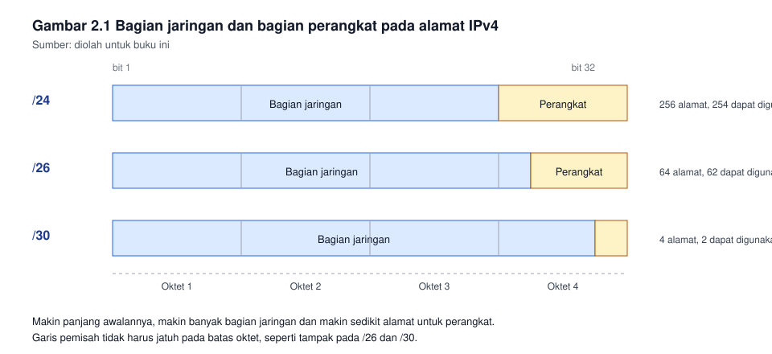
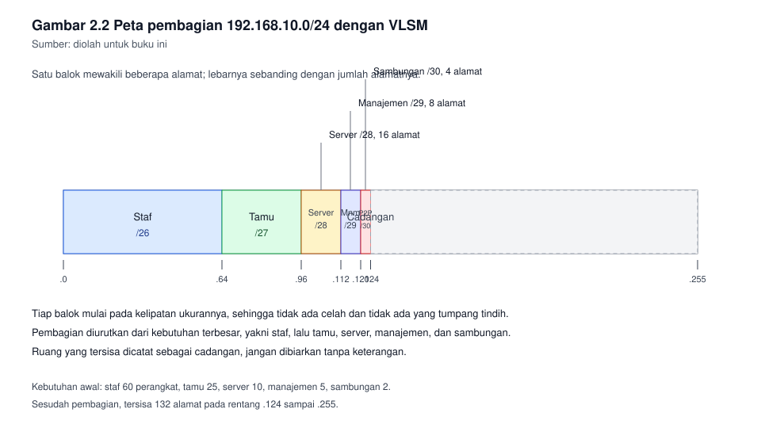

# Bab 2. Perancangan Pengalamatan Jaringan

## Capaian pembelajaran bab

Sesudah mempelajari bab ini mahasiswa mampu:

1. Menjelaskan struktur alamat IPv4, awalan jaringan, dan cara menentukan
   alamat jaringan beserta alamat siarannya. *(Sub-CPMK pertemuan 2, CPMK-1,
   unit SKKNI J.611000.004.01)*
2. Menghitung pembagian jaringan menurut kebutuhan jumlah perangkat pada tiap
   segmen.
3. Menyusun rencana alamat untuk instansi dengan beberapa segmen, tanpa
   tumpang tindih, dengan mempergunakan VLSM.
4. Menemukan kesalahan umum pada perencanaan alamat, dan menjelaskan
   akibatnya.
5. Menjelaskan mengapa IPv6 diperlukan, dan menyebutkan perbedaan
   mendasarnya terhadap IPv4.

## Peta konsep

```
Bab 2 Perancangan Pengalamatan
|-- 2.1 Mengapa alamat perlu direncanakan
|-- 2.2 Bilangan yang digunakan: biner dan desimal
|-- 2.3 Struktur alamat IPv4
|-- 2.4 Alamat jaringan, alamat siaran, alamat perangkat
|-- 2.5 Pembagian jaringan secara merata
|-- 2.6 Pembagian menurut kebutuhan (VLSM)
|-- 2.7 Menyusun rencana alamat
|-- 2.8 Kesalahan yang sering terjadi
|-- 2.9 Pengantar IPv6
`-- 2.10 Alat bantu dan kebiasaan memeriksa
```

---

## 2.1 Mengapa alamat perlu direncanakan

Banyak jaringan kecil lahir tanpa perhitungan. Satu komputer diberi
192.168.1.10, komputer berikutnya 192.168.1.11, dan seterusnya, sampai
suatu hari sebuah perangkat baru menggunakan alamat yang sudah digunakan
perangkat lain. Gejalanya aneh: dua komputer bergantian tidak dapat
terhubung, dan gejalanya hilang bila salah satunya dimatikan.

Perencanaan alamat mencegah dua hal:

- **Tumpang tindih.** Dua segmen menggunakan rentang alamat yang sama, sehingga
  perangkat pada segmen yang berbeda mengira mereka berada pada jaringan
  yang sama.
- **Kekurangan ruang.** Satu segmen tumbuh lebih cepat daripada perkiraan,
  sementara segmen lain menyisakan ratusan alamat yang tidak digunakan,
  karena pembagiannya dilakukan sama rata tanpa memperhitungkan kebutuhan.

Kedua persoalan itu tidak muncul pada hari pertama. Ia muncul enam bulan
kemudian, ketika jaringan sudah sulit diubah karena terlalu banyak
perangkat bergantung padanya.

## 2.2 Bilangan yang digunakan: biner dan desimal

Alamat IP bekerja pada bilangan biner, sedangkan manusia membacanya pada
bilangan desimal. Kalian tidak perlu menghitung biner setiap hari, tetapi
kalian perlu memahaminya, sebab seluruh aturan pembagian jaringan berasal
dari sana.

Satu oktet terdiri atas 8 bit. Nilai tiap posisi bit, dari kiri ke kanan:

| Posisi bit | 8 | 7 | 6 | 5 | 4 | 3 | 2 | 1 |
|---|---|---|---|---|---|---|---|---|
| Nilai | 128 | 64 | 32 | 16 | 8 | 4 | 2 | 1 |

Cara membaca: bila bit bernilai 1, nilainya dihitung; bila 0, diabaikan.

**Contoh.** 192 dalam biner.

```
128  64  32  16   8   4   2   1
  1   1   0   0   0   0   0   0   =  128 + 64  =  192
```

**Contoh.** 168 dalam biner.

```
128  64  32  16   8   4   2   1
  1   0   1   0   1   0   0   0   =  128 + 32 + 8  =  168
```

Dua contoh itu cukup untuk memahami satu hal penting: nilai 255 berarti
seluruh delapan bit bernilai 1. Itu sebabnya angka 255 muncul terus pada
penulisan netmask.

## 2.3 Struktur alamat IPv4

Alamat IPv4 terdiri atas 32 bit, ditulis sebagai empat oktet yang dipisah
titik. Alamat itu terbagi dua: bagian jaringan dan bagian perangkat.
Garis pemisahnya tidak tetap, dan ditentukan oleh penutup jaringan
(netmask) atau oleh panjang awalan (prefix length).

| Cara tulis | Contoh | Artinya |
|---|---|---|
| Penutup jaringan | 255.255.255.0 | 24 bit pertama adalah bagian jaringan |
| Panjang awalan | /24 | sama dengan 255.255.255.0 |
| Penutup jaringan | 255.255.255.192 | 26 bit pertama adalah bagian jaringan |
| Panjang awalan | /26 | sama dengan 255.255.255.192 |

Dua cara penulisan itu setara. Panjang awalan lebih ringkas, dan digunakan
pada hampir seluruh perangkat jaringan masa kini.

Beberapa panjang awalan yang perlu kalian hafal, sebab ia muncul terus:

| Awalan | Penutup jaringan | Jumlah alamat | Alamat yang dapat digunakan perangkat |
|---|---|---|---|
| /24 | 255.255.255.0 | 256 | 254 |
| /25 | 255.255.255.128 | 128 | 126 |
| /26 | 255.255.255.192 | 64 | 62 |
| /27 | 255.255.255.224 | 32 | 30 |
| /28 | 255.255.255.240 | 16 | 14 |
| /29 | 255.255.255.248 | 8 | 6 |
| /30 | 255.255.255.252 | 4 | 2 |

Alamat yang dapat digunakan perangkat adalah jumlah alamat dikurangi dua,
sebab dua alamat tidak dapat digunakan: alamat jaringan dan alamat siaran.

**Gambar 2.1** memperlihatkan letak garis pemisah itu untuk tiga panjang
awalan yang berbeda.



*Gambar 2.1* Bagian jaringan dan bagian perangkat pada /24, /26, dan /30.
Sumber: diolah untuk buku ini.

## 2.4 Alamat jaringan, alamat siaran, alamat perangkat

Pada setiap jaringan terdapat dua alamat yang tidak boleh diberikan kepada
perangkat:

- **Alamat jaringan.** Alamat pertama. Bagian perangkatnya seluruhnya
  bernilai 0. Ia menyatakan jaringannya, bukan perangkatnya.
- **Alamat siaran.** Alamat terakhir. Bagian perangkatnya seluruhnya
  bernilai 1. Ia digunakan untuk mengirim ke seluruh perangkat sekaligus.

**Contoh.** Jaringan 192.168.10.0/26.

| Kedudukan | Alamat | Keterangan |
|---|---|---|
| Alamat jaringan | 192.168.10.0 | Tidak boleh diberikan ke perangkat |
| Alamat pertama yang dapat digunakan | 192.168.10.1 | Lazimnya digunakan sebagai gerbang |
| Alamat terakhir yang dapat digunakan | 192.168.10.62 | |
| Alamat siaran | 192.168.10.63 | Tidak boleh diberikan ke perangkat |

Mengapa demikian? /26 berarti 26 bit bagian jaringan, sehingga tersisa
6 bit untuk bagian perangkat. Enam bit memberi 64 kombinasi, dari 0 sampai
63. Kombinasi 0 menjadi alamat jaringan, dan kombinasi 63 menjadi alamat
siaran. Sisanya, 1 sampai 62, dapat digunakan perangkat.

**Gerbang (gateway).** Gerbang ialah alamat perangkat yang menjadi jalan
keluar dari jaringan itu. Tidak ada aturan baku yang mewajibkan gerbang
menggunakan alamat pertama atau terakhir. Kebiasaan yang baik: pilih salah
satu secara konsisten, tuliskan pada rencana alamat, dan jangan ubah
kebiasaan itu di tengah jalan.

## 2.5 Pembagian jaringan secara merata

Pembagian merata digunakan bila seluruh segmen diperkirakan membutuhkan
jumlah perangkat yang sama. Ia mudah dihitung, tetapi sering memboroskan
alamat.

**Langkahnya.**

1. Tentukan jumlah jaringan yang dibutuhkan.
2. Cari pangkat dua terkecil yang lebih besar atau sama dengan jumlah itu.
   Misalnya butuh 4 jaringan, maka 2 pangkat 2 sama dengan 4.
3. Tambahkan pangkat itu pada panjang awalan yang lama. Bila semula /24 dan
   dibagi empat, awalan barunya /26.
4. Bagi rentang alamatnya menurut ukuran yang baru.

**Contoh.** 192.168.10.0/24 dibagi menjadi empat.

| Jaringan | Rentang | Dapat digunakan | Siaran |
|---|---|---|---|
| 192.168.10.0/26 | .0 sampai .63 | .1 sampai .62 | .63 |
| 192.168.10.64/26 | .64 sampai .127 | .65 sampai .126 | .127 |
| 192.168.10.128/26 | .128 sampai .191 | .129 sampai .190 | .191 |
| 192.168.10.192/26 | .192 sampai .255 | .193 sampai .254 | .255 |

Kelemahannya segera terlihat bila kebutuhannya tidak sama. Bila satu
segmen hanya perlu 10 perangkat, ia tetap menerima 62 alamat, dan 52
di antaranya terbuang.

## 2.6 Pembagian menurut kebutuhan (VLSM)

VLSM, kependekan dari Variable Length Subnet Mask, membagi jaringan
menurut kebutuhan tiap segmen, bukan sama rata. Inilah teknik yang digunakan
pada perencanaan yang sesungguhnya.

**Aturan utamanya: urutkan dari kebutuhan terbesar, lalu bagikan secara
berurutan tanpa menyisakan celah.**

Mengapa harus diurutkan? Sebab ukuran jaringan harus sejajar dengan
kelipatannya. Jaringan berukuran 64 harus mulai pada kelipatan 64, yakni
0, 64, 128, atau 192. Bila kalian memberi jaringan kecil lebih dahulu,
jaringan besar berikutnya akan kehilangan tempat yang sejajar.

### Contoh perhitungan lengkap

Sebuah instansi menggunakan 192.168.10.0/24, dengan kebutuhan:

| Segmen | Perangkat yang dibutuhkan |
|---|---|
| Staf | 60 |
| Tamu | 25 |
| Server | 10 |
| Manajemen perangkat jaringan | 5 |
| Sambungan antar perangkat | 2 |

**Langkah 1. Tentukan ukuran tiap segmen.**

| Segmen | Butuh | Awalan | Alamat tersedia | Dapat digunakan | Cukup? |
|---|---|---|---|---|---|
| Staf | 60 | /26 | 64 | 62 | Ya |
| Tamu | 25 | /27 | 32 | 30 | Ya |
| Server | 10 | /28 | 16 | 14 | Ya |
| Manajemen | 5 | /29 | 8 | 6 | Ya |
| Sambungan | 2 | /30 | 4 | 2 | Ya |

**Langkah 2. Bagikan secara berurutan, mulai dari yang terbesar.**

| Segmen | Jaringan | Dapat digunakan | Siaran | Gerbang |
|---|---|---|---|---|
| Staf | 192.168.10.0/26 | .1 sampai .62 | .63 | .1 |
| Tamu | 192.168.10.64/27 | .65 sampai .94 | .95 | .65 |
| Server | 192.168.10.96/28 | .97 sampai .110 | .111 | .97 |
| Manajemen | 192.168.10.112/29 | .113 sampai .118 | .119 | .113 |
| Sambungan | 192.168.10.120/30 | .121 sampai .122 | .123 | tidak perlu |

**Langkah 3. Periksa sisa ruang.**

Pemakaian berhenti pada 192.168.10.123. Rentang 192.168.10.124 sampai
192.168.10.255 masih kosong, yakni 132 alamat, dan dapat digunakan untuk
pengembangan.

Perhatikan betapa rapi hasilnya: dari satu jaringan /24, seluruh
kebutuhan terpenuhi, dan masih tersisa lebih dari separuh ruang. Bila
kalian membagi sama rata menjadi empat, segmen staf yang butuh 60
perangkat akan kekurangan, atau tamu dan server akan membuang puluhan
alamat.

**Gambar 2.2** memperlihatkan hasil pembagian itu sebagai peta blok.



*Gambar 2.2* Hasil pembagian menurut kebutuhan, dari yang terbesar sampai
yang terkecil. Sumber: diolah untuk buku ini.

## 2.7 Menyusun rencana alamat

Rencana alamat bukan sekadar hasil hitungan. Ia adalah dokumen yang dibaca
orang lain, mungkin lima tahun lagi, mungkin oleh orang yang tidak pernah
bertemu kalian.

Kolom yang wajib ada:

| Kolom | Kegunaan |
|---|---|
| Nama segmen | Menyatakan untuk siapa segmen itu |
| Awalan | Menyatakan ukurannya |
| Alamat jaringan | Menyatakan awal rentangnya |
| Rentang yang dapat digunakan | Menjadi acuan pemberian alamat |
| Alamat siaran | Menjadi batas akhir |
| Gerbang | Menjadi acuan konfigurasi perangkat |
| Keterangan | Menyatakan keperluan khusus, misalnya cadangan |

**Tabel 2.1** Rencana alamat instansi contoh pada bab ini.

| Segmen | Awalan | Jaringan | Dapat digunakan | Siaran | Gerbang | Keterangan |
|---|---|---|---|---|---|---|
| Staf | /26 | 192.168.10.0 | .1 - .62 | .63 | .1 | 60 komputer, 3 lantai |
| Tamu | /27 | 192.168.10.64 | .65 - .94 | .95 | .65 | Nirkabel tamu |
| Server | /28 | 192.168.10.96 | .97 - .110 | .111 | .97 | Layanan internal |
| Manajemen | /29 | 192.168.10.112 | .113 - .118 | .119 | .113 | Perangkat jaringan |
| Sambungan | /30 | 192.168.10.120 | .121 - .122 | .123 | - | Tautan antar perangkat |
| Cadangan | - | 192.168.10.124 - .255 | - | - | - | Belum dialokasikan |

Tiga kebiasaan yang membuat rencana alamat bertahan lama:

1. **Tuliskan yang belum digunakan.** Ruang kosong yang tidak tertulis akan
   diisi orang lain tanpa sepengetahuan kalian.
2. **Tetapkan kebiasaan gerbang sejak awal.** Pilih alamat pertama atau
   alamat terakhir, lalu pegang teguh.
3. **Simpan perhitungannya, bukan hanya hasilnya.** Bila kelak ada yang
   mempertanyakan mengapa staf menggunakan /26, jawabannya ada pada tabel
   kebutuhan, bukan pada kebiasaan.

## 2.8 Kesalahan yang sering terjadi

| Kesalahan | Gejalanya | Pencegahannya |
|---|---|---|
| Dua segmen tumpang tindih | Perangkat pada segmen berbeda tidak dapat berhubungan, atau hubungannya timbul tenggelam | Gambar peta blok seperti Gambar 2.2 sebelum menetapkan |
| Gerbang berada di luar rentang segmen | Perangkat dapat berhubungan dengan tetangganya, tetapi tidak dapat keluar | Periksa gerbang terhadap tabel rencana |
| Alamat jaringan atau siaran diberikan ke perangkat | Perangkat itu kadang terhubung, kadang tidak, bergantung pada perangkatnya | Ingat selisih dua alamat pada tiap jaringan |
| Segmen diberi ukuran sama rata | Ada segmen yang kehabisan alamat, ada yang membuang ratusan | Pakai VLSM |
| /30 digunakan untuk lebih dari dua perangkat | Satu perangkat tidak pernah dapat dikonfigurasi | Ingat /30 hanya dua alamat yang dapat digunakan |
| Alamat statis diberikan tanpa pencatatan | Suatu hari dua perangkat saling rebut alamat | Catat tiap pemberian alamat statis |

Satu kebiasaan yang menyelamatkan banyak waktu: sebelum menetapkan
konfigurasi, hitung kembali rentangnya, lalu bacakan keras-keras kepada
rekan pasangan. Kesalahan hitungan jauh lebih mudah terdengar daripada
terbaca.

## 2.9 Pengantar IPv6

IPv4 memiliki 32 bit, yang berarti sekitar empat miliar alamat. Jumlah itu
terlihat besar pada tahun 1980, tetapi tidak cukup untuk jumlah perangkat
masa kini. IPv6 disusun untuk menjawabnya.

| Hal | IPv4 | IPv6 |
|---|---|---|
| Panjang alamat | 32 bit | 128 bit |
| Cara tulis | Desimal bertitik, empat oktet | Heksadesimal bertitik dua, delapan kelompok |
| Contoh | 192.168.10.1 | 2001:0db8:0085:0000:0000:0000:0000:0001 |
| Penulisan ringkas | Tidak ada | Nol di depan boleh dihilangkan, kelompok nol berurutan boleh ditulis :: |
| Alamat siaran | Ada | Tidak ada, digantikan oleh siaran kelompok |
| Konfigurasi otomatis | Memerlukan layanan tersendiri | Tersedia pada perangkatnya sendiri |

Penulisan ringkas sering membingungkan pemula. Aturannya sederhana:
kelompok nol yang berurutan cukup ditulis `::` satu kali, dan nol di depan
tiap kelompok boleh dihilangkan. Karena itu
`2001:0db8:0085:0000:0000:0000:0000:0001` dapat ditulis
`2001:db8:85::1`.

Ukuran jaringan yang lazim pada IPv6 ialah /64, jauh lebih besar daripada
jaringan IPv4 mana pun. Konsekuensinya, perencanaan alamat IPv6 tidak
bertumpu pada menghemat alamat, melainkan pada merapikan penomoran agar
mudah diingat.

## 2.10 Alat bantu dan kebiasaan memeriksa

Kalkulator pembagian jaringan banyak tersedia, baik pada situs web maupun
sebagai perangkat lunak. Pakailah, tetapi jangan menggantungkan diri
padanya.

Alasannya sederhana: pada ujian, pada wawancara kerja, dan pada saat
jaringan sedang mati dan kalian tidak memiliki sambungan internet, yang
tersisa hanyalah kemampuan menghitung sendiri. Selain itu, alat bantu
tidak akan memberi tahu bahwa segmen staf kelak akan bertambah menjadi
seratus komputer.

Kebiasaan yang baik:

1. Hitung sendiri lebih dahulu.
2. Periksa dengan alat bantu.
3. Bila hasilnya berbeda, cari tahu siapa yang salah, jangan langsung
   menggunakan hasil alat bantu.

---

## Contoh soal dan pembahasan

### Contoh 2.1 Merancang alamat untuk dua lokasi

Sebuah instansi memiliki dua lantai. Lantai satu membutuhkan 45 perangkat,
lantai dua 20 perangkat, dan terdapat satu tautan antar perangkat yang
membutuhkan dua alamat. Sediakan rencana alamat dari 172.16.20.0/24.

**Pembahasan.**

Langkah 1, tentukan ukuran. Lantai satu butuh 45, maka /26 memberikan 62
yang dapat digunakan, cukup. Bila digunakan /27 hanya tersedia 30, tidak
cukup. Lantai dua butuh 20, maka /27 memberikan 30, cukup. Tautan butuh
dua, maka /30.

Langkah 2, urutkan dari yang terbesar: lantai satu (/26), lantai dua
(/27), tautan (/30).

Langkah 3, bagikan berurutan.

| Segmen | Jaringan | Dapat digunakan | Siaran |
|---|---|---|---|
| Lantai 1 | 172.16.20.0/26 | .1 sampai .62 | .63 |
| Lantai 2 | 172.16.20.64/27 | .65 sampai .94 | .95 |
| Tautan | 172.16.20.96/30 | .97 sampai .98 | .99 |

Langkah 4, periksa kesejajaran. Lantai 1 mulai pada 0, kelipatan 64.
Lantai 2 mulai pada 64, kelipatan 32. Tautan mulai pada 96, kelipatan 4.
Ketiganya sejajar, sehingga pembagian ini sah.

Sisa ruang: 172.16.20.100 sampai 172.16.20.255 masih kosong.

### Contoh 2.2 Menemukan tumpang tindih

Seorang rekan menyerahkan rencana alamat berikut.

| Segmen | Jaringan |
|---|---|
| Staf | 192.168.30.0/25 |
| Tamu | 192.168.30.64/26 |
| Server | 192.168.30.128/25 |

Periksalah apakah rencana itu dapat digunakan. Bila tidak, sebutkan
letak persoalannya dan perbaiki.

**Pembahasan.**

Ubah tiap baris menjadi rentang:

- /25 berukuran 128 alamat, sehingga 192.168.30.0/25 mencakup .0 sampai
  .127.
- /26 berukuran 64 alamat, sehingga 192.168.30.64/26 mencakup .64 sampai
  .127.
- /25 berikutnya, 192.168.30.128/25, mencakup .128 sampai .255.

Bandingkan: staf mencakup .0 sampai .127, sedangkan tamu mencakup .64
sampai .127. Seluruh rentang tamu berada di dalam rentang staf. Itulah
tumpang tindih.

Akibatnya: perangkat tamu yang diberi alamat .70 akan menganggap
perangkat staf berada pada jaringan yang sama, sehingga ia tidak akan
mengirim lalu lintasnya ke gerbang. Sebagian perangkat tampak terhubung,
sebagian tidak, dan gejalanya tidak pernah sama dua kali.

Perbaikannya, dengan tetap menggunakan 192.168.30.0/24 dan mengurutkan dari
kebutuhan terbesar:

| Segmen | Jaringan | Dapat digunakan | Siaran |
|---|---|---|---|
| Staf | 192.168.30.0/25 | .1 sampai .126 | .127 |
| Server | 192.168.30.128/26 | .129 sampai .190 | .191 |
| Tamu | 192.168.30.192/26 | .193 sampai .254 | .255 |

Kini ketiga rentang tidak saling menaungi: .0 sampai .127, .128 sampai
.191, dan .192 sampai .255.

---

## Latihan

1. Tuliskan 172 dan 224 dalam bilangan biner, lalu tunjukkan
   perhitungannya.
2. Sebuah jaringan berawalan /21. Berapa jumlah alamatnya, dan berapa
   alamat yang dapat digunakan perangkat?
3. Tentukan alamat jaringan, rentang yang dapat digunakan, dan alamat siaran
   untuk 10.20.30.40/28.
4. Bagi 192.168.50.0/24 menjadi delapan bagian sama rata, lalu tuliskan
   tabel lengkapnya.
5. Sebuah instansi membutuhkan segmen untuk 100 perangkat, 40 perangkat,
   12 perangkat, dan dua tautan yang masing-masing dua alamat. Susunlah
   rencana alamatnya dari 10.10.0.0/24 dengan VLSM.
6. Periksalah rencana berikut, dan sebutkan apakah ia sah: 172.20.0.0/24
   untuk staf, 172.20.0.128/25 untuk tamu, 172.20.1.0/24 untuk server.
7. Mengapa ukuran jaringan harus sejajar dengan kelipatannya? Jelaskan
   dengan satu contoh yang menunjukkan akibat bila aturan itu dilanggar.
8. Sebutkan dua perbedaan IPv4 dan IPv6 yang menurut kalian paling
   berpengaruh pada pekerjaan administrator, dan jelaskan alasannya.

**Kunci dan rubrik.** Nomor 1 sampai 5 dinilai dari kebenaran perhitungan
dan kerapian tabel. Nomor 6 dinilai dari ketepatan menemukan letak
persoalan; perhatikan bahwa rencana itu memuat dua kesalahan sekaligus,
yakni tumpang tindih dan melampaui batas jaringan /24. Nomor 7 dan 8
dinilai dari kejelasan penjelasan, bukan dari panjangnya jawaban.

## Rangkuman

- Alamat IPv4 terbagi atas bagian jaringan dan bagian perangkat, dan garis
  pemisahnya ditentukan oleh panjang awalan.
- Dua alamat pada tiap jaringan tidak dapat digunakan perangkat: alamat
  jaringan dan alamat siaran.
- Pembagian merata mudah dihitung tetapi sering memboroskan alamat; VLSM
  membagi menurut kebutuhan.
- Pada VLSM, urutkan dari kebutuhan terbesar, dan pastikan tiap jaringan
  mulai pada kelipatan ukurannya.
- Rencana alamat mencantumkan yang belum digunakan, kebiasaan gerbang, dan
  perhitungannya, bukan hanya hasilnya.
- IPv6 menggunakan alamat 128 bit, tidak memiliki alamat siaran, dan
  perencanaannya bertumpu pada kerapian, bukan pada penghematan.

## Glosarium

| Istilah | Arti |
|---|---|
| Alamat jaringan | Alamat pertama pada suatu jaringan, menyatakan jaringannya |
| Alamat siaran | Alamat terakhir, digunakan untuk mengirim ke seluruh perangkat |
| Awalan | Panjang bagian jaringan, ditulis dengan garis miring, misalnya /26 |
| Gerbang | Alamat perangkat yang menjadi jalan keluar dari jaringan |
| Netmask | Penutup jaringan, padanan awalan dalam bentuk desimal bertitik |
| Oktet | Kelompok delapan bit pada penulisan alamat |
| Tumpang tindih | Keadaan dua jaringan menggunakan rentang alamat yang saling menaungi |
| VLSM | Pembagian jaringan dengan panjang awalan yang berbeda menurut kebutuhan |

## Rujukan

| Sumber | Kedudukan | Status |
|---|---|---|
| Kepmenaker Nomor 321 Tahun 2016, unit J.611000.004.01 | Acuan kompetensi merancang pengalamatan | ⏳ status berlakunya perlu dicek |
| RPS KPT0502324 | Acuan capaian bab | ✓ tersusun pada folder kerja ini |
| Tanenbaum dan Wetherall, Computer Networks | Pendalaman pengalamatan dan perutean | ⏳ edisi dan tahun perlu dicek |
