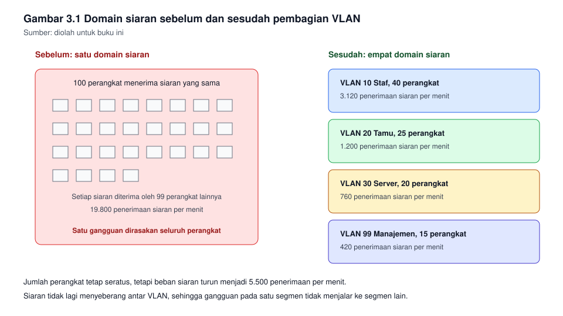
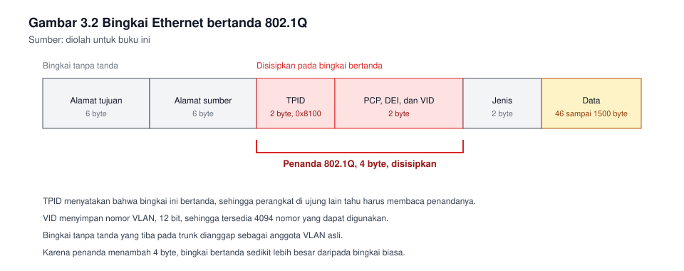

# Bab 3. Pemisahan Segmen dengan VLAN dan Trunking

## Capaian pembelajaran bab

Sesudah mempelajari bab ini mahasiswa mampu:

1. Menjelaskan mengapa satu jaringan besar perlu dibagi, dan menghitung
   dampak pembagian itu terhadap lalu lintas siaran. *(Sub-CPMK pertemuan 3,
   CPMK-2, unit SKKNI J.611000.012.02)*
2. Menjelaskan cara kerja penandaan VLAN menurut standar 802.1Q.
3. Membedakan port akses dan port trunk, lalu menetapkan kegunaannya.
4. Mengonfigurasi VLAN dan trunk pada switch, dan memverifikasinya.
5. Menyusun penomoran VLAN yang rapi, dan mendokumentasikan penugasan port.
6. Menutup celah keamanan dasar yang muncul akibat kesalahan penetapan VLAN.

## Peta konsep

```
Bab 3 Pemisahan Segmen
|-- 3.1 Domain siaran dan mengapa ia perlu dibatasi
|-- 3.2 Konsep VLAN dan penandaan 802.1Q
|-- 3.3 Port akses dan port trunk
|-- 3.4 Penomoran VLAN yang rapi
|-- 3.5 Konfigurasi pada switch
|-- 3.6 Verifikasi
|-- 3.7 Trunk antar switch
|-- 3.8 Keamanan dasar VLAN
`-- 3.9 Dokumentasi penugasan port
```

---

## 3.1 Domain siaran dan mengapa ia perlu dibatasi

Siaran adalah kiriman yang ditujukan kepada seluruh perangkat dalam satu
jaringan. Ia tidak dapat dihindari, sebab banyak hal bergantung padanya.
Yang paling sering terjadi adalah pemeriksaan alamat: sebelum mengirim data
ke suatu alamat IP, perangkat perlu mengetahui alamatan perangkat yang
memiliki alamat itu, dan ia menanyakannya dengan siaran.

Bayangkan satu jaringan dengan seratus komputer pada satu switch besar,
tanpa pembagian apa pun.

| Keadaan | Akibatnya |
|---|---|
| Tiap komputer sesekali mengirim siaran | Seluruh sembilan puluh sembilan komputer lainnya menerimanya |
| Switch meneruskan siaran ke seluruh port |Siaran itu diproses oleh kartu jaringan tiap komputer |
| Semakin banyak perangkat, semakin sering siaran | Waktu proses komputer habis untuk menolak siaran, bukan untuk bekerja |

Kumpulan perangkat yang menerima siaran yang sama disebut **domain
siaran**. Membatasi domain siaran berarti membatasi siapa yang menerima
siaran itu, dan dengan demikian membatasi gangguan yang ditimbulkannya.

**Gambar 3.1** memperlihatkan keadaan sebelum dan sesudah pembagian.



*Gambar 3.1* Satu domain besar di sebelah kiri, empat domain kecil di
sebelah kanan. Sumber: diolah untuk buku ini.

Perlu dicatat: pembagian ini tidak menghemat bandwidth sebagaimana yang
sering dikira orang. Yang dihemat adalah perhatian perangkat, karena
perangkat tidak lagi dipaksa memproses kiriman yang bukan untuknya.

## 3.2 Konsep VLAN dan penandaan 802.1Q

VLAN, kependekan dari Virtual Local Area Network, membagi satu switch
menjadi beberapa jaringan yang seolah-olah terpisah, meski perangkatnya
menumpang pada perangkat fisik yang sama.

Dua hal yang perlu dipahami sejak awal:

- **VLAN bekerja pada lapis 2.** Ia memisahkan siaran, tidak memisahkan
  alamat IP. Alamat IP dapat saja berada pada rentang yang berbeda, tetapi
  yang memisahkan lalu lintasnya adalah penandaan VLAN, bukan alamatnya.
- **Satu port akses menjadi anggota satu VLAN.** Perangkat yang menempel
  pada port itu tidak tahu menahu soal VLAN. Switch yang mengurusnya.

### Penandaan 802.1Q

Bila sebuah bingkai harus melewati sambungan yang membawa lebih dari satu
VLAN, bingkai itu perlu ditandai, agar switch di ujung lain tahu bingkai
itu milik VLAN yang mana. Standar yang digunakan ialah 802.1Q.

Penandaan itu menyisipkan empat byte pada bingkai, dengan susunan:

| Bagian | Ukuran | Kegunaan |
|---|---|---|
| Pengenal jenis penanda (TPID) | 16 bit | Menyatakan bahwa bingkai ini bertanda, nilainya 0x8100 |
| Prioritas (PCP) | 3 bit | Menandai tingkat pentingnya lalu lintas |
| Penanda boleh dibuang (DEI) | 1 bit | Digunakan bersama prioritas |
| Pengenal VLAN (VID) | 12 bit | Nomor VLAN, dari 1 sampai 4094 |

Dua belas bit memberi 4096 kemungkinan nomor. Nomor 0 dan 4095 dicadangkan,
sehingga yang dapat digunakan 1 sampai 4094.

**Gambar 3.2** memperlihatkan letak empat byte itu pada bingkai.



*Gambar 3.2* Empat byte penanda disisipkan di antara alamat sumber dan
jenis. Sumber: diolah untuk buku ini.

### VLAN asli (native VLAN)

Satu VLAN pada setiap trunk diperlakukan istimewa: lalu lintasnya lewat
tanpa ditandai. VLAN itu disebut VLAN asli. Bila dua switch pada ujung
trunk menetapkan VLAN asli yang berbeda, lalu lintas akan berpindah
VLAN tanpa disadari, dan gejalanya sulit dilacak.

Karena itu kebiasaan yang baik: tetapkan VLAN asli pada satu nomor khusus
yang tidak digunakan perangkat apa pun, sama pada seluruh trunk, dan
tuliskan pada dokumentasi.

## 3.3 Port akses dan port trunk

| Hal | Port akses | Port trunk |
|---|---|---|
| Jumlah VLAN yang lewat | Satu | Banyak |
| Penandaan | Tidak ditandai | Ditandai, kecuali VLAN asli |
| Dihubungkan ke | Komputer, pencetak, server | Switch lain, router, titik akses |
| Perangkat di ujungnya | Tidak perlu mengerti VLAN | Perlu mengerti VLAN |

Kesalahan yang paling sering: port yang seharusnya trunk dibiarkan pada
keadaan bawaan, sehingga hanya satu VLAN yang lewat, dan keluhannya muncul
sebagai "komputer di lantai dua tidak dapat masuk", padahal yang tidak
lewat adalah VLAN-nya.

## 3.4 Penomoran VLAN yang rapi

Nomor VLAN bebas dipilih, tetapi kebebasan itu sering disalahgunakan,
sampai tidak ada yang mengerti maksud nomor 7 atau nomor 13.

Satu konvensi yang mudah diingat, dan digunakan pada buku ini:

| Nomor | Kegunaan |
|---|---|
| 1 | Bawaan pabrik, tidak digunakan untuk perangkat |
| 10 | Staf |
| 20 | Tamu |
| 30 | Server |
| 99 | Manajemen perangkat jaringan |
| 999 | Penampungan port yang tidak digunakan |

Nilai utamanya bukan pada angkanya, melainkan pada konsistensinya. Bila
kalian menetapkan 10 untuk staf di gedung ini, tetapkan juga 10 untuk staf
di gedung lain, supaya dokumentasinya dapat dibaca tanpa membuka catatan.

## 3.5 Konfigurasi pada switch

Perintah berikut ditulis dalam gaya yang lazim pada perangkat jaringan
kelas enterprise, dan dapat dicoba pada Cisco Packet Tracer. Nama antarmuka
dapat berbeda menurut jenis perangkat, karena itu biasakan membaca
keluaran perintah `show ip interface brief` sebelum menulis konfigurasi.

### Membuat VLAN

```
Switch# configure terminal
Switch(config)# vlan 10
Switch(config-vlan)# name STAF
Switch(config-vlan)# exit
Switch(config)# vlan 20
Switch(config-vlan)# name TAMU
Switch(config-vlan)# exit
Switch(config)# vlan 30
Switch(config-vlan)# name SERVER
Switch(config-vlan)# exit
Switch(config)# vlan 99
Switch(config-vlan)# name MANAJEMEN
Switch(config-vlan)# exit
Switch(config)# vlan 999
Switch(config-vlan)# name PENAMPUNGAN
Switch(config-vlan)# exit
```

Mengapa VLAN 999 perlu dibuat lebih dahulu? Sebab port yang akan
dinonaktifkan perlu dipindahkan ke VLAN yang memang ada. Memindahkan port
ke VLAN yang belum dibuat akan ditolak, atau pada sebagian perangkat
membuat VLAN itu terbuat tanpa nama.

### Menetapkan port akses

```
Switch(config)# interface range fastEthernet 0/1 - 20
Switch(config-if-range)# switchport mode access
Switch(config-if-range)# switchport access vlan 10
Switch(config-if-range)# exit
```

Dua baris pertama tidak boleh tertinggal. Menuliskan
`switchport access vlan 10` tanpa menetapkan modenya akan membuat port itu
tetap merundingkan modenya sendiri, dan hasilnya tidak menentu.

### Menetapkan port trunk

```
Switch(config)# interface gigabitEthernet 0/1
Switch(config-if)# switchport mode trunk
Switch(config-if)# switchport trunk native vlan 999
Switch(config-if)# switchport trunk allowed vlan 10,20,30,99
Switch(config-if)# exit
```

Perhatikan baris ketiga. Daftar VLAN yang diizinkan penting, sebab secara
bawaan trunk mengizinkan seluruh VLAN. Membatasi daftarnya berarti
mengurangi lalu lintas yang tidak perlu, dan menutup jalan bagi VLAN yang
tidak seharusnya lewat.

### Menonaktifkan port yang tidak digunakan

```
Switch(config)# interface range fastEthernet 0/21 - 24
Switch(config-if-range)# switchport mode access
Switch(config-if-range)# switchport access vlan 999
Switch(config-if-range)# shutdown
Switch(config-if-range)# exit
```

Kebiasaan ini sering dianggap berlebihan, sampai suatu hari seorang tamu
mencolokkan kabelnya ke port kosong di ruang rapat dan langsung berada
di dalam jaringan staf.

## 3.6 Verifikasi

Konfigurasi yang sudah ditulis tidak dapat dipercaya sebelum diperiksa.
Empat perintah yang digunakan terus:

| Perintah | Yang ditanyakannya |
|---|---|
| `show vlan brief` | VLAN apa saja yang ada, dan port mana yang menjadi anggotanya |
| `show interfaces trunk` | Port mana yang menjadi trunk, VLAN apa yang diizinkan, dan berapa VLAN aslinya |
| `show mac address-table` | Alamatan apa yang dipelajari pada port dan VLAN berapa |
| `show running-config interface` | Apa yang tertulis pada satu antarmuka |

Urutan pemeriksaan yang baik:

1. Periksa `show vlan brief`. Bila port komputer belum muncul pada VLAN 10,
   persoalannya ada pada penetapan port akses.
2. Periksa `show interfaces trunk`. Bila port antar switch tidak muncul,
   persoalannya ada pada penetapan trunk.
3. Periksa `show mac address-table`. Bila alamatan komputer tidak muncul,
   komputer itu belum mengirim apa pun, atau kabelnya belum terpasang.

Satu pengujian yang sering menipu: menguji hubungan dengan `ping` antar
dua komputer pada VLAN yang berbeda, lalu menyimpulkan bahwa konfigurasi
VLAN salah. Padahal tidak ada yang salah. Dua VLAN yang berbeda memang
belum dapat berhubungan sebelum ada perutean, dan perutean dibahas pada
bab berikutnya.

## 3.7 Trunk antar switch

Bila dua switch dihubungkan dan kedua ujungnya membawa lebih dari satu
VLAN, sambungannya harus trunk. Bila salah satu ujungnya lupa, VLAN yang
tidak diizinkan akan terputus tanpa pesan kesalahan apa pun.

Tiga hal yang harus sama pada kedua ujung:

| Hal | Mengapa harus sama |
|---|---|
| VLAN asli | Bila berbeda, lalu lintas berpindah VLAN tanpa tanda |
| Daftar VLAN yang diizinkan | Bila berbeda, sebagian VLAN hanya lewat satu arah |
| Penetapan modenya | Bila salah satu ujung memaksa akses, trunk tidak terbentuk |

Ada perangkat yang dapat merundingkan modenya sendiri secara otomatis.
Kenyamanan itu menyimpan risiko: penyerang yang mendapat akses ke port
dapat meminta agar portnya menjadi trunk, lalu melihat lalu lintas seluruh
VLAN. Karena itu pada port yang menghadap ke pengguna, matikan perundingan
itu.

```
Switch(config-if)# switchport mode access
Switch(config-if)# switchport nonegotiate
```

## 3.8 Keamanan dasar VLAN

| Celah | Bagaimana terjadinya | Penutupnya |
|---|---|---|
| VLAN 1 digunakan untuk perangkat | Bawaan pabrik menempatkan seluruh port pada VLAN 1 | Pindahkan seluruh port ke VLAN yang semestinya |
| VLAN asli tidak diubah | Lalu lintas tanpa tanda masuk ke VLAN yang digunakan perangkat | Tetapkan VLAN asli pada nomor kosong yang sama di seluruh trunk |
| Port kosong dibiarkan hidup | Siapa pun dapat menancapkan kabel | Nonaktifkan, dan pindahkan ke VLAN penampungan |
| Perundingan mode dibiarkan aktif | Penyerang meminta portnya menjadi trunk | Matikan perundingan pada port akses |
| Daftar VLAN pada trunk tidak dibatasi | Seluruh VLAN lewat, termasuk yang tidak diperlukan | Batasi dengan daftar yang jelas |

Celah yang paling sering ditemukan pada pemeriksaan bukanlah celah yang
rumit. Ia justru yang paling sederhana: port kosong yang masih hidup, dan
VLAN 1 yang masih digunakan.

## 3.9 Dokumentasi penugasan port

Sesudah konfigurasi selesai, pekerjaan belum selesai. Dokumentasikan
penugasannya, sebab switch tidak memberi tahu siapa pun tentang maksud
nomor-nomor itu.

**Tabel 3.1** Contoh penugasan port pada switch lantai satu.

| Port | Mode | VLAN | Keterangan |
|---|---|---|---|
| Fa0/1 - Fa0/20 | Akses | 10 | Komputer staf lantai satu |
| Fa0/21 - Fa0/24 | Akses | 999 | Tidak digunakan, dimatikan |
| Gi0/1 | Trunk | 10, 20, 30, 99 | Sambungan ke switch inti |
| Gi0/2 | Akses | 999 | Tidak digunakan, dimatikan |

Tiga kebiasaan yang membuat dokumentasi ini bertahan:

1. Perbarui pada hari yang sama dengan perubahan konfigurasinya, bukan
   pada akhir semester.
2. Tuliskan juga yang tidak digunakan, sebab port kosong yang tidak
   tercatat akan digunakan orang lain tanpa sepengetahuan kalian.
3. Simpan konfigurasi akhir perangkat sebagai berkas, bersama
   dokumentasinya, bukan hanya pada perangkatnya.

---

## Contoh soal dan pembahasan

### Contoh 3.1 Menghitung dampak pembagian

Sebuah jaringan terdiri atas 100 komputer pada satu switch. Setiap
komputer mengirim siaran rata-rata dua kali per menit.

Pertanyaan:

1. Berapa banyak penerimaan siaran yang terjadi per menit pada keadaan
   itu?
2. Bila jaringan dibagi menjadi empat VLAN dengan 40, 25, 20, dan 15
   komputer, berapa banyak penerimaan siaran per menit?

**Pembahasan.**

Pertanyaan pertama. Tiap komputer mengirim dua siaran per menit, dan
tiap siaran diterima oleh seluruh komputer lainnya, yakni 99 komputer.
Maka:

```
100 komputer x 2 siaran x 99 penerima = 19.800 penerimaan per menit
```

Pertanyaan kedua. Siaran hanya menyebar di dalam VLAN-nya masing-masing.

| VLAN | Komputer | Penerimaan per menit |
|---|---|---|
| Staf | 40 | 40 x 2 x 39 = 3.120 |
| Tamu | 25 | 25 x 2 x 24 = 1.200 |
| Server | 20 | 20 x 2 x 19 = 760 |
| Manajemen | 15 | 15 x 2 x 14 = 420 |
| Jumlah | 100 | 5.500 |

Jadi penerimaan siaran turun dari 19.800 menjadi 5.500 per menit, atau
menjadi sekitar 28 persen dari keadaan semula.

Angka ini menunjukkan sesuatu yang penting: manfaat pembagian tidak
bertambah secara merata seiring jumlah komputer, melainkan membesar
seiring kuadrat jumlahnya. Jaringan yang dua kali lebih besar menimbulkan
bukan dua kali, melainkan kira-kira empat kali beban siaran.

### Contoh 3.2 Merancang penugasan port

Dua switch melayani satu lantai. Switch A menampung 20 komputer staf dan
satu titik akses nirkabel tamu. Switch B menampung 12 komputer staf dan
dua server. Keduanya tersambung ke switch inti.

Susunlah penugasan VLAN dan portnya, beserta penetapan trunk.

**Pembahasan.**

Konvensi nomor mengikuti bagian 3.4: staf 10, tamu 20, server 30,
manajemen 99, penampungan 999.

Switch A:

| Port | Mode | VLAN | Keterangan |
|---|---|---|---|
| Fa0/1 - Fa0/20 | Akses | 10 | Komputer staf |
| Fa0/21 | Trunk | 20, 99 | Titik akses nirkabel, sebab ia meneruskan SSID tamu |
| Fa0/22 - Fa0/24 | Akses | 999 | Tidak digunakan, dimatikan |
| Gi0/1 | Trunk | 10, 20, 30, 99 | Sambungan ke switch inti |

Switch B:

| Port | Mode | VLAN | Keterangan |
|---|---|---|---|
| Fa0/1 - Fa0/12 | Akses | 10 | Komputer staf |
| Fa0/13 - Fa0/14 | Akses | 30 | Server |
| Fa0/15 - Fa0/24 | Akses | 999 | Tidak digunakan, dimatikan |
| Gi0/1 | Trunk | 10, 20, 30, 99 | Sambungan ke switch inti |

Yang perlu diperhatikan pada jawaban di atas: port titik akses pada switch
A bukan port akses biasa. Titik akses yang meneruskan lebih dari satu SSID
membutuhkan trunk, sebab tiap SSID berada pada VLAN yang berbeda.

---

## Latihan

1. Jelaskan dengan kata-kata sendiri apa yang dimaksud domain siaran, dan
   mengapa membatasi domain siaran bukan soal menghemat bandwidth.
2. Hitung jumlah nomor VLAN yang tersedia menurut standar 802.1Q, dan
   jelaskan mengapa tidak seluruhnya dapat digunakan.
3. Sebutkan tiga perbedaan port akses dan port trunk.
4. Sebuah trunk pada ujung kiri menggunakan VLAN asli 1, sedangkan ujung
   kanannya menggunakan VLAN asli 99. Jelaskan apa yang terjadi pada lalu
   lintasnya, dan bagaimana memperbaikinya.
5. Tuliskan baris perintah untuk menambahkan VLAN 40 bernama LAB pada
   switch, lalu menetapkan port Fa0/5 sebagai akses pada VLAN itu.
6. Sebuah jaringan terdiri atas 50 komputer, tiap komputer mengirim tiga
   siaran per menit. Hitung penerimaan siaran per menit sebelum
   pembagian, dan sesudah dibagi menjadi dua VLAN berisi masing-masing
   25 komputer.
7. Sebutkan dua celah keamanan pada bagian 3.8 yang menurut kalian paling
   sering dijumpai, dan jelaskan alasan kalian.
8. Buat tabel penugasan port untuk satu switch di laboratorium kampus,
   dengan sekurang-kurangnya delapan port yang digunakan.

**Kunci dan rubrik.** Nomor 2, 4, dan 6 dinilai dari kebenaran hitungan
dan ketepatan penjelasan; pada nomor 6 perhatikan bahwa sesudah
pembagian, tiap VLAN dihitung terpisah lalu dijumlahkan, bukan dihitung
dari total 50. Nomor 5 dinilai dari kelengkapan perintah,
termasuk penetapan modenya. Nomor 1, 3, 7, dan 8 dinilai dari kejelasan
dan kerapian.

## Rangkuman

- Domain siaran ialah kumpulan perangkat yang menerima siaran yang sama,
  dan beban siaran membesar mengikuti kuadrat jumlah perangkat.
- VLAN membagi satu switch menjadi beberapa jaringan pada lapis 2, dengan
  penandaan 802.1Q sepanjang empat byte.
- Port akses membawa satu VLAN tanpa penandaan, port trunk membawa banyak
  VLAN dengan penandaan, kecuali VLAN aslinya.
- VLAN asli harus sama pada kedua ujung trunk, dan sebaiknya ditetapkan
  pada nomor yang tidak digunakan perangkat.
- Verifikasi dilakukan dengan empat perintah, dan `ping` antar VLAN yang
  gagal bukan berarti konfigurasi VLAN salah.
- Celah keamanan yang paling sering ditemukan justru yang paling
  sederhana: port kosong yang hidup dan VLAN 1 yang masih digunakan.

## Glosarium

| Istilah | Arti |
|---|---|
| 802.1Q | Standar penandaan VLAN pada bingkai Ethernet |
| Domain siaran | Kumpulan perangkat yang menerima siaran yang sama |
| Port akses | Port switch yang menjadi anggota satu VLAN |
| Port trunk | Port switch yang membawa banyak VLAN bertanda |
| Siaran | Kiriman yang ditujukan kepada seluruh perangkat dalam satu jaringan |
| VLAN | Jaringan maya yang memisahkan lalu lintas pada satu perangkat fisik |
| VLAN asli | VLAN yang lalu lintasnya lewat trunk tanpa penandaan |
| VLAN penampungan | VLAN tempat port yang tidak digunakan diparkirkan |

## Rujukan

| Sumber | Kedudukan | Status |
|---|---|---|
| Kepmenaker Nomor 321 Tahun 2016, unit J.611000.012.02 | Acuan kompetensi mengonfigurasi switch | ⏳ status berlakunya perlu dicek |
| RPS KPT0502324 | Acuan capaian bab | ✓ tersusun pada folder kerja ini |
| Tanenbaum dan Wetherall, Computer Networks | Pendalaman lapisan taut data | ⏳ edisi dan tahun perlu dicek |
