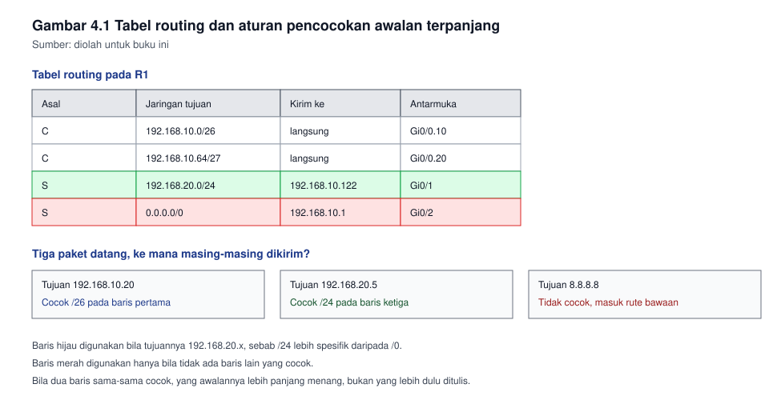
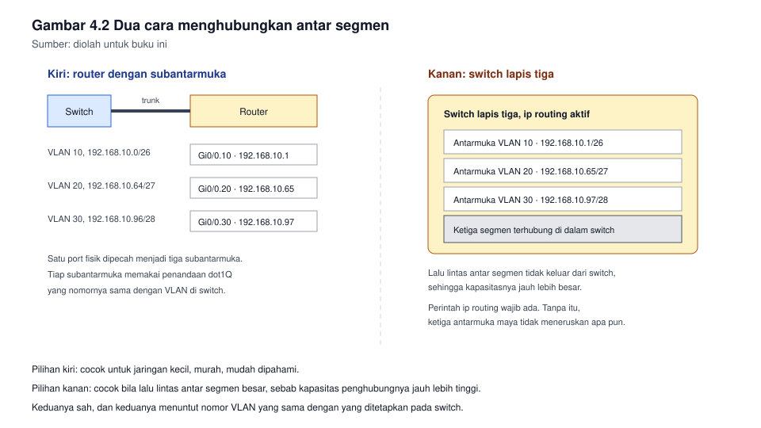

# Bab 4. Routing Statis dan Routing Antar Segmen

## Capaian pembelajaran bab

Sesudah mempelajari bab ini mahasiswa mampu:

1. Menjelaskan isi tabel routing dan aturan pemilihan rute yang dipergunakan
   router. *(Sub-CPMK pertemuan 4, CPMK-2)*
2. Menulis rute statis dengan dua cara, memilih di antaranya, dan
   menjelaskan akibat pilihan itu.
3. Menghubungkan dua segmen yang berbeda VLAN, baik dengan router maupun
   dengan switch lapis tiga.
4. Memeriksa keberhasilan routing dengan perintah yang tepat, dan
   menemukan letak persoalan bila rute tidak tercapai.
5. Menjelaskan kapan rute statis layak digunakan, dan kapan ia menjadi
   sumber persoalan.

## Peta konsep

```
Bab 4 Routing Statis
|-- 4.1 Apa yang dikerjakan router
|-- 4.2 Jenis rute pada tabel routing
|-- 4.3 Menulis rute statis
|-- 4.4 Menghubungkan antar segmen
|-- 4.5 Verifikasi
|-- 4.6 Urutan pemeriksaan bila gagal
|-- 4.7 Rute statis pada jaringan nyata
`-- 4.8 Rute bawaan dan rute cadangan
```

---

## 4.1 Apa yang dikerjakan router

Router bekerja pada lapis 3. Ia tidak mempercepat jaringan, dan tidak
membuat kabel menjadi lebih baik. Ia memilih jalur bagi tiap paket yang
lewat, berdasar tabel yang dimilikinya.

Tiga hal yang perlu dipahami tentang tabel routing:

| Hal | Penjelasannya |
|---|---|
| Isinya | Daftar jaringan tujuan, beserta ke mana paket harus dikirim selanjutnya |
| Sumbernya | Jaringan yang menempel langsung, rute statis, atau hasil pertukaran protokol |
| Aturan pilihnya | Rute yang paling spesifik menang, bukan rute yang paling cepat |

Aturan ketiga sering mengejutkan pemula. Bila tabel memuat dua rute yang
sama-sama menuju 192.168.10.0, satu berawalan /24 dan satu lagi /26, maka
untuk tujuan 192.168.10.20 router memilih yang /26, sebab awalan yang lebih
panjang berarti lebih spesifik. Aturan ini disebut pencocokan awalan
terpanjang.

**Gambar 4.1** memperlihatkan satu tabel routing sederhana beserta
penerapan aturan itu.



*Gambar 4.1* Rute yang paling spesifik menang. Sumber: diolah untuk buku ini.

## 4.2 Jenis rute pada tabel routing

| Jenis | Asalnya | Kegunaannya |
|---|---|---|
| Terhubung langsung | Antarmuka yang menyala dan beralamat | Menjadi dasar seluruh rute lainnya |
| Statis | Ditulis administrator | Cocok untuk jaringan kecil dan untuk jalur cadangan |
| Dinamis | Hasil pertukaran antar perangkat | Menyesuaikan diri bila topologi berubah |

Selain itu terdapat dua rute yang bersifat khusus:

- **Rute bawaan (default route).** Rute untuk seluruh tujuan yang tidak
  tercantum pada tabel. Ditulis dengan awalan /0, dan lazimnya digunakan pada
  router tepi yang hanya memiliki satu jalan keluar.
- **Rute statis mengambang (floating static).** Rute statis yang sengaja
  diberi jarak administratif lebih buruk daripada rute utamanya, sehingga
  ia hanya digunakan bila rute utamanya hilang. Teknik ini murah dan sering
  dipergunakan sebagai jalur cadangan.

**Jarak administratif** adalah angka kepercayaan terhadap sumber rute,
bukan ukuran kecepatan. Makin kecil angkanya, makin dipercaya. Rute
terhubung langsung memiliki angka paling kecil, lalu rute statis, lalu
rute dari tiap protokol dengan angkanya masing-masing.

## 4.3 Menulis rute statis

Ada dua cara menulis rute statis, dan perbedaannya tidak sepele.

```
Router(config)# ip route 192.168.20.0 255.255.255.0 192.168.10.2
Router(config)# ip route 192.168.20.0 255.255.255.0 gigabitEthernet 0/1
```

Baris pertama menyebut **next-hop**, yakni alamat perangkat berikutnya.
Baris kedua menyebut **antarmuka keluar**, yakni port yang digunakan untuk
mengirim.

| Cara | Kelebihannya | Kelemahannya |
|---|---|---|
| Next-hop | Tidak membebani router dengan pencarian alamat satu per satu | Perlu satu entri pencarian untuk menemukan alamat berikutnya |
| Antarmuka keluar | Tidak perlu mencari alamat berikutnya | Pada jaringan yang banyak perangkatnya, router harus mengulang pencarian alamat untuk tiap paket |

Kaidah praktisnya:

- Pada jaringan bertipe siaran, misalnya Ethernet, **utamakan next-hop**.
- Pada tautan titik ke titik, keduanya sama saja, dan antarmuka keluar
  boleh digunakan.
- Bila kalian menulis antarmuka keluar pada jaringan Ethernet, ujilah
  dengan teliti, sebab perilakunya bergantung pada jenis perangkatnya.

Rute statis juga dapat ditulis untuk satu tujuan saja, misalnya untuk satu
komputer tertentu, dengan menuliskan awalan /32. Entri semacam ini berguna
untuk pengujian, tetapi jarang digunakan pada jaringan produksi, sebab ia
membuat tabel menjadi penuh oleh pengecualian.

## 4.4 Menghubungkan antar segmen

Sesudah VLAN dipisah pada bab 3, dua segmen yang berbeda VLAN tidak dapat
berhubungan, sebagaimana mestinya. Agar dapat berhubungan, lalu lintasnya
harus melewati sesuatu yang bekerja pada lapis 3.

Ada dua cara yang lazim.

### Cara pertama: router dengan subantarmuka

Satu port router dipecah menjadi beberapa subantarmuka, tiap subantarmuka
menjadi gerbang bagi satu VLAN. Pola ini sering dijuluki router di atas
tongkat.

```
Router(config)# interface gigabitEthernet 0/0.10
Router(config-subif)# encapsulation dot1Q 10
Router(config-subif)# ip address 192.168.10.1 255.255.255.192
Router(config-subif)# exit
Router(config)# interface gigabitEthernet 0/0.20
Router(config-subif)# encapsulation dot1Q 20
Router(config-subif)# ip address 192.168.10.65 255.255.255.224
Router(config-subif)# exit
Router(config)# interface gigabitEthernet 0/0
Router(config-if)# no shutdown
```

Tiga hal yang sering terlupa:

1. Antarmuka utamanya harus dinyalakan. Menyalakan subantarmuka saja tidak
   cukup.
2. Nomor VLAN pada perintah penandaan harus sama dengan nomor VLAN pada
   switch.
3. Port switch yang menghadap ke router harus trunk, bukan akses.

### Cara kedua: switch lapis tiga

Pada switch lapis tiga, penghubung antar segmen dibuat sebagai antarmuka
maya yang disebut antarmuka VLAN.

```
Switch(config)# ip routing
Switch(config)# interface vlan 10
Switch(config-if)# ip address 192.168.10.1 255.255.255.192
Switch(config-if)# no shutdown
Switch(config-if)# exit
Switch(config)# interface vlan 20
Switch(config-if)# ip address 192.168.10.65 255.255.255.224
Switch(config-if)# no shutdown
```

Perintah pertama pada contoh itu yang paling sering tertinggal. Tanpa
`ip routing`, switch tidak akan meneruskan lalu lintas antar VLAN, meski
seluruh antarmuka mayanya sudah beralamat.

**Gambar 4.2** memperlihatkan kedua cara itu secara berdampingan.



*Gambar 4.2* Kiri: router dengan subantarmuka. Kanan: switch lapis tiga
dengan antarmuka VLAN. Sumber: diolah untuk buku ini.

### Memilih di antaranya

| Keadaan | Pilihan yang bijak |
|---|---|
| Jaringan kecil, lalu lintas antar segmen sedikit | Router dengan subantarmuka |
| Banyak segmen, lalu lintas antar segmen besar | Switch lapis tiga, sebab kapasitasnya jauh lebih besar |
| Perlu penyaringan yang rumit antar segmen | Router, atau tembok api yang berdiri sendiri |

Alasan utamanya ialah kapasitas. Port router ukurannya terbatas, sedangkan
kapasitas penghubung internal pada switch lapis tiga jauh lebih besar,
sebab ia tidak melalui kabel sama sekali.

## 4.5 Verifikasi

| Perintah | Yang ditanyakannya |
|---|---|
| `show ip route` | Rute apa saja yang dikenal, dan dari mana asalnya |
| `show ip interface brief` | Antarmuka mana yang menyala, dan alamatnya berapa |
| `show ip arp` | Alamatan apa yang sudah dikenal pada tiap alamat IP |
| `ping` | Apakah paket pergi dan kembali |
| `traceroute` | Lewat perangkat mana saja paket itu berjalan |

Cara membaca keluaran `show ip route` yang perlu dikuasai:

- Huruf di awal baris menyatakan asal rute, misalnya C untuk terhubung
  langsung, S untuk statis, dan O untuk hasil OSPF.
- Tanda kurung siku memuat jarak administratif dan metriknya.
- Bagian sesudah kata `via` menyatakan ke mana paket dikirim selanjutnya.

**Kebiasaan yang menghemat waktu.** Bila `ping` gagal, jangan hanya
mengulang `ping`. Jalankan `traceroute`, sebab ia menunjukkan sampai di
mana paket itu berhasil pergi. Dari situ kalian tahu harus memeriksa
perangkat yang mana.

## 4.6 Urutan pemeriksaan bila rute tidak tercapai

Kerjakan berurutan, dan jangan melompat.

1. **Periksa kabel dan antarmuka.** Apakah antarmukanya menyala? Bila tidak,
   persoalannya pada lapis 1.
2. **Periksa alamat.** Apakah alamat dan netmasknya benar, dan sesuai
   dengan rencana alamat? Kesalahan netmask menghasilkan gejala yang
   menyerupai persoalan routing.
3. **Periksa rutenya.** Apakah router memiliki rute menuju tujuan itu? Bila
   tidak, tidak ada yang akan meneruskan paketnya.
4. **Periksa arah baliknya.** Ini yang paling sering terlupa. Bila paket
   berhasil pergi tetapi jawabannya tidak pernah kembali, maka persoalannya
   ada pada router tujuan, bukan pada router asal.
5. **Periksa penyaringan.** Apakah ada aturan yang memblokir? Pada
   laboratorium jarang ada, tetapi pada jaringan nyata hampir selalu ada.

Contoh gejala yang menjelaskan urutan di atas: komputer A dapat mengirim ke
komputer B, tetapi `ping` dari A ke B selalu habis waktu. Pemeriksaan pada
B menunjukkan paketnya datang. Berarti langkah 3 terpenuhi pada satu arah,
dan yang gagal ialah langkah 4, yakni B tidak memiliki rute kembali ke A.

## 4.7 Rute statis pada jaringan nyata

Rute statis tidak beradaptasi. Bila satu tautan putus, rute statis yang
menunjuk ke tautan itu tetap ada, dan lalu lintas tetap dikirim ke arah
yang sudah mati. Tidak ada pesan kesalahan, tidak ada penyesuaian. Yang ada
hanya keluhan pengguna.

Karena itu:

| Keadaan | Rute statis layak? |
|---|---|
| Satu jalan keluar menuju internet | Ya, dan ini justru yang paling lazim |
| Nama jaringan hanya dua atau tiga, jarang berubah | Ya |
| Banyak jaringan, sering berubah, ada lebih dari satu jalur | Tidak, gunakan protokol routing |

Kelebihan rute statis yang tidak dimiliki protokol routing: ia tidak
mengirim apa pun ke jaringan, tidak menambah beban perangkat, dan tidak
membuka celah bagi perangkat lain untuk menyisipkan rute palsu. Pada
jaringan kecil, kelebihan itu lebih berharga daripada kemampuan beradaptasi.

## 4.8 Rute bawaan dan rute cadangan

Rute bawaan ditulis dengan awalan /0:

```
Router(config)# ip route 0.0.0.0 0.0.0.0 192.168.10.1
```

Artinya: untuk tujuan yang tidak tercantum pada tabel, kirim ke
192.168.10.1. Inilah baris yang membuat jaringan kecil dapat mencapai
internet.

Rute cadangan dibuat dengan menambahkan jarak administratif pada akhir
barisnya:

```
Router(config)# ip route 0.0.0.0 0.0.0.0 192.168.10.1
Router(config)# ip route 0.0.0.0 0.0.0.0 192.168.20.1 150
```

Angka 150 pada baris kedua membuat rute itu lebih buruk daripada rute
pertama, sehingga ia tidak digunakan selama rute pertama ada. Bila tautan
utama putus, rute pertama hilang dari tabel, dan rute kedua menggantikan
tanpa campur tangan siapa pun.

---

## Contoh soal dan pembahasan

### Contoh 4.1 Menulis rute untuk tiga segmen

Topologi:

| Segmen | Jaringan | Gerbang |
|---|---|---|
| Staf | 192.168.10.0/26 | 192.168.10.1 |
| Tamu | 192.168.10.64/27 | 192.168.10.65 |
| Server | 192.168.10.96/28 | 192.168.10.97 |

Ketiga segmen terhubung ke router R1. R1 tersambung ke router R2 melalui
192.168.10.121, dengan R2 beralamat 192.168.10.122. Di belakang R2 terdapat
jaringan 192.168.30.0/24.

Tuliskan rute yang diperlukan agar seluruh segmen dapat berhubungan.

**Pembahasan.**

R1 sudah mengenal ketiga segmennya secara langsung, sebab ketiga antarmuka
itu menempel padanya. Yang belum dikenal R1 ialah 192.168.30.0/24, maka
ditulis:

```
R1(config)# ip route 192.168.30.0 255.255.255.0 192.168.10.122
```

R2 mengenal 192.168.30.0/24 secara langsung. Yang belum dikenal R2 ialah
tiga segmen di belakang R1.

Tiga rute terpisah dapat ditulis, tetapi ketiga segmen itu dapat dirangkum,
sebab 192.168.10.0/26, /27, dan /28 seluruhnya berada di dalam
192.168.10.0/24. Maka cukup satu baris:

```
R2(config)# ip route 192.168.10.0 255.255.255.0 192.168.10.121
```

Perhatikan bahwa perangkaian ini aman pada contoh ini, sebab seluruh
192.168.10.0/24 menjadi milik R1. Bila sebagian rentang itu berada di
tempat lain, perangkaian akan mengirim sebagian lalu lintas ke arah yang
salah. Karena itu, rangkum hanya bila kalian menguasai seluruh rentangnya.

Langkah terakhir yang sering terlupa: uji dari kedua arah. `ping` dari staf
ke server, lalu `ping` dari server ke staf. Bila hanya satu arah yang
berhasil, periksa kembali rute pada perangkat tujuan.

### Contoh 4.2 Mendiagnosis gejala

Seorang mahasiswa melaporkan: komputernya beralamat 192.168.20.10/24
dengan gerbang 192.168.20.1. Ia dapat mengirim ke 192.168.20.1, dan dapat
mengirim ke 192.168.10.5, tetapi tidak dapat mengirim ke 192.168.10.50.
Sementara itu komputer lain di ruang yang sama, beralamat 192.168.20.11,
dapat mengirim ke 192.168.10.50 dengan lancar.

Tentukanlah kemungkinan persoalannya, dan sebutkan dua pemeriksaan
pertama.

**Pembahasan.**

Kunci pada soal ini: satu komputer gagal, komputer lainnya berhasil,
keduanya pada ruang yang sama dengan gerbang yang sama. Bila persoalannya
ada pada rute atau pada gerbang, kedua komputer akan gagal bersama.

Karena itu persoalannya hampir pasti ada pada komputer pertama sendiri,
bukan pada jaringannya. Dua kemungkinan yang paling dekat:

1. Netmask pada komputer itu salah, sehingga 192.168.10.50 dianggap berada
   di luar jaringannya, atau sebaliknya dianggap berada di dalam
   jaringannya sehingga tidak dikirim ke gerbang.
2. Terdapat rute yang tertanam pada komputer itu, atau entri pencarian
   alamat yang usang yang menunjuk ke tempat yang salah.

Dua pemeriksaan pertama:

1. Bandingkan alamat, netmask, dan gerbang pada kedua komputer. Perbedaan
   sekecil apa pun pada netmask cukup menjelaskan gejala itu.
2. Bersihkan entri pencarian alamat pada komputer yang bermasalah, lalu
   ulangi pengujiannya. Entri yang usang membuat komputer mengirim ke
   alamatan lama yang sudah tidak digunakan.

Pelajaran dari soal ini: sebelum menyalahkan router, pastikan dua perangkat
yang berbeda menunjukkan gejala yang sama. Bila tidak, persoalannya
hampir pasti ada pada perangkatnya, bukan pada jaringannya.

---

## Latihan

1. Sebuah tabel routing memuat 10.0.0.0/8, 10.1.0.0/16, dan 10.1.1.0/24.
   Ke arah mana router mengirim paket untuk tujuan 10.1.1.20? Jelaskan.
2. Sebutkan perbedaan menulis rute statis dengan next-hop dan dengan
   antarmuka keluar, lalu sebutkan kapan masing-masing digunakan.
3. Tuliskan perintah untuk membuat subantarmuka pada VLAN 30 dengan
   alamat 192.168.10.97/28, beserta penandaannya.
4. Apa yang terjadi bila perintah `ip routing` tertinggal pada switch
   lapis tiga yang seluruh antarmuka mayanya sudah benar?
5. Sebuah jaringan memiliki satu jalan keluar menuju internet. Tuliskan
   rute bawaannya, bila gerbangnya beralamat 192.168.1.1.
6. Jelaskan mengapa rute statis mengambang disebut mengambang, dan
   sebutkan satu keadaan yang membuatnya berguna.
7. Susun urutan pemeriksaan kalian sendiri untuk gejala "dapat mengirim
   keluar, tetapi jawabannya tidak pernah kembali", lalu jelaskan tiap
   langkahnya.
8. Dua router terhubung melalui 10.0.0.0/30. Di belakang router pertama
   terdapat 172.16.1.0/24, dan di belakang router kedua 172.16.2.0/24.
   Tuliskan rute pada kedua router agar kedua jaringan itu terhubung.

**Kunci dan rubrik.** Nomor 1, 3, 5, dan 8 dinilai dari kebenaran jawaban
dan kelengkapan perintah; pada nomor 8 perhatikan bahwa kedua router
membutuhkan rute, bukan hanya salah satunya. Nomor 2, 4, 6, dan 7 dinilai
dari kejelasan penjelasan dan ketepatan istilah.

## Rangkuman

- Router memilih jalur menurut tabelnya, dan rute yang paling spesifik
  menang, bukan yang paling cepat.
- Rute statis dapat ditulis dengan next-hop atau dengan antarmuka keluar;
  pada jaringan Ethernet utamakan next-hop.
- Menghubungkan antar VLAN memerlukan sesuatu yang bekerja pada lapis 3,
  baik router dengan subantarmuka maupun switch lapis tiga.
- Verifikasi tidak berhenti pada `ping`; `traceroute` menunjukkan sampai di
  mana paket berhasil pergi.
- Pemeriksaan gangguan dilakukan berurutan, dan arah baliknya paling sering
  terlupa.
- Rute statis tidak beradaptasi, sehingga ia layak pada jaringan kecil,
  dan tidak layak bila topologinya sering berubah.

## Glosarium

| Istilah | Arti |
|---|---|
| Antarmuka VLAN | Antarmuka maya pada switch lapis tiga yang menjadi gerbang bagi satu VLAN |
| Arah balik | Jalur yang ditempuh jawaban dari tujuan kembali ke pengirim |
| Jarak administratif | Angka kepercayaan terhadap sumber rute, makin kecil makin dipercaya |
| Next-hop | Alamat perangkat berikutnya yang menerima paket |
| Pencocokan awalan terpanjang | Aturan memilih rute yang paling spesifik |
| Rute bawaan | Rute untuk seluruh tujuan yang tidak tercantum pada tabel |
| Rute statis mengambang | Rute statis cadangan yang hanya digunakan bila rute utamanya hilang |
| Subantarmuka | Pecahan satu antarmuka fisik menjadi beberapa antarmuka logika |

## Rujukan

| Sumber | Kedudukan | Status |
|---|---|---|
| Kepmenaker Nomor 321 Tahun 2016, unit J.611000.013.02 | Acuan kompetensi routing | ⏳ status berlakunya perlu dicek |
| RPS KPT0502324 | Acuan capaian bab | ✓ tersusun pada folder kerja ini |
| Tanenbaum dan Wetherall, Computer Networks | Pendalaman routing | ⏳ edisi dan tahun perlu dicek |
