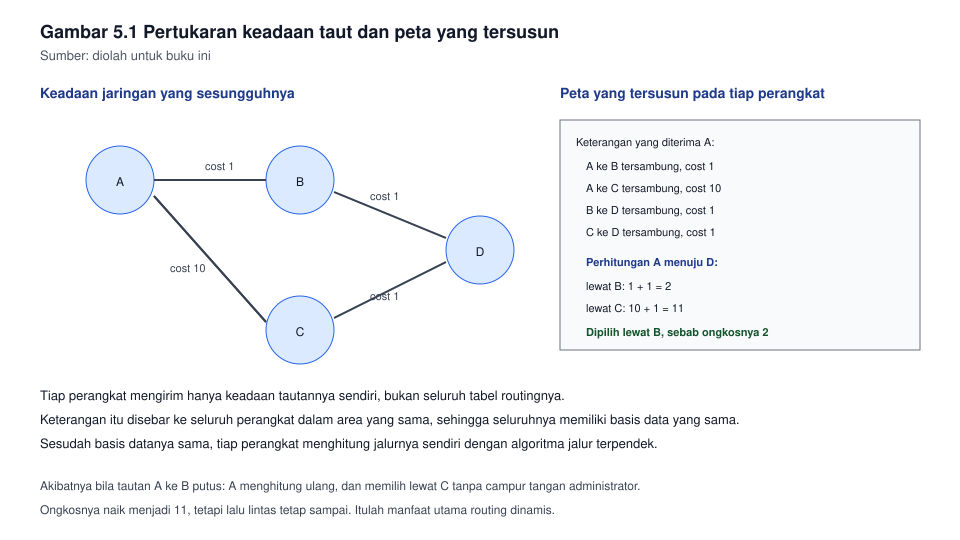
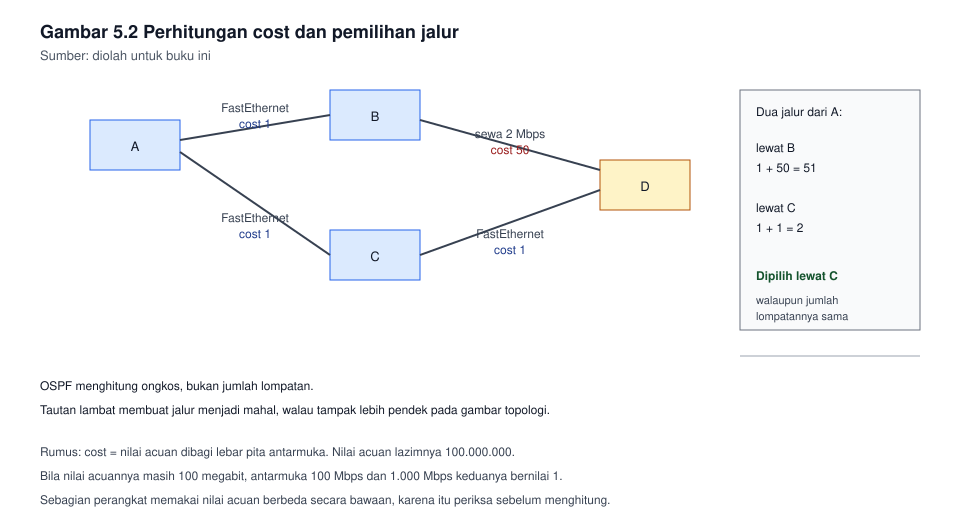

# Bab 5. Routing Dinamis dalam Satu Sistem Otonom

## Capaian pembelajaran bab

Sesudah mempelajari bab ini mahasiswa mampu:

1. Menjelaskan mengapa routing dinamis diperlukan, dan membedakan routing
   dalam satu sistem otonom dari routing antar sistem otonom.
   *(Sub-CPMK pertemuan 5, CPMK-2, unit SKKNI J.611000.013.02)*
2. Menjelaskan cara kerja protokol berkeadaan taut, termasuk pertukaran
   informasi dan perhitungan jalurnya.
3. Mengonfigurasi OSPF satu area pada beberapa perangkat, lalu
   memverifikasi bahwa tetangganya terbentuk.
4. Menghitung nilai cost, dan menentukan jalur yang dipilih router.
5. Menemukan penyebab tetangga tidak terbentuk, dengan urutan pemeriksaan
   yang tertulis.

## Peta konsep

```
Bab 5 Routing Dinamis Satu Area
|-- 5.1 Mengapa tidak cukup mengandalkan rute statis
|-- 5.2 Konsep protokol berkeadaan taut
|-- 5.3 Pembentukan tetangga
|-- 5.4 Perhitungan cost
|-- 5.5 Konfigurasi OSPF satu area
|-- 5.6 Verifikasi
|-- 5.7 Peran terpilih pada jaringan siaran
|-- 5.8 Menemukan penyebab kegagalan
`-- 5.9 Kapan OSPF berlebihan
```

---

## 5.1 Mengapa tidak cukup mengandalkan rute statis

Bab 4 menetapkan bahwa rute statis tidak beradaptasi. Sekarang bayangkan
jaringan dengan empat router yang saling tersambung membentuk cincin. Bila
satu tautan putus, masih ada jalan lain, tetapi rute statis tidak akan
memakainya, sebab ia hanya tahu apa yang ditulis administrator.

Routing dinamis mengatasi hal itu: perangkat saling memberitahu keadaan
masing-masing, dan menghitung ulang jalurnya bila keadaan berubah.

Dua golongan besar protokolnya:

| Golongan | Cara kerjanya | Contohnya |
|---|---|---|
| Jarak vektor | Tiap perangkat memberitahu tetangganya tentang jarak yang ia ketahui | RIP |
| Keadaan taut | Tiap perangkat memberitahu seluruh perangkat dalam wilayahnya tentang keadaan tautannya sendiri | OSPF, IS-IS |

Perbedaan mendasarnya: pada jarak vektor, perangkat mempercayai apa yang
dikatakan tetangganya. Pada keadaan taut, tiap perangkat menggambar peta
sendiri dari informasi yang diterimanya, lalu menghitung jalurnya sendiri.

Selain itu:

| Golongan | Wilayahnya | Contohnya |
|---|---|---|
| IGP, routing dalam satu sistem otonom | Digunakan di dalam satu organisasi | OSPF, EIGRP, IS-IS, RIP |
| EGP, routing antar sistem otonom | Digunakan antar organisasi | BGP |

Bab ini membahas yang pertama. Yang kedua dibahas pada bab berikutnya.

## 5.2 Konsep protokol berkeadaan taut

Tiap perangkat yang menjalankan OSPF melakukan tiga hal:

1. **Mengenali tetangganya.** Ia mengirim paket sapa, dan mencatat siapa
   saja yang membalas.
2. **Menyebarkan keadaan tautannya.** Ia memberitahu perangkat lain tentang
   tautan apa yang ia miliki, berapa cost-nya, dan ke mana tautan itu
   mengarah.
3. **Menghitung jalur terpendek.** Dari seluruh keterangan yang diterimanya,
   ia menyusun peta, lalu menghitung jalur terbaik menuju tiap tujuan.

Kumpulan keterangan yang diterima disebut basis data keadaan taut. Seluruh
perangkat dalam satu area memiliki basis data yang sama. Itulah sebabnya
mereka menghitung hasil yang sama pula.

Karena tiap perangkat menghitung sendiri, OSPF tidak mudah tertipu oleh
keterangan yang salah dari satu tetangga, meski ia tetap dapat terganggu
bila keterangan salah itu tersebar luas.

**Gambar 5.1** memperlihatkan peta yang tersusun dari pertukaran itu.



*Gambar 5.1* Tiap perangkat menggambar peta yang sama, lalu menghitung
jalurnya sendiri. Sumber: diolah untuk buku ini.

### Area

OSPF membagi wilayahnya menjadi area. Pembagian ini mengurangi beban:
perubahan pada satu area tidak memaksa seluruh jaringan menghitung ulang.

Pada jaringan kecil dan menengah, satu area sudah cukup, dan wilayah itu
disebut area tulang punggung, bernomor 0. Seluruh konfigurasi pada bab ini
menggunakan satu area bernomor 0.

## 5.3 Pembentukan tetangga

Dua perangkat tidak langsung bertukar rute. Mereka melewati beberapa
keadaan:

| Keadaan | Artinya |
|---|---|
| Down | Belum menerima apa pun dari calon tetangga |
| Init | Sudah menerima sapa, tetapi belum melihat dirinya pada sapa itu |
| 2-Way | Sudah melihat dirinya pada sapa itu, kenal satu sama lain |
| ExStart | Mulai bertukar, menentukan siapa yang lebih dulu |
| Exchange | Bertukar ringkasan isi basis datanya |
| Loading | Meminta bagian yang belum ia miliki |
| Full | Selesai, basis datanya sama |

Yang perlu kalian camkan: tetangga yang berhenti pada 2-Way belum bertukar
rute apa pun. Bila tabel routing tidak terisi sementara tetangganya tampak
ada, periksa pada keadaan mana tetangga itu berhenti.

Agar tetangga terbentuk, beberapa hal **harus sama** pada kedua ujung:

| Hal | Mengapa harus sama |
|---|---|
| Nomor area | Perangkat pada area berbeda tidak bertukar rute secara langsung |
| Waktu sapa dan waktu mati | Bila berbeda, salah satu menganggap yang lain sudah mati |
| Penandaan jaringan | Menentukan cara paket sapa dikirim |
| Pengesahan | Bila satu pihak memakai kata sandi dan pihak lain tidak, sapa ditolak |
| Ukuran bingkai maksimum | Bila berbeda, pertukaran dapat tertahan pada ExStart |
| Jeda waktu | Harus sama pada sebagian besar perangkat |

## 5.4 Perhitungan cost

OSPF memilih jalur menurut cost, yakni ongkos kumulatif dari pengirim
sampai tujuan. Ongkos tiap tautan dihitung dari lebar pita antarmukanya.

Rumusnya:

```
cost = nilai acuan / lebar pita antarmuka
```

Nilai acuan lazimnya 100.000.000, yakni seratus megabit per detik. Maka:

| Antarmuka | Lebar pita | Perhitungan | Cost |
|---|---|---|---|
| Ethernet 10 Mbps | 10.000.000 | 100.000.000 / 10.000.000 | 10 |
| FastEthernet 100 Mbps | 100.000.000 | 100.000.000 / 100.000.000 | 1 |
| GigabitEthernet 1.000 Mbps | 1.000.000.000 | 100.000.000 / 1.000.000.000 | 1 |
| Tautan sewa 2 Mbps | 2.000.000 | 100.000.000 / 2.000.000 | 50 |

Perhatikan baris ketiga. Hasilnya di bawah 1, dan OSPF tidak memakai
pecahan, sehingga ia dibulatkan menjadi 1. Akibatnya, pada perangkat yang
nilai acuannya masih 100 megabit, tautan 100 Mbps dan 1.000 Mbps dianggap
sama ongkosnya. Inilah sebabnya administrator kerap menaikkan nilai
acuannya, supaya perbedaan itu terlihat kembali.

Sebagian perangkat memakai nilai acuan yang berbeda secara bawaan. Karena
itu, sebelum menghitung, periksa nilai acuan pada perangkat yang kalian
pegang.

**Gambar 5.2** memperlihatkan perhitungan cost pada satu topologi kecil,
beserta jalur yang terpilih.



*Gambar 5.2* Jalur dengan jumlah cost terkecil yang terpilih. Sumber:
diolah untuk buku ini.

## 5.5 Konfigurasi OSPF satu area

Misalkan router R1 memiliki tiga jaringan yang akan diumumkan:
192.168.10.0/26, 192.168.10.64/27, dan 192.168.10.96/28, serta tersambung
ke router lain melalui 192.168.10.120/30.

```
R1(config)# router ospf 1
R1(config-router)# router-id 1.1.1.1
R1(config-router)# network 192.168.10.0 0.0.0.63 area 0
R1(config-router)# network 192.168.10.64 0.0.0.31 area 0
R1(config-router)# network 192.168.10.96 0.0.0.15 area 0
R1(config-router)# network 192.168.10.120 0.0.0.3 area 0
R1(config-router)# passive-interface gigabitEthernet 0/0
R1(config-router)# exit
```

Empat hal yang perlu diperhatikan:

1. **Penanda pengenal router.** Ditulis sendiri, supaya tetap sama walau
   perangkat dimulai ulang. Bila tidak ditulis, perangkat memilih sendiri,
   dan pilihannya dapat berubah.
2. **Kebalikan netmask.** Perintah `network` pada OSPF memakai kebalikan
   netmask, bukan netmask. /26 berarti 0.0.0.63, /27 berarti 0.0.0.31.
   Kesalahan pada bagian ini adalah kesalahan yang paling sering.
3. **Antarmuka pasif.** Antarmuka yang menghadap ke pengguna sebaiknya
   dibuat pasif, supaya perangkat tidak mengirim paket sapa ke arah
   pengguna. Selain menghemat, ini menutup celah bagi perangkat pengguna
   untuk mencoba ikut serta.
4. **Urutan.** Tidak ada keharusan mengumumkan jaringan dengan urutan
   tertentu.

Bila kalian ingin router mengumumkan rute bawaannya kepada perangkat lain
dalam area itu, tambahkan:

```
R1(config-router)# default-information originate
```

## 5.6 Verifikasi

| Perintah | Yang ditanyakannya |
|---|---|
| `show ip ospf neighbor` | Siapa saja tetangganya, dan pada keadaan mana mereka berhenti |
| `show ip ospf` | Nomor proses, penanda pengenal, dan ringkasan areanya |
| `show ip route ospf` | Rute apa saja yang diperoleh dari OSPF |
| `show ip ospf interface` | Waktu sapa, cost, dan peran pada tiap antarmuka |
| `show ip protocols` | Jaringan apa saja yang diumumkan |

Urutan pemeriksaannya:

1. Periksa tetangganya lebih dahulu. Bila tidak ada tetangga, tidak akan
   ada rute, dan memeriksa tabel routing hanya membuang waktu.
2. Bila tetangganya ada tetapi berhenti pada ExStart atau Exchange,
   periksa ukuran bingkai maksimum pada kedua ujung.
3. Bila tetangganya penuh, periksa rute yang diterima.
4. Bila rute sudah ada, uji dengan `ping` dari kedua arah.

## 5.7 Peran terpilih pada jaringan siaran

Pada jaringan bertipe siaran, misalnya Ethernet, bila seluruh perangkat
saling bertukar dengan seluruh perangkat, jumlah pertukarannya meledak.
Karena itu dipilih satu perangkat sebagai peran terpilih, dan satu lagi
sebagai cadangannya.

| Peran | Tugasnya |
|---|---|
| Peran terpilih | Menjadi pusat pertukaran bagi perangkat lain pada segmen itu |
| Peran terpilih cadangan | Menggantikan bila yang terpilih hilang |
| Perangkat lainnya | Bertukar hanya dengan dua peran di atas |

Pemilihannya didasarkan pada prioritas, lalu pada penanda pengenal
tertinggi bila prioritasnya sama. Bila kalian ingin perangkat tertentu yang
menjadi peran terpilih, naikkan prioritasnya, jangan hanya mengandalkan
kebetulan penanda pengenal.

Pada tautan titik ke titik tidak ada pemilihan, sebab hanya ada dua
perangkat, dan tidak ada yang perlu dipilih.

## 5.8 Menemukan penyebab kegagalan

| Gejala | Penyebab yang paling mungkin |
|---|---|
| Tidak ada tetangga sama sekali | Antarmuka mati, alamat tidak sejaringan, atau pengesahan tidak cocok |
| Tetangga berhenti pada Init | Hanya satu arah yang sampai, atau penandaan jaringan berbeda |
| Tetangga berhenti pada 2-Way | Wajar bila kedua perangkat bukan peran terpilih pada segmen itu |
| Tetangga berhenti pada ExStart | Ukuran bingkai maksimum berbeda |
| Tetangga penuh, tetapi rute tidak muncul | Jaringan belum diumumkan, atau kebalikan netmasknya salah |
| Rute ada, tetapi lalu lintas tidak lewat | Arah baliknya belum ada, atau ada penyaringan |

Cara memakai tabel di atas: temukan gejalanya, kerjakan barisnya, lalu
periksa dari kedua ujung. Hampir seluruh persoalan OSPF berasal dari
ketidakcocokan, bukan dari kerusakan.

## 5.9 Kapan OSPF berlebihan

OSPF bukan selalu jawaban. Ia menambah beban perangkat, menuntut
perencanaan area, dan membuka celah bagi kesalahan konfigurasi yang
menjalar cepat.

| Keadaan | Apakah OSPF layak? |
|---|---|
| Satu router, satu jalan keluar | Tidak, rute statis lebih tepat |
| Dua atau tiga router, topologi tetap | Boleh, tetapi rute statis pun cukup |
| Empat router atau lebih, ada lebih dari satu jalur | Ya, dan OSPF mulai menunjukkan manfaatnya |
| Jaringan besar dengan banyak segmen | Ya, dengan perencanaan area yang matang |

Ukuran yang paling sederhana: bila kalian dapat menyebut seluruh rute yang
dibutuhkan tanpa membuka catatan, dan rute itu jarang berubah, rute statis
masih lebih murah daripada OSPF.

---

## Contoh soal dan pembahasan

### Contoh 5.1 Menentukan jalur yang terpilih

Topologi:

- A tersambung ke B melalui FastEthernet, cost 1.
- A tersambung ke C melalui FastEthernet, cost 1.
- B tersambung ke D melalui tautan sewa 2 Mbps, cost 50.
- C tersambung ke D melalui FastEthernet, cost 1.
- D memiliki jaringan tujuan 172.16.5.0/24.

Hitunglah jalur yang dipilih A menuju 172.16.5.0/24.

**Pembahasan.**

Ada dua jalur dari A menuju D.

Jalur pertama, melalui B:

```
A ke B   = 1
B ke D   = 50
Jumlah   = 51
```

Jalur kedua, melalui C:

```
A ke C   = 1
C ke D   = 1
Jumlah   = 2
```

Jalur kedua menang, sebab cost-nya lebih kecil. Yang menarik pada contoh
ini: jalur melalui B secara kasatmata terlihat lebih pendek, sebab
jumlahnya sama-sama dua lompatan, tetapi OSPF tidak menghitung lompatan,
ia menghitung ongkos. Tautan sewa yang lambat membuat jalur itu jauh lebih
mahal.

Pelajaran praktisnya: bila kalian memasang tautan cadangan yang lambat,
jangan heran bila tautan itu tidak pernah digunakan selama tautan utamanya
masih hidup. Bila kalian ingin tautan itu digunakan hanya sebagai cadangan,
keadaan itu justru yang kalian inginkan.

### Contoh 5.2 Tetangga tidak terbentuk

Dua router tersambung langsung melalui 10.0.0.0/30. Keduanya sudah
menjalankan OSPF, dan konfigurasinya sebagai berikut.

| Hal | Router kiri | Router kanan |
|---|---|---|
| Nomor area | 0 | 1 |
| Waktu sapa | 10 detik | 10 detik |
| Alamat | 10.0.0.1/30 | 10.0.0.2/30 |
| Pengesahan | tidak ada | tidak ada |

Tentukan mengapa tetangganya tidak terbentuk, dan sebutkan perbaikannya.

**Pembahasan.**

Periksa satu per satu dari daftar kesamaan pada bagian 5.3. Alamatnya
sejaringan, waktunya sama, pengesahannya sama-sama tidak ada. Yang berbeda
hanya satu: nomor areanya.

Perangkat pada area yang berbeda tidak akan membentuk tetangga, sebab
mereka seharusnya bertukar hanya melalui perangkat perbatasan. Karena itu
kedua router berhenti sebelum pertukaran dimulai.

Perbaikannya: samakan nomor areanya. Pada jaringan kecil, samakan pada
area 0, sebab seluruh jaringan berada dalam satu area.

Pelajaran dari soal ini: persoalan OSPF hampir seluruhnya berupa
ketidakcocokan. Karena itu periksa dengan berpasangan, bandingkan kolom
demi kolom, jangan membaca konfigurasi satu perangkat saja.

---

## Latihan

1. Sebutkan dua perbedaan protokol jarak vektor dan protokol keadaan taut.
2. Sebutkan enam hal yang harus sama agar dua perangkat menjadi tetangga
   OSPF.
3. Hitunglah cost untuk antarmuka 10 Mbps, 100 Mbps, dan 2 Mbps, bila
   nilai acuannya 100.000.000.
4. Tuliskan konfigurasi OSPF untuk router yang mengumumkan 172.16.1.0/24,
   172.16.2.0/24, dan 10.0.0.0/30, dengan penanda pengenal 2.2.2.2.
5. Mengapa antarmuka yang menghadap ke pengguna sebaiknya dibuat pasif?
   Sebutkan dua alasan.
6. Tetangga berhenti pada keadaan ExStart. Sebutkan dua hal yang akan
   kalian periksa, dan jelaskan mengapa.
7. Tiga router tersambung membentuk rantai: A ke B melalui FastEthernet,
   B ke C melalui tautan 2 Mbps. Hitung cost dari A ke C, dan jelaskan
   apa yang akan terjadi bila tautan lambat itu diganti menjadi
   FastEthernet.
8. Jelaskan dengan kata-kata sendiri mengapa OSPF dikatakan tidak mudah
   tertipu oleh keterangan dari satu tetangga, tetapi tetap dapat
   terganggu bila keterangan salah itu tersebar luas.

**Kunci dan rubrik.** Nomor 3, 4, dan 7 dinilai dari kebenaran perhitungan
dan kelengkapan perintah; pada nomor 4 perhatikan bahwa kebalikan netmask
untuk /24 ialah 0.0.0.255 dan untuk /30 ialah 0.0.0.3. Nomor 1, 2, 5, 6,
dan 8 dinilai dari ketepatan konsep dan kejelasan alasan.

## Rangkuman

- Routing dinamis diperlukan bila topologinya memiliki lebih dari satu
  jalur, atau sering berubah.
- Protokol keadaan taut membuat tiap perangkat menggambar peta sendiri,
  lalu menghitung jalurnya sendiri.
- Tetangga terbentuk hanya bila beberapa hal sama pada kedua ujung, dan
  persoalan OSPF hampir selalu berupa ketidakcocokan.
- Cost dihitung dari nilai acuan dibagi lebar pita, sehingga tautan lambat
  membuat jalur menjadi mahal walau jumlah lompatannya sama.
- Pemeriksaan dimulai dari tetangga, lalu rute, baru kemudian pengujian
  lalu lintas.
- OSPF berlebihan pada jaringan kecil yang topologinya tetap.

## Glosarium

| Istilah | Arti |
|---|---|
| Area | Wilayah dalam OSPF yang memiliki basis data keadaan taut yang sama |
| Area tulang punggung | Area bernomor 0, menjadi pusat bagi area lainnya |
| Basis data keadaan taut | Kumpulan keterangan tautan yang dimiliki tiap perangkat |
| Cost | Ongkos tautan yang dihitung dari lebar pita, dipergunakan untuk memilih jalur |
| EGP | Protokol routing antar sistem otonom |
| IGP | Protokol routing di dalam satu sistem otonom |
| Keadaan taut | Golongan protokol yang menyebarkan keadaan tautan tiap perangkat |
| Penanda pengenal router | Nomor pengenal router, sebaiknya ditulis sendiri agar tetap |
| Peran terpilih | Perangkat yang menjadi pusat pertukaran pada segmen siaran |
| Sistem otonom | Sekumpulan jaringan yang dikelola satu organisasi |

## Rujukan

| Sumber | Kedudukan | Status |
|---|---|---|
| Kepmenaker Nomor 321 Tahun 2016, unit J.611000.013.02 | Acuan kompetensi routing | ⏳ status berlakunya perlu dicek |
| RPS KPT0502324 | Acuan capaian bab | ✓ tersusun pada folder kerja ini |
| Tanenbaum dan Wetherall, Computer Networks | Pendalaman protokol routing | ⏳ edisi dan tahun perlu dicek |
