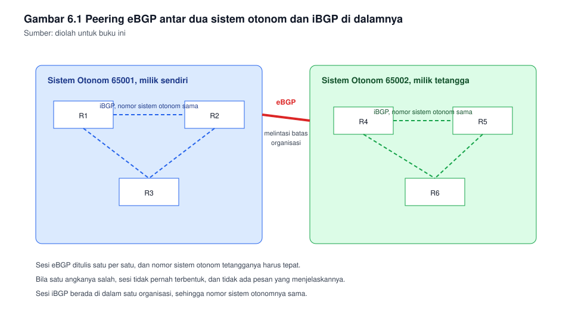
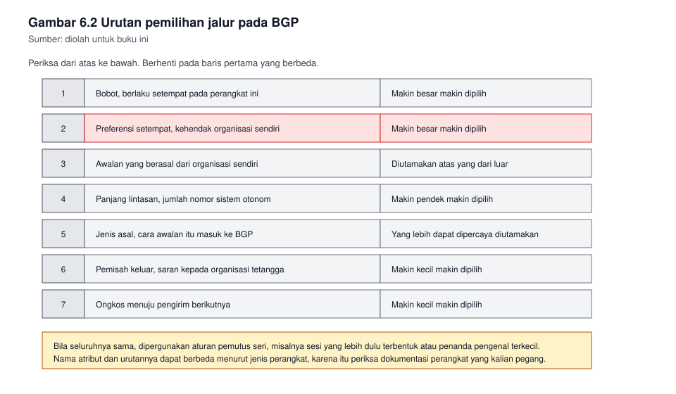

# Bab 6. Pertukaran Rute Antar Sistem Otonom

## Capaian pembelajaran bab

Sesudah mempelajari bab ini mahasiswa mampu:

1. Menjelaskan perbedaan routing di dalam satu sistem otonom dan routing
   antar sistem otonom. *(Sub-CPMK pertemuan 6, CPMK-2, unit SKKNI
   J.611000.014.02)*
2. Menjelaskan konsep nomor sistem otonom, peering, eBGP, dan iBGP.
3. Menyebutkan atribut yang dipergunakan BGP untuk memilih jalur, dan
   menentukan jalur yang terpilih dari atribut itu.
4. Mengonfigurasi sesi eBGP sederhana, lalu memverifikasinya.
5. Menjelaskan mengapa pengumuman rute yang salah dapat merugikan
   organisasi lain, dan bagaimana mencegahnya.

## Peta konsep

```
Bab 6 Pertukaran Rute Antar Sistem Otonom
|-- 6.1 Mengapa BGP berbeda dari OSPF
|-- 6.2 Nomor sistem otonom dan peering
|-- 6.3 Cara kerja sesi BGP
|-- 6.4 Atribut dan pemilihan jalur
|-- 6.5 Konfigurasi eBGP sederhana
|-- 6.6 Verifikasi
|-- 6.7 Menyaring pengumuman
|-- 6.8 Kesalahan yang sering terjadi
`-- 6.9 Tanggung jawab yang menyertainya
```

---

## 6.1 Mengapa BGP berbeda dari OSPF

OSPF memilih jalur menurut ongkos, dan menghitungnya sendiri dari peta yang
ia miliki. Cara itu tepat di dalam satu organisasi, sebab seluruh
perangkatnya dikelola oleh orang yang sama, dengan tujuan yang sama.

Antar organisasi, cara itu tidak berlaku. Tidak ada satu pihak pun yang
berhak menentukan jalur terbaik bagi pihak lain, dan tidak ada pihak yang
mau membeberkan keadaan dalam jaringannya kepada organisasi lain.

Karena itu BGP tidak menghitung ongkos. Ia memilih jalur menurut
**kebijakan**, yakni aturan yang ditulis administratornya sendiri.

| Hal | OSPF | BGP |
|---|---|---|
| Wilayahnya | Di dalam satu organisasi | Antar organisasi |
| Dasar pilihannya | Ongkos menurut lebar pita | Kebijakan menurut atribut |
| Yang dipertukarkan | Keadaan tautan | Daftar awalan jaringan yang dapat dicapai |
| Kecepatan menyesuaikan diri | Cepat | Sengaja lebih lambat, demi kestabilan |
| Cara berjalannya | Di atas protokolnya sendiri | Di atas sesi andal yang sudah mapan |

Satu akibat penting dari baris keempat: bila tautan putus, BGP tidak
langsung berpindah. Penundaan itu disengaja, sebab pada skala besar,
perpindahan yang terlalu cepat justru membuat jaringan bergetar.

## 6.2 Nomor sistem otonom dan peering

Setiap organisasi yang menjalankan BGP memiliki nomor sistem otonom.
Nomor itu menjadi identitasnya di hadapan organisasi lain.

| Istilah | Artinya |
|---|---|
| Sistem otonom | Sekumpulan jaringan yang dikelola satu organisasi dengan kebijakan sendiri |
| Nomor sistem otonom | Nomor pengenal sistem otonom itu |
| Peering | Kesepakatan dua organisasi untuk saling bertukar rute |
| eBGP | Sesi BGP antar dua sistem otonom yang berbeda |
| iBGP | Sesi BGP di dalam satu sistem otonom yang sama |

Perbedaan eBGP dan iBGP bukan pada jaraknya, melainkan pada nomor sistem
otonomnya. Dua perangkat pada gedung yang sama dapat membentuk eBGP bila
nomor sistem otonomnya berbeda, dan dua perangkat pada kota yang berbeda
dapat membentuk iBGP bila nomornya sama.

**Gambar 6.1** memperlihatkan kedudukan keduanya.



*Gambar 6.1* Sesi eBGP melintasi batas organisasi, sesi iBGP berada di
dalamnya. Sumber: diolah untuk buku ini.

## 6.3 Cara kerja sesi BGP

Tidak seperti OSPF yang menemukan tetangganya sendiri, sesi BGP harus
ditulis satu per satu. Tiap tetangga dinyatakan dengan nomor sistem
otonomnya.

Sesudah sesi terbentuk, kedua pihak saling mengirim daftar awalan jaringan
yang dapat mereka capai, beserta atributnya. Mereka tidak mengirim
keadaan tautan, dan tidak mengirim peta.

Tiga hal yang perlu diingat:

| Hal | Konsekuensinya |
|---|---|
| Sesinya harus andal | Bila sesinya putus, rutenya dianggap hilang |
| Tetangganya ditulis sendiri | Kesalahan satu angka pada nomor sistem otonom membuat sesi tidak pernah terbentuk |
| Hanya yang diumumkan yang tersebar | Bila lupa mengumumkan, jaringan itu tidak dikenal pihak lain, meski sesinya terbentuk |

Baris ketiga adalah sumber keluhan yang paling sering: sesi tampak
terbentuk, tetapi rute tidak pernah muncul.

## 6.4 Atribut dan pemilihan jalur

Tiap awalan yang diterima membawa atribut. Atribut itu yang menentukan
pilihan.

| Atribut | Kegunaannya | Arah pengaruhnya |
|---|---|---|
| Bobot | Khusus pada sebagian perangkat, berlaku setempat | Makin besar makin dipilih |
| Preferensi setempat | Menentukan jalur keluar bagi seluruh sistem otonom | Makin besar makin dipilih |
| Asal sendiri | Menandai awalan yang berasal dari organisasi ini | Diutamakan atas yang dari luar |
| Panjang lintasan | Jumlah nomor sistem otonom yang dilalui | Makin pendek makin dipilih |
| Jenis asal | Cara awalan itu masuk ke BGP | Yang lebih dapat dipercaya diutamakan |
| Pemisah keluar | Saran kepada organisasi tetangga | Makin kecil makin dipilih |
| Ongkos menuju pengirim berikutnya | Ongkos di dalam organisasi sendiri | Makin kecil makin dipilih |

Urutan di atas juga menjadi urutan pemeriksaannya: bila dua jalur
bersaing, periksa dari baris teratas, dan berhenti pada baris pertama yang
berbeda. Bila seluruhnya sama, barulah dipergunakan aturan pemutus seri,
misalnya sesi yang lebih dulu terbentuk.

**Gambar 6.2** memperlihatkan urutan itu sebagai bagan.



*Gambar 6.2* Periksa dari atas, berhenti pada perbedaan pertama. Sumber:
diolah untuk buku ini.

Yang perlu dicatat: karena preferensi setempat diperiksa lebih dahulu
daripada panjang lintasan, sebuah organisasi dapat saja memilih jalur yang
secara kasatmata lebih jauh, bila ia memang menginginkannya. Itulah
hakikat kebijakan.

## 6.5 Konfigurasi eBGP sederhana

Misalkan organisasi kita bernomor 65001, akan tersambung ke organisasi
tetangga bernomor 65002 melalui 10.0.0.0/30, dan akan mengumumkan
jaringan 192.168.10.0/24.

```
R1(config)# router bgp 65001
R1(config-router)# neighbor 10.0.0.2 remote-as 65002
R1(config-router)# network 192.168.10.0 mask 255.255.255.0
R1(config-router)# exit
```

Di sisi tetangga:

```
R2(config)# router bgp 65002
R2(config-router)# neighbor 10.0.0.1 remote-as 65001
R2(config-router)# network 172.16.0.0 mask 255.255.0.0
R2(config-router)# exit
```

Empat hal yang sering terlupa:

1. **Nomor sistem otonom pada perintah neighbor.** Ia harus sama dengan
   nomor yang dipergunakan pihak lain pada perintah `router bgp`. Bila berbeda,
   sesi tidak akan terbentuk.
2. **Awalan harus ada pada tabel routing lebih dahulu.** Perintah
   `network` pada BGP tidak menghidupkan apa pun. Ia hanya menandai awalan
   yang sudah dikenal, untuk kemudian diumumkan. Bila awalan itu tidak ada
   pada tabel, tidak ada yang diumumkan.
3. **Topeng jaringannya harus tepat.** Perintah `network` tanpa kata
   `mask` akan dianggap sebagai awalan menurut kelasnya, dan hasilnya
   sering berbeda dari yang diinginkan.
4. **Pengirim berikutnya harus dapat dicapai.** Mendapat rute tidak ada
   gunanya bila perangkat tidak tahu ke mana harus mengirim.

Bila kalian ingin mengumumkan rute bawaan kepada tetangga, jangan
menyebarkan seluruh tabel. Cukup satu baris:

```
R1(config-router)# default-originate
```

Penggunaan nama perintah dapat berbeda menurut jenis perangkatnya.
Biasakan membaca dokumentasi perangkat yang kalian pegang.

## 6.6 Verifikasi

| Perintah | Yang ditanyakannya |
|---|---|
| `show ip bgp summary` | Sesi dengan siapa saja, dan sudah terbentuk atau belum |
| `show ip bgp` | Awalan apa saja yang dikenal, beserta atribut dan jalur terpilihnya |
| `show ip route bgp` | Awalan mana yang masuk ke tabel routing |
| `show ip bgp neighbors` | Rincian sesi, termasuk terakhir kali ia menerima kabar |

Urutan pemeriksaan yang hemat waktu:

1. Periksa sesinya. Bila sesinya tidak terbentuk, tidak ada gunanya
   memeriksa awalan.
2. Bila sesi terbentuk tetapi awalan tidak muncul, periksa apakah awalan
   itu ada pada tabel routing pengirimnya.
3. Bila awalan muncul pada BGP tetapi tidak masuk ke tabel routing,
   periksa apakah pengirim berikutnya dapat dicapai.

## 6.7 Menyaring pengumuman

Menyaring adalah kewajiban, bukan pilihan. Tanpa penyaringan, satu
kesalahan ketik dapat menyebarkan awalan yang bukan milik kalian ke
seluruh jaringan tetangga.

Tiga penyaringan paling dasar:

| Menyaring | Tujuannya |
|---|---|
| Daftar awalan keluar | Hanya awalan milik sendiri yang diumumkan |
| Daftar awalan masuk | Awalan yang tidak masuk akal ditolak, misalnya awalan yang terlalu luas |
| Penyaring lintasan | Awalan yang melintasi nomor sistem otonom tertentu tidak diterima |

Prinsipnya sederhana dan berlaku di mana saja: **umumkan hanya yang
menjadi milik kalian, dan tolak apa yang tidak kalian percayai.**

Kesalahan yang paling merugikan bukanlah kesalahan teknis yang rumit,
melainkan mengumumkan awalan yang terlalu luas, misalnya mengumumkan
seluruh rentang padahal yang dimiliki hanya sebagian. Lalu lintas pihak
lain kemudian ditarik ke jaringan kalian, dan layanan kalian lumpuh
karenanya.

## 6.8 Kesalahan yang sering terjadi

| Kesalahan | Gejalanya | Pencegahannya |
|---|---|---|
| Nomor sistem otonom salah satu angka | Sesi tidak pernah terbentuk | Periksa berpasangan dengan pihak lain |
| Awalan tidak ada pada tabel routing | Sesi terbentuk, tetapi tidak ada yang diumumkan | Pastikan awalannya terhubung langsung atau ada rutenya |
| Topeng jaringan tertinggal | Yang diumumkan berbeda dari yang dimaksud | Tuliskan topengnya secara lengkap |
| Pengirim berikutnya tidak tercapai | Awalan ada pada BGP, tetapi tidak masuk tabel routing | Sediakan rute menuju pengirim berikutnya |
| Tidak ada penyaringan keluar | Awalan orang lain tersebar atas nama kalian | Pasang daftar awalan keluar sejak awal |
| Mengumumkan awalan terlalu luas | Lalu lintas pihak lain masuk ke jaringan kalian | Periksa cakupan sebelum mengumumkan |

## 6.9 Tanggung jawab yang menyertainya

Bekerja dengan BGP berarti memegang pengaruh atas jaringan orang lain.
Kesalahan tidak berhenti pada organisasi kalian, sebab awalan yang salah
tersebar ke mana-mana dalam hitungan menit.

Tiga kebiasaan yang melindungi kalian:

1. **Uji pada lingkungan tertutup.** Biasakan mencoba pada simulator
   sebelum menyentuh perangkat produksi.
2. **Tulis rencana pengembalian sebelum mengubah.** Ini berlaku pada seluruh
   mata kuliah ini, dan paling menentukan pada BGP.
3. **Curigai pengumuman yang terlalu luas.** Bila tetangga mengumumkan
   awalan yang seharusnya tidak ia miliki, konfirmasikan sebelum menerima.

---

## Contoh soal dan pembahasan

### Contoh 6.1 Menentukan jalur yang terpilih

Organisasi kita menerima dua jalur menuju 172.16.5.0/24.

| Jalur | Panjang lintasan | Preferensi setempat | Ongkos menuju pengirim berikutnya |
|---|---|---|---|
| Melalui tetangga A | 2 | 100 | 20 |
| Melalui tetangga B | 4 | 150 | 5 |

Tentukan jalur yang dipilih, dan jelaskan.

**Pembahasan.**

Ikuti urutan pada Gambar 6.2. Bobot tidak disebut, anggap sama. Baris
berikutnya ialah preferensi setempat: jalur melalui A bernilai 100, jalur
melalui B bernilai 150. Karena 150 lebih besar, jalur melalui B menang, dan
pemeriksaan dihentikan di situ.

Jadi yang dipilih ialah jalur melalui B, meski lintasannya dua kali lebih
panjang dan ongkos menuju pengirim berikutnya lebih tinggi pada
pemeriksaan berikutnya.

Mengapa demikian? Sebab preferensi setempat menyatakan kehendak
organisasi kita sendiri, sedangkan panjang lintasan hanya menyatakan
keadaan di luar. Kehendak sendiri didahulukan. Bila administrator
menetapkan 150 pada jalur B, ia tentu punya alasan, misalnya jalur itu
melalui penyedia yang lebih andal, atau lebih murah menurut kontraknya.

### Contoh 6.2 Sesi terbentuk, rute tidak muncul

Sesi eBGP antara dua organisasi sudah terbentuk, dan `show ip bgp summary`
menunjukkan keadaan yang baik. Namun `show ip bgp` tidak memuat satu awalan
pun dari pihak lain.

Sebutkan tiga kemungkinan penyebabnya, urut menurut yang paling sering
terjadi, beserta pemeriksaan untuk tiap penyebab.

**Pembahasan.**

Keadaan ini lazim, dan hampir seluruhnya bukan kerusakan.

Pertama, pihak lain belum mengumumkan apa pun. Pemeriksaannya: minta pihak
lain menjalankan pemeriksaan awalan pada perangkatnya, atau periksa
konfigurasinya apakah ada perintah pengumuman. Ini yang paling sering
terjadi, sebab perintah pengumuman mudah tertinggal.

Kedua, awalan yang hendak diumumkan tidak ada pada tabel routing pihak
lain. Ingat bahwa perintah pengumuman hanya menandai apa yang sudah
dikenal. Pemeriksaannya: minta pihak lain memeriksa tabel routingnya.

Ketiga, penyaringan pada salah satu pihak menolak awalan itu.
Pemeriksaannya: periksa daftar awalan atau penyaring lintasan pada kedua
pihak, arah masuk maupun arah keluar.

Pelajaran dari soal ini: sesi yang terbentuk hanya membuktikan kedua
pihak saling mengenal. Ia tidak membuktikan bahwa ada sesuatu yang
dipertukarkan. Dua hal itu diperiksa terpisah.

---

## Latihan

1. Sebutkan tiga perbedaan OSPF dan BGP, dan jelaskan mengapa perbedaan
   itu masuk akal menurut wilayah kerjanya masing-masing.
2. Jelaskan perbedaan eBGP dan iBGP, dan berikan satu contoh yang
   menunjukkan bahwa perbedaannya bukan pada jaraknya.
3. Mengapa BGP sengaja lebih lambat menyesuaikan diri daripada OSPF?
4. Sebutkan empat atribut BGP yang kalian ketahui, beserta arah
   pengaruhnya.
5. Tuliskan konfigurasi eBGP untuk organisasi bernomor 65100 yang
   tersambung ke organisasi bernomor 65200 melalui 10.10.10.0/30,
   dengan alamat sendiri 10.10.10.1, dan mengumumkan 192.168.50.0/24.
6. Mengapa perintah pengumuman pada BGP tidak menghidupkan antarmuka apa
   pun? Jelaskan akibatnya bila hal itu tidak dipahami.
7. Sebutkan dua akibat bila sebuah organisasi mengumumkan awalan yang
   terlalu luas, satu bagi organisasinya sendiri dan satu bagi
   organisasi lain.
8. Susun urutan pemeriksaan kalian sendiri bila sesi BGP terbentuk tetapi
   tabel routing tidak terisi.

**Kunci dan rubrik.** Nomor 5 dinilai dari kelengkapan perintah, termasuk
topeng jaringannya. Nomor 1, 2, 3, 4, 6, dan 7 dinilai dari ketepatan
konsep dan kejelasan alasan. Nomor 8 dinilai dari kelogisan urutan:
pemeriksaan yang murah dikerjakan lebih dahulu, dan pemeriksaan yang hanya
mungkin bila yang sebelumnya sudah benar dikerjakan belakangan.

## Rangkuman

- BGP memilih jalur menurut kebijakan, bukan menurut ongkos, sebab tidak
  ada satu pihak pun yang berhak menentukan jalur bagi pihak lain.
- eBGP dan iBGP dibedakan oleh nomor sistem otonomnya, bukan oleh
  jaraknya.
- Sesi harus ditulis satu per satu, dan kesalahan satu angka membuatnya
  tidak pernah terbentuk.
- Perintah pengumuman hanya menandai awalan yang sudah dikenal; awalan
  yang tidak ada pada tabel tidak akan tersebar.
- Pemilihan jalur diperiksa berurutan, dan berhenti pada perbedaan
  pertama, sehingga kehendak sendiri dapat mengalahkan lintasan yang lebih
  pendek.
- Menyaring pengumuman adalah kewajiban, sebab kesalahan merugikan
  organisasi lain, bukan hanya organisasi sendiri.

## Glosarium

| Istilah | Arti |
|---|---|
| Atribut | Keterangan yang menyertai tiap awalan, dipergunakan untuk memilih jalur |
| Awalan | Jaringan tujuan yang diumumkan, ditulis beserta panjangnya |
| eBGP | Sesi BGP antar dua sistem otonom yang berbeda |
| iBGP | Sesi BGP di dalam satu sistem otonom |
| Kebijakan | Aturan yang ditulis administrator untuk menentukan pilihan jalur |
| Lintasan | Daftar nomor sistem otonom yang dilalui suatu awalan |
| Peering | Kesepakatan dua organisasi untuk saling bertukar rute |
| Preferensi setempat | Atribut yang menyatakan kehendak organisasi sendiri |

## Rujukan

| Sumber | Kedudukan | Status |
|---|---|---|
| Kepmenaker Nomor 321 Tahun 2016, unit J.611000.014.02 | Acuan kompetensi routing antar sistem otonom | ⏳ status berlakunya perlu dicek |
| RPS KPT0502324 | Acuan capaian bab | ✓ tersusun pada folder kerja ini |
| Tanenbaum dan Wetherall, Computer Networks | Pendalaman routing antar domain | ⏳ edisi dan tahun perlu dicek |
