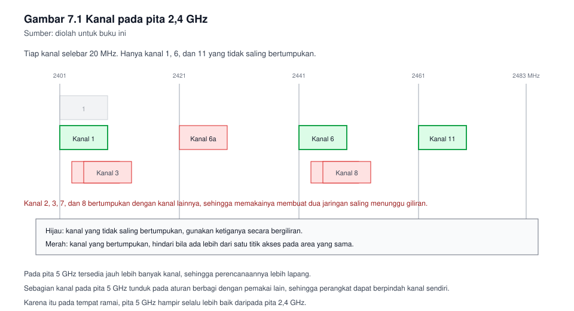
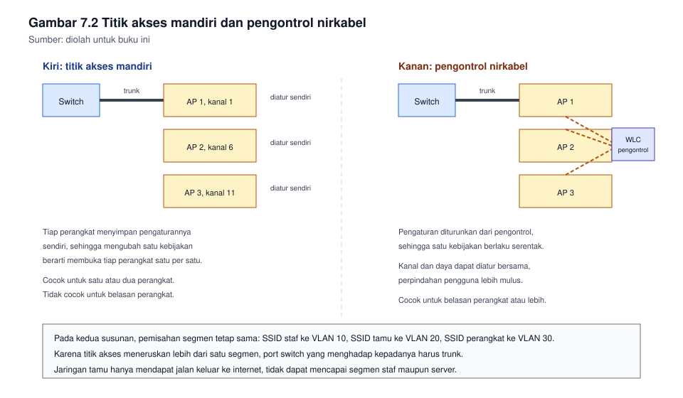

# Bab 7. Jaringan Nirkabel Terkendali

## Capaian pembelajaran bab

Sesudah mempelajari bab ini mahasiswa mampu:

1. Menjelaskan perbedaan mendasar medium nirkabel dan medium kabel, beserta
   akibatnya bagi perancangan. *(Sub-CPMK pertemuan 7, CPMK-3, unit SKKNI
   J.611000.010.02)*
2. Menjelaskan standar jaringan nirkabel yang digunakan sekarang, serta
   perbedaan pita dan kanalnya.
3. Merencanakan penempatan titik akses dan pembagian kanal sehingga tidak
   saling mengganggu.
4. Memasang jaringan nirkabel dengan pemisahan segmen, keamanan akses yang
   layak, dan pengaturan daya yang masuk akal.
5. Menjelaskan perbedaan pengontrol nirkabel dan titik akses mandiri, serta
   memilih di antaranya menurut kebutuhan.

## Peta konsep

```
Bab 7 Jaringan Nirkabel Terkendali
|-- 7.1 Mengapa nirkabel berbeda
|-- 7.2 Standar, pita, dan kanal
|-- 7.3 Merancang cakupan dan kanal
|-- 7.4 Identitas jaringan dan pemisahan segmen
|-- 7.5 Keamanan akses
|-- 7.6 Pengontrol lawan titik akses mandiri
|-- 7.7 Pemasangan dan pengaturan
|-- 7.8 Pemeliharaan
`-- 7.9 Batas yang tidak boleh dilanggar
```

---

## 7.1 Mengapa nirkabel berbeda

Pada jaringan kabel, kalian menguasai mediumnya. Kabel terpasang, ujungnya
jelas, dan siapa pun yang hendak menyambung harus menancapkan sesuatu.
Pada jaringan nirkabel, tidak ada satupun dari itu.

| Hal | Kabel | Nirkabel |
|---|---|---|
| Medium | Tertutup, dimiliki | Terbuka, digunakan bersama |
| Cara kirim | Dua arah sekaligus | Bergiliran dalam satu kanal |
| Batas jangkauan | Ditentukan panjang kabel | Ditentukan daya dan keadaan ruangan |
| Gangguan | Jarang, dan mudah dicari | Lazim, dan bergantung pada tetangga |
| Siapa yang dapat menyambung | Yang dapat menjangkau kabelnya | Siapa pun yang dapat menangkap sinyalnya |

Baris kedua sering disalahpahami. Pada satu kanal, hanya satu perangkat
yang dapat mengirim pada satu saat. Semakin banyak perangkat bergabung,
semakin lama tiap perangkat menunggu giliran, walau tidak ada satu pun yang
mengirim data besar.

Baris terakhir menjelaskan mengapa keamanan pada nirkabel tidak dapat
diandalkan dari sekat bangunan. Sinyal menembus dinding, lantai, dan
jendela, sehingga jangkauan jaringan kalian tidak berhenti pada dinding
kantor.

## 7.2 Standar, pita, dan kanal

Standar jaringan nirkabel diterbitkan oleh keluarga 802.11. Yang perlu
kalian ketahui bukanlah tahunnya, melainkan pita dan kemampuannya.

| Standar | Pita | Ciri utamanya |
|---|---|---|
| 802.11a | 5 GHz | Lebih sedikit gangguan, jangkauan lebih pendek |
| 802.11b dan 802.11g | 2,4 GHz | Jangkauan lebih jauh, tetapi kanalnya sempit dan ramai |
| 802.11n | 2,4 GHz dan 5 GHz | Memperkenalkan banyak antena, laju naik jauh |
| 802.11ac | 5 GHz | Laju tinggi, kanal lebih lebar |
| 802.11ax | 2,4 GHz, 5 GHz, dan 6 GHz | Mengatur giliran kirim dengan lebih cekap pada tempat ramai |

Dua pita yang paling sering digunakan ialah 2,4 GHz dan 5 GHz.

| Hal | 2,4 GHz | 5 GHz |
|---|---|---|
| Jangkauan | Lebih jauh | Lebih pendek |
| Tembus dinding | Lebih baik | Lebih buruk |
| Jumlah kanal yang tidak saling tumpang tindih | Tiga | Jauh lebih banyak |
| Kepadatan | Sangat ramai, termasuk perangkat selain jaringan | Lebih lengang |

Pada pita 2,4 GHz, kanal selebar 20 MHz sebagian saling tumpang tindih.
Hanya tiga kanal yang tidak saling bertumpukan, yakni kanal 1, 6, dan 11.
Inilah sebabnya hampir seluruh perancangan jaringan 2,4 GHz memakai ketiga
kanal itu secara bergiliran.

**Gambar 7.1** memperlihatkan susunan kanal itu, dan mengapa kanal 2 atau
3 bukan pilihan yang bijak.



*Gambar 7.1* Hanya kanal 1, 6, dan 11 yang tidak saling bertumpukan pada
lebar 20 MHz. Sumber: diolah untuk buku ini.

## 7.3 Merancang cakupan dan kanal

Perancangan jaringan nirkabel bertumpu pada dua pertanyaan yang berbeda:
seberapa luas, dan seberapa ramai.

| Pertanyaan | Yang menentukannya | Kesalahan yang lazim |
|---|---|---|
| Seberapa luas cakupannya | Daya, keadaan ruangan, bahan dinding | Daya dipasang maksimum supaya tampak kuat |
| Seberapa ramai | Jumlah perangkat yang bergabung | Hanya menghitung luas ruangan, lupa menghitung orang |

Kesalahan pada baris pertama sangat lazim. Daya maksimum membuat sinyal
terlihat kuat pada perangkat, tetapi perangkat itu belum tentu dapat
membalas dengan kuat yang sama. Akibatnya perangkat melihat jaringan,
mencoba bergabung, dan gagal berulang kali.

Kaidah yang lebih bijak:

1. Pasang daya secukupnya, jangan maksimum.
2. Tambah titik akses bila ruangannya luas, jangan tambah daya.
3. Ukur dari ujung terjauh, bukan dari sebelah titik akses.

**Tinjauan lokasi** ialah kegiatan mengukur keadaan sesungguhnya sebelum
memasang. Ia tidak harus memakai perangkat mahal. Berjalan ke seluruh
ruangan dengan satu perangkat, catat kekuatan sinyal pada tiap sudut, dan
tandai tempat yang lemah. Catatan itu lebih berharga daripada perhitungan
di atas kertas, sebab bahan dinding dan letak rak logam tidak pernah sama
antar gedung.

Sebagai pedoman kasar yang dipergunakan luas pada pekerjaan lapangan, kekuatan
sinyal dinyatakan dalam satuan negatif, dan makin mendekati nol berarti
makin kuat. Sekitar minus 65 atau lebih baik masih nyaman untuk
keperluan umum, sedangkan di bawah minus 80 mulai mengecewakan. Angka ini
pedoman, bukan standar, dan keperluan yang menuntut banyak data
membutuhkan sinyal yang lebih baik lagi.

## 7.4 Identitas jaringan dan pemisahan segmen

Nama jaringan yang dipancarkan disebut SSID. Satu titik akses dapat
memancarkan lebih dari satu nama, dan tiap nama dapat diikat ke segmen yang
berbeda.

| Nama jaringan | Segmen | Siapa penggunanya |
|---|---|---|
| KANTOR-Staf | VLAN 10 | Pegawai, dapat mencapai server |
| KANTOR-Tamu | VLAN 20 | Tamu, hanya dapat mencapai internet |
| KANTOR-Perangkat | VLAN 30 | Perangkat yang tidak memiliki layar |


Pemisahan ini penting, sebab tanpa dia, tamu yang datang lima belas menit
dapat mencapai server internal yang sama dengan pegawai.

Dua kebijakan yang layak ditetapkan sejak awal:

- **Jaringan tamu hanya mendapat jalan keluar ke internet**, tidak lebih.
- **Perangkat yang tidak dikenal tidak diletakkan pada segmen staf**,
  meski pemiliknya dikenal.

## 7.5 Keamanan akses

Keamanan jaringan nirkabel memiliki sejarah panjang, dan sebagian di
antaranya adalah sejarah kegagalan.

| Cara lama | Keadaannya sekarang |
|---|---|
| Penyembunyian nama jaringan | Tidak melindungi apa pun, nama itu tetap terbaca pada lalu lintas |
| Penyaringan alamatan perangkat | Mudah dipalsukan, hanya menyusahkan pengguna yang sah |
| Penyandian WEP | Sudah lama dipecahkan, jangan digunakan dalam keadaan apa pun |
| WPA versi lama | Digantikan oleh WPA2, dan kini oleh WPA3 |

Yang layak digunakan sekarang:

| Cara | Cocok untuk | Catatannya |
|---|---|---|
| WPA2 dengan kata sandi bersama | Rumah dan kelompok sangat kecil | Kata sandinya digunakan bersama, sehingga sulit dicabut untuk satu orang |
| WPA2 dengan pengesahan terpusat | Kantor dan kampus | Tiap pengguna memiliki akun sendiri, dapat dicabut satu per satu |
| WPA3 | Perangkat yang mendukungnya | Memperbaiki kelemahan pada pertukaran kata sandi, dan melindungi lalu lintas pada jaringan terbuka |

Perbedaan yang menentukan bukanlah pada penyandiannya, melainkan pada
caranya mengenali pengguna. Bila seluruh orang memakai satu kata sandi
yang sama, kalian tidak dapat mencabut hak satu orang tanpa mengganti kata
sandi seluruhnya. Bila tiap orang memiliki akun sendiri, pencabutan
dilakukan pada satu nama saja.

Karena itu pada organisasi, **pengesahan terpusat lebih berharga daripada
penyandian yang lebih baru**. WPA2 dengan akun per orang jauh lebih baik
daripada WPA3 dengan satu kata sandi bersama.

## 7.6 Pengontrol lawan titik akses mandiri

| Hal | Titik akses mandiri | Pengontrol nirkabel |
|---|---|---|
| Tempat pengaturannya | Pada tiap perangkat | Terpusat pada satu pengontrol |
| Cocok untuk | Satu atau dua perangkat | Puluhan perangkat atau lebih |
| Perpindahan pengguna | Sederhana, tetapi kurang mulus | Diatur, sehingga perpindahan lebih mulus |
| Pengaturan kanal | Diatur sendiri-sendiri | Dapat diatur bersama |
| Biaya awal | Rendah | Lebih tinggi |

Kaidah praktisnya: pada satu atau dua titik akses, pengontrol hanya
menambah kerumitan. Pada belasan titik akses atau lebih, mengatur
satu per satu akan membuat kalian menyesal.

**Gambar 7.2** memperlihatkan kedua susunan itu, beserta pemisahan jaringan
tamu.



*Gambar 7.2* Kiri: tiap titik akses diatur sendiri. Kanan: pengaturan
terpusat. Sumber: diolah untuk buku ini.

## 7.7 Pemasangan dan pengaturan

Tahap pemasangan, pada simulasi maupun pada perangkat sungguhan:

1. Tentukan nama jaringan dan segmennya lebih dahulu, sebelum menyentuh
   perangkatnya.
2. Tetapkan kanal. Pada pita 2,4 GHz pilih salah satu dari 1, 6, atau 11,
   dan pilih yang paling jarang digunakan di sekitarnya.
3. Tetapkan keamanannya. Pilih cara pengenalan pengguna yang sesuai,
   sebagaimana pada bagian 7.5.
4. Atur daya secukupnya, lalu ukur dari ujung ruangan.
5. Hubungkan titik akses ke switch dengan trunk, sebab ia meneruskan lebih
   dari satu segmen.

Langkah kelima sering terlupa, sama seperti pada bab 3: titik akses yang
meneruskan lebih dari satu nama jaringan memerlukan trunk, bukan port
akses biasa.

## 7.8 Pemeliharaan

| Kegiatan | Kekerapan | Mengapa perlu |
|---|---|---|
| Memeriksa kanal yang digunakan tetangga | Setiap beberapa bulan | Keadaan sekitar berubah, kanal yang dulu lengang bisa menjadi ramai |
| Memperbarui perangkat | Menurut pengumuman pembuat | Kekurangan keamanan ditemukan terus |
| Meninjau nama dan kata sandi jaringan | Setiap beberapa bulan | Kata sandi bersama lama kelamaan tersebar |
| Memeriksa jumlah perangkat yang bergabung | Setiap bulan | Kepadatan yang naik pelan-pelan jarang disadari |

Satu kebiasaan yang menghemat banyak keluhan: catat keluhan pengguna
beserta waktu dan tempatnya. Bila tiga orang mengeluh pada tempat yang
sama pada jam yang sama, persoalannya hampir pasti ada pada jaringannya,
bukan pada perangkat mereka.

## 7.9 Batas yang tidak boleh dilanggar

Jaringan nirkabel membuat batas antara "milik sendiri" dan "milik orang
lain" menjadi kabur, karena itu aturannya perlu ditegaskan.

- Jangan menguji, mengamati, atau mencoba masuk ke jaringan nirkabel yang
  bukan milik kalian, meski jaringan itu tidak berkunci. Tidak berkunci
  bukan berarti diizinkan.
- Pada praktikum, gunakan nama jaringan contoh, bukan nama instansi
  sesungguhnya, dan jangan menyiarkan nama yang dapat dikira milik
  organisasi lain.
- Jaringan tamu tetap wajib dilindungi. Keterbukaan kepada tamu tidak
  berarti keterbukaan kepada siapa pun yang lewat di luar gedung.

---

## Contoh soal dan pembahasan

### Contoh 7.1 Membagi kanal untuk tiga titik akses

Sebuah lantai berbentuk persegi panjang sepanjang 30 meter. Akan dipasang
tiga titik akses pada pita 2,4 GHz, berjajar dari kiri ke kanan. Titik
akses tetangga di lantai lain tidak diketahui keadaannya.

Tentukan kanal untuk ketiga titik akses itu, dan jelaskan alasannya. Bila
kemudian diketahui bahwa di lantai atas sudah ada titik akses dengan kanal
6, apa yang sebaiknya dilakukan?

**Pembahasan.**

Pertanyaan pertama. Pada pita 2,4 GHz hanya tersedia tiga kanal yang tidak
saling bertumpukan, yakni 1, 6, dan 11. Karena itu ketiga titik akses
masing-masing memakai satu kanal berbeda:

| Titik akses | Letak | Kanal |
|---|---|---|
| Pertama | Kiri | 1 |
| Kedua | Tengah | 6 |
| Ketiga | Kanan | 11 |

Alasannya: dua titik akses yang berdekatan dan memakai kanal yang
bertumpukan akan saling menunggu giliran, sehingga keduanya melambat.
Dengan kanal yang terpisah, keduanya mengirim tanpa menunggu satu sama
lain.

Pertanyaan kedua. Diketahui lantai atas memakai kanal 6. Sinyal menembus
lantai, sehingga kanal 6 pada lantai kita berpotensi bertumpukan dengan
kanal 6 di lantai atas.

Tindakan yang bijak:

1. Ukur kekuatan sinyal kanal 6 milik lantai atas pada lantai kita. Bila
   sangat lemah, gangguannya dapat diabaikan, dan kanal 6 tetap digunakan.
2. Bila ternyata kuat, pindahkan titik akses tengah ke kanal yang paling
   sepi, atau kurangi dayanya supaya jangkauannya tidak naik ke lantai
   atas.
3. Bila perangkatnya mendukung pita 5 GHz, pindahkan titik akses tengah ke
   pita itu, sebab pita 5 GHz memiliki jauh lebih banyak kanal.

Yang tidak bijak: menambah daya supaya sinyal kita mengalahkan lantai
atas. Cara itu memulai perlombaan yang merugikan kedua lantai, dan membuat
perangkat di kedua lantai semakin sulit mengirim.

### Contoh 7.2 Merancang untuk kepadatan, bukan luas

Sebuah ruang pertemuan berukuran 10 x 12 meter akan dipasangi satu titik
akses. Ruangan itu digunakan untuk pelatihan dengan 40 peserta, dan seluruh
peserta membawa ponsel serta sebagian membawa laptop.

Seorang teknisi mengusulkan satu titik akses dengan daya maksimum, dengan
alasan ruangannya kecil dan satu titik akses cukup menutup seluruh
ruangan.

Tanggapilah usulan itu.

**Pembahasan.**

Usulan itu menjawab pertanyaan yang salah. Teknisi itu menghitung luas,
padahal yang menentukan pada ruang pertemuan ialah kepadatan.

Hitunglah beban gilirannya. Empat puluh peserta, masing-masing membawa
satu atau dua perangkat, berarti sekitar lima puluh perangkat pada satu
kanal. Pada satu kanal, hanya satu perangkat yang mengirim pada satu saat.
Lima puluh perangkat yang bergiliran akan membuat tiap perangkat menunggu
lama, walau tidak ada yang mengirim berkas besar.

Menambah daya memperburuk keadaan, sebab ia menjangkau lebih banyak
perangkat di luar ruangan, yang ikut mengantre pada kanal yang sama.

Yang lebih bijak:

1. Pasang dua titik akses, masing-masing pada kanal yang berbeda, dengan
   daya rendah, sehingga beban terbagi dua.
2. Bila perangkatnya mendukung, utamakan pita 5 GHz, sebab kanalnya lebih
   banyak dan kepadatannya lebih rendah.
3. Bila memungkinkan, batasi kecepatan tiap pengguna, supaya satu
   perangkat tidak menghabiskan giliran terlalu lama.

Pelajaran dari soal ini: sebelum menambah daya, tanyakan apakah
persoalannya cakupan atau kepadatan. Jawabannya menentukan tindakan yang
berlawanan.

---

## Latihan

1. Sebutkan tiga perbedaan medium kabel dan medium nirkabel, lalu
   jelaskan akibat tiap perbedaan bagi perancangan.
2. Mengapa pada pita 2,4 GHz hanya tersedia tiga kanal yang tidak saling
   bertumpukan? Jelaskan dengan menyebut lebarnya.
3. Mengapa menambah daya pemancar bukan selalu jawaban atas keluhan
   "sinyal lemah"? Berikan dua alasan.
4. Tiga titik akses berjajar pada satu lorong. Tetapkan kanalnya, dan
   jelaskan mengapa kanal 2 dan 3 sebaiknya dihindari.
5. Jelaskan perbedaan WPA2 dengan kata sandi bersama dan WPA2 dengan
   pengesahan terpusat. Mana yang lebih layak untuk kampus, dan mengapa?
6. Sebutkan dua keadaan yang membuat pengontrol nirkabel lebih bijak
   daripada titik akses mandiri, dan dua keadaan sebaliknya.
7. Sebuah titik akses memancarkan tiga nama jaringan untuk tiga segmen
   yang berbeda. Bagaimanakah seharusnya port switch yang menghadap ke
   titik akses itu diatur? Jelaskan.
8. Tuliskan urutan kegiatan kalian bila menerima keluhan "jaringan
   nirkabel lambat setiap jam istirahat", dari yang paling murah sampai
   yang paling mahal.

**Kunci dan rubrik.** Nomor 2, 4, dan 7 dinilai dari ketepatan konsep
teknis. Nomor 1, 3, 5, dan 6 dinilai dari kejelasan alasan, bukan dari
panjangnya jawaban. Nomor 8 dinilai dari kelogisan urutan: yang tidak
mengganggu pengguna dikerjakan lebih dahulu, dan yang menuntut perangkat
tambahan dikerjakan paling akhir.

## Rangkuman

- Nirkabel memakai medium terbuka yang digunakan bersama, sehingga gangguan
  dan kepadatan menjadi persoalan utama, bukan panjang kabel.
- Pada pita 2,4 GHz hanya kanal 1, 6, dan 11 yang tidak saling
  bertumpukan; pita 5 GHz memiliki jauh lebih banyak kanal.
- Perancangan bertumpu pada dua pertanyaan yang berbeda: seberapa luas,
  dan seberapa ramai, dan jawabannya menuntut tindakan yang berlawanan.
- Menambah daya bukan jawaban atas persoalan kepadatan, malah
  memperburuknya.
- Pengenalan pengguna per orang lebih berharga daripada penyandian yang
  lebih baru, sebab ia memungkinkan pencabutan hak satu per satu.
- Titik akses yang meneruskan lebih dari satu segmen memerlukan trunk pada
  switch-nya.

## Glosarium

| Istilah | Arti |
|---|---|
| Kanal | Jalur frekuensi yang digunakan bersama pada satu pita |
| Kepadatan | Banyaknya perangkat yang bergabung pada satu kanal |
| Pita | Rentang frekuensi yang digunakan, misalnya 2,4 GHz atau 5 GHz |
| Pengesahan terpusat | Cara mengenali pengguna melalui pelayan tersendiri, tiap pengguna memiliki akun |
| Pengontrol nirkabel | Perangkat yang mengatur banyak titik akses secara terpusat |
| SSID | Nama jaringan nirkabel yang dipancarkan |
| Tinjauan lokasi | Kegiatan mengukur keadaan sesungguhnya sebelum memasang |
| Titik akses | Perangkat yang menjembatani perangkat nirkabel ke jaringan kabel |

## Rujukan

| Sumber | Kedudukan | Status |
|---|---|---|
| Kepmenaker Nomor 321 Tahun 2016, unit J.611000.010.02 | Acuan kompetensi memasang jaringan nirkabel | ⏳ status berlakunya perlu dicek |
| RPS KPT0502324 | Acuan capaian bab | ✓ tersusun pada folder kerja ini |
| Tanenbaum dan Wetherall, Computer Networks | Pendalaman lapisan fisik nirkabel | ⏳ edisi dan tahun perlu dicek |
