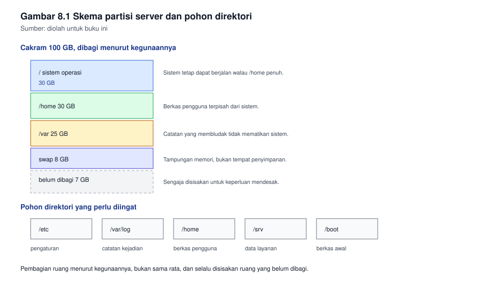
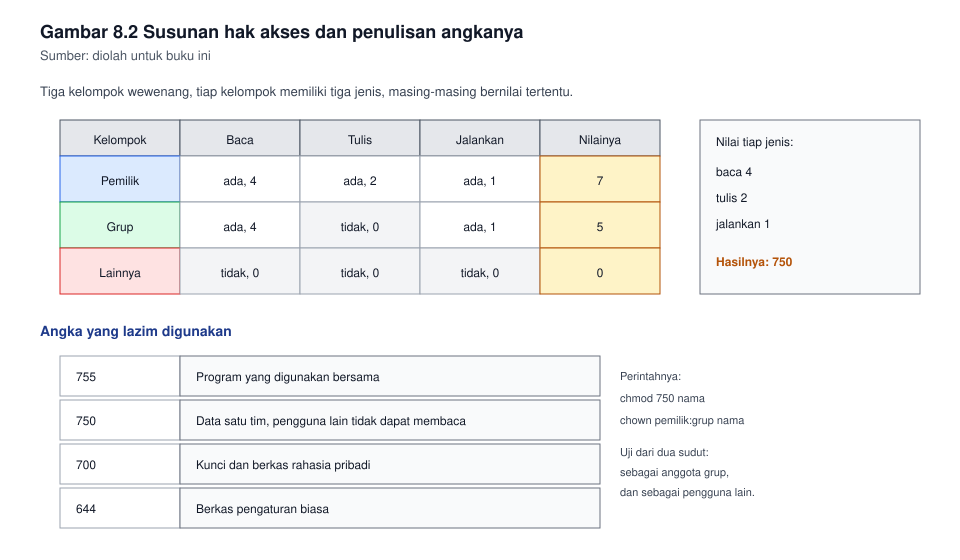

# Bab 8. Administrasi Sistem Operasi Server

## Capaian pembelajaran bab

Sesudah mempelajari bab ini mahasiswa mampu:

1. Menjelaskan dasar pemilihan sistem operasi server, dan menyebutkan
   akibatnya bagi pekerjaan harian. *(Sub-CPMK pertemuan 9, CPMK-4)*
2. Memasang sistem operasi server dengan skema partisi yang dapat
   dipertanggungjawabkan.
3. Mengelola pengguna, grup, dan hak akses menurut prinsip hak paling
   kecil.
4. Mengelola akses jarak jauh dengan kunci, dan menutup kelemahan
   bawaannya.
5. Mengelola proses dan layanan, serta membaca catatan kejadian sistem.

## Peta konsep

```
Bab 8 Administrasi Sistem Operasi Server
|-- 8.1 Memilih sistem operasi server
|-- 8.2 Pemasangan dan skema partisi
|-- 8.3 Manajemen paket
|-- 8.4 Pengguna, grup, dan hak akses
|-- 8.5 Akses jarak jauh
|-- 8.6 Proses dan layanan
|-- 8.7 Pencatatan kejadian
`-- 8.8 Kebiasaan kerja yang menyelamatkan
```

---

## 8.1 Memilih sistem operasi server

Pilihan sistem operasi server jarang ditentukan oleh mana yang paling
unggul. Ia ditentukan oleh hal-hal yang lebih membumi.

| Pertimbangan | Pertanyaannya |
|---|---|
| Dukungan jangka panjang | Berapa lama pembuatnya masih merilis pembaruan keamanan? |
| Kebutuhan perangkat lunak | Apakah layanan yang dibutuhkan tersedia, dan mudah dipasang? |
| Keahlian tim | Siapa yang akan merawatnya pada hari libur, dan apa yang ia kuasai? |
| Biaya | Apakah lisensinya, dan siapa yang menanggungnya? |
| Kebiasaan organisasi | Apa yang sudah berjalan, dan apa yang sudah terdokumentasi? |

Baris ketiga sering diabaikan, padahal ia yang paling menentukan
kelangsungan. Server yang hanya satu orang mengerti akan menjadi masalah
pada hari orang itu berhalangan.

Pada mata kuliah ini praktikum memakai satu keluarga sistem operasi sumber
terbuka, sebab ia tanpa biaya lisensi, tersedia secara luas, dan
keahliannya mudah dipindahtangankan.

## 8.2 Pemasangan dan skema partisi

Partisi membagi satu cakram menjadi beberapa bagian. Pembagian ini bukan
sekadar merapikan berkas, ia menentukan apa yang terjadi bila salah satu
bagian penuh.

| Direktori | Isinya | Mengapa dipisah |
|---|---|---|
| `/` | Sistem operasinya sendiri | Tetap dapat berjalan walau bagian lain penuh |
| `/home` | Berkas pengguna | Batas bagi pengguna supaya tidak menghabiskan sistem |
| `/var` | Catatan kejadian, antrean surat, data layanan | Catatan yang membludak tidak boleh mematikan sistem |
| `/boot` | Berkas awal yang diperlukan saat menyala | Terpisah dari perubahan sistem |
| swap | Ruang tampungan memori | Menjaga sistem tidak langsung mati kehabisan memori |

Baris ketiga adalah yang paling sering menyelamatkan keadaan. Catatan
kejadian yang tidak dibatasi dapat menghabiskan sisa ruang dalam semalam,
dan bila ia berada pada partisi yang sama dengan sistem, sistem itu
berhenti menulis apa pun.

**Gambar 8.1** memperlihatkan satu contoh pembagian untuk cakram
100 GB, beserta pohon direktorinya.



*Gambar 8.1* Pembagian ruang menurut kegunaannya, bukan sama rata. Sumber:
diolah untuk buku ini.

Dua kebiasaan yang layak dibiasakan sejak awal:

1. **Sisakan ruang yang belum dibagi.** Menambah ruang sesudah sistem
   berjalan jauh lebih repot daripada menyisakan ruang sejak awal.
2. **Tuliskan alasan tiap ukuran.** Enam bulan lagi kalian tidak akan
   ingat mengapa `/var` diberi 30 GB, dan catatan itu akan menyelamatkan
   keputusan berikutnya.

## 8.3 Manajemen paket

Perangkat lunak pada sistem sumber terbuka dikelola melalui pengelola
paket. Ia mencatat apa yang terpasang, dari mana asalnya, dan apa yang
bergantung pada apa.

| Perintah | Kegunaannya |
|---|---|
| `apt update` | Memperbarui daftar paket yang tersedia, tidak mengubah apa pun |
| `apt upgrade` | Memasang versi yang lebih baru bagi paket yang terpasang |
| `apt install nama` | Memasang satu paket beserta keperluannya |
| `apt remove nama` | Menghapus paket, berkas pengaturannya ditinggalkan |
| `apt purge nama` | Menghapus paket beserta berkas pengaturannya |

Perbedaan kedua baris pertama perlu dipahami benar. Memperbarui daftar
tidak mengubah sistem. Banyak pemula mengira ia sudah memperbarui sistem
setelah menjalankan yang pertama, padahal yang diubah baru daftarnya.

Kebiasaan pembaruan yang bijak:

| Keadaan | Tindakannya |
|---|---|
| Pembaruan keamanan | Pasang segera, jangan menunggu |
| Pembaruan perbaikan kecil | Pasang berkala, pada jendela yang disepakati |
| Pembaruan besar versi | Uji pada lingkungan percobaan lebih dahulu |
| Server yang melayani masyarakat | Selalu punya rencana pengembalian sebelum memperbarui |

Satu aturan yang berlaku pada seluruh keadaan: **catat apa yang diperbarui
dan kapan.** Bila kelak muncul keluhan, catatan itu menjadi petunjuk
pertama.

## 8.4 Pengguna, grup, dan hak akses

### Pengguna dan grup

| Berkas | Isinya |
|---|---|
| `/etc/passwd` | Daftar pengguna, tanpa kata sandi |
| `/etc/shadow` | Kata sandi yang disandikan, hanya dapat dibaca pengguna istimewa |
| `/etc/group` | Daftar grup beserta anggotanya |

Tiap pengguna memiliki nomor pengenal, dan tiap grup memiliki nomor
pengenalnya sendiri. Yang dikenali sistem ialah nomornya, bukan namanya,
sebab nama dapat diubah sementara nomor tidak.

Cara menambah pengguna dan memberinya wewenang:

```
useradd -m -s /bin/bash nama-pengguna
passwd nama-pengguna
usermod -aG sudo nama-pengguna
```

Baris ketiga membuat pengguna itu dapat menjalankan perintah istimewa
melalui `sudo`. Hindari menambahkan pengguna ke dalam grup yang lebih luas
daripada yang diperlukan.

### Prinsip hak paling kecil

Prinsipnya sederhana: berikan wewenang yang diperlukan untuk pekerjaan
hari ini, tidak lebih. Bila kelak diperlukan lebih, tambahkan saat itu
juga, beserta catatannya.

Tiga akibat nyata bila prinsip ini dilanggar:

| Pelanggaran | Akibatnya |
|---|---|
| Seluruh orang menjadi pengguna istimewa | Kesalahan ketik satu huruf dapat menghapus sistem, dan tidak ada jejak siapa pelakunya |
| Layanan berjalan sebagai pengguna istimewa | Celah pada layanan itu menjadi celah pada seluruh sistem |
| Kata sandi dibagi bersama | Tidak ada lagi yang dapat dimintai pertanggungjawaban |

### Hak akses berkas

Tiap berkas memiliki tiga kelompok wewenang, dan tiap kelompok memiliki
tiga jenisnya.

| Kelompok | Berlakunya bagi |
|---|---|
| Pemilik | Pengguna yang memilikinya |
| Grup | Anggota grup pemiliknya |
| Lainnya | Semua orang selain dua di atas |

| Jenis | Pada berkas | Pada direktori |
|---|---|---|
| Baca | Isinya dapat dibaca | Isinya dapat didaftar |
| Tulis | Isinya dapat diubah | Berkas di dalamnya dapat dibuat dan dihapus |
| Jalankan | Dapat dijalankan sebagai program | Dapat dimasuki |

Penulisan angkanya dihitung dengan menjumlahkan nilai: baca 4, tulis 2,
jalankan 1. Maka:

| Angka | Wewenangnya | Digunakan untuk |
|---|---|---|
| 755 | Pemilik penuh, yang lain hanya baca dan jalankan | Program yang digunakan bersama |
| 750 | Pemilik penuh, grup baca dan jalankan, yang lain tidak ada | Data yang hanya untuk satu tim |
| 700 | Hanya pemiliknya | Kunci dan berkas rahasia pribadi |
| 644 | Pemilik dapat menulis, yang lain hanya membaca | Berkas pengaturan biasa |
| 600 | Hanya pemiliknya yang dapat membaca dan menulis | Berkas berisi kata sandi |

**Gambar 8.2** memperlihatkan susunan itu secara lengkap.



*Gambar 8.2* Tiga kelompok kali tiga jenis, dijumlahkan menurut nilainya.
Sumber: diolah untuk buku ini.

Perintah yang digunakan:

```
chmod 750 /data/keuangan
chown administrator:keuangan /data/keuangan
```

Baris pertama mengubah wewenangnya, baris kedua mengubah pemilik dan
grupnya.

## 8.5 Akses jarak jauh

Akses jarak jauh ke server hampir selalu dilakukan melalui SSH. Kekuatan
utamanya bukan pada penyandiannya, melainkan pada pengenalannya.

### Kunci, bukan kata sandi

Kunci terdiri atas dua bagian: bagian rahasia yang disimpan di komputer
kalian, dan bagian umum yang diletakkan pada server. Keduanya harus cocok.

```
ssh-keygen -t ed25519
ssh-copy-id nama-pengguna@alamat-server
```

Kelebihannya atas kata sandi:

| Hal | Kata sandi | Kunci |
|---|---|---|
| Dapat ditebak | Ya, terutama yang pendek | Tidak, kecuali bagian rahasianya dicuri |
| Dapat digunakan berulang dari mana saja | Ya | Tidak, ia harus ada pada komputer kalian |
| Dapat dibatalkan satu per satu | Tidak, kecuali diganti | Ya, hapus barisnya pada server |

### Tiga pengaturan yang wajib ditinjau

| Pengaturan | Nilai yang bijak | Mengapa |
|---|---|---|
| Masuk sebagai pengguna istimewa secara langsung | Ditiadakan | Jejaknya menjadi tidak jelas, dan kesalahan langsung merusak |
| Pengesahan dengan kata sandi | Ditiadakan sesudah kunci berjalan | Menghapus seluruh serangan tebakan |
| Pengesahan dengan kunci | Diaktifkan | Menjadi satu-satunya jalan masuk |

```
sudo nano /etc/ssh/sshd_config
sudo systemctl restart ssh
```

Sebelum meniadakan pengesahan kata sandi, pastikan kunci kalian benar-benar
berjalan. Buka satu sesi baru dan uji, jangan tutup sesi lama sebelum
pengujiannya berhasil. Kebiasaan ini mencegah kalian mengunci diri sendiri
di luar server.

## 8.6 Proses dan layanan

Sistem operasi modern mengelola layanan melalui satu pengelola tunggal.
Perintahnya seragam, dan itu memudahkan.

| Perintah | Kegunaannya |
|---|---|
| `systemctl status nama` | Keadaan satu layanan, beserta catatan terakhirnya |
| `systemctl start nama` | Menjalankan sekarang |
| `systemctl stop nama` | Menghentikan sekarang |
| `systemctl enable nama` | Menjalankan otomatis setiap kali menyala |
| `systemctl restart nama` | Menghentikan lalu menjalankan kembali |
| `systemctl --failed` | Layanan apa saja yang gagal |

Perbedaan yang perlu dikuasai: **menjalankan** dan **mengaktifkan** adalah
dua hal berbeda. Menjalankan mengubah keadaan hari ini, mengaktifkan
mengubah keadaan sesudah menyala ulang. Banyak layanan yang tampak
berjalan, lalu hilang sesudah server dinyalakan ulang, semata-mata karena
yang dilakukan baru menjalankan.

## 8.7 Pencatatan kejadian

Catatan kejadian adalah satu-satunya saksi yang tidak pernah lupa. Ia
menjawab pertanyaan yang tidak terjawab oleh keadaan saat ini.

| Tempat | Isinya |
|---|---|
| `/var/log/` | Tempat catatan dari berbagai layanan |
| `journalctl` | Catatan terpusat milik pengelola sistem |
| `journalctl -u nama` | Catatan satu layanan saja |
| `journalctl -f` | Mengikuti catatan yang muncul saat itu juga |

Tiga kebiasaan yang membuat catatan berguna:

1. **Baca catatan pada layanan yang gagal, jangan menebak.** Keluaran
   `systemctl status` hampir selalu menyebut alasannya pada baris
   terakhir.
2. **Batasi ukurannya.** Catatan yang tidak dibatasi akan menghabiskan
   partisi, dan itulah sebabnya `/var` dipisah pada bagian 8.2.
3. **Simpan catatan penting di tempat lain.** Bila server diserang,
   catatan pada server itu sendiri dapat diubah oleh penyerang.

## 8.8 Kebiasaan kerja yang menyelamatkan

| Kebiasaan | Yang dicegahnya |
|---|---|
| Bekerja sebagai pengguna biasa, memakai wewenang istimewa hanya bila perlu | Kesalahan ketik yang langsung merusak |
| Menyalin berkas pengaturan sebelum mengubahnya | Tidak dapat kembali ke keadaan semula |
| Menguji pada satu layanan sebelum menyebarkan | Gangguan serentak pada seluruh pengguna |
| Mencatat tiap perubahan beserta alasannya | Tidak ada yang tahu apa yang telah dilakukan |
| Menutup sesi yang tidak digunakan | Akses yang tertinggal terbuka |

Baris kedua sangat murah dan sangat sering menyelamatkan. Satu baris
sebelum mengubah pengaturan:

```
sudo cp /etc/ssh/sshd_config /etc/ssh/sshd_config.cadangan
```

Bila perubahan itu kelak menimbulkan persoalan, kalian memiliki jalan
pulang yang pasti.

---

## Contoh soal dan pembahasan

### Contoh 8.1 Menentukan wewenang berkas

Sebuah direktori bernama `/data/keuangan` berisi laporan yang hanya boleh
dibaca oleh tim keuangan, dan hanya boleh diubah oleh ketuanya. Seluruh
pengguna lain, termasuk pengguna yang masuk dari jaringan tamu, tidak boleh
membaca apa pun dari direktori itu.

Tentukan pemilik, grup, dan wewenangnya.

**Pembahasan.**

Langkah pertama, tetapkan pemilik dan grupnya. Pemiliknya ketua tim,
sebab hanya ia yang menulis. Grupnya kelompok keuangan, sebab mereka yang
membaca.

```
sudo chown ketua:keuangan /data/keuangan
```

Langkah kedua, hitung wewenangnya menurut tiga kelompok.

| Kelompok | Yang dibutuhkan | Angkanya |
|---|---|---|
| Pemilik | Baca, tulis, masuk ke direktori | 4 + 2 + 1 = 7 |
| Grup | Baca dan masuk, tanpa tulis | 4 + 1 = 5 |
| Lainnya | Tidak ada sama sekali | 0 |

Maka wewenangnya 750.

```
sudo chmod 750 /data/keuangan
```

Langkah ketiga, uji dari dua sudut. Masuk sebagai anggota tim keuangan,
pastikan ia dapat membaca tetapi tidak dapat membuat berkas. Masuk sebagai
pengguna lain, pastikan ia tidak dapat membaca apa pun. Pengujian dari dua
sudut ini yang paling sering dilewati, padahal ia satu-satunya cara
membuktikan bahwa kebijakannya benar-benar berlaku.

### Contoh 8.2 Layanan berjalan tetapi tidak aktif

Seorang mahasiswa melapor: ia memasang server web, menjalankannya, dan
dapat membukanya dari peramban. Keesokan harinya server dinyalakan ulang,
dan situsnya tidak dapat dibuka lagi. Pemeriksaan menunjukkan berkas
pengaturannya tidak berubah, dan paketnya masih terpasang.

Tentukan penyebabnya, dan sebutkan pemeriksaan untuk membuktikannya.

**Pembahasan.**

Gejalanya sangat khas. Layanan itu bekerja kemarin, tidak ada perubahan
pengaturan, dan satu-satunya peristiwa di antaranya ialah menyala ulang.
Itu berarti layanannya dijalankan, tetapi tidak diaktifkan.

Perbedaan keduanya dijelaskan pada bagian 8.6: menjalankan mengubah
keadaan hari ini, mengaktifkan menentukan keadaan sesudah menyala.

Pemeriksaan untuk membuktikannya:

```
systemctl is-enabled nama-layanan
```

Bila keluarannya menyatakan tidak aktif, dugaan itu terbukti.
Perbaikannya:

```
sudo systemctl enable --now nama-layanan
```

Perintah di atas mengerjakan dua hal sekaligus: mengaktifkan supaya
menyala otomatis, dan menjalankan sekarang juga.

Pelajaran dari soal ini: sesudah memasang layanan apa pun, biasakan
memeriksa dua hal, bukan satu. Jalankan, lalu periksa apakah ia aktif.
Keduanya berbeda, dan lupa pada yang kedua baru terasa pada hari berikutnya.

---

## Latihan

1. Sebutkan tiga pertimbangan memilih sistem operasi server, dan
   jelaskan mengapa keahlian tim lebih menentukan daripada keunggulan
   teknisnya.
2. Mengapa `/var` sebaiknya dipisah menjadi partisi tersendiri? Jelaskan
   dengan satu skenario yang menunjukkan kerugian bila ia tidak dipisah.
3. Jelaskan perbedaan memperbarui daftar paket dan memperbarui paketnya
   sendiri. Apa yang salah bila kalian mengira keduanya sama?
4. Berikan wewenang berangka untuk: berkas pengaturan yang hanya boleh
   diubah pemiliknya, program bersama, dan direktori berisi kunci rahasia.
5. Sebutkan tiga pengaturan akses jarak jauh yang wajib ditinjau, beserta
   nilai yang bijak untuk masing-masing.
6. Jelaskan perbedaan menjalankan layanan dan mengaktifkan layanan, lalu
   sebutkan gejala bila salah satunya terlupa.
7. Sebuah direktori akan digunakan bersama oleh lima orang, seluruhnya dapat
   membuat dan menghapus berkas, tetapi pengguna lain tidak boleh melihat
   isinya. Tetapkan pemilik, grup, dan angka wewenangnya.
8. Sebutkan dua cara membaca catatan kejadian, dan satu kebiasaan yang
   membuat catatan itu tetap berguna pada saat dibutuhkan.

**Kunci dan rubrik.** Nomor 4 dan 7 dinilai dari kebenaran angka dan
ketepatan alasannya; pada nomor 7 perhatikan bahwa anggota grup memerlukan
tulis, sehingga angkanya 770. Nomor 1, 2, 3, 5, 6, dan 8 dinilai dari
ketepatan konsep dan kejelasan penjelasan.

## Rangkuman

- Pilihan sistem operasi server ditentukan oleh dukungan, keahlian tim, dan
  kebiasaan organisasi, bukan semata keunggulan teknisnya.
- Partisi dipisah menurut kegunaannya, dan `/var` paling penting dipisah
  agar catatan yang membludak tidak mematikan sistem.
- Prinsip hak paling kecil melindungi sistem dari kesalahan yang paling
  sering terjadi, yakni kesalahan ketik oleh orang yang berwenang.
- Wewenang dihitung dari tiga kelompok kali tiga jenis, dengan nilai baca
  4, tulis 2, dan jalankan 1.
- Akses jarak jauh hendaknya memakai kunci, dengan masuk langsung sebagai
  pengguna istimewa ditiadakan.
- Menjalankan layanan dan mengaktifkan layanan adalah dua hal berbeda, dan
  lupa pada yang kedua baru terasa sesudah menyala ulang.

## Glosarium

| Istilah | Arti |
|---|---|
| Hak paling kecil | Prinsip memberi wewenang secukupnya untuk pekerjaan hari ini |
| Kunci | Pasangan bagian rahasia dan bagian umum untuk mengenali pengguna |
| Layanan | Program yang berjalan di belakang layar tanpa tampilan |
| Paket | Berkas terkemas yang berisi program beserta keperluannya |
| Partisi | Pembagian satu cakram menjadi beberapa bagian |
| Pengguna istimewa | Pengguna dengan wewenang tertinggi pada sistem |
| Repositori | Tempat tersimpannya paket yang dapat dipasang |
| Swap | Ruang pada cakram yang digunakan sebagai tampungan memori |

## Rujukan

| Sumber | Kedudukan | Status |
|---|---|---|
| Nemeth dan kawan-kawan, UNIX and Linux System Administration Handbook | Pustaka utama bab ini | ⏳ tahun terbit perlu dicek |
| RPS KPT0502324 | Acuan capaian bab | ✓ tersusun pada folder kerja ini |
| Dokumentasi resmi sistem operasi yang dipasang | Acuan perintah terkini | ⏳ versi belum dicatat |
