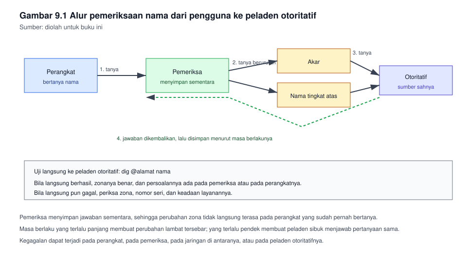
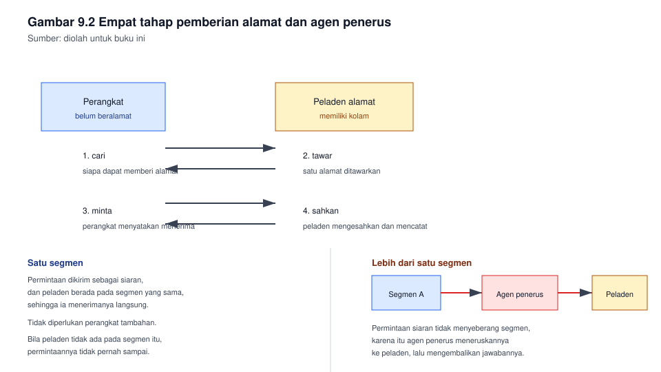

# Bab 9. Layanan Nama dan Layanan Alamat

## Capaian pembelajaran bab

Sesudah mempelajari bab ini mahasiswa mampu:

1. Menjelaskan cara kerja penamaan jaringan, serta perbedaan peladen nama
   otoritatif dan peladen pemeriksa. *(Sub-CPMK pertemuan 10, CPMK-4)*
2. Menyebutkan jenis catatan pada sistem penamaan, dan kegunaan
   masing-masing.
3. Memasang zona internal, mengujinya, dan menemukan kesalahan umumnya.
4. Menjelaskan tahapan pemberian alamat secara otomatis, dan mengatur
   kolam beserta pengecualiannya.
5. Memeriksa layanan nama dan layanan alamat dengan alat yang tepat, serta
   menentukan letak persoalan dari gejalanya.

## Peta konsep

```
Bab 9 Layanan Nama dan Alamat
|-- 9.1 Mengapa manusia memakai nama
|-- 9.2 Susunan penamaan dan jenis catatan
|-- 9.3 Alur pemeriksaan nama
|-- 9.4 Memasang zona internal
|-- 9.5 Mengatur pemeriksa nama
|-- 9.6 Pemberian alamat secara otomatis
|-- 9.7 Mengatur kolam dan pengecualian
|-- 9.8 Verifikasi
`-- 9.9 Urutan pemeriksaan bila gagal
```

---

## 9.1 Mengapa manusia memakai nama

Perangkat bekerja dengan alamat, manusia bekerja dengan nama. Layanan nama
menjembatani keduanya, dan karena hampir seluruh layanan jaringan
menyebut nama, kegagalannya terasa sebagai kegagalan segalanya.

Satu ciri yang sering membingungkan: bila layanan nama tidak bekerja,
hampir seluruh keluhan pengguna berbunyi "internet mati", padahal sambungan
ke luar tidak ada masalah sama sekali.

## 9.2 Susunan penamaan dan jenis catatan

Sistem penamaan tersusun sebagai pohon terbalik. Puncaknya disebut akar,
lalu nama tingkat atas, lalu nama organisasi, lalu nama perangkatnya.

Nama lengkap yang menyertakan seluruh tingkatnya disebut nama domain
berkualifikasi penuh, dan ditulis dengan titik pada akhirnya, misalnya
`arsip.kantor.internal.`

| Istilah | Artinya |
|---|---|
| Zona | Bagian dari pohon penamaan yang dikelola bersama |
| Peladen nama otoritatif | Peladen yang menjadi sumber sah bagi satu zona |
| Peladen pemeriksa | Peladen yang mencarikan jawaban atas nama pengguna |
| Catatan | Satu baris keterangan di dalam zona |
| Masa berlaku | Lamanya jawaban boleh disimpan oleh yang meminta |

Jenis catatan yang perlu kalian kuasai:

| Jenis | Kegunaannya | Contoh pemakaiannya |
|---|---|---|
| SOA | Menyatakan awal zona dan pengaturannya | Satu pada tiap zona |
| NS | Menyatakan peladen nama bagi zona itu | Menunjuk ke peladen kalian |
| A | Menyatakan alamat bagi satu nama | Nama server menjadi alamat |
| AAAA | Sama seperti A, untuk alamat versi enam | Perangkat yang memakai versi enam |
| CNAME | Nama lain bagi nama yang sudah ada | Nama pendek untuk layanan |
| MX | Menyatakan peladen surat bagi satu domain | Surat dikirim ke alamat yang benar |
| PTR | Menyatakan nama bagi satu alamat | Pemeriksaan balik, diperlukan peladen surat |
| TXT | Catatan teks bebas | Pembuktian kepemilikan domain |

Masa berlaku menentukan berapa lama jawaban disimpan. Masa yang terlalu
panjang membuat perubahan lambat tersebar; masa yang terlalu pendek membuat
peladen sibuk menjawab pertanyaan yang sama terus-menerus.

## 9.3 Alur pemeriksaan nama

**Gambar 9.1** memperlihatkan alur itu dari perangkat pengguna sampai ke
peladen otoritatif.



*Gambar 9.1* Pemeriksa menyimpan jawaban sementara menurut masa
berlakunya. Sumber: diolah untuk buku ini.

Tiga hal yang perlu diingat dari alur itu:

1. Pemeriksa bekerja atas nama pengguna, dan menyimpan jawabannya
   sementara. Karena itu perubahan pada zona tidak langsung terasa pada
   perangkat yang sudah pernah bertanya.
2. Satu nama dapat memiliki lebih dari satu alamat, dan satu alamat dapat
   memiliki lebih dari satu nama.
3. Kegagalan dapat terjadi pada salah satu dari empat tempat: pada
   perangkat, pada pemeriksa, pada jaringan di antaranya, atau pada
   peladen otoritatifnya.

## 9.4 Memasang zona internal

Misalkan organisasi kalian memiliki domain internal `kantor.internal`,
dengan peladen nama beralamat 192.168.10.97, dan tiga layanan yang akan
diberi nama.

Berkas zonanya, disederhanakan:

```
$TTL 604800
@   IN  SOA ns.kantor.internal. admin.kantor.internal. (
            2026091301  ; nomor seri
            604800      ; segar ulang
            86400       ; coba ulang
            2419200     ; kedaluwarsa
            604800 )    ; masa berlaku negatif

@       IN  NS   ns.kantor.internal.
ns      IN  A    192.168.10.97
arsip   IN  A    192.168.10.98
surat   IN  A    192.168.10.99
web     IN  CNAME arsip.kantor.internal.
@       IN  MX   10 surat.kantor.internal.
```

Empat hal yang paling sering salah:

| Bagian | Kesalahannya | Akibatnya |
|---|---|---|
| Nomor seri | Tidak dinaikkan sesudah mengubah zona | Peladen lain tidak mengambil perubahan |
| Titik pada akhir nama | Tertinggal | Nama itu digabung dengan nama zonanya |
| Alamat pada catatan A | Salah ketik satu angka | Nama terurai ke tempat yang keliru |
| Masa berlaku | Terlalu lama pada masa percobaan | Hasil percobaan sulit diubah |

Nomor seri layak dibiasakan berbentuk tanggal, misalnya `2026091301` untuk
perubahan pertama pada 13 September 2026. Bentuk itu membuat urutannya
terlihat, dan tidak mudah tertukar.

Sebelum memuat ulang peladen, periksa lebih dahulu:

```
named-checkconf
named-checkzone kantor.internal /etc/bind/db.kantor.internal
sudo systemctl restart bind9
```

## 9.5 Mengatur pemeriksa nama

Perangkat pengguna tidak perlu mengetahui seluruh zona. Cukup beritahu ke
mana ia harus bertanya.

| Cara | Tempatnya |
|---|---|
| Pada peladen tersendiri | Berkas pengaturan pemeriksa nama |
| Pada perangkat pengguna | Berkas pengaturan pemeriksanya |
| Melalui layanan alamat | Diberitahukan bersama alamatnya |

Baris ketiga yang paling lazim pada jaringan nyata: layanan alamat
memberitahukan peladen nama kepada perangkat bersama dengan alamat yang
diberikan, sehingga kalian tidak perlu menyentuh tiap perangkat.

## 9.6 Pemberian alamat secara otomatis

Pemberian alamat secara otomatis melalui empat tahap. Singkatannya berasal
dari huruf awal tiap tahap: cari, tawar, minta, sahkan.

| Tahap | Yang terjadi |
|---|---|
| Cari | Perangkat bertanya siapa yang dapat memberi alamat |
| Tawar | Peladen menawarkan satu alamat beserta pengaturannya |
| Minta | Perangkat menyatakan ia menerima tawaran itu |
| Sahkan | Peladen mengesahkan, dan mencatatnya |

**Gambar 9.2** memperlihatkan keempat tahap itu, beserta agen penerus
untuk segmen lain.



*Gambar 9.2* Tahap cari, tawar, minta, dan sahkan. Sumber: diolah untuk
buku ini.

Yang dikirim peladen tidak hanya alamat. Ia juga mengirim:

| Yang dikirim | Kegunaannya |
|---|---|
| Alamat perangkat | Identitasnya di jaringan |
| Topeng jaringan | Batas jaringannya |
| Gerbang | Jalan keluarnya |
| Peladen nama | Tempat bertanya nama |
| Masa pinjam | Lamanya alamat itu dipinjam |

Masa pinjam menentukan keseimbangan. Masa yang terlalu pendek membuat
perangkat sering memperpanjang, dan peladen sibuk. Masa yang terlalu
panjang membuat alamat lama tertahan padahal perangkatnya sudah pergi.

## 9.7 Mengatur kolam dan pengecualian

Berkas pengaturan layanan alamat, disederhanakan:

```
subnet 192.168.10.64 netmask 255.255.255.224 {
  range 192.168.10.70 192.168.10.90;
  option routers 192.168.10.65;
  option domain-name-servers 192.168.10.97;
  default-lease-time 3600;
  max-lease-time 7200;
}

host printer-lantai1 {
  hardware ethernet 00:1b:44:11:aa:21;
  fixed-address 192.168.10.66;
}
```

Tiga hal yang perlu diperhatikan:

1. **Kolam harus berada di dalam jaringannya.** Pada contoh di atas,
   jaringannya 192.168.10.64/27, yang mencakup .65 sampai .94. Kolamnya
   .70 sampai .90, masih di dalamnya, dan menyisakan ruang bagi
   pengecualian.
2. **Gerbang tidak boleh berada di dalam kolam.** Bila gerbang ikut
   ditawarkan, suatu hari dua perangkat akan memakai alamat yang sama.
3. **Pengecualian diikat ke alamatan perangkatnya.** Pencetak dan server
   sebaiknya menerima alamat yang tetap, bukan alamat yang berubah-ubah.

## 9.8 Verifikasi

| Alat | Kegunaannya |
|---|---|
| `dig nama` | Memeriksa nama, dan melihat jawabannya secara lengkap |
| `dig @alamat nama` | Memeriksa langsung ke peladen tertentu, melewati pemeriksa |
| `dig -x alamat` | Memeriksa balik, dari alamat ke nama |
| `nslookup nama` | Pemeriksaan singkat, tersedia hampir di mana saja |
| `journalctl -u nama-layanan` | Melihat catatan layanan nama atau alamat |

Cara memakai dua baris pertama bersama-sama sangat menentukan. Bila
`dig nama` gagal tetapi `dig @alamat nama` berhasil, berarti peladen
otoritatifnya benar, dan persoalannya ada pada pemeriksa atau pada
pengaturan di perangkat. Bila keduanya gagal, persoalannya ada pada
zonanya.

## 9.9 Urutan pemeriksaan bila gagal

### Nama tidak terurai

1. Periksa apakah perangkat memiliki peladen nama yang benar.
2. Periksa apakah peladen itu dapat dihubungi.
3. Uji langsung ke peladen otoritatif dengan `dig @alamat`.
4. Bila langsung berhasil, bersihkan simpanan sementara pada perangkat,
   lalu uji lagi.
5. Bila langsung pun gagal, periksa zona dan nomor serinya.

### Alamat tidak diperoleh

1. Periksa apakah layanan alamatnya berjalan.
2. Periksa apakah kolamnya masih memiliki alamat yang tersisa.
3. Periksa apakah permintaan sampai ke peladen. Bila segmennya berbeda,
   periksa agen penerusnya.
4. Periksa apakah ada dua peladen alamat pada segmen yang sama. Dua
   peladen yang tidak saling mengenal adalah sumber persoalan yang sulit
   dilacak.

### Dua perangkat memakai alamat yang sama

1. Periksa apakah salah satunya memakai alamat tetap.
2. Periksa apakah alamat tetap itu berada di dalam kolam.
3. Periksa pengecualian pada peladen alamat, pastikan alamat tetap itu
   tidak pernah ditawarkan kepada perangkat lain.

---

## Contoh soal dan pembahasan

### Contoh 9.1 Merancang kolam dan pengecualian

Sebuah segmen tamu memakai 192.168.10.64/27. Tersedia satu pencetak yang
harus beralamat tetap, dan diperkirakan paling banyak 20 perangkat
bergabung bersamaan.

Susun kolamnya, tetapkan pengecualiannya, dan tentukan mana yang tidak
boleh ditawarkan.

**Pembahasan.**

Langkah pertama, tentukan batas jaringannya. /27 berarti 32 alamat, dari
192.168.10.64 sampai 192.168.10.95. Alamat pertama adalah jaringannya,
alamat terakhir adalah siarannya, sehingga yang tersisa .65 sampai .94.

Langkah kedua, sisihkan yang tidak boleh ditawarkan:

| Alamat | Kedudukannya | Boleh ditawarkan? |
|---|---|---|
| 192.168.10.64 | Jaringan | Tidak |
| 192.168.10.65 | Gerbang | Tidak |
| 192.168.10.66 | Pencetak, tetap | Tidak |
| 192.168.10.95 | Siaran | Tidak |

Langkah ketiga, tetapkan kolamnya. Kebutuhannya 20 perangkat, sediakan
lebih sedikit agar masih ada ruang, misalnya .70 sampai .90, yakni 21
alamat. Alamat .67 sampai .69 dan .91 sampai .94 dibiarkan kosong untuk
keperluan lain.

Kolamnya:

```
range 192.168.10.70 192.168.10.90;
```

Pengecualiannya, diikat pada alamatan pencetaknya:

```
host printer-tamu {
  hardware ethernet 00:1b:44:11:aa:21;
  fixed-address 192.168.10.66;
}
```

Yang tidak boleh ditawarkan: alamat jaringan, alamat siaran, alamat gerbang,
dan alamat pencetak. Keempatnya dicatat pada tabel di atas, dan kolamnya
sengaja tidak menyentuh satupun dari itu.

### Contoh 9.2 Menemukan letak persoalan

Seorang staf melapor bahwa namanya dapat membuka situs di internet, tetapi
tidak dapat membuka `arsip.kantor.internal`. Pemeriksaan pada komputernya:

| Pemeriksaan | Hasilnya |
|---|---|
| Membuka nama internet | Berhasil |
| Mengirim ke alamat 192.168.10.98 | Berhasil |
| Memeriksa `dig arsip.kantor.internal` | Tidak ada jawaban |
| Memeriksa `dig @192.168.10.97 arsip.kantor.internal` | Berhasil, alamatnya benar |

Tentukan letak persoalannya, dan sebutkan langkah perbaikannya.

**Pembahasan.**

Baris terakhir adalah kuncinya. Pemeriksaan langsung ke peladen otoritatif
berhasil dan memberi alamat yang benar. Berarti zonanya benar, catatannya
benar, dan peladennya bekerja.

Yang gagal ialah pemeriksaan tanpa menyebut peladen, yakni pemeriksaan
melalui pemeriksa yang digunakan komputer itu. Berarti persoalannya ada pada
pengaturan pemeriksa di komputer staf, atau pada simpanan sementaranya.

Langkah perbaikan, berurutan:

1. Periksa peladen nama yang tertulis pada komputer itu. Bila ia menunjuk
   ke tempat lain, perbaikilah.
2. Bila pengaturannya benar, bersihkan simpanan sementara pada komputer
   itu, lalu uji kembali.
3. Bila masih gagal, periksa apakah lalu lintas menuju peladen nama itu
   tersaring di jalurnya.

Yang tidak perlu dikerjakan: mengubah zona. Fakta bahwa pemeriksaan
langsung berhasil sudah membuktikan zonanya benar. Mengubah zona pada
keadaan seperti ini hanya menambah persoalan baru.

Pelajaran dari soal ini: uji langsung ke peladen otoritatif lebih dahulu.
Satu perintah itu membagi persoalan menjadi dua, dan menghemat
pemeriksaan yang tidak perlu.

---

## Latihan

1. Jelaskan perbedaan peladen nama otoritatif dan peladen pemeriksa.
2. Sebutkan lima jenis catatan beserta kegunaannya.
3. Mengapa nomor seri pada zona harus dinaikkan setiap kali mengubahnya?
   Apa akibatnya bila terlupa?
4. Sebuah jaringan 172.16.5.0/24 akan dipasangi layanan alamat. Gerbangnya
   172.16.5.1. Susun kolam untuk 40 perangkat, dan sebutkan alamat yang
   tidak boleh ditawarkan.
5. Jelaskan empat tahap pemberian alamat, dan sebutkan apa yang terjadi
   pada tahap ketiga.
6. Kapan agen penerus diperlukan, dan apa yang terjadi bila ia tidak ada
   padahal ada lebih dari satu segmen?
7. Hasil `dig nama` gagal, tetapi `dig @alamat nama` berhasil. Sebutkan
   dua kemungkinan penyebabnya, dan pemeriksaan untuk masing-masing.
8. Mengapa masa pinjam yang terlalu lama merugikan pada jaringan tamu,
   dan mengapa masa pinjam yang terlalu pendek merugikan pada jaringan
   staf?

**Kunci dan rubrik.** Nomor 4 dinilai dari kebenaran batas jaringan dan
kepatutan kolamnya; perhatikan bahwa alamat .0, .1, dan .255 tidak boleh
ditawarkan. Nomor 1, 2, 3, 5, 6, 7, dan 8 dinilai dari ketepatan konsep
dan kejelasan alasan.

## Rangkuman

- Layanan nama menerjemahkan nama menjadi alamat, dan kegagalannya sering
  disangka kegagalan sambungan internet.
- Zona dikelola pada peladen otoritatif, sedangkan perangkat cukup
  mengetahui alamat peladen pemeriksa.
- Nomor seri wajib dinaikkan setiap kali zona berubah, jika tidak,
  perubahan tidak akan tersebar.
- Pemberian alamat berlangsung dalam empat tahap, dan peladen mengirim
  lebih dari sekadar alamat.
- Kolam harus berada di dalam jaringannya, dan gerbang serta alamat tetap
  tidak boleh berada di dalam kolam.
- Uji langsung ke peladen otoritatif lebih dahulu, sebab satu perintah itu
  membagi persoalan menjadi dua.

## Glosarium

| Istilah | Arti |
|---|---|
| Agen penerus | Perangkat yang meneruskan permintaan alamat antar segmen |
| Cari, tawar, minta, sahkan | Empat tahap pemberian alamat otomatis |
| Catatan | Satu baris keterangan di dalam zona |
| Kolam | Rentang alamat yang boleh ditawarkan kepada perangkat |
| Masa berlaku | Lamanya jawaban nama boleh disimpan |
| Masa pinjam | Lamanya satu alamat dipinjam perangkat |
| Peladen otoritatif | Sumber sah bagi satu zona |
| Peladen pemeriksa | Peladen yang mencarikan jawaban atas nama pengguna |
| Zona | Bagian pohon penamaan yang dikelola bersama |

## Rujukan

| Sumber | Kedudukan | Status |
|---|---|---|
| Nemeth dan kawan-kawan, UNIX and Linux System Administration Handbook | Pustaka utama layanan nama dan alamat | ⏳ tahun terbit perlu dicek |
| RPS KPT0502324 | Acuan capaian bab | ✓ tersusun pada folder kerja ini |
| Dokumentasi resmi perangkat lunak peladen yang dipasang | Acuan perintah terkini | ⏳ versi belum dicatat |
