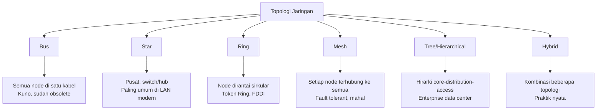
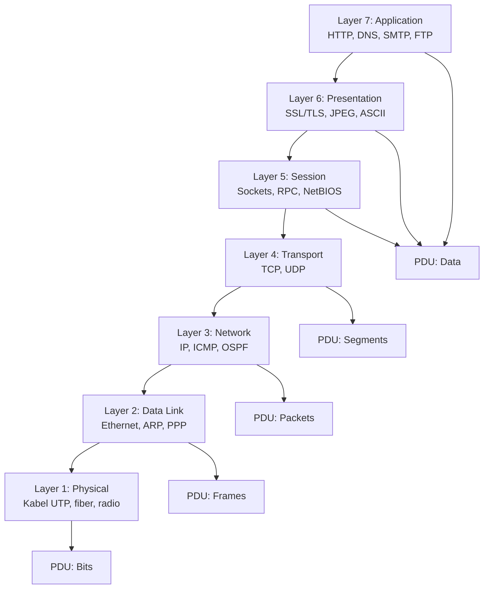
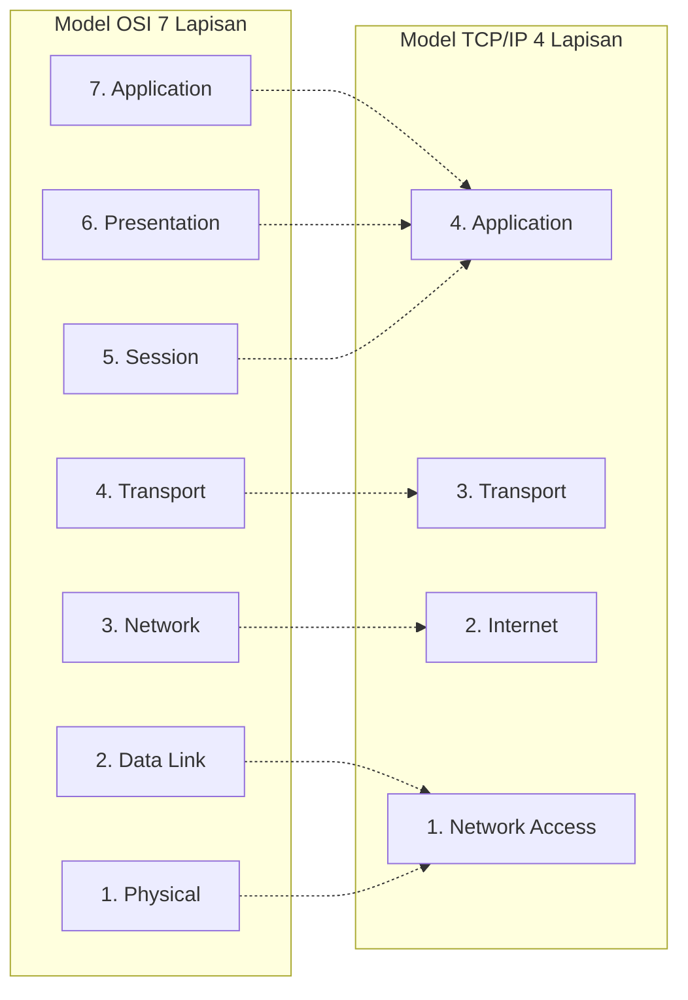
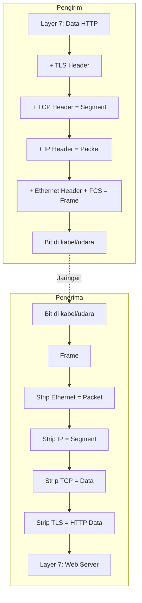
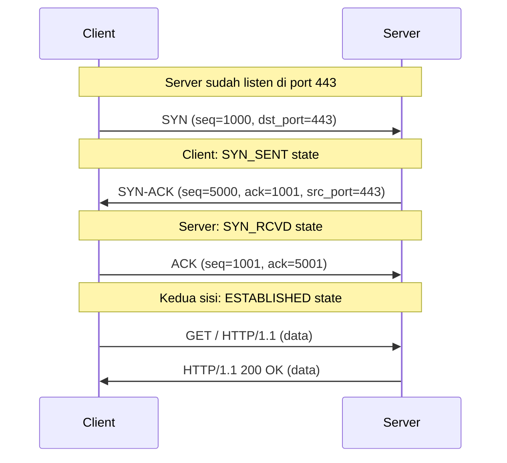

# 🌐 Bab 1: Foundation Jaringan Komputer

## Model OSI, TCP/IP, dan Analisis Paket dengan Wireshark

| | |
|:---|:---|
| **Bab** | 1 - Foundation |
| **Sub-CPMK** | 1.1 & 1.2 |
| **CPMK** | CPMK-1 |
| **Pertemuan** | 2 x 150 menit |

---

## 🎯 Tujuan Pembelajaran Bab Ini

Setelah mempelajari Bab 1 ini, mahasiswa diharapkan mampu:

1. **Menjelaskan** tujuh lapisan model OSI (Open Systems Interconnection) beserta fungsi masing-masing lapisan, runtut dan benar (Sub-CPMK 1.1).
2. **Menjelaskan** empat lapisan model TCP/IP dan memetakan kesesuaiannya dengan model OSI.
3. **Menganalisis** proses enkapsulasi dan dekapsulasi saat data dikirim dari aplikasi hingga sampai ke tujuan, melalui studi kasus pengiriman data.
4. **Mengidentifikasi** PDU (Protocol Data Unit) pada tiap lapisan: Data, Segment, Packet, Frame, Bit.
5. **Mengoperasikan** Wireshark untuk menangkap paket (capture) dan menganalisis header tiap lapisan (Sub-CPMK 1.2).
6. **Menyadari** dimensi spiritual dari jaringan komputer sebagai perantara silaturahim digital dalam perspektif Islam.

> 📌 **Pemetaan Sub-CPMK:** Bab ini menjawab **Sub-CPMK 1.1** (Mhs mampu menjelaskan fungsi 7 lapisan OSI & 4 lapisan TCP/IP, melalui studi kasus pengiriman data, runtut & benar) dan **Sub-CPMK 1.2** (Mhs mampu menganalisis enkapsulasi-dekapsulasi antar lapisan dengan tangkapan paket Wireshark, hingga PDU tiap lapisan teridentifikasi tepat). Keduanya menopang **CPMK-1** (Menjelaskan model OSI dan TCP/IP serta keterkaitan antar lapisan).

---

## 1.1 Konsep Dasar Jaringan Komputer

### 1.1.1 Apa itu Jaringan Komputer?

Jaringan komputer (computer network) adalah sekumpulan komputer dan perangkat lain yang saling terhubung melalui media komunikasi untuk berbagi sumber daya (data, printer, internet), berkomunikasi (email, chat, voice/video call), dan bekerja kolaboratif. Tanpa jaringan, setiap komputer berdiri sendiri (standalone) dan harus mengandalkan media fisik (USB, CD) untuk bertukar data, yang lambat, tidak efisien, dan tidak scalable.

Sebagai mahasiswa D3 Teknik Informatika, Anda akan berinteraksi dengan jaringan setiap hari: WiFi kampus, internet rumah, jaringan kantong smartphone (cellular), bahkan Bluetooth antar perangkat. Memahami bagaimana jaringan bekerja adalah fondasi penting untuk peran profesional seperti **junior network administrator**, **system administrator**, **DevOps engineer**, atau **cloud engineer**. Banyak konsep di cloud computing (VPC, subnet, load balancer) adalah ekstensi langsung dari konsep jaringan tradisional yang akan dipelajari di Bab 1-5.

Tiga manfaat utama jaringan komputer:

**Pertama, sharing sumber daya.** Tanpa jaringan, satu printer harus dipindahkan-pindahkan antar komputer, atau setiap komputer harus punya printer sendiri (biaya tinggi). Dengan jaringan, satu printer dapat dipakai bersama (network printer). Demikian juga file server: satu server dengan storage 10 TB dapat melayani 100 karyawan, lebih ekonomis daripada 100 PC masing-masing dengan storage 1 TB.

**Kedua, komunikasi.** Email, instant messaging (WhatsApp, Slack), voice/video conference (Zoom, Google Meet), semua bergantung pada jaringan. Tanpa jaringan, komunikasi bisnis akan kembali ke era surat fisik dan telepon kabel, jauh lebih lambat. Era pandemi COVID-19 membuktikan bahwa jaringan yang andal memungkinkan work-from-home untuk jutaan pekerja, sesuatu yang mustahil 20 tahun lalu.

**Ketiga, akses informasi terdistribusi.** World Wide Web (WWW) adalah contoh supremasi jaringan. Satu klik di browser dapat mengakses informasi dari server di belahan dunia mana pun. Search engine (Google, Bing) mengindeks miliaran halaman yang tersebar di jutaan server global. Cloud storage (Google Drive, OneDrive) memungkinkan akses file dari perangkat mana pun, kapan pun.

### 1.1.2 Komponen Dasar Jaringan

Sebuah jaringan komputer, bagaimana pun skala nya, terdiri dari beberapa komponen dasar:

| Komponen | Fungsi | Contoh |
|:---|:---|:---|
| **End Device (Host)** | Sumber atau tujuan data; perangkat akhir yang dipakai user | PC, laptop, smartphone, IoT device, server |
| **Intermediary Device** | Perantara yang meneruskan data dari sumber ke tujuan | Switch, router, firewall, access point, repeater |
| **Network Media** | Jalur fisik atau nirkabel tempat data merambat | Kabel UTP, fiber optik, radio WiFi, gelombang 4G/5G |
| **Service** | Aplikasi yang menyediakan fungsi tertentu di jaringan | Web server, email server, DNS, DHCP, file server |
| **Protocol** | Aturan komunikasi antar perangkat | TCP, UDP, IP, HTTP, DNS, BGP, OSPF |

Mari bedah masing-masing:

**End device** adalah perangkat yang menjadi sumber atau tujuan akhir data. Laptop yang Anda pakai untuk browsing adalah end device. Server web yang melayani request juga end device (walaupun ia melayani banyak client). Istilah **host** sering dipakai sebagai sinonim, terutama ketika perangkat punya alamat IP. Dalam jaringan perusahaan, host biasanya berupa PC karyawan, sementara server berada di data center.

**Intermediary device** meneruskan data dari satu segmen jaringan ke segmen lain. Tanpa intermediate device, semua komputer harus terhubung langsung satu sama lain (point-to-point), yang tidak feasible untuk skala besar. **Switch** menghubungkan perangkat dalam satu jaringan lokal (LAN). **Router** menghubungkan antar jaringan yang berbeda (mis. LAN ke internet). **Firewall** menyaring trafik berdasarkan kebijakan keamanan. **Access point** menyediakan konektivitas wireless. **Repeater** memperkuat sinyal untuk jarak jauh.

**Network media** adalah jalur fisik atau nirkabel yang membawa sinyal dari pengirim ke penerima. Media kabel (wired) paling umum adalah **UTP (Unshielded Twisted Pair)** Category 5e/6 untuk LAN, dan **fiber optik** untuk backbone jarak jauh. Media nirkabel (wireless) menggunakan spektrum radio: **WiFi** (2.4 GHz, 5 GHz, 6 GHz), **Bluetooth** (2.4 GHz), **4G/LTE/5G** (berbagai band seluler). Setiap media punya karakteristik trade-off antara kecepatan, jangkauan, biaya, dan keamanan.

**Service** adalah aplikasi yang berjalan di server (atau perangkat lain) dan menyediakan fungsi tertentu. Web server (Apache, Nginx) menyajikan halaman web. Email server (Postfix, Exchange) mengirim dan menerima email. DNS server (BIND, Unbound) menerjemahkan nama domain ke IP. DHCP server memberikan IP otomatis ke client. File server (Samba, NFS) berbagi file antar komputer.

**Protocol** adalah aturan komunikasi yang disepakati antar perangkat. Tanpa protocol, perangkat dari vendor berbeda (Cisco, Mikrotik, Juniper, HP) tidak akan bisa saling berbicara. Protocol menentukan format pesan, urutan komunikasi, penanganan error, dan lain-lain. **TCP/IP** adalah keluarga protocol paling luas dipakai di internet, mencakup IP, TCP, UDP, HTTP, DNS, dan ratusan protocol lain.

### 1.1.3 Klasifikasi Jaringan Berdasarkan Skala

Jaringan diklasifikasikan berdasarkan cakupan geografis:

| Jenis | Singkatan | Cakupan | Contoh |
|:---|:---|:---|:---|
| **PAN** | Personal Area Network | ~10 meter | Bluetooth earphone ke HP, smartwatch ke HP |
| **LAN** | Local Area Network | Satu gedung / kampus | WiFi rumah, jaringan kantor, lab komputer |
| **MAN** | Metropolitan Area Network | Satu kota | Jaringan antar kantor cabang di satu kota |
| **WAN** | Wide Area Network | Antar kota / negara | Internet, jaringan multi-cabang perusahaan |
| **GAN** | Global Area Network | Antar benua | Internet global, jaringan satelit |

Untuk mata kuliah ini, fokus utama adalah **LAN** (Local Area Network) di Bab 1-4, dan sedikit **WAN** di Bab 5 saat membahas routing antar jaringan. LAN modern umumnya menggunakan teknologi **Ethernet** (IEEE 802.3) untuk kabel dan **WiFi** (IEEE 802.11) untuk nirkabel.

### 1.1.4 Topologi Jaringan

Topologi jaringan adalah susunan fisik atau logis perangkat di jaringan. Topologi mempengaruhi performa, keandalan, dan biaya. Berikut topologi umum:



**Topologi Star** (Bintang) adalah yang paling umum di LAN modern. Semua perangkat terhubung ke perangkat pusat (switch). Kelebihan: mudah dikelola, satu kabel putus tidak mempengaruhi perangkat lain. Kekurangan: switch pusat menjadi single point of failure.

**Topologi Mesh** digunakan di jaringan yang membutuhkan keandalan tinggi (data center, backbone internet). Setiap perangkat terhubung ke beberapa perangkat lain, sehingga jika satu link putus, masih ada jalur alternatif. Kelebihan: fault tolerant. Kekurangan: biaya kabel dan port mahal (untuk N node butuh N*(N-1)/2 link).

**Topologi Hierarchical (Tree)** dipakai di enterprise dengan tiga lapis: **core** (backbone cepat), **distribution** (agregasi), **access** (ke end user). Topologi ini scalable, mudah dikelola, dan menjadi standar di data center dan kampus besar.

> 💡 **Praktik di Indonesia:** Warnet (warung internet) era 2000-an sering pakai topologi star dengan hub murah. Warnet modern dan kantor UMKM umumnya pakai star dengan switch L2 + router wireless untuk internet. Kantor pemerintah dan universitas pakai hierarchical dengan core switch 10 Gbps.

---

## 1.2 Model OSI (Open Systems Interconnection)

### 1.2.1 Sejarah dan Tujuan Model OSI

Model OSI dikembangkan oleh **ISO (International Organization for Standardization)** pada tahun 1984 sebagai kerangka konseptual untuk memahami dan standardisasi komunikasi jaringan. OSI bukan protocol implementasi, melainkan **reference model** (model rujukan) yang membagi fungsi komunikasi jaringan menjadi 7 lapisan (layer).

Tujuan utama model OSI:

1. **Standardisasi**: memungkinkan perangkat dari vendor berbeda saling berkomunikasi (interoperabilitas).
2. **Pemisahan tanggung jawab**: setiap lapisan fokus pada fungsi spesifik, sehingga perubahan di satu lapisan tidak merusak lapisan lain.
3. **Pembelajaran**: model 7 lapisan memudahkan pengajaran dan pemahaman konsep jaringan.

Walaupun implementasi nyata di internet lebih mengikuti model TCP/IP (lebih sederhana, 4 lapisan), model OSI tetap dipakai sebagai referensi pedagogis dan troubleshooting. Ketika kita bilang "masalah di layer 2" atau "switch adalah perangkat layer 2", yang dimaksud adalah model OSI.

### 1.2.2 Tujuh Lapisan Model OSI



Mari bedah masing-masing lapisan dari bawah (Layer 1) ke atas (Layer 7), karena ini urutan data mengalir saat pengiriman.

#### Layer 1: Physical (Fisik)

Layer physical berhubungan dengan transmisi bit mentah (0 dan 1) melalui media fisik. Topik utama: kabel, sinyal listrik/cahaya/radio, encoding, voltage level.

**Fungsi:**

- Mengubah bit menjadi sinyal fisik (listrik di UTP, cahaya di fiber, radio di WiFi).
- Menentukan karakteristik media: level voltage, frekuensi, modulasi.
- Menentukan topologi fisik (bus, star, ring).
- Menentukan connector (RJ-45, SC/LC untuk fiber).

**Standar populer:**

- IEEE 802.3 (Ethernet fisik): 100BASE-TX (Fast Ethernet 100 Mbps), 1000BASE-T (Gigabit Ethernet 1 Gbps), 10GBASE-T (10 Gbps).
- IEEE 802.11 (WiFi fisik): 802.11n (Wi-Fi 4), 802.11ac (Wi-Fi 5), 802.11ax (Wi-Fi 6).
- TIA/EIA-568 (kabel UTP straight-through dan crossover).
- RS-232 (serial port legacy).

**Perangkat Layer 1:** Hub (sudah obsolete), Repeater, Kabel UTP, Fiber optik, Connector RJ-45.

> 💡 **Tips troubleshoot Layer 1:** Sebelum nyala-nyala analisis paket, cek dulu Layer 1. Apakah kabel tertancap? Apakah LED link di switch/PC menyala? Apakah WiFi terhubung? 80% masalah jaringan rumah/kantor sebenarnya masalah Layer 1 (kabel longgar, WiFi lemot, power-off).

#### Layer 2: Data Link (Data Link)

Layer data link berhubungan dengan pengiriman frame antar perangkat pada jaringan lokal yang sama (single link). Layer ini menggunakan **MAC address** (Media Access Control) 48-bit untuk identifikasi perangkat.

**Fungsi:**

- **Framing**: membagi bit stream menjadi unit diskret bernama frame.
- **Addressing fisik**: MAC address source dan destination.
- **Error detection**: FCS (Frame Check Sequence) dengan CRC untuk deteksi error (tapi tidak correction).
- **Flow control**: mencegah transmitter membanjiri receiver.
- **Media access control**: aturan siapa boleh kirim kapan (CSMA/CD untuk Ethernet, CSMA/CA untuk WiFi).

**Sub-lapisan Layer 2:**

- **LLC (Logical Link Control)**: interface ke layer 3, identifikasi protocol.
- **MAC (Media Access Control)**: akses ke media fisik, MAC address.

**Standar populer:**

- Ethernet (IEEE 802.3): format frame, MAC addressing.
- WiFi (IEEE 802.11): mirip Ethernet tapi untuk wireless.
- ARP (Address Resolution Protocol): mapping IP ke MAC.
- PPP (Point-to-Point Protocol): untuk koneksi serial/WAN.
- VLAN (IEEE 802.1Q): virtual LAN tagging.

**Perangkat Layer 2:** Switch (L2), Bridge, NIC (Network Interface Card), Access Point.

**Format frame Ethernet umum:**

```
| Destination MAC (6 byte) | Source MAC (6 byte) | EtherType (2 byte) | Payload (46-1500 byte) | FCS (4 byte) |
```

> 💡 **MAC address** ditulis dalam format heksadesimal dengan pemisah `:` atau `-`, misal `00:1A:2B:3C:4D:5E`. 24 bit pertama adalah OUI (Organizationally Unique Identifier) yang menunjukkan vendor pembuat NIC, 24 bit terakhir adalah NIC-specific. Anda bisa cek vendor dari MAC di https://macvendors.com.

#### Layer 3: Network (Jaringan)

Layer network berhubungan dengan pengiriman packet antar jaringan yang berbeda (routing). Layer ini menggunakan **IP address** (IPv4 32-bit atau IPv6 128-bit) untuk identifikasi logical.

**Fungsi:**

- **Logical addressing**: IP address (terlepas dari hardware).
- **Routing**: menentukan path terbaik dari sumber ke tujuan lintas multiple network.
- **Fragmentation**: memecah packet terlalu besar untuk MTU link.
- **Quality of Service (QoS)**: prioritas trafik (marking DSCP).

**Standar populer:**

- IPv4 (RFC 791): protocol pengalamatan utama internet.
- IPv6 (RFC 8200): penerus IPv4, 128-bit address.
- ICMP (Internet Control Message Protocol): ping, traceroute, error message.
- Routing protocol: OSPF, BGP, RIP, EIGRP, IS-IS.
- IPSec: enkripsi di layer 3 (VPN).

**Perangkat Layer 3:** Router, L3 Switch, Firewall (yang punya routing), Multilayer Switch.

> ⚠️ **Router vs Switch:** Switch meneruskan frame berdasarkan MAC address (Layer 2). Router meneruskan packet berdasarkan IP address (Layer 3). Switch menghubungkan perangkat di jaringan yang sama (satu subnet). Router menghubungkan jaringan yang berbeda (antar subnet). Pada Bab 3 kita akan bahas switching dan routing lebih detail.

#### Layer 4: Transport (Transport)

Layer transport berhubungan dengan pengiriman segment antar end device (end-to-end). Layer ini menyediakan komunikasi antar proses aplikasi via **port number**.

**Fungsi:**

- **Segmentation & reassembly**: memecah data aplikasi menjadi segment, menyusun ulang di tujuan.
- **Port addressing**: TCP/UDP port (16-bit, 0-65535).
- **Connection control**: connection-oriented (TCP) atau connectionless (UDP).
- **Flow control**: windowing TCP.
- **Error control**: retransmission TCP untuk segment hilang.
- **Multiplexing**: multiple aplikasi share satu koneksi jaringan.

**Protocol utama:**

| Protocol | Karakteristik | Use Case |
|:---|:---|:---|
| **TCP** | Connection-oriented, reliable, ordered, slow | HTTP/HTTPS, email, file transfer, SSH |
| **UDP** | Connectionless, unreliable, fast | DNS, streaming, VoIP, gaming |

**TCP three-way handshake** (akan dibahas detail di sub-bab 1.5):

```
Client -> SYN -> Server
Client <- SYN-ACK <- Server
Client -> ACK -> Server
(Koneksi established)
```

**Port number well-known:**

- 20, 21: FTP
- 22: SSH
- 25: SMTP
- 53: DNS
- 80: HTTP
- 443: HTTPS
- 3389: RDP

#### Layer 5: Session (Sesi)

Layer session berhubungan dengan manajemen sesi komunikasi antar aplikasi. Bertanggung jawab untuk: membuka, mengelola, dan menutup sesi; sinkronisasi; checkpointing.

**Fungsi:**

- Session establishment, maintenance, termination.
- Dialog control (half-duplex vs full-duplex).
- Synchronization points (checkpoint untuk recovery).

**Protocol:** NetBIOS, RPC (Remote Procedure Call), PPTP, SOCKS.

> 💡 **Di praktik nyata,** layer 5 jarang diimplementasikan secara terpisah. Fungsinya sering digabung dengan layer 4 atau 7. Contoh: TCP sendiri punya konsep "session" via connection, jadi layer 5 TCP/IP seolah menyatu dengan layer 4.

#### Layer 6: Presentation (Presentasi)

Layer presentation berhubungan dengan format dan encoding data agar dapat dipahami oleh aplikasi. Bertanggung jawab untuk: translasi syntax, enkripsi/dekripsi, kompresi.

**Fungsi:**

- **Data translation**: konversi format (EBCDIC ke ASCII, little-endian ke big-endian).
- **Encryption**: SSL/TLS untuk enkripsi HTTPS, S/MIME untuk email.
- **Compression**: gzip, deflate untuk web; H.264 untuk video.

**Protocol/Format:** SSL/TLS, JPEG/GIF/PNG (gambar), ASCII/Unicode, MIME, BER/DER (ASN.1).

> 💡 **SSL/TLS** secara teknis beroperasi antara layer 5 dan 7, sering disebut layer 6 (atau "layer 5.5"). Saat Anda browsing HTTPS, data aplikasi (HTTP) dienkripsi dulu oleh TLS sebelum dikirim ke TCP. Bab 2 sub-bab 2.9-2.11 (di eBook Keamanan Sistem Informasi) membahas TLS lebih detail.

#### Layer 7: Application (Aplikasi)

Layer application adalah lapisan teratas, berhubungan langsung dengan aplikasi pengguna. Bukan aplikasi itu sendiri (browser, email client), melainkan protocol yang dipakai aplikasi untuk berkomunikasi.

**Fungsi:**

- Menyediakan interface antara aplikasi pengguna dan jaringan.
- Mendefinisikan format pesan dan prosedur komunikasi.

**Protocol populer:**

- **HTTP/HTTPS** (HyperText Transfer Protocol): web browsing, port 80/443.
- **DNS** (Domain Name System): resolusi nama, port 53.
- **SMTP/POP3/IMAP**: email, port 25/110/143.
- **FTP** (File Transfer Protocol): transfer file, port 20/21.
- **SSH** (Secure Shell): remote login, port 22.
- **DHCP** (Dynamic Host Configuration Protocol): IP otomatis, port 67/68.
- **SNMP** (Simple Network Management Protocol): monitoring, port 161.
- **NTP** (Network Time Protocol): sinkronisasi waktu, port 123.

---

## 1.3 Model TCP/IP

### 1.3.1 Sejarah Model TCP/IP

Model TCP/IP dikembangkan oleh **DARPA (Defense Advanced Research Projects Agency)** AS pada 1970-an untuk proyek ARPANET, cikal bakal internet. Berbeda dengan OSI yang merupakan model teoritis, TCP/IP adalah model **praktis** yang benar-benar diimplementasikan dan menjadi tulang punggung internet hingga hari ini.

TCP/IP lebih sederhana dengan hanya 4 lapisan, karena menggabungkan beberapa lapisan OSI yang dianggap tidak perlu dipisah secara implementasi. Walaupun OSI lebih detail untuk pembelajaran, TCP/IP adalah yang dipakai di lapangan.

### 1.3.2 Empat Lapisan TCP/IP



#### Layer 4 TCP/IP: Application

Setara dengan 3 lapisan teratas OSI (Application, Presentation, Session). Mencakup semua protocol aplikasi: HTTP, DNS, SMTP, FTP, SSH, DHCP, SNMP, NTP. Layer ini juga menangani presentasi (enkripsi TLS, encoding) dan manajemen sesi.

#### Layer 3 TCP/IP: Transport

Setara dengan Layer 4 OSI. Mencakup TCP dan UDP. Bertanggung jawab atas komunikasi end-to-end antar proses aplikasi via port number.

#### Layer 2 TCP/IP: Internet

Setara dengan Layer 3 OSI (Network). Mencakup IP (IPv4, IPv6), ICMP, routing protocol. Bertanggung jawab atas pengalamatan logical dan routing antar jaringan.

#### Layer 1 TCP/IP: Network Access

Setara dengan Layer 1 dan 2 OSI (Physical dan Data Link). Mencakup Ethernet, WiFi, ARP, MAC addressing, framing, transmisi bit. Kadang disebut juga Link Layer atau Network Interface Layer.

### 1.3.3 Perbandingan OSI vs TCP/IP

| Aspek | Model OSI | Model TCP/IP |
|:---|:---|:---|
| **Jumlah lapisan** | 7 | 4 |
| **Origin** | ISO (standardisasi) | DARPA (implementasi praktis) |
| **Approach** | Theoretical reference | Practical implementation |
| **Pemisahan presentation/session** | Ya (terpisah) | Tidak (digabung ke Application) |
| **Pemisahan physical/data link** | Ya (terpisah) | Tidak (digabung ke Network Access) |
| **Dipakai di** | Pembelajaran, troubleshooting | Implementasi nyata internet |
| **Protocol standar** | Tidak ada protocol OSI nyata | TCP/IP adalah keluarga protocol |

> 💡 **Tips belajar:** Untuk ujian/teori, hafalkan 7 lapisan OSI. Untuk praktik, pahami 4 lapisan TCP/IP. Di dunia kerja, kita sering bilang "layer 3 switch" (OSI layer 3) atau "issue di layer 7" (OSI layer 7), walaupun yang dimaksud sebenarnya mengikuti TCP/IP. Kedua model saling melengkapi.

### 1.3.4 Mnemonic untuk Mengingat 7 Lapisan OSI

Untuk memudahkan hafalan 7 lapisan OSI dari bawah ke atas (1 ke 7) atau sebaliknya, gunakan mnemonic:

**Dari Layer 1 ke Layer 7 (bawah ke atas):**

- **P**lease **D**o **N**ot **T**hrow **S**ausage **P**izza **A**way
- Physical, Data Link, Network, Transport, Session, Presentation, Application

**Dari Layer 7 ke Layer 1 (atas ke bawah):**

- **A**ll **P**eople **S**eem **T**o **N**eed **D**ata **P**rocessing
- Application, Presentation, Session, Transport, Network, Data Link, Physical

Pilih satu yang paling mudah Anda ingat. Yang penting: Layer 1 (Physical) = bit/kabel, Layer 7 (Application) = HTTP/DNS/SMTP.

---

## 1.4 Studi Kasus: Pengiriman Data End-to-End

Mari kita aplikasikan konsep 7 lapisan OSI ke skenario nyata: **mahasiswa UNIMMA ingin mengakses website kampus https://unimma.ac.id dari laptop via WiFi**.

### 1.4.1 Skenario

- **Client**: Laptop mahasiswa, terhubung WiFi kampus.
- **Server**: Web server unimma.ac.id di data center.
- **Aplikasi**: Browser (Chrome) melakukan request HTTPS GET / ke port 443.
- **Network path**: Laptop -> WiFi AP -> Switch -> Router gateway -> ISP -> ... -> Server.

### 1.4.2 Alur Data di Sisi Pengirim (Encapsulation)

Ketika user mengetik `https://unimma.ac.id` di browser dan tekan Enter:

**Layer 7 (Application):** Browser membentuk HTTP request:

```
GET / HTTP/1.1
Host: unimma.ac.id
User-Agent: Mozilla/5.0 ...
Accept: text/html
```

**Layer 6 (Presentation):** HTTP request dienkripsi dengan TLS (karena HTTPS). Hasilnya ciphertext yang merepresentasikan request asli.

**Layer 5 (Session):** Browser membuka session TCP ke server unimma.ac.id port 443.

**Layer 4 (Transport):** Data dipecah menjadi segment TCP. Setiap segment diberi header TCP:

```
| Source Port: 54321 | Dst Port: 443 | Seq: 1000 | Ack: 0 | ... | Data |
```

Segment ini akan dikirim setelah three-way handshake TCP selesai.

**Layer 3 (Network):** Setiap segment TCP dibungkus dengan header IP:

```
| Src IP: 192.168.1.50 | Dst IP: 103.43.46.242 | TTL: 64 | Protocol: TCP | ... | Segment |
```

Destination IP didapat dari DNS resolution `unimma.ac.id`. PDU di layer ini disebut **packet**.

**Layer 2 (Data Link):** Packet IP dibungkus dengan header Ethernet/WiFi:

```
| Dst MAC: 00:1A:2B:3C:4D:5E (gateway router) | Src MAC: AA:BB:CC:DD:EE:FF (laptop) | Type: IPv4 | ... | Packet | FCS |
```

Destination MAC adalah MAC address gateway router (bukan MAC server, karena server jauh di internet). PDU di layer ini disebut **frame**. ARP digunakan untuk menemukan MAC gateway dari IP gateway.

**Layer 1 (Physical):** Frame dikonversi menjadi sinyal radio (WiFi) atau listrik (kabel). PDU di layer ini disebut **bit** (0 dan 1). Sinyal dikirim melalui media (udara untuk WiFi).

### 1.4.3 Perjalanan Data di Jaringan

Frame (yang berisi packet yang berisi segment yang berisi HTTP request terenkripsi) dirambatkan:

1. **Laptop -> WiFi AP**: sinyal radio diterima AP.
2. **AP -> Switch**: AP meneruskan frame via kabel UTP ke switch.
3. **Switch -> Router gateway**: switch meneruskan frame ke router gateway (berdasarkan MAC address gateway).
4. **Router gateway** memproses packet: membaca IP tujuan, menentukan next hop (ISP router), membongkar frame lama, membungkus packet dengan frame baru (destination MAC = next hop router). Proses ini disebut **routing**.
5. **Router ISP** melakukan hal serupa, hop by hop, hingga packet sampai di router di data center unimma.ac.id.
6. **Router data center -> Switch -> Server**: packet akhirnya sampai di server.

Setiap hop router hanya membaca Layer 3 (IP), mengubah Layer 2 (MAC), dan meneruskan. Router tidak peduli isi Layer 4-7.

### 1.4.4 Alur Data di Sisi Penerima (Decapsulation)

Saat frame sampai di server unimma.ac.id:

**Layer 1 (Physical):** Server NIC menerima sinyal listrik, mengubah kembali menjadi bit.

**Layer 2 (Data Link):** NIC membaca frame, memeriksa destination MAC (cocok dengan MAC server?), memeriksa FCS (frame utuh?), kemudian membongkar header MAC dan mengirim packet ke layer 3.

**Layer 3 (Network):** OS server membaca packet, memeriksa destination IP (cocok dengan IP server?), membongkar header IP dan mengirim segment ke layer 4.

**Layer 4 (Transport):** OS server membaca segment TCP, melihat destination port 443, menyerahkan data ke proses web server (yang listen di port 443). ACK dikirim balik ke pengirim untuk konfirmasi penerimaan.

**Layer 5 (Session):** Session TCP antara client dan server di-maintain.

**Layer 6 (Presentation):** Web server mendekripsi TLS ciphertext menjadi HTTP request plain.

**Layer 7 (Application):** Web server (Nginx/Apache) membaca HTTP request `GET /`, memproses, dan menyiapkan response (HTML halaman utama).

Response kemudian mengalir balik dari Layer 7 ke Layer 1 di server, dirambatkan melalui jaringan ke client, dan di-decapsulate dari Layer 1 ke Layer 7 di laptop. Browser menerima HTML, render halaman, user melihat website UNIMMA.

### 1.4.5 Pelajaran dari Studi Kasus

1. **Setiap lapisan punya peran spesifik.** Menghapus satu lapisan akan merusak komunikasi.
2. **Encapsulation-decapsulation terjadi di setiap hop.** Router melakukan encapsulation baru di Layer 2 saat meneruskan packet.
3. **PDU berubah per lapisan.** Bit -> Frame -> Packet -> Segment -> Data. Hafalkan ini!
4. **Router hanya peduli Layer 3** (IP). Switch hanya peduli Layer 2 (MAC). End device peduli semua lapisan.
5. **Masalah bisa terjadi di lapisan mana saja.** Troubleshooting terstruktur per lapisan akan dibahas di Bab 5.

---

## 1.5 Enkapsulasi dan Dekapsulasi

### 1.5.1 Konsep Enkapsulasi

**Enkapsulasi (encapsulation)** adalah proses pembungkusan data dari lapisan atas ke lapisan bawah di sisi pengirim, dengan menambahkan header (dan kadang trailer) di setiap lapisan. Setiap header berisi informasi kontrol yang dibutuhkan lapisan tersebut.

**Dekapsulasi (decapsulation)** adalah kebalikannya: membuka header demi header di sisi penerima, dari lapisan bawah ke atas.



### 1.5.2 PDU (Protocol Data Unit) per Lapisan

**PDU** adalah unit data di suatu lapisan. Setiap lapisan punya nama PDU yang berbeda:

| Lapisan OSI | Nama PDU | Header ditambahkan | Contoh |
|:---:|:---|:---|:---|
| 7, 6, 5 | Data | (tergantung protocol) | HTTP request, DNS query |
| 4 | Segment (TCP) / Datagram (UDP) | TCP/UDP header (port, seq, ack) | TCP segment |
| 3 | Packet | IP header (src/dst IP, TTL) | IPv4 packet |
| 2 | Frame | Ethernet header (MAC, type) + FCS | Ethernet frame |
| 1 | Bit | (tidak ada header, hanya sinyal) | 01101001 |

### 1.5.3 Header TCP dan IP yang Penting

**Header TCP (20 byte minimum):**

```
 0                   1                   2                   3
 0 1 2 3 4 5 6 7 8 9 0 1 2 3 4 5 6 7 8 9 0 1 2 3 4 5 6 7 8 9 0 1
+-+-+-+-+-+-+-+-+-+-+-+-+-+-+-+-+-+-+-+-+-+-+-+-+-+-+-+-+-+-+-+-+
|          Source Port          |       Destination Port        |
+-+-+-+-+-+-+-+-+-+-+-+-+-+-+-+-+-+-+-+-+-+-+-+-+-+-+-+-+-+-+-+-+
|                        Sequence Number                        |
+-+-+-+-+-+-+-+-+-+-+-+-+-+-+-+-+-+-+-+-+-+-+-+-+-+-+-+-+-+-+-+-+
|                    Acknowledgment Number                      |
+-+-+-+-+-+-+-+-+-+-+-+-+-+-+-+-+-+-+-+-+-+-+-+-+-+-+-+-+-+-+-+-+
|  Data |           |U|A|P|R|S|F|                               |
| Offset| Reserved  |R|C|S|S|Y|I|            Window             |
|       |           |G|K|H|T|N|N|                               |
+-+-+-+-+-+-+-+-+-+-+-+-+-+-+-+-+-+-+-+-+-+-+-+-+-+-+-+-+-+-+-+-+
|           Checksum            |         Urgent Pointer        |
+-+-+-+-+-+-+-+-+-+-+-+-+-+-+-+-+-+-+-+-+-+-+-+-+-+-+-+-+-+-+-+-+
```

Field penting:

- **Source/Destination Port** (16-bit masing-masing): mengidentifikasi aplikasi.
- **Sequence Number** (32-bit): posisi segment dalam stream (untuk reassembly).
- **Acknowledgment Number** (32-bit): nomor segment berikutnya yang diharapkan.
- **Flags** (9 bit): SYN, ACK, FIN, RST, PSH, URG, dll.
- **Window** (16-bit): flow control (berapa byte siap diterima).

**Header IPv4 (20 byte minimum):**

```
+-+-+-+-+-+-+-+-+-+-+-+-+-+-+-+-+-+-+-+-+-+-+-+-+-+-+-+-+-+-+-+-+
|Version|  IHL  |Type of Service|          Total Length         |
+-+-+-+-+-+-+-+-+-+-+-+-+-+-+-+-+-+-+-+-+-+-+-+-+-+-+-+-+-+-+-+-+
|         Identification        |Flags|      Fragment Offset    |
+-+-+-+-+-+-+-+-+-+-+-+-+-+-+-+-+-+-+-+-+-+-+-+-+-+-+-+-+-+-+-+-+
|  Time to Live |    Protocol   |       Header Checksum         |
+-+-+-+-+-+-+-+-+-+-+-+-+-+-+-+-+-+-+-+-+-+-+-+-+-+-+-+-+-+-+-+-+
|                       Source Address                          |
+-+-+-+-+-+-+-+-+-+-+-+-+-+-+-+-+-+-+-+-+-+-+-+-+-+-+-+-+-+-+-+-+
|                    Destination Address                        |
+-+-+-+-+-+-+-+-+-+-+-+-+-+-+-+-+-+-+-+-+-+-+-+-+-+-+-+-+-+-+-+-+
```

Field penting:

- **Version** (4-bit): 4 untuk IPv4, 6 untuk IPv6.
- **TTL (Time to Live)** (8-bit): di-decrement setiap hop router. Jika 0, packet dibuang. Mencegah packet loop selamanya.
- **Protocol** (8-bit): protocol layer 4 berikutnya (6 = TCP, 17 = UDP, 1 = ICMP).
- **Source/Destination IP** (32-bit masing-masing): alamat logical.

---

## 1.6 TCP Three-Way Handshake

Sebelum data TCP dikirim, client dan server harus membuka koneksi via **three-way handshake**:



Tiga langkah:

1. **SYN (Synchronize)**: client mengirim segment dengan flag SYN=1 dan sequence number awal (mis. 1000). Client masuk state SYN_SENT.
2. **SYN-ACK**: server merespons dengan SYN=1 dan ACK=1, seq=5000 (sequence server), ack=1001 (mengkonfirmasi SYN client). Server masuk state SYN_RCVD.
3. **ACK**: client mengirim ACK=1, seq=1001, ack=5001. Koneksi ESTABLISHED di kedua sisi.

Setelah ini, data dapat dikirim dua arah (full-duplex). Untuk menutup koneksi, digunakan **four-way handshake** dengan flag FIN.

> 💡 **Di Wireshark,** three-way handshake mudah dikenali: cari tiga segment berurutan dengan SYN, SYN-ACK, ACK. Ini menjadi penanda awal setiap koneksi TCP baru. Bab sub-bab 1.7 akan mempraktikkan capture ini.

---

## 1.7 Praktik Wireshark: Capture dan Analisis Paket

Sub-CPMK 1.2 secara eksplisit menyebutkan: **"Mhs mampu menganalisis enkapsulasi-dekapsulasi antar lapisan dengan tangkapan paket Wireshark, hingga PDU tiap lapisan teridentifikasi tepat"**. Sub-bab ini adalah lab praktik Wireshark yang harus dikerjakan mahasiswa.

### 1.7.1 Tentang Wireshark

**Wireshark** adalah network protocol analyzer paling populer di dunia. Dengan Wireshark, Anda dapat menangkap paket (capture) dari interface jaringan (Ethernet, WiFi, loopback), lalu menganalisis header dan payload setiap paket secara interaktif. Wireshark adalah tool wajib bagi network administrator, security analyst, dan developer yang ingin memahami komunikasi jaringan secara mendalam.

**Fitur utama Wireshark:**

- **Live capture** dari multiple interface.
- **Display filter** dengan sintaks powerful (mis. `tcp.port == 443`).
- **Capture filter** dengan BPF (Berkeley Packet Filter) untuk capture selektif.
- **Protocol dissection** untuk ratusan protocol (HTTP, DNS, TLS, TCP, IP, Ethernet, dll).
- **Statistics**: I/O graph, conversation, endpoint, protocol hierarchy.
- **Export** ke PCAP, CSV, JSON untuk analisis lanjutan.

### 1.7.2 Instalasi Wireshark

```bash
# Ubuntu/Debian
sudo apt update
sudo apt install wireshark
# Saat ditanya "Allow non-root users to capture?", pilih Yes
sudo usermod -aG wireshark $USER  # logout & login untuk efek
# Atau jalankan dengan sudo: sudo wireshark

# Windows
# Download dari https://www.wireshark.org/download.html
# Saat install, pastikan WinPcap/Npcap tercentang

# Mac (Homebrew)
brew install --cask wireshark

# Atau download installer dari https://www.wireshark.org
```

### 1.7.3 Lab 1: Capture HTTP Request ke Server Lokal

**Tujuan:** melihat proses encapsulation end-to-end saat browser request HTTP.

**Setup:**

1. Jalankan Wireshark, pilih interface yang aktif (WiFi atau Ethernet).
2. Mulai capture (Ctrl+E atau tombol shark fin hijau).
3. Di filter bar, ketik `http or dns or tcp.port == 80` (atau biarkan kosong untuk capture semua).
4. Buka browser, akses http://example.com (HTTP, BUKAN HTTPS, supaya payload terlihat plain).
5. Setelah halaman muncul, stop capture.

**Analisis:**

Di Wireshark, Anda akan melihat banyak paket. Cari urutan berikut:

1. **DNS Query dan Response**: cari paket dengan `Standard query A example.com` dan `Standard query response A 93.184.216.34`. Ini adalah Layer 7 (DNS) yang berjalan di Layer 4 (UDP port 53).
2. **TCP Three-way Handshake**: cari tiga paket berurutan dengan `[SYN]`, `[SYN, ACK]`, `[ACK]`. Ini adalah pembukaan koneksi TCP ke port 80 server.
3. **HTTP GET Request**: cari paket dengan `GET / HTTP/1.1` di info column. Klik paket ini, lihat panel detail di bawahnya.

**Panel Detail Wireshark:**

Klik salah satu paket HTTP GET, panel detail akan menampilkan hierarki lapisan:

```
v Frame 42: 415 bytes on wire, 415 bytes captured
v Ethernet II, Src: aa:bb:cc:dd:ee:ff, Dst: 00:1a:2b:3c:4d:5e
v Internet Protocol Version 4, Src: 192.168.1.50, Dst: 93.184.216.34
v Transmission Control Protocol, Src Port: 54321, Dst Port: 80, Seq: 1, Ack: 1
v Hypertext Transfer Protocol
    GET / HTTP/1.1
    Host: example.com
    User-Agent: Mozilla/5.0 ...
    Accept: text/html

```

Perhatikan struktur hierarkis: Wireshark otomatis decode setiap lapisan. Anda dapat expand masing-masing lapisan untuk melihat field header.

**Klik kanan paket -> Follow -> TCP Stream** untuk melihat percakapan TCP end-to-end. Anda akan melihat request dan response dalam format text, memudahkan analisis aplikasi.

### 1.7.4 Lab 2: Analisis PDU per Lapisan

**Tujuan:** mengidentifikasi PDU di setiap lapisan (Data, Segment, Packet, Frame, Bit).

**Setup:** gunakan capture dari Lab 1.

**Tugas analisis:**

Untuk satu paket HTTP GET (Frame 42 dalam contoh di atas), identifikasi:

| Lapisan | PDU | Field yang dilihat di Wireshark |
|:---:|:---|:---|
| Layer 7 | Data | HTTP method (GET), Host, User-Agent |
| Layer 4 | Segment | TCP port src/dst, seq, ack, flags |
| Layer 3 | Packet | IP src/dst, TTL, protocol |
| Layer 2 | Frame | MAC src/dst, EtherType, FCS |
| Layer 1 | Bit | (tidak terlihat di Wireshark, tapi terlihat di wire |

**Identifikasi header tiap lapisan:**

1. **Ethernet header (14 byte):**
   - Destination MAC (6 byte): `00:1a:2b:3c:4d:5e`
   - Source MAC (6 byte): `aa:bb:cc:dd:ee:ff`
   - EtherType (2 byte): `0x0800` (IPv4)

2. **IP header (20 byte):**
   - Version: 4
   - IHL: 5 (20 byte)
   - TTL: 64
   - Protocol: 6 (TCP)
   - Source IP: 192.168.1.50
   - Destination IP: 93.184.216.34

3. **TCP header (20 byte):**
   - Source Port: 54321
   - Destination Port: 80
   - Sequence Number: 1
   - Acknowledgment Number: 1
   - Flags: ACK, PSH

4. **HTTP payload (Data):**

```
GET / HTTP/1.1
Host: example.com
...
```

Total frame size = 14 (Ethernet) + 20 (IP) + 20 (TCP) + length(HTTP request) + 4 (FCS) = 415 byte.

### 1.7.5 Lab 3: Capture DHCP Discovery

**Tujuan:** melihat komunikasi DHCP (Layer 7) yang berjalan di UDP (Layer 4) dan broadcast (Layer 2/3).

**Setup:**

1. Mulai capture Wireshark di interface WiFi atau Ethernet.
2. Filter: `bootp or dhcp` (DHCP traffic).
3. Disconnect dan reconnect WiFi (atau `ipconfig /release` dan `ipconfig /renew` di Windows, atau `dhclient -r` dan `dhclient` di Linux).

**Analisis:**

Anda akan melihat 4 paket DHCP utama:

1. **DHCP Discover** (client -> broadcast): client cari DHCP server. Source IP 0.0.0.0, destination IP 255.255.255.255. Source MAC client, destination MAC FF:FF:FF:FF:FF:FF (broadcast).
2. **DHCP Offer** (server -> broadcast atau unicast): DHCP server menawarkan IP.
3. **DHCP Request** (client -> broadcast): client accept offer, dengan parameter option.
4. **DHCP Acknowledge** (server -> unicast): konfirmasi, IP dan parameter (DNS, gateway, lease time).

Bab 4 sub-bab 4.1 akan membahas DHCP lebih detail. Untuk Bab 1, fokus pada pengamatan struktur lapisan: DHCP di Layer 7, UDP di Layer 4, IP broadcast di Layer 3, Ethernet broadcast di Layer 2.

### 1.7.6 Lab 4: Capture DNS Resolution

**Tujuan:** melihat struktur DNS query dan response.

**Setup:**

1. Flush DNS cache:
   - Windows: `ipconfig /flushdns`
   - Linux: `sudo systemd-resolve --flush-caches` atau `sudo rndc flush`
   - Mac: `sudo dscacheutil -flushcache`
2. Mulai capture Wireshark, filter `dns`.
3. Buka browser, akses domain yang belum di-cache (mis. `https://example-new.com`).

**Analisis:**

1. **DNS Query** (client -> DNS server): Standard query A example-new.com. UDP, source port acak (mis. 54321), destination port 53.
2. **DNS Response** (DNS server -> client): Standard query response A 93.184.216.34. Berisi answer record dengan IP address.

Expand DNS header di Wireshark:

- Transaction ID (16-bit): pairing query dan response.
- Flags: query/response, opcode, authoritative, truncated, recursion desired, recursion available.
- Questions: 1
- Answer RRs: 1
- Authority RRs: 0
- Additional RRs: 0
- Query: example-new.com, Type A, Class IN
- Answer: example-new.com, Type A, Class IN, TTL 3600, Address 93.184.216.34

### 1.7.7 Display Filter Wireshark yang Berguna

| Filter | Fungsi |
|:---|:---|
| `http` | Hanya paket HTTP |
| `dns` | Hanya paket DNS |
| `tcp.port == 443` | Hanya HTTPS (port 443) |
| `tcp.port == 80` | Hanya HTTP (port 80) |
| `ip.addr == 192.168.1.50` | Hanya paket dari/ke IP ini |
| `ip.src == 192.168.1.50 && ip.dst == 8.8.8.8` | Dari IP tertentu ke IP tertentu |
| `eth.addr == aa:bb:cc:dd:ee:ff` | Filter MAC address |
| `tcp.flags.syn == 1 && tcp.flags.ack == 0` | Hanya SYN (awal koneksi TCP) |
| `tcp.flags.reset == 1` | Hanya RST (koneksi di-reset) |
| `!(arp or dns or icmp)` | Sembunyikan ARP/DNS/ICMP (noise) |
| `frame contains "password"` | Cari string "password" di payload |

> 💡 **Tips capture di production:** Capture penuh di jaringan 1 Gbps bisa menghasilkan GB data dalam menit. Gunakan **capture filter** (BPF syntax) saat mulai capture untuk batasi hanya yang relevan. Contoh: `host 8.8.8.8 and port 53` hanya capture DNS ke Google DNS.

### 1.7.8 Capture Filter vs Display Filter

| Aspek | Capture Filter | Display Filter |
|:---|:---|:---|
| **Saat dijalankan** | Saat capture (sebelum paket disimpan) | Setelah capture (saat menampilkan) |
| **Sintaks** | BPF (Berkeley Packet Filter) | Wireshark display filter |
| **Contoh** | `host 8.8.8.8 and port 53` | `ip.addr == 8.8.8.8 && udp.port == 53` |
| **Performa** | Hemat memory, hanya paket relevan yang disimpan | Paket tetap disimpan semua, hanya ditampilkan yang relevan |
| **Use case** | Capture lama di jaringan sibuk | Analisis interaktif setelah capture |

### 1.7.9 Tugas Praktikum Wireshark

Kerjakan tugas berikut sebagai latihan:

1. **Capture browsing ke https://unimma.ac.id** (5 menit). Identifikasi:
   - DNS query dan response untuk unimma.ac.id.
   - TCP three-way handshake ke server web.
   - TLS ClientHello dan ServerHello (catatan: payload TLS terenkripsi, tapi header metadata terlihat).
   - Berapa total byte transfer dalam 5 menit?

2. **Capture ping ke 8.8.8.8** (`ping -c 10 8.8.8.8`). Identifikasi:
   - Paket ICMP Echo Request dan Echo Reply.
   - Berapa lama round-trip time (RTT) rata-rata?
   - Apakah ada paket yang loss?

3. **Capture traceroute ke 1.1.1.1** (`traceroute 1.1.1.1` di Linux/Mac, `tracert 1.1.1.1` di Windows). Identifikasi:
   - Paket ICMP dengan TTL increment.
   - ICMP Time Exceeded dari setiap hop router.
   - Berapa hop sampai ke 1.1.1.1?

4. **Capture saat login ke WiFi kampus** (jika diizinkan). Identifikasi:
   - DHCP discover, offer, request, acknowledge.
   - 802.11 authentication dan association.
   - EAP/TLS authentication (jika WPA2-Enterprise).

Submit file PCAP (`.pcap` atau `.pcapng`) beserta laporan analisis dalam format Markdown. Laporan harus mencakup: skenario capture, screenshot Wireshark yang relevan, analisis per lapisan, dan kesimpulan.

---

## 🕌 Refleksi Islami: Jaringan sebagai Sarana Silaturahim Digital

> *"Dan Kami jadikan bagi kamu pendengaran, penglihatan, dan hati nurani, agar kamu bersyukur."*
> *(QS. An-Nahl [16]: 78)*

> *"Tidaklah dua orang muslim bertemu lalu berjabat tangan, kecuali Allah mengampuni dosa keduanya sebelum mereka berpisah."*
> *(HR. Abu Daud)*

### Tiga Dimensi Spiritual Jaringan Komputer

**Pertama, Silaturahim Digital.** Rasulullah SAW sangat menekankan silaturahim: *"Barangsiapa ingin dilapangkan rezekinya dan dipanjangkan umurnya, hendaklah ia menyambung silaturahim."* (HR. Bukhari-Muslim). Di era digital, jaringan komputer adalah perantara (wasilah) silaturahim antar Muslim yang terpisah jarak. Video call keluarga di perantauan, grup WhatsApp keluarga besar, Zoom pengajian lintas kota, semua tidak mungkin tanpa jaringan. Sebagai praktisi jaringan, Anda turut membangun infrastruktur silaturahim digital yang diberkahi.

Tapi ingat, wasilah bukan tujuan. Jaringan cepat 1 Gbps tidak ada gunanya jika hanya untuk gosip dan fitnah. Jaringan mewah di kantor pelayanan publik tidak bermanfaat jika pelayanan tetap lambat dan birokratis. **Niat** saat membangun jaringan menentukan barokahnya: niat untuk memudahkan silaturahim dan pelayanan umat = barokah; niat untuk pamer atau untuk memfasilitasi maksiat = hilang barokah.

**Kedua, Amanah Profesional Network Administrator.** Network administrator adalah profesi yang dipercaya menjaga infrastruktur komunikasi organisasi. Anda punya akses ke traffic semua karyawan, bisa melihat email yang lewat, bisa intercept transaksi finansial, bisa menyadap percakapan pribadi. Ini amanah berat.

Etika Islam mengatur:

- **Tidak menyadap tanpa keperluan sah.** *"Dan janganlah kamu mengintip (aib orang lain)."* (QS. Al-Hujurat: 12). Network monitoring untuk troubleshooting sah, tapi intip traffic pribadi karyawan tanpa sebab adalah pelanggaran.
- **Menjaga kerahasiaan data yang lewat.** Password yang transit di log, percakapan pribadi yang tertangkap capture, semua adalah amanah. Tidak boleh dibocorkan, diperjualbelikan, atau dipakai untuk pemerasan.
- **Tidak memblokir akses untuk kezaliman.** Memblokir akses ke situs dakwah, media independen, atau platform kritik terhadap penguasa adalah bentuk kezaliman. Network admin yang turut serta melakukan ini ikut berdosa.

**Ketiga, Transparansi dan Keadilan dalam Alokasi Resource.** Jaringan punya resource terbatas: bandwidth, IP address, port. Bagaimana mengalokasikan secara adil adalah ujian. Praktisi muslim harus:

- **Tidak favoritisme**: tidak boleh memberi bandwidth besar ke atasan sementara karyawan biasa dialihkan ke jalur lambat tanpa keperluan.
- **Transparan dalam kebijakan QoS**: jika ada prioritas (mis. voice over IP didahulukan), harus didokumentasikan dan dikomunikasikan.
- **Tidak memonopoli**: di jaringan publik (WiFi kampus, hotspot gratis), tidak boleh satu user menyita semua bandwidth dengan download besar.
- **Melayani UMKM**: banyak UMKM butuh setup jaringan sederhana tapi tidak mampu bayar konsultan. Bantu setup sebagai sedekah jariyah.

### Tiga Pertanyaan Reflektif Sebelum Konfigurasi Network

Sebelum Anda melakukan konfigurasi di router/switch production, renungkan:

1. **Apakah perubahan ini akan mengganggu layanan pengguna?** Jika ya, lakukan di maintenance window, komunikasikan ke stakeholder. Rasulullah bersabda: *"Janganlah salah seorang dari kalian membebani saudaranya sesuatu yang ia mampu melaksanakannya."* (HR. Bukhari).
2. **Apakah saya sudah backup konfigurasi sebelumnya?** Amanah berarti hati-hati. Tidak ada backup = kelalaian yang bisa fatal.
3. **Apakah saya sudah test di lab sebelum production?** Test di simulator (Packet Tracer, GNS3) sebelum apply di perangkat nyata. *"Ihsan adalah engkau menyembah Allah seolah-olah melihat-Nya."* Menulis konfigurasi ihsan = test dulu, bukan coba-coba di production.

Jaringan komputer, dalam perspektif Islam, bukan sekadar kabel dan protocol. Ia adalah infrastruktur silaturahim digital, amanah profesi, dan sarana pelayanan umat. Mari membangun jaringan yang diberkahi.

---

## 📝 Ringkasan Bab 1

Bab 1 ini telah membahas fondasi jaringan komputer sebagai jawaban atas Sub-CPMK 1.1 dan 1.2 yang menopang CPMK-1. Berikut poin-poin kunci:

**Pertama, jaringan komputer** adalah sekumpulan perangkat yang saling terhubung untuk sharing sumber daya, komunikasi, dan akses informasi. Komponen dasarnya: end device, intermediary device, network media, service, protocol. Klasifikasi berdasarkan skala: PAN, LAN, MAN, WAN, GAN. Topologi umum: star (paling umum di LAN), mesh (data center), hierarchical (enterprise).

**Kedua, model OSI 7 lapisan** adalah referensi konseptual: (1) Physical - bit/kabel, (2) Data Link - frame/MAC, (3) Network - packet/IP, (4) Transport - segment/TCP-UDP, (5) Session - sesi, (6) Presentation - format/enkripsi, (7) Application - HTTP/DNS. Mnemonic dari bawah: **P**lease **D**o **N**ot **T**hrow **S**ausage **P**izza **A**way.

**Ketiga, model TCP/IP 4 lapisan** adalah implementasi praktis internet: (1) Network Access (= OSI 1+2), (2) Internet (= OSI 3), (3) Transport (= OSI 4), (4) Application (= OSI 5+6+7). TCP/IP lebih sederhana dari OSI dan yang dipakai di lapangan.

**Keempat, enkapsulasi-dekapsulasi** adalah proses pembungkusan data dengan header di setiap lapisan (encapsulation di pengirim) dan pembukaan header (decapsulation di penerima). PDU per lapisan: Data (Layer 7-5), Segment (Layer 4), Packet (Layer 3), Frame (Layer 2), Bit (Layer 1).

**Kelima, TCP three-way handshake** adalah pembukaan koneksi TCP: SYN -> SYN-ACK -> ACK. Setelah established, data dapat dikirim dua arah. Penutupan koneksi dengan FIN four-way handshake.

**Keenam, Wireshark** adalah tool analisis paket wajib dikuasai. Capture dari interface jaringan, lalu analisis header tiap lapisan secara interaktif. Display filter dengan sintaks Wireshark (`tcp.port == 443`), capture filter dengan sintaks BPF (`host 8.8.8.8 and port 53`). Lab praktikum mencakup: capture HTTP, analisis PDU, capture DHCP, capture DNS.

**Ketujuh, perspektif Islam** menempatkan jaringan komputer sebagai sarana silaturahim digital, amanah profesional network admin, dan transparansi dalam alokasi resource. Tiga pertanyaan reflektif sebelum konfigurasi production: dampak ke pengguna, backup, test di lab.

## 📚 Referensi Bab 1

1. ISO/IEC 7498-1:1994. *Information technology - Open Systems Interconnection - Basic Reference Model: The Basic Model*. International Organization for Standardization.
2. Zimmermann, H. (1980). *OSI Reference Model - The ISO Model of Architecture for Open Systems Interconnection*. IEEE Transactions on Communications.
3. RFC 1122. (1989). *Requirements for Internet Hosts - Communication Layers*. IETF.
4. RFC 793. (1981). *Transmission Control Protocol*. IETF.
5. RFC 791. (1981). *Internet Protocol*. IETF.
6. Kurose, J. F., & Ross, K. W. (2021). *Computer Networking: A Top-Down Approach* (8th ed.). Pearson.
7. Odom, W. (2019). *CCNA 200-301 Official Cert Guide, Volume 1*. Cisco Press.
8. Wireshark Foundation. (2024). *Wireshark User's Guide*. https://www.wireshark.org/docs/wsug_html_chunked/
9. Cisco Networking Academy. (2024). *Introduction to Networks (ITN) v7*. Cisco Press.
10. UNIMMA. (2026). *Dokumen Kurikulum KUR-D3TI-2026*. Universitas Muhammadiyah Magelang.

## 🔜 Yang Akan Dipelajari di Bab 2

Bab berikutnya adalah **Bab 2: IP Addressing & Subnetting** yang mencakup dua Sub-CPMK (2.1 dan 2.2):

- **Sub-CPMK 2.1:** Struktur pengalamatan IPv4 & IPv6 (kelas A/B/C/D/E, netmask, CIDR). Anda akan memahami kenapa IP `192.168.1.1` dan `10.0.0.1` berbeda perlakuannya, bagaimana router menentukan network boundary dengan netmask, dan bagaimana IPv6 mengatasi kehabisan IPv4.
- **Sub-CPMK 2.2:** Subnetting VLSM (Variable Length Subnet Masking). Anda akan belajar membagi network besar menjadi subnet kecil sesuai kebutuhan host, dengan studi kasus perusahaan UMKM dengan multiple departemen.

Sebelum lanjut ke Bab 2, pastikan Anda menguasai 7 lapisan OSI dan 4 lapisan TCP/IP, serta telah menyelesaikan lab Wireshark. IP addressing yang akan dipelajari di Bab 2 beroperasi di Layer 3 (Network), dan tanpa pemahaman layer 3, subnetting akan terasa abstrak.

---

**🔖 Bab 1 selesai. Bab 2 akan disusun setelah review.**

[⬆ Kembali ke Daftar Isi](./jarkom-README.md)

---
