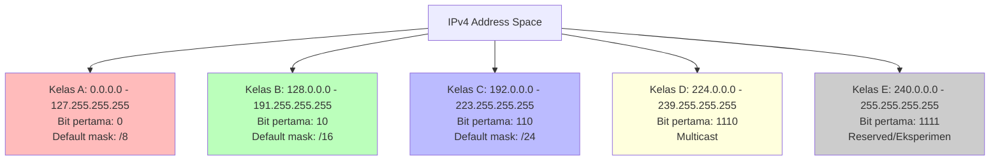
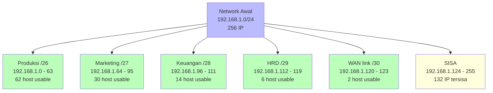

# 🌐 Bab 2: IP Addressing & Subnetting

## IPv4, IPv6, Netmask, CIDR, dan VLSM

| | |
|:---|:---|
| **Bab** | 2 - IP Addressing & Subnetting |
| **Sub-CPMK** | 2.1 & 2.2 |
| **CPMK** | CPMK-2 |
| **Pertemuan** | 2 x 150 menit |

---

## 🎯 Tujuan Pembelajaran Bab Ini

Setelah mempelajari Bab 2 ini, mahasiswa diharapkan mampu:

1. **Menjelaskan** struktur pengalamatan IPv4: kelas A/B/C/D/E, netmask, CIDR, serta perbedaan public vs private IP (Sub-CPMK 2.1).
2. **Menjelaskan** struktur pengalamatan IPv6: format, kategori (unicast, multicast, anycast), dan keunggulan dibanding IPv4.
3. **Menghitung** subnet IPv4 dengan metode FLSM (Fixed Length Subnet Mask) untuk kebutuhan same-size subnet.
4. **Menghitung** subnet IPv4 dengan metode VLSM (Variable Length Subnet Mask) berdasarkan kebutuhan host studi kasus, hingga blok teralokasi tanpa tumpang tindih (Sub-CPMK 2.2).
5. **Mengonfigurasi** IP address pada host (PC) dan router di Cisco Packet Tracer, serta memverifikasi dengan `ping`, `ipconfig`, `show ip interface brief`.
6. **Menyadari** dimensi spiritual dari pengalamatan jaringan sebagai bentuk adil alokasi sumber daya (hisb al-maal) dalam perspektif Islam.

> 📌 **Pemetaan Sub-CPMK:** Bab ini menjawab **Sub-CPMK 2.1** (Mhs mampu menjelaskan struktur pengalamatan IPv4 & IPv6 beserta perannya) dan **Sub-CPMK 2.2** (Mhs mampu menghitung subnet IPv4 metode VLSM berdasarkan kebutuhan host studi kasus, hingga blok teralokasi tanpa tumpang tindih). Keduanya menopang **CPMK-2** (Menerapkan IP addressing dan subnetting untuk perancangan jaringan).

---

## 2.1 Pengantar IP Addressing

### 2.1.1 Mengapa Butuh IP Address?

Di Bab 1 kita sudah pelajari bahwa MAC address (Layer 2) mengidentifikasi perangkat fisik. Lalu mengapa butuh IP address (Layer 3)? Jawabannya: **MAC address tidak scalable untuk internetwork**.

Bayangkan jutaan perangkat di internet. Jika setiap router harus mengingat MAC address setiap perangkat untuk meneruskan packet, tabel routing akan meledak (triliunan entry). Lebih buruk lagi, MAC address bersifat **hardware-dependent** (tertanam di NIC), sehingga jika Anda pindah perangkat dari satu jaringan ke jaringan lain, MAC address tetap sama. Padahal secara logical, di jaringan baru Anda harus dianggap anggota jaringan tersebut.

**IP address** menyelesaikan ini dengan dua prinsip:

1. **Hierarkis**: IP address punya struktur network + host, mirip alamat pos (provinsi -> kota -> jalan -> nomor rumah). Router hanya perlu tahu network tujuan, bukan setiap host.
2. **Logical, bukan hardware**: IP address diberikan ke perangkat berdasarkan jaringan tempat ia berada. Pindah jaringan = ganti IP.

Dengan struktur hierarkis, router core internet hanya perlu tahu ~800.000 network (full table BGP), bukan miliaran host. Ini scalable.

### 2.1.2 Anatomi IP Address IPv4

**IPv4 (Internet Protocol version 4)** adalah protocol pengalamatan utama internet sejak 1981 (RFC 791). IPv4 address panjangnya **32 bit**, ditulis dalam 4 oktet desimal dipisah titik (dotted-decimal notation).

Contoh: `192.168.1.50`

Representasi binary:
```
11000000 . 10101000 . 00000001 . 00110010
   192    .   168    .     1     .    50
```

Setiap oktet (8 bit) bernilai 0-255. Total kombinasi IPv4 = 2^32 = **4.294.967.296** (sekitar 4,3 miliar) alamat unik. Sayangnya, jumlah ini tidak cukup untuk 8 miliar penduduk bumi dengan multiple device per orang. Karena itulah muncul **IPv6** (128 bit, 2^128 alamat) yang akan dibahas di sub-bab 2.5.

Struktur IPv4 address terbagi dua:

- **Network portion**: mengidentifikasi jaringan. Seperti kode area telepon.
- **Host portion**: mengidentifikasi host di dalam jaringan. Seperti nomor telepon lokal.

Pembagian network vs host portion ditentukan oleh **subnet mask** (netmask). Contoh:

```
IP Address  : 192.168.1.50
Netmask     : 255.255.255.0   (/24)
Network     : 192.168.1.0     (network portion)
Host        : 50              (host portion)
```

Dalam binary, netmask `255.255.255.0` = `11111111.11111111.11111111.00000000`. Bit 1 menandakan network portion, bit 0 menandakan host portion. Jadi 24 bit pertama = network, 8 bit terakhir = host.

### 2.1.3 Subnet Mask dan CIDR

**Subnet mask** menentukan boundary antara network dan host portion. Netmask selalu berupa deret bit 1 diikuti bit 0 (tidak boleh acak).

Netmask umum:

| Netmask | CIDR | Binary | Jumlah host |
|:---|:---:|:---|---:|
| 255.0.0.0 | /8 | 11111111.00000000.00000000.00000000 | 16.777.214 |
| 255.255.0.0 | /16 | 11111111.11111111.00000000.00000000 | 65.534 |
| 255.255.255.0 | /24 | 11111111.11111111.11111111.00000000 | 254 |
| 255.255.255.128 | /25 | 11111111.11111111.11111111.10000000 | 126 |
| 255.255.255.192 | /26 | 11111111.11111111.11111111.11000000 | 62 |
| 255.255.255.224 | /27 | 11111111.11111111.11111111.11100000 | 30 |
| 255.255.255.240 | /28 | 11111111.11111111.11111111.11110000 | 14 |
| 255.255.255.248 | /29 | 11111111.11111111.11111111.11111000 | 6 |
| 255.255.255.252 | /30 | 11111111.11111111.11111111.11111100 | 2 |

**CIDR (Classless Inter-Domain Routing)** adalah notasi ringkas netmask dengan `/n` di belakang IP, dimana `n` adalah jumlah bit network. Contoh: `192.168.1.0/24` artinya 24 bit pertama adalah network (sama dengan netmask 255.255.255.0). CIDR diperkenalkan tahun 1993 (RFC 4632) untuk menggantikan sistem kelas yang kaku (sub-bab 2.2).

### 2.1.4 Rumus Penting Subnetting

Untuk netmask `/n`:

- Jumlah bit network = `n`
- Jumlah bit host = `32 - n`
- Jumlah host per subnet = `2^(32-n) - 2` (kurang 2 karena network address dan broadcast address reserved)
- Jumlah subnet (jika dari kelas default) = `2^(n - default_class_bits)`

Contoh untuk `192.168.1.0/26`:
- Bit network = 26
- Bit host = 32 - 26 = 6
- Jumlah host per subnet = 2^6 - 2 = 64 - 2 = 62
- Dari kelas C default (/24), jumlah subnet = 2^(26-24) = 2^2 = 4 subnet

> 💡 **Hafalkan rumus ini!** Ini adalah pondasi semua perhitungan subnetting. Tanpa memahami ini, VLSM akan terasa seperti sihir.

### 2.1.5 Network Address dan Broadcast Address

Setiap subnet punya 2 alamat yang **tidak boleh** dipakai host:

- **Network address**: semua bit host = 0. Mengidentifikasi subnet itu sendiri. Contoh: `192.168.1.0/24` -> network address `192.168.1.0`.
- **Broadcast address**: semua bit host = 1. Untuk kirim paket ke semua host di subnet. Contoh: `192.168.1.0/24` -> broadcast `192.168.1.255`.

Host usable range adalah dari `network + 1` sampai `broadcast - 1`. Contoh: `192.168.1.1` sampai `192.168.1.254`.

---

## 2.2 Kelas IP Address IPv4

### 2.2.1 Sistem Kelas (Classful Addressing)

Sebelum CIDR (1993), IPv4 dibagi menjadi 5 kelas berdasarkan bit pertama. Sistem ini disebut **classful addressing**. Walaupun sekarang sudah obsolete di internet (digantikan CIDR), sistem kelas masih diajarkan karena:

1. Memberikan intuisi tentang skala jaringan (kecil vs besar).
2. Sebagian besar private IP masih pakai kelas default (mis. rumah pakai 192.168.1.0/24).
3. Beberapa tools dan dokumentasi masih menggunakan terminologi kelas.



### 2.2.2 Detail Tiap Kelas

#### Kelas A (Range: 1.0.0.0 - 126.255.255.255)

- Bit pertama: `0` (binary)
- Default netmask: `255.0.0.0` (/8)
- Network portion: 8 bit pertama
- Host portion: 24 bit terakhir
- Jumlah network: 126 (network 0 dan 127 reserved)
- Jumlah host per network: 2^24 - 2 = 16.777.214

**Penggunaan:** kelas A diberikan ke organisasi besar dengan jutaan host (mis. IBM, Apple, MIT). Saat ini sangat langka karena sudah habis dibagi di era 1980-an.

Contoh kelas A: `10.0.0.0/8` (private IP), `44.0.0.0/8` (amateur radio).

#### Kelas B (Range: 128.0.0.0 - 191.255.255.255)

- Bit pertama: `10` (binary)
- Default netmask: `255.255.0.0` (/16)
- Network portion: 16 bit pertama
- Host portion: 16 bit terakhir
- Jumlah network: 16.384
- Jumlah host per network: 2^16 - 2 = 65.534

**Penggunaan:** kelas B diberikan ke universitas dan perusahaan menengah-besar. Juga habis di era 1990-an.

Contoh kelas B: `172.16.0.0/12` (private IP, mencakup 172.16-172.31).

#### Kelas C (Range: 192.0.0.0 - 223.255.255.255)

- Bit pertama: `110` (binary)
- Default netmask: `255.255.255.0` (/24)
- Network portion: 24 bit pertama
- Host portion: 8 bit terakhir
- Jumlah network: 2.097.152
- Jumlah host per network: 2^8 - 2 = 254

**Penggunaan:** kelas C untuk organisasi kecil. Yang paling umum dijumpai di LAN rumah/kantor.

Contoh kelas C: `192.168.1.0/24` (private IP), `200.100.50.0/24` (public IP).

#### Kelas D (Range: 224.0.0.0 - 239.255.255.255)

- Bit pertama: `1110` (binary)
- Tidak ada netmask (multicast, bukan unicast)
- **Penggunaan:** multicast untuk streaming, OSPF hello, RIP v2.

Contoh: `224.0.0.5` (all OSPF router), `224.0.0.9` (RIP v2), `239.255.255.250` (SSDP/UPnP).

#### Kelas E (Range: 240.0.0.0 - 255.255.255.255)

- Bit pertama: `1111` (binary)
- **Penggunaan:** reserved untuk eksperimen dan riset, tidak digunakan di internet publik.

### 2.2.3 Private vs Public IP

Tidak semua IP address bisa dipakai di internet publik. RFC 1918 (1996) mendefinisikan **private IP ranges** yang hanya untuk jaringan internal (LAN), tidak dirutekan di internet:

| Kelas | Private Range | CIDR | Jumlah host |
|:---:|:---|:---|---:|
| A | 10.0.0.0 - 10.255.255.255 | 10.0.0.0/8 | 16.777.214 |
| B | 172.16.0.0 - 172.31.255.255 | 172.16.0.0/12 | 1.048.574 |
| C | 192.168.0.0 - 192.168.255.255 | 192.168.0.0/16 | 65.534 |

**Mengapa private IP penting?**
1. **Konservasi alamat IPv4**: 4,3 miliar IPv4 tidak cukup untuk semua perangkat dunia. Dengan private IP + NAT (Bab 4 sub-bab 4.2), satu public IP bisa dipakai bersama ribuan perangkat.
2. **Keamanan**: perangkat dengan private IP tidak bisa diakses langsung dari internet, ada lapisan isolasi NAT.
3. **Gratis**: tidak perlu beli public IP dari ISP untuk jaringan internal.

> 💡 **Cek IP Anda:** Buka terminal/cmd, jalankan `ipconfig` (Windows) atau `ip addr` (Linux). Kemungkinan besar Anda lihat `192.168.x.x` atau `10.x.x.x`. Itu private IP. Untuk lihat public IP: `curl ifconfig.me`.

### 2.2.4 Special IPv4 Addresses

Beberapa IPv4 address punya arti khusus:

| IP | Arti |
|:---|:---|
| `0.0.0.0` | Default route / "any IP" (di server binding, listen semua interface) |
| `127.0.0.0/8` | Loopback (localhost). Test protocol tanpa network fisik. |
| `169.254.0.0/16` | APIPA (Automatic Private IP Addressing). Windows assign ini jika DHCP gagal. |
| `255.255.255.255` | Limited broadcast (semua host di local link) |
| `224.0.0.0/4` | Multicast |
| `100.64.0.0/10` | CGNAT (Carrier-Grade NAT) untuk ISP |

### 2.2.5 Subnetting FLSM (Fixed Length Subnet Mask)

**FLSM** adalah metode subnetting dimana semua subnet memiliki ukuran yang sama (same netmask). FLSM adalah pendahulu VLSM dan lebih sederhana, tapi boros IP.

**Contoh kasus:** PT TokoKita punya network `192.168.1.0/24` dan ingin membagi jadi 4 subnet sama besar.

**Langkah perhitungan:**

1. Tentukan jumlah subnet yang dibutuhkan: 4.
2. Cari `n` dimana `2^n >= 4`. `n = 2` (2^2 = 4).
3. Tambah `n` bit ke default mask. Kelas C default `/24`, jadi subnet mask baru = `/24 + 2 = /26`.
4. Netmask `/26` = `255.255.255.192` (binary: 11111111.11111111.11111111.11000000).
5. Hitung host per subnet: `2^(32-26) - 2 = 2^6 - 2 = 62 host`.
6. Hitung block size: `256 - 192 = 64`. Subnet increments: 0, 64, 128, 192.

**Hasil 4 subnet:**

| Subnet | Network Address | Host Range | Broadcast |
|:---:|:---|:---|:---|
| 1 | 192.168.1.0/26 | 192.168.1.1 - 192.168.1.62 | 192.168.1.63 |
| 2 | 192.168.1.64/26 | 192.168.1.65 - 192.168.1.126 | 192.168.1.127 |
| 3 | 192.168.1.128/26 | 192.168.1.129 - 192.168.1.190 | 192.168.1.191 |
| 4 | 192.168.1.192/26 | 192.168.1.193 - 192.168.1.254 | 192.168.1.255 |

**Kapan pakai FLSM?**
- Semua subnet butuh ukuran host sama (mis. lab komputer dengan 30 PC per lab).
- Routing protocol lama (RIP v1) yang tidak mendukung VLSM.

**Kelemahan FLSM:**
- Boros IP. Jika satu subnet butuh 60 host dan 3 subnet lain butuh 10 host, semua dapat 62 host. Sisa IP di subnet kecil terbuang.

Inilah mengapa **VLSM** dikembangkan (sub-bab 2.4).

---
## 2.3 Subnet Mask Detail dan Binary Operation

### 2.3.1 Menghitung Network Address dari IP + Netmask

Untuk mendapat network address dari IP + netmask, gunakan operasi **bitwise AND** antara IP dan netmask.

**Contoh:**
```
IP       : 192.168.1.130    11000000.10101000.00000001.10000010
Netmask  : 255.255.255.192  11111111.11111111.11111111.11000000
                              AND
Network  : 192.168.1.128    11000000.10101000.00000001.10000000
```

Setiap bit IP di-AND dengan bit netmask. Hasilnya adalah network address `192.168.1.128`. Artinya, IP `192.168.1.130/26` berada di subnet `192.168.1.128/26`.

### 2.3.2 Menghitung Broadcast Address

Broadcast address = network address dengan semua bit host di-set 1.

```
Network  : 192.168.1.128    11000000.10101000.00000001.10000000
Host bits                       (6 bit terakhir)
Broadcast: 192.168.1.191    11000000.10101000.00000001.10111111
```

Cara cepat: `broadcast = network + (jumlah host + 1) = 128 + 63 = 191`.

Atau gunakan trik: `broadcast = (network | ~netmask)`.

### 2.3.3 Tabel Subnet Magic

Untuk subnet yang umum (di oktet terakhir), hafalkan tabel ini:

| CIDR | Netmask | Block Size | Subnets in /24 | Host per subnet |
|:---:|:---:|---:|---:|---:|
| /24 | .0 | 256 | 1 | 254 |
| /25 | .128 | 128 | 2 | 126 |
| /26 | .192 | 64 | 4 | 62 |
| /27 | .224 | 32 | 8 | 30 |
| /28 | .240 | 16 | 16 | 14 |
| /29 | .248 | 8 | 32 | 6 |
| /30 | .252 | 4 | 64 | 2 |
| /31 | .254 | 2 | 128 | 0 (point-to-point, RFC 3021) |
| /32 | .255 | 1 | 256 | 1 (single host) |

**Block size** adalah kelipatan network address. Untuk `/26`, block size 64, sehingga network addresses: 0, 64, 128, 192.

> 💡 **Tabel magic ini sering disebut "subnetting cheat sheet".** Hafalkan ini dan 80% soal subnetting bisa diselesaikan tanpa kalkulator.

### 2.3.4 Quick Subnetting dengan Cheat Sheet

**Soal:** IP `192.168.10.175/28`, tentukan:
1. Network address?
2. Broadcast address?
3. Host range?
4. Subnet ke berapa (dari /24)?

**Jawaban cepat:**

1. Cek `/28` di tabel: netmask `.240`, block size 16.
2. Network addresses dalam /24: 0, 16, 32, 48, ..., 160, 176, 192, ...
3. Cari network terbesar yang <= 175: `160` (karena 176 > 175).
4. **Network address: 192.168.10.160**.
5. **Broadcast address: 192.168.10.175** (network + block size - 1 = 160 + 16 - 1).
6. **Host range: 192.168.10.161 - 192.168.10.174**.
7. **Subnet ke-11** (160 / 16 = 10, plus 1 = subnet ke-11 dari 16 subnet).

---

## 2.4 VLSM (Variable Length Subnet Mask)

### 2.4.1 Mengapa VLSM?

**VLSM** adalah teknik subnetting dimana setiap subnet boleh punya netmask berbeda, sesuai kebutuhan host. VLSM mengatasi kelemahan FLSM yang boros IP.

**Contoh kasus:** PT TokoKita punya 4 departemen dengan kebutuhan host berbeda:

| Departemen | Kebutuhan Host |
|:---|---:|
| Produksi | 60 host |
| Marketing | 30 host |
| Keuangan | 14 host |
| HRD | 6 host |
| WAN Router-link | 2 host (point-to-point) |

**Dengan FLSM** (semua pakai /26 = 62 host), dibutuhkan 5 subnet x 64 IP = 320 IP. Padahal kebutuhan sebenarnya hanya 60+30+14+6+2 = 112 host. **Boros 208 IP!**

**Dengan VLSM**, tiap subnet dapat netmask sesuai kebutuhan:

| Departemen | Kebutuhan | Netmask | Block Size | IP Terpakai |
|:---|---:|:---:|---:|---:|
| Produksi | 60 | /26 | 64 | 64 |
| Marketing | 30 | /27 | 32 | 32 |
| Keuangan | 14 | /28 | 16 | 16 |
| HRD | 6 | /29 | 8 | 8 |
| WAN link | 2 | /30 | 4 | 4 |
| **Total** | **112** | | | **124** |

Hemat 196 IP dibanding FLSM. Untuk organisasi besar dengan ratusan cabang, penghematan ini sangat signifikan.

### 2.4.2 Aturan VLSM

1. **Sortir kebutuhan host dari yang TERBESAR ke TERKECIL**. Ini wajib! Kalau tidak, alokasi bisa overlap.
2. **Pilih netmask yang ukurannya >= kebutuhan host + 2** (network + broadcast).
3. **Alokasikan subnet secara berurutan** dari awal block, tanpa gap.
4. **Verifikasi tidak ada overlap**.

### 2.4.3 Step-by-Step VLSM

Kita gunakan kasus PT TokoKita dengan network `192.168.1.0/24`.

**Step 1: Sortir kebutuhan host dari terbesar**

| Subnet | Host Butuh | Host + 2 | Cari 2^n >= Host+2 | Bit host | CIDR |
|:---|---:|---:|:---|:---:|:---:|
| Produksi | 60 | 62 | 2^6 = 64 | 6 | /26 |
| Marketing | 30 | 32 | 2^5 = 32 | 5 | /27 |
| Keuangan | 14 | 16 | 2^4 = 16 | 4 | /28 |
| HRD | 6 | 8 | 2^3 = 8 | 3 | /29 |
| WAN link | 2 | 4 | 2^2 = 4 | 2 | /30 |

**Step 2: Alokasi subnet berurutan**

| Subnet | Network | Netmask | First Host | Last Host | Broadcast |
|:---|:---|:---:|:---|:---|:---|
| Produksi | 192.168.1.0 | /26 | 192.168.1.1 | 192.168.1.62 | 192.168.1.63 |
| Marketing | 192.168.1.64 | /27 | 192.168.1.65 | 192.168.1.94 | 192.168.1.95 |
| Keuangan | 192.168.1.96 | /28 | 192.168.1.97 | 192.168.1.110 | 192.168.1.111 |
| HRD | 192.168.1.112 | /29 | 192.168.1.113 | 192.168.1.118 | 192.168.1.119 |
| WAN link | 192.168.1.120 | /30 | 192.168.1.121 | 192.168.1.122 | 192.168.1.123 |

**Step 3: Verifikasi tidak overlap**

Cek broadcast subnet N < network subnet N+1:
- 63 < 64 (OK)
- 95 < 96 (OK)
- 111 < 112 (OK)
- 119 < 120 (OK)

Semua OK, tidak overlap.

**Step 4: Cek sisa IP**

Total terpakai: 0-123 = 124 IP. Sisa dari /24 (256 IP): 192.168.1.124 - 192.168.1.255 = 132 IP tersisa untuk subnet baru di masa depan.

### 2.4.4 Diagram VLSM Visual



### 2.4.5 Latihan VLSM Mandiri

**Soal 1:** Universitas XYZ punya network `172.16.0.0/16`. Alokasikan subnet untuk:

- Fakultas Teknik: 2000 host
- Fakultas Ekonomi: 1000 host
- Fakultas Hukum: 500 host
- Fakultas Kedokteran: 250 host
- Server Farm: 100 host
- WAN link ke cabang: 2 host

**Step 1: Sortir**

| Subnet | Host Butuh | 2^n >= Host+2 | CIDR | Block Size |
|:---|---:|:---|:---:|---:|
| Teknik | 2000 | 2^11 = 2048 | /21 | 2048 |
| Ekonomi | 1000 | 2^10 = 1024 | /22 | 1024 |
| Hukum | 500 | 2^9 = 512 | /23 | 512 |
| Kedokteran | 250 | 2^8 = 256 | /24 | 256 |
| Server Farm | 100 | 2^7 = 128 | /25 | 128 |
| WAN | 2 | 2^2 = 4 | /30 | 4 |

**Step 2: Alokasi**

| Subnet | Network | Broadcast | Host Range |
|:---|:---|:---|:---|
| Teknik | 172.16.0.0/21 | 172.16.7.255 | 172.16.0.1 - 172.16.7.254 |
| Ekonomi | 172.16.8.0/22 | 172.16.11.255 | 172.16.8.1 - 172.16.11.254 |
| Hukum | 172.16.12.0/23 | 172.16.13.255 | 172.16.12.1 - 172.16.13.254 |
| Kedokteran | 172.16.14.0/24 | 172.16.14.255 | 172.16.14.1 - 172.16.14.254 |
| Server Farm | 172.16.15.0/25 | 172.16.15.127 | 172.16.15.1 - 172.16.15.126 |
| WAN | 172.16.15.128/30 | 172.16.15.131 | 172.16.15.129 - 172.16.15.130 |

**Sisa:** 172.16.15.132 - 172.16.255.255 masih banyak tersedia.

**Soal 2:** (kerjakan sendiri) Sekolah SMK Informatika punya `10.10.0.0/16`. Alokasikan untuk:
- Lab A: 60 PC
- Lab B: 30 PC
- Lab C: 14 PC
- Guru: 30 PC
- Kantor: 14 PC
- Server: 6 unit
- WiFi tamu: 60 host
- 3 link WAN ke cabang (2 host each)

Hitung VLSM, sajikan dalam tabel, verifikasi tidak overlap.

### 2.4.6 Trik Cepat VLSM dengan Binary Tree

Untuk VLSM kompleks, gambar binary tree. Setiap split mengubah 1 bit network, membagi block jadi 2 sama besar.

```
/24 (256 IP)
├── /25 (128 IP)
│   ├── /26 (64)
│   └── /26 (64)
└── /25 (128 IP)
    ├── /26 (64)
    └── /26 (64)
```

Mulai dari /24, alokasikan kebutuhan terbesar dulu. Jika kebutuhan = 60, alokasi /26 (64 host). Subnet kedua (/26 sisa) bisa dipecah lagi untuk kebutuhan 30 (/27), dst.

---

## 2.5 IPv6 Addressing

### 2.5.1 Mengapa IPv6?

IPv4 (32-bit, ~4,3 miliar alamat) sudah habis. IANA menyerahkan blok IPv4 terakhir ke Regional Internet Registry (RIR) pada 2011. APNIC (Asia-Pasifik) habis 2011, ARIN (Amerika Utara) habis 2015. Indonesia sendiri masih dapat IPv4 dari APNIC allocation, tetapi semakin sulit dan mahal.

**IPv6** (128-bit, 2^128 = ~3,4 x 10^38 alamat) adalah solusi. Jumlah ini cukup untuk memberi miliaran alamat per meter persegi bumi. Walaupun migrasi IPv6 lambat (masih ~40% trafik global per 2024), semua perangkat modern sudah mendukung IPv6.

### 2.5.2 Format IPv6

IPv6 address panjang 128 bit, ditulis dalam 8 grup heksadesimal 16-bit dipisah titik dua:

```
2001:0db8:85a3:0000:0000:8a2e:0370:7334
```

Aturan penulisan:

1. **Leading zero suppression**: setiap grup bisa hilangkan leading zero. `0db8` -> `db8`.
2. **Double colon (::) compression**: deret grup nol berurutan bisa diganti `::` (hanya sekali per address). `0000:0000` -> `::`.

Hasil kompresi:

```
2001:db8:85a3::8a2e:370:7334
```

### 2.5.3 Struktur IPv6

IPv6 address dibagi:

- **Global Routing Prefix (48 bit)**: dialokasikan oleh ISP ke organisasi.
- **Subnet ID (16 bit)**: organisasi bagi untuk subnet internal (16 bit = 65.536 subnet).
- **Interface ID (64 bit)**: mengidentifikasi host di subnet.

Contoh: `2001:db8:acad:1::10/64`

- Network prefix (64 bit): `2001:db8:acad:1::`
- Interface ID (64 bit): `::10`
- Subnet ID: `1` (16 bit setelah prefix global `2001:db8:acad`)

### 2.5.4 Jenis IPv6 Address

| Jenis | Prefix | Range | Penggunaan |
|:---|:---|:---|:---|
| **Global Unicast** | 2000::/3 | 2000:: - 3fff:... | IP publik di internet |
| **Unique Local** | fc00::/7 | fc00:: - fdff:... | Private IP (seperti RFC 1918 IPv4) |
| **Link-Local** | fe80::/10 | fe80:: - febf:: | Otomatis per interface, hanya local link (seperti APIPA) |
| **Loopback** | ::1/128 | ::1 | Localhost (seperti 127.0.0.1) |
| **Multicast** | ff00::/8 | ff00:: - ffff:: | Multicast (pengganti broadcast IPv4) |
| **Unspecified** | ::/128 | :: | "Tidak ada IP" (seperti 0.0.0.0) |

Catatan: **IPv6 tidak punya broadcast**. Semua komunikasi one-to-many pakai multicast.

### 2.5.5 SLAAC (Stateless Address Autoconfiguration)

IPv6 punya fitur **SLAAC** dimana host otomatis generate IPv6 address tanpa DHCP server. Cara kerja:

1. Host generate link-local address `fe80::interface_id/64` (interface ID biasanya dari MAC address via EUI-64, atau random).
2. Host kirim Router Solicitation (RS) multicast ke router.
3. Router balas Router Advertisement (RA) berisi network prefix (mis. `2001:db8:acad:1::/64`).
4. Host gabung prefix + interface ID -> global unicast address.

SLAAC membuat IPv6 plug-and-play: colok kabel, langsung dapat IP global tanpa DHCP. DHCPv6 masih ada untuk opsional (memberikan DNS, NTP, dll).

### 2.5.6 Perbandingan IPv4 vs IPv6

| Aspek | IPv4 | IPv6 |
|:---|:---|:---|
| Panjang | 32 bit | 128 bit |
| Jumlah alamat | ~4,3 miliar | ~3,4 x 10^38 |
| Notasi | dotted decimal | hex dengan titik dua |
| Header | 20 byte (variable) | 40 byte (fixed) |
| Broadcast | Ya | Tidak (ganti multicast) |
| Autoconfig | DHCP atau manual | SLAAC (otomatis) |
| IPsec | Opsional | Built-in (tapi tidak wajib aktif) |
| NAT | Umum (RFC 1918) | Tidak butuh NAT (cukup alamat) |

> 💡 **Di Indonesia:** Mayoritas ISP masih IPv4-only atau dual-stack (IPv4 + IPv6). Provider seluler (Telkomsel, Indosat, XL) lebih cepat adopt IPv6 karena mobile cloud. Konten besar (Google, Facebook, Cloudflare) sudah dual-stack. Jaringan kampus dan kantor Indonesia umumnya masih IPv4-only, tetapi mulai migrasi.

---

## 2.6 Lab Praktik: Konfigurasi IP di Cisco Packet Tracer

Sub-bab ini adalah lab praktik yang harus dikerjakan mahasiswa di **Cisco Packet Tracer** (gratis download dari https://www.netacad.com/cisco-packet-tracer).

### 2.6.1 Setup Lab VLSM TokoKita

**Skenario:** Implementasikan rancangan VLSM PT TokoKita (sub-bab 2.4.3) di Packet Tracer.

**Komponen yang dibutuhkan:**

- 4 PC (untuk 4 departemen: Produksi, Marketing, Keuangan, HRD)
- 4 Switch (Layer 2)
- 1 Router dengan 4 interface (atau 1 router + 3 interface tambahan)
- Kabel straight-through UTP

**Topologi:**

```
[PC Produksi] -- [SW1] --+
[PC Marketing] -- [SW2] --+
[PC Keuangan] -- [SW3] --+-- [Router] -- (Internet simulasi)
[PC HRD]      -- [SW4] --+
```

### 2.6.2 Langkah Konfigurasi

**Step 1: Tambahkan perangkat di Packet Tracer**

1. Buka Packet Tracer, buat workspace kosong.
2. Drag 4 PC dari End Devices ke workspace.
3. Drag 4 Switch dari Network Devices -> Switches (pilih 2960).
4. Drag 1 Router dari Network Devices -> Routers (pilih 2911).
5. Hubungkan dengan kabel straight-through: PC -> Switch -> Router.

**Step 2: Konfigurasi IP di PC (GUI Packet Tracer)**

Klik PC -> tab Desktop -> IP Configuration:

- Pilih **Static**.
- IPv4 Address: sesuai tabel VLSM.
- Subnet Mask: sesuai CIDR.
- Default Gateway: IP router di subnet tersebut.

Contoh untuk PC Produksi:

```
IPv4 Address: 192.168.1.1
Subnet Mask: 255.255.255.192
Default Gateway: 192.168.1.62
```

**Step 3: Konfigurasi IP di Router (CLI)**

Klik Router -> tab CLI:

```
Router> enable
Router# configure terminal

# Interface untuk Produksi (GigabitEthernet 0/0)
Router(config)# interface GigabitEthernet0/0
Router(config-if)# ip address 192.168.1.62 255.255.255.192
Router(config-if)# no shutdown
Router(config-if)# description Link to Produksi LAN
Router(config-if)# exit

# Interface untuk Marketing (GigabitEthernet 0/1)
Router(config)# interface GigabitEthernet0/1
Router(config-if)# ip address 192.168.1.94 255.255.255.224
Router(config-if)# no shutdown
Router(config-if)# description Link to Marketing LAN
Router(config-if)# exit

# Interface untuk Keuangan (GigabitEthernet 0/2)
Router(config)# interface GigabitEthernet0/2
Router(config-if)# ip address 192.168.1.110 255.255.255.240
Router(config-if)# no shutdown
Router(config-if)# description Link to Keuangan LAN
Router(config-if)# exit

# Interface untuk HRD (Serial 0/0/0 atau GigabitEthernet tambahan)
Router(config)# interface Serial0/0/0
Router(config-if)# ip address 192.168.1.118 255.255.255.248
Router(config-if)# no shutdown
Router(config-if)# description Link to HRD LAN
Router(config-if)# exit

Router(config)# exit
Router# write memory
```

**Catatan:** Untuk router 2911, gunakan interface tambahan (NM-2FE2W module) atau hubungkan HRD via switch dengan sub-interface (router-on-a-stick, dibahas di Bab 3).

**Step 4: Verifikasi**

Di Router CLI:

```
Router# show ip interface brief
Interface              IP-Address      OK? Method Status                Protocol
GigabitEthernet0/0     192.168.1.62    YES manual up                    up
GigabitEthernet0/1     192.168.1.94    YES manual up                    up
GigabitEthernet0/2     192.168.1.110   YES manual up                    up
Serial0/0/0            192.168.1.118   YES manual up                    up
```

Di PC (Command Prompt via Desktop):

```
C:\> ipconfig

IP Address......................: 192.168.1.1
Subnet Mask.....................: 255.255.255.192
Default Gateway.................: 192.168.1.62

C:\> ping 192.168.1.62

Pinging 192.168.1.62 with 32 bytes of data:

Reply from 192.168.1.62: bytes=32 time=1ms TTL=255
Reply from 192.168.1.62: bytes=32 time=1ms TTL=255
Reply from 192.168.1.62: bytes=32 time=1ms TTL=255
Reply from 192.168.1.62: bytes=32 time=1ms TTL=255

Ping statistics for 192.168.1.62:
    Packets: Sent = 4, Received = 4, Lost = 0 (0% loss)

C:\> ping 192.168.1.65
(Marketing PC, harus berhasil jika routing sudah benar)
```

### 2.6.3 Verifikasi Routing antar Subnet

Default gateway di PC adalah IP router. Saat PC A (Produksi) ping PC B (Marketing), packet dikirim ke router (gateway), router meneruskan ke subnet Marketing. Tanpa routing di router, ping akan gagal.

Untuk memastikan router sudah routing antar interface directly-connected:

```
Router# show ip route
Codes: L - local, C - connected, ...

C    192.168.1.0/26 is directly connected, GigabitEthernet0/0
L    192.168.1.62/32 is directly connected, GigabitEthernet0/0
C    192.168.1.64/27 is directly connected, GigabitEthernet0/1
L    192.168.1.94/32 is directly connected, GigabitEthernet0/1
C    192.168.1.96/28 is directly connected, GigabitEthernet0/2
L    192.168.1.110/32 is directly connected, GigabitEthernet0/2
C    192.168.1.112/29 is directly connected, Serial0/0/0
L    192.168.1.118/32 is directly connected, Serial0/0/0
```

Huruf `C` = connected (interface langsung terhubung). Router otomatis routing antar connected network tanpa perlu konfigurasi static/dynamic routing. Bab 3 akan bahas routing ke network non-connected (static, OSPF).

### 2.6.4 Troubleshooting Common Issues

| Gejala | Penyebab Umum | Solusi |
|:---|:---|:---|
| Ping gateway Request timeout | IP PC salah subnet | Cek IP PC vs netmask |
| Ping gateway Destination unreachable | Gateway belum di-set / salah | Set default gateway PC = IP router |
| Ping antar PC gagal | Router interface down | `no shutdown` di interface router |
| Ping antar PC gagal padahal gateway OK | Routing belum konvergen | Tunggu 30 detik, atau cek `show ip route` |
| Subnet mask salah di PC | CIDR salah hitung | Hitung ulang subnet mask |
| IP overlap | VLSM salah alokasi | Verifikasi network addresses tidak overlap |

### 2.6.5 Latihan Lab Mandiri

Kerjakan lab berikut dan submit file `.pkt` (Packet Tracer) + laporan:

**Lab 1: Implementasi VLSM Universitas XYZ**

- Network: `172.16.0.0/16`
- 6 subnet: Teknik (2000), Ekonomi (1000), Hukum (500), Kedokteran (250), Server Farm (100), WAN (2)
- Pakai tabel VLSM dari sub-bab 2.4.5
- Topologi: 6 switch + 1 router dengan multiple interface
- Verifikasi: ping antar PC di subnet berbeda berhasil

**Lab 2: Implementasi VLSM Sekolah SMK**

- Network: `10.10.0.0/16`
- Subnet sesuai sub-bab 2.4.5 Soal 2 (Lab A, Lab B, Lab C, Guru, Kantor, Server, WiFi tamu, 3 WAN)
- Topologi: 7 switch + 2 router (1 router utama + 1 router cabang untuk WAN link)
- Verifikasi: ping dari Lab A ke Router Cabang berhasil

**Lab 3: IPv6 Basic Configuration**

- Network: `2001:db8:acad::/48`
- Bagi 4 subnet: `2001:db8:acad:1::/64`, `:2::/64`, `:3::/64`, `:4::/64`
- Konfigurasi IPv6 di PC dan Router
- Verifikasi: `ping ipv6` antar host berhasil

Format laporan: skenario, tabel VLSM, screenshot konfigurasi router, screenshot hasil ping, kesimpulan.

---

## 🕌 Refleksi Islami: Adil Alokasi Sumber Daya (Hisb al-Maal)

> *"Sesungguhnya Allah menyuruh (kamu) berlaku adil dan berbuat kebajikan."*
> *(QS. An-Nahl [16]: 90)*

> *"Dan Kami telah menjadikan untukmu di bumi ini segala sarana kehidupan, maka sedikit sekali kamu bersyukur."*
> *(QS. Al-A'raf [7]: 10)*

### Tiga Dimensi Spiritual IP Addressing

**Pertama, Adil dalam Alokasi Resource Terbatas.** IPv4 address adalah resource terbatas (4,3 miliar), seperti harta (maal) yang juga terbatas. Allah memerintahkan kita berlaku adil dalam alokasi: *"Sesungguhnya Allah menyuruh berlaku adil."* (QS. An-Nahl: 90). FLSM yang boros IP adalah bentuk **israf** (pemborosan) yang dilarang Islam. VLSM yang efisien adalah bentuk **iqtishad** (hemat) yang dianjurkan.

Dalam konteks network admin, alokasi subnet harus adil:
- **Tidak memonopoli**: tidak boleh satu departemen pegang /24 (254 IP) padahal hanya butuh 10 host.
- **Tidak favoritisme**: tidak boleh atasan dapat subnet besar tanpa kebutuhan, sementara staf dipaksa subnet kecil padahal butuh banyak.
- **Future planning**: sisakan ruang untuk ekspansi. Alokasi 100% sekarang = kesulitan saat ada departemen baru.

**Kedua, Hikmah Hierarki.** IP address dirancang hierarkis: network prefix -> subnet -> host. Struktur ini mirip struktur organisasi Islam: khalifah -> gubernur -> kepala daerah -> rakyat. Setiap level punya tanggung jawab dan batas wewenang.

Pelajaran dari hierarki IP:
- **Tidak semua orang perlu tahu semua detail.** Router core hanya perlu tahu network besar (/8 atau /16), router distribution tahu subnet (/24), router access tahu host (/32). Sama seperti pemimpin yang tidak perlu micro-manage setiap detail.
- **Delegasi yang tepat.** ISP dapat blok besar dari IANA, delegasi ke organisasi, organisasi delegasi ke departemen. Setiap level punya otonomi sesuai porsinya.
- **Batasan yang jelas.** Netmask menentukan batas network. Tanpa batas yang jelas, akan terjadi conflict IP. Begitu juga organisasi: tanpa batas wewenang yang jelas, akan terjadi konflik.

**Ketiga, Amanah Mempelajari IPv6.** IPv4 sudah habis. Generasi mendatang akan hidup di era IPv6. Sebagai mahasiswa D3 TI, mempelajari IPv6 adalah **amanah generasi**:
- **Tidak menyerah pada "yang sudah jalan"**. Banyak network admin enggan migrasi IPv6 dengan alasan "IPv4 masih cukup". Ini **taqshir** (kelalaian) karena memindahkan beban ke generasi mendatang.
- **Bersiap untuk future**. Migrasi IPv6 butuh 10-20 tahun. Mulai sekarang, di kampus, di lab, di proyek pribadi. Don't be the bottleneck.
- **Sharing knowledge**. Setelah paham IPv6, ajarkan ke junior, ke UMKM yang mulai migrasi, ke komunitas. Ini **dakwah bil hal**.

### Tiga Pertanyaan Reflektif Sebelum Alokasi IP

Sebelum Anda alokasikan subnet di jaringan organisasi, renungkan:

1. **Apakah alokasi ini sudah efisien?** Pakai VLSM, bukan FLSM, kecuali ada alasan kuat. Boros IP = boros amanah.
2. **Apakah alokasi ini adil antar departemen?** Jangan sampai satu departemen dapat /22 (1024 IP) padahal butuh 20, sementara departemen lain dapat /25 (126 IP) padahal butuh 100.
3. **Apakah saya menyisakan ruang untuk masa depan?** Alokasi 80% sekarang, simpan 20% untuk ekspansi. Sabda Nabi: *"Mukmin yang kuat lebih dicintai daripada mukmin yang lemah."* Sistem yang kuat = ada buffer.

Subnetting, dalam perspektif Islam, bukan sekadar hitung angka. Ia adalah latihan berlaku adil dalam alokasi resource terbatas, mempelajari hikmah hierarki, dan amanah mempersiapkan generasi mendatang. Mari merancang subnet yang diberkahi.

---

## 📝 Ringkasan Bab 2

Bab 2 ini telah membahas IP addressing dan subnetting sebagai jawaban atas Sub-CPMK 2.1 dan 2.2 yang menopang CPMK-2. Berikut poin-poin kunci:

**Pertama, IPv4 address** adalah 32-bit logical address, ditulis dalam 4 oktet desimal. Struktur: network portion + host portion, dipisahkan oleh subnet mask. CIDR notation `/n` menunjukkan jumlah bit network. Rumus penting: jumlah host = 2^(32-n) - 2.

**Kedua, sistem kelas IPv4** (classful): Kelas A (/8, 16 juta host), B (/16, 65K host), C (/24, 254 host), D (multicast), E (reserved). Private IP (RFC 1918): 10.0.0.0/8, 172.16.0.0/12, 192.168.0.0/16. Special IP: 127.0.0.0/8 (loopback), 169.254.0.0/16 (APIPA), 0.0.0.0 (default route).

**Ketiga, FLSM** (Fixed Length Subnet Mask) membagi network ke subnet ukuran sama. Boros IP jika kebutuhan host bervariasi. Cocok untuk same-size subnet (mis. lab komputer).

**Keempat, VLSM** (Variable Length Subnet Mask) membagi network ke subnet ukuran berbeda sesuai kebutuhan. Aturan: sort kebutuhan dari terbesar ke terkecil, alokasi berurutan, verifikasi tidak overlap. Hemat IP signifikan dibanding FLSM.

**Kelima, IPv6** adalah 128-bit address (2^128 alamat), format 8 grup hex. Jenis: Global Unicast (2000::/3), Unique Local (fc00::/7), Link-Local (fe80::/10), Loopback (::1), Multicast (ff00::/8). Fitur SLAAC untuk autoconfiguration tanpa DHCP. Tidak ada broadcast (ganti multicast).

**Keenam, lab Packet Tracer** mengimplementasikan VLSM dengan: konfigurasi IP di PC (GUI), konfigurasi IP di Router (CLI `ip address`), verifikasi dengan `ping`, `ipconfig`, `show ip interface brief`, `show ip route`. Troubleshooting common issues: IP salah subnet, gateway belum set, interface down, IP overlap.

**Ketujuh, perspektif Islam** menempatkan subnetting sebagai latihan adil alokasi resource (hisb al-maal), hikmah hierarki, dan amanah mempelajari IPv6 untuk generasi mendatang. Tiga pertanyaan reflektif sebelum alokasi: efisien, adil, future-proof.

## 📚 Referensi Bab 2

1. RFC 791. (1981). *Internet Protocol Darpa Internet Program Protocol Specification*. IETF.
2. RFC 1918. (1996). *Address Allocation for Private Internets*. IETF.
3. RFC 4632. (2006). *Classless Inter-Domain Routing (CIDR): The Internet Address Assignment and Aggregation Plan*. IETF.
4. RFC 4291. (2006). *IP Version 6 Addressing Architecture*. IETF.
5. RFC 3021. (2000). *Using 31-Bit Prefixes on Point-to-Point Links*. IETF.
6. Odom, W. (2019). *CCNA 200-301 Official Cert Guide, Volume 1*. Cisco Press.
7. Kurose, J. F., & Ross, K. W. (2021). *Computer Networking: A Top-Down Approach* (8th ed.). Pearson.
8. Cisco Networking Academy. (2024). *Switching, Routing, and Wireless Essentials (SRWE) v7*. Cisco Press.
9. APNIC. (2024). *IPv4 Address Exhaustion Report*. https://www.apnic.net/community/ipv4-exhaustion/
10. Google. (2024). *IPv6 Adoption Statistics*. https://www.google.com/intl/en/ipv6/statistics.html
11. UNIMMA. (2026). *Dokumen Kurikulum KUR-D3TI-2026*. Universitas Muhammadiyah Magelang.

## 🔜 Yang Akan Dipelajari di Bab 3

Bab berikutnya adalah **Bab 3: Switching & Routing** yang mencakup tiga Sub-CPMK (3.1, 3.2, 3.3):

- **Sub-CPMK 3.1:** Switching, VLAN, dan inter-VLAN routing di Cisco Packet Tracer. Anda akan belajar konsep VLAN (802.1Q), trunking, dan dua metode inter-VLAN routing (router-on-a-stick dan L3 switch).
- **Sub-CPMK 3.2:** Static & default routing pada multi-router Packet Tracer. Anda akan konfigurasi `ip route` manual di Cisco IOS, memahami tabel routing, dan verifikasi dengan `ping` dan `traceroute`.
- **Sub-CPMK 3.3:** Dynamic routing OSPF single-area. Anda akan belajar konsep link-state routing, neighbor adjacency, OSPF area, dan konfigurasi `router ospf` di Cisco IOS.

Sebelum lanjut ke Bab 3, pastikan Anda menguasai VLSM (Sub-CPMK 2.2) dan telah menyelesaikan Lab 1 (VLSM Universitas XYZ). Switching dan routing yang akan dipelajari di Bab 3 akan menggunakan hasil alokasi subnet dari Bab 2, jadi pemahaman subnetting adalah prerequisite.

---

**🔖 Bab 2 selesai. Bab 3 akan disusun setelah review.**

[⬆ Kembali ke Daftar Isi](./jarkom-README.md)

---
