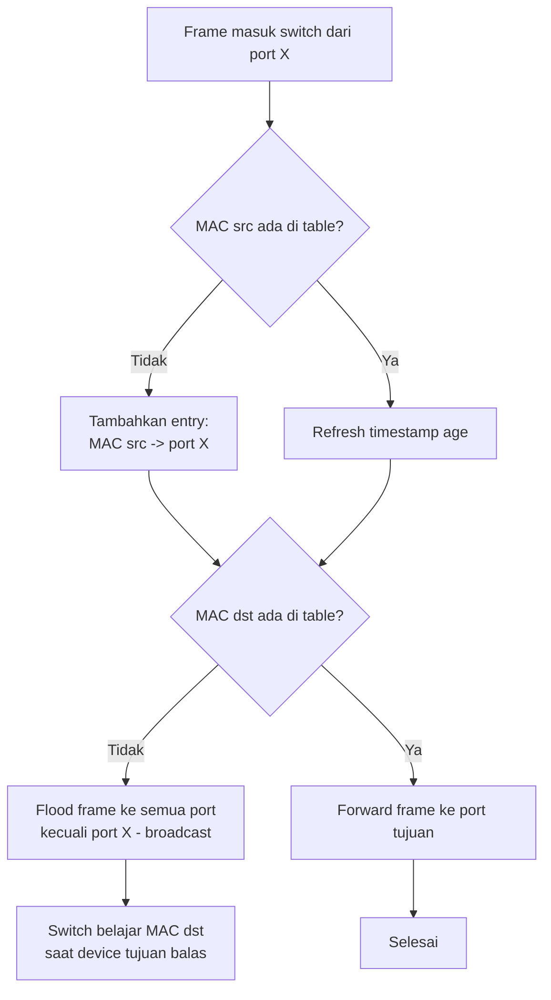
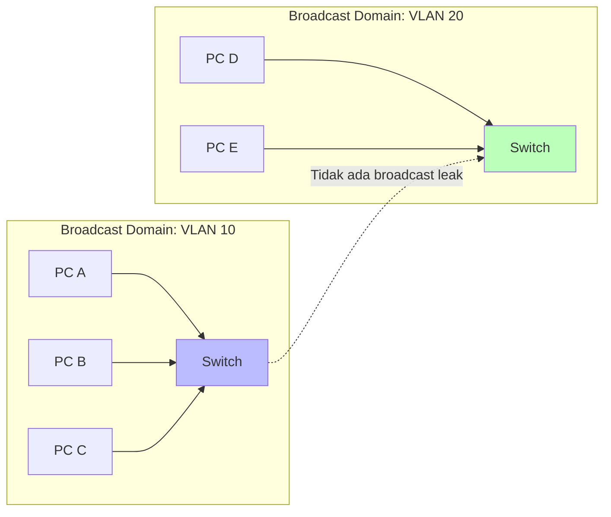
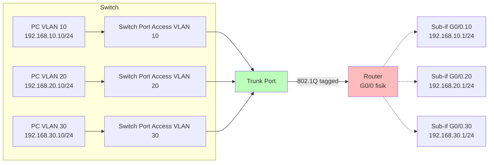
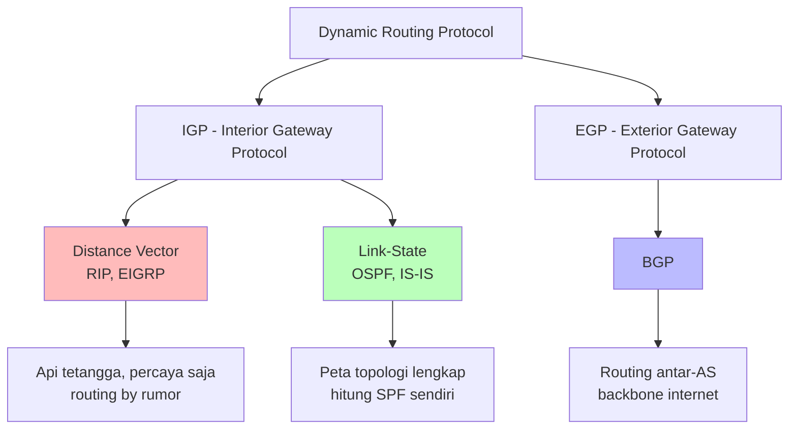
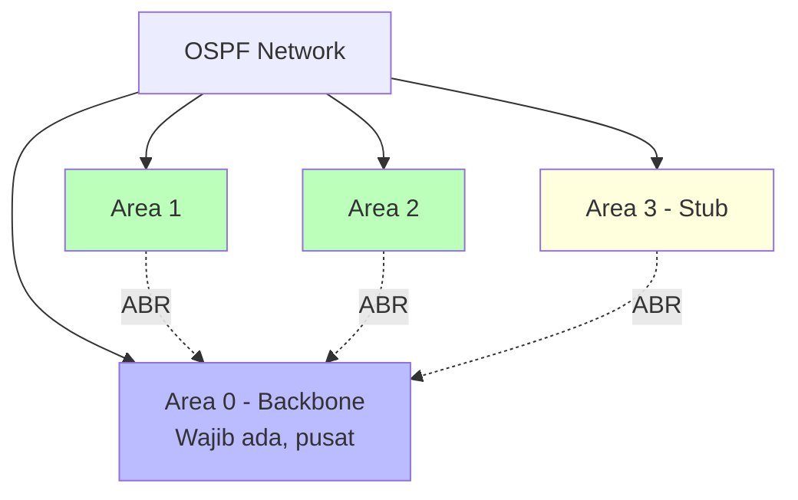
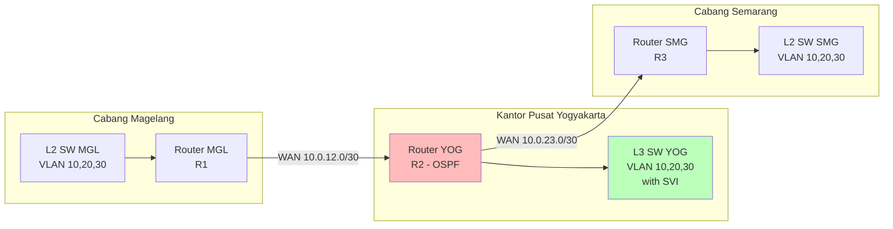

# 🌐 Bab 3: Switching & Routing

## VLAN, Trunking, Static Route, dan OSPF

| | |
|:---|:---|
| **Bab** | 3 - Switching & Routing |
| **Sub-CPMK** | 3.1, 3.2 & 3.3 |
| **CPMK** | CPMK-3 |
| **Pertemuan** | 3 x 150 menit |

---

## 🎯 Tujuan Pembelajaran Bab Ini

Setelah mempelajari Bab 3 ini, mahasiswa diharapkan mampu:

1. **Menjelaskan** cara kerja switch Ethernet: MAC learning, MAC address table, frame forwarding (Sub-CPMK 3.1).
2. **Mengonfigurasi** VLAN (Virtual LAN) pada switch Cisco dengan 802.1Q tagging, hingga host antar-VLAN terisolasi sesuai kebijakan.
3. **Mengonfigurasi** trunk antar switch dan inter-VLAN routing (router-on-a-stick dan Layer 3 switch), hingga host antar-VLAN dapat berkomunikasi (Sub-CPMK 3.1).
4. **Mengonfigurasi** static route dan default route pada multi-router di Cisco Packet Tracer, hingga tabel routing terbentuk dan ping antar jaringan berhasil (Sub-CPMK 3.2).
5. **Menerapkan** dynamic routing OSPF single-area pada jaringan skala menengah, hingga konvergen tanpa routing loop (Sub-CPMK 3.3).
6. **Memilih** jenis routing yang tepat (static vs dynamic) berdasarkan skenario jaringan.
7. **Menyadari** dimensi spiritual dari routing dan switching sebagai bentuk kolaborasi antar-bagian dan hikmah jalur hidup dalam perspektif Islam.

> 📌 **Pemetaan Sub-CPMK:** Bab ini menjawab tiga Sub-CPMK yang menopang **CPMK-3** (Mengonfigurasi routing dan switching pada perangkat jaringan):
> - **Sub-CPMK 3.1** = Switch, VLAN, trunking, inter-VLAN routing - sub-bab 3.1-3.4
> - **Sub-CPMK 3.2** = Static & default routing - sub-bab 3.5-3.6
> - **Sub-CPMK 3.3** = OSPF single-area - sub-bab 3.7-3.8

---

# Bagian A: Switching dan VLAN (Sub-CPMK 3.1)

## 3.1 Cara Kerja Switch Ethernet

### 3.1.1 Switch vs Hub

Sebelum mendalami VLAN, kita perlu paham cara kerja switch. **Switch** adalah perangkat Layer 2 yang meneruskan frame berdasarkan MAC address tujuan. Switch berbeda dari **hub** (yang sudah obsolete):

| Aspek | Hub (Layer 1, obsolete) | Switch (Layer 2) |
|:---|:---|:---|
| Cara kerja | Broadcast frame ke semua port | Unicast ke port tujuan (jika MAC dikenal) |
| Collision domain | Satu untuk semua port | Per port (micro-segmentation) |
| Bandwidth | Shared (100 Mbps dibagi semua) | Dedicated (100 Mbps per port) |
| MAC learning | Tidak | Ya |
| Half/Full duplex | Half-duplex saja | Full-duplex |

Switch modern juga mendukung **auto-negotiation** (deteksi kecepatan dan duplex), **auto-MDIX** (auto-crossover kabel), dan **PoE** (Power over Ethernet untuk AP, IP phone).

### 3.1.2 MAC Learning dan MAC Address Table

Switch belajar MAC address secara otomatis. Berikut alurnya:



**Contoh MAC table:**

```
SW1# show mac address-table
          Mac Address Table
-------------------------------------------
Vlan    Mac Address       Type        Ports
----    -----------       --------    -----
   1    0001.4286.7e3a    DYNAMIC     Fa0/1
   1    0090.2b3c.4d5e    DYNAMIC     Fa0/2
   1    00d0.d3a8.9c10    DYNAMIC     Fa0/3
```

Artinya: switch tahu bahwa MAC `0001.4286.7e3a` ada di port `Fa0/1`. Saat ada frame untuk MAC ini, switch forward ke `Fa0/1` saja, tidak flood.

**Aging time:** MAC entry dihapus setelah tidak aktif (default 5 menit di Cisco). Mencegah table penuh dengan entry stale.

### 3.1.3 Frame Forwarding Methods

Switch meneruskan frame dengan salah satu dari tiga metode:

| Metode | Cara Kerja | Latensi | Error Check |
|:---|:---|:---|:---|
| **Store-and-forward** | Switch terima frame lengkap, cek FCS, baru forward | Tinggi | Ya (CRC) |
| **Cut-through** | Switch forward segera setelah baca destination MAC | Rendah | Tidak |
| **Fragment-free** | Cut-through tapi simpan 64 byte pertama (collision detection) | Sedang | Sebagian |

Switch Cisco modern umumnya pakai **store-and-forward** karena sudah cepat (silicon switching) dan memberikan error check paling baik.

### 3.1.4 Collision Domain dan Broadcast Domain

Dua konsep penting yang membedakan perangkat:

- **Collision domain**: kelompok perangkat yang berbagi media dan bisa terjadi tabrakan (collision) saat kirim bersamaan. Setiap port switch = 1 collision domain.
- **Broadcast domain**: kelompok perangkat yang menerima broadcast yang sama. Satu VLAN = satu broadcast domain. Router memecah broadcast domain.



Insight: **VLAN memecah broadcast domain di Layer 2**. Tanpa VLAN, satu switch = satu broadcast domain besar. Dengan VLAN, satu switch bisa berisi multiple broadcast domain terpisah.

---

## 3.2 VLAN (Virtual LAN)

### 3.2.1 Mengapa Butuh VLAN?

Tanpa VLAN, semua port switch berada di satu network (default VLAN 1). Ini menimbulkan masalah:

1. **Broadcast storm**: setiap ARP, DHCP discover, NetBIOS broadcast diterima semua host. Di jaringan 1000 host, broadcast bisa membanjiri bandwidth.
2. **Keamanan**: HR bisa "sniff" trafik Keuangan dengan tool seperti Wireshark (kalau di same switch).
3. **Manajemen rumit**: jika ingin pindah PC ke departemen lain, harus pindah kabel fisik ke switch lain.
4. **Skalabilitas**: untuk tambah departemen baru, harus beli switch baru.

**VLAN** memecahkan ini dengan membagi satu switch fisik jadi multiple logical switch. Setiap VLAN = broadcast domain terpisah, seolah-olah switch berbeda.

### 3.2.2 Manfaat VLAN

| Manfaat | Penjelasan |
|:---|:---|
| **Broadcast control** | Broadcast dibatasi di satu VLAN, tidak membanjiri VLAN lain |
| **Keamanan** | Host di VLAN berbeda tidak bisa "lihat" trafik satu sama lain tanpa router |
| **Fleksibilitas** | Pindah departemen = ubah VLAN port, tidak perlu pindah kabel |
| **Cost-effective** | Satu switch fisik melayani multiple departemen |
| **Performance** | Broadcast domain lebih kecil = bandwidth lebih efisien |

### 3.2.3 Jenis VLAN

| Jenis VLAN | Range | Penggunaan |
|:---|:---|:---|
| **Default VLAN** | VLAN 1 | Semua port default-nya di sini (security risk, sebaiknya tidak dipakai untuk data) |
| **Data VLAN** | 2-1000 | Untuk trafik user normal (mis. VLAN 10 Produksi, VLAN 20 Marketing) |
| **Voice VLAN** | Bebas | Khusus untuk IP Phone (butuh QoS) |
| **Management VLAN** | Bebas | Untuk akses management switch (SSH, SNMP) |
| **Native VLAN** | Bebas (default 1) | VLAN yang tidak di-tag di trunk (PITFALL keamanan!) |
| **Blackhole VLAN** | Bebas (tidak dipakai) | VLAN dummy untuk port unused (security) |

**Best practice:**
- Jangan pakai VLAN 1 untuk apapun. Buat VLAN khusus data, voice, management.
- Pindahkan port unused ke VLAN "blackhole" yang tidak punya SVI atau host.
- Native VLAN sebaiknya beda dari VLAN 1 dan tidak dipakai user.

### 3.2.4 Konfigurasi VLAN di Cisco IOS

**Skenario:** Buat 3 VLAN di switch TokoKita:
- VLAN 10: Produksi
- VLAN 20: Marketing
- VLAN 30: HRD
- VLAN 99: Management
- VLAN 999: Blackhole (unused)

**Langkah 1: Buat VLAN di switch**

```
SW1> enable
SW1# configure terminal

! Buat VLAN dengan nama
SW1(config)# vlan 10
SW1(config-vlan)# name Produksi
SW1(config-vlan)# exit

SW1(config)# vlan 20
SW1(config-vlan)# name Marketing
SW1(config-vlan)# exit

SW1(config)# vlan 30
SW1(config-vlan)# name HRD
SW1(config-vlan)# exit

SW1(config)# vlan 99
SW1(config-vlan)# name Management
SW1(config-vlan)# exit

SW1(config)# vlan 999
SW1(config-vlan)# name Blackhole
SW1(config-vlan)# exit
```

**Langkah 2: Assign port ke VLAN**

```
! Port Fa0/1 - Fa0/10 untuk Produksi
SW1(config)# interface range FastEthernet0/1 - 10
SW1(config-if-range)# switchport mode access
SW1(config-if-range)# switchport access vlan 10
SW1(config-if-range)# exit

! Port Fa0/11 - Fa0/20 untuk Marketing
SW1(config)# interface range FastEthernet0/11 - 20
SW1(config-if-range)# switchport mode access
SW1(config-if-range)# switchport access vlan 20
SW1(config-if-range)# exit

! Port Fa0/21 - Fa0/24 untuk HRD
SW1(config)# interface range FastEthernet0/21 - 24
SW1(config-if-range)# switchport mode access
SW1(config-if-range)# switchport access vlan 30
SW1(config-if-range)# exit

! Port unused dipindah ke Blackhole
SW1(config)# interface range GigabitEthernet0/1 - 2
SW1(config-if-range)# switchport mode access
SW1(config-if-range)# switchport access vlan 999
SW1(config-if-range)# shutdown
SW1(config-if-range)# exit
```

**Langkah 3: Konfigurasi SVI (Switch Virtual Interface) untuk management**

```
SW1(config)# vlan 99
SW1(config-vlan)# name Management
SW1(config-vlan)# exit

SW1(config)# interface Vlan99
SW1(config-if)# ip address 192.168.99.2 255.255.255.0
SW1(config-if)# no shutdown
SW1(config-if)# exit

SW1(config)# ip default-gateway 192.168.99.1
```

**Langkah 4: Verifikasi**

```
SW1# show vlan brief

VLAN Name                             Status    Ports
---- -------------------------------- --------- -------------------------------
1    default                          active    
10   Produksi                         active    Fa0/1, Fa0/2, Fa0/3, Fa0/4
                                                Fa0/5, Fa0/6, Fa0/7, Fa0/8
                                                Fa0/9, Fa0/10
20   Marketing                        active    Fa0/11, Fa0/12, Fa0/13, Fa0/14
                                                Fa0/15, Fa0/16, Fa0/17, Fa0/18
                                                Fa0/19, Fa0/20
30   HRD                              active    Fa0/21, Fa0/22, Fa0/23, Fa0/24
99   Management                       active    
999  Blackhole                        active    Gi0/1, Gi0/2

SW1# show vlan name Produksi
```

Setelah konfigurasi ini:
- PC di port Fa0/1-10 (VLAN 10) bisa ping satu sama lain.
- PC di VLAN 10 **TIDAK** bisa ping PC di VLAN 20 (perlu router untuk inter-VLAN routing, sub-bab 3.4).
- Broadcast (mis. ARP request) di VLAN 10 tidak bocor ke VLAN 20.

---

## 3.3 Trunking 802.1Q

### 3.3.1 Mengapa Butuh Trunk?

Saat ada multiple switch dan multiple VLAN, bagaimana menghubungkan switch-switch tersebut untuk semua VLAN? Dua opsi:

**Opsi 1: Satu kabel per VLAN (tidak scalable)**
- 10 VLAN = 10 kabel antar switch. Boros port.

**Opsi 2: Satu kabel multiplex untuk semua VLAN (TRUNK)**
- 10 VLAN bisa lewat 1 kabel. Hemat port.
- Frame ditandai (tag) dengan VLAN ID agar switch tujuan tahu VLAN asal.

**Trunk** adalah link yang membawa trafik multiple VLAN. Standar tagging yang dipakai: **IEEE 802.1Q** (Cisco punya proprietary ISL, sudah obsolete).

### 3.3.2 Cara Kerja 802.1Q Tagging

Saat frame masuk switch dari access port (VLAN 10), switch menambahkan **802.1Q tag** (4 byte) di header Ethernet saat forward ke trunk:

```
Tanpa tag (access port):
| Dst MAC | Src MAC | EtherType | Payload | FCS |

Dengan tag 802.1Q (trunk port):
| Dst MAC | Src MAC | TPID (0x8100) | TCI (VLAN ID) | EtherType | Payload | FCS |
```

Field TCI (Tag Control Information) berisi:
- **VLAN ID** (12 bit): nomor VLAN 1-4094.
- **Priority** (3 bit): QoS 802.1p.
- **DEI** (1 bit): Drop Eligible Indicator.

Switch tujuan menerima frame tagged, baca VLAN ID, strip tag, forward ke access port VLAN yang sesuai.

### 3.3.3 Native VLAN

**Native VLAN** adalah VLAN yang frame-nya **tidak di-tag** saat lewat trunk. Default: VLAN 1, tetapi **best practice ganti ke VLAN tidak terpakai** (mis. VLAN 999).

Kenapa ada native VLAN? Untuk kompatibilitas dengan device lawas yang tidak paham 802.1Q (mis. hub lama).

**Pitfall keamanan:** jika penyerang connect ke port trunk native VLAN, ia bisa kirim frame untagged yang akan diterima switch sebagai bagian native VLAN. Bisa dipakai untuk VLAN hopping attack. Solusi: native VLAN = VLAN dummy yang tidak ada host-nya.

### 3.3.4 Konfigurasi Trunk di Cisco IOS

**Skenario:** Hubungkan SW1 dan SW2 dengan trunk untuk VLAN 10, 20, 30, 99.

```
! Di SW1, port GigabitEthernet0/1 sebagai trunk
SW1(config)# interface GigabitEthernet0/1
SW1(config-if)# switchport mode trunk
SW1(config-if)# switchport trunk allowed vlan 10,20,30,99
SW1(config-if)# switchport trunk native vlan 999
SW1(config-if)# exit

! Di SW2, port GigabitEthernet0/1 sebagai trunk (sama)
SW2(config)# interface GigabitEthernet0/1
SW2(config-if)# switchport mode trunk
SW2(config-if)# switchport trunk allowed vlan 10,20,30,99
SW2(config-if)# switchport trunk native vlan 999
SW2(config-if)# exit
```

**Verifikasi trunk:**

```
SW1# show interfaces trunk

Port        Mode         Encapsulation  Status        Native vlan
Gi0/1       on           802.1q         trunking      999

Port        Vlan allowed on trunk
Gi0/1       10,20,30,99

Port        Vlan allowed and active in management domain
Gi0/1       10,20,30,99

Port        Vlan in spanning tree forwarding state and not pruned
Gi0/1       10,20,30,99
```

### 3.3.5 Dynamic Trunking Protocol (DTP)

Cisco punya protokol **DTP** untuk auto-negotiate trunk antar switch. Mode DTP:

| Mode | Behavior |
|:---|:---|
| `switchport mode access` | Paksa jadi access, tidak negotiate trunk |
| `switchport mode trunk` | Paksa jadi trunk, kirim DTP |
| `switchport mode dynamic desirable` | Aktif negotiate jadi trunk |
| `switchport mode dynamic auto` | Pasif, jadi trunk kalau lawan desirable |
| `switchport nonegotiate` | Disable DTP (recommended untuk security) |

**Best practice security:** Jangan pakai DTP di port yang menghadap user. Set `switchport mode access` + `switchport nonegotiate` di access port untuk mencegah user men-taruh switch rogue dan jadi trunk.

### 3.3.6 VLAN Pruning

VTP (VLAN Trunking Protocol) Pruning membatasi VLAN mana yang diforward ke trunk tertentu. Mis. SW2 tidak punya port VLAN 30, maka trunk SW1-SW2 tidak perlu forward VLAN 30, hemat bandwidth.

Konfigurasi manual: `switchport trunk allowed vlan 10,20,30,99` (hanya VLAN listed yang diforward).

---

## 3.4 Inter-VLAN Routing

### 3.4.1 Mengapa Butuh Inter-VLAN Routing?

VLAN mengisolasi broadcast domain. Host di VLAN 10 tidak bisa langsung ping host di VLAN 20, karena mereka di network berbeda. Untuk komunikasi antar-VLAN, dibutuhkan **router** (atau Layer 3 switch) yang meneruskan packet antar network.

Dua metode inter-VLAN routing:
1. **Router-on-a-stick**: 1 router, 1 interface fisik, multiple sub-interface dengan 802.1Q encapsulation.
2. **Layer 3 switch (SVI)**: switch dengan kemampuan routing, pakai Switch Virtual Interface (SVI) per VLAN.

### 3.4.2 Router-on-a-Stick



**Konfigurasi Router (Cisco 2911):**

```
Router> enable
Router# configure terminal

! Interface fisik: hidupkan saja, tidak perlu IP
Router(config)# interface GigabitEthernet0/0
Router(config-if)# no shutdown
Router(config-if)# exit

! Sub-interface VLAN 10
Router(config)# interface GigabitEthernet0/0.10
Router(config-subif)# encapsulation dot1Q 10
Router(config-subif)# ip address 192.168.10.1 255.255.255.0
Router(config-subif)# exit

! Sub-interface VLAN 20
Router(config)# interface GigabitEthernet0/0.20
Router(config-subif)# encapsulation dot1Q 20
Router(config-subif)# ip address 192.168.20.1 255.255.255.0
Router(config-subif)# exit

! Sub-interface VLAN 30
Router(config)# interface GigabitEthernet0/0.30
Router(config-subif)# encapsulation dot1Q 30
Router(config-subif)# ip address 192.168.30.1 255.255.255.0
Router(config-subif)# exit

Router(config)# exit
Router# write memory
```

**Konfigurasi Switch (port yang menghadap router jadi trunk):**

```
SW1(config)# interface GigabitEthernet0/1
SW1(config-if)# switchport mode trunk
SW1(config-if)# switchport trunk allowed vlan 10,20,30
SW1(config-if)# switchport trunk native vlan 999
SW1(config-if)# exit
```

**Default gateway di PC:**
- PC VLAN 10: gateway `192.168.10.1`
- PC VLAN 20: gateway `192.168.20.1`
- PC VLAN 30: gateway `192.168.30.1`

**Verifikasi:**
- PC di VLAN 10 ping PC di VLAN 20 -> harus berhasil (router meneruskan)
- `show ip route` di router -> ada 3 network connected (192.168.10.0/24, 20.0/24, 30.0/24)

**Kelebihan router-on-a-stick:**
- Murah: butuh 1 router + 1 switch L2.
- Cocok untuk jaringan kecil-menengah.

**Kekurangan:**
- Router jadi single point of failure.
- Bandwidth terbatas (1 interface fisik untuk semua VLAN).
- Untuk skala besar, pakai Layer 3 switch.

### 3.4.3 Layer 3 Switch (SVI)

**Layer 3 switch** adalah switch yang punya kemampuan routing hardware (CEF - Cisco Express Forwarding). Performanya jauh lebih tinggi dari router-on-a-stick karena routing dilakukan di ASIC, bukan software.

**Konfigurasi Layer 3 Switch (mis. Cisco 3560, 3650):**

```
L3-SW> enable
L3-SW# configure terminal

! Aktifkan routing di L3 switch
L3-SW(config)# ip routing

! Buat VLAN
L3-SW(config)# vlan 10
L3-SW(config-vlan)# name Produksi
L3-SW(config-vlan)# exit
L3-SW(config)# vlan 20
L3-SW(config-vlan)# name Marketing
L3-SW(config-vlan)# exit
L3-SW(config)# vlan 30
L3-SW(config-vlan)# name HRD
L3-SW(config-vlan)# exit

! Buat SVI per VLAN
L3-SW(config)# interface Vlan10
L3-SW(config-if)# ip address 192.168.10.1 255.255.255.0
L3-SW(config-if)# no shutdown
L3-SW(config-if)# exit

L3-SW(config)# interface Vlan20
L3-SW(config-if)# ip address 192.168.20.1 255.255.255.0
L3-SW(config-if)# no shutdown
L3-SW(config-if)# exit

L3-SW(config)# interface Vlan30
L3-SW(config-if)# ip address 192.168.30.1 255.255.255.0
L3-SW(config-if)# no shutdown
L3-SW(config-if)# exit

! Assign port access ke VLAN
L3-SW(config)# interface range FastEthernet0/1 - 10
L3-SW(config-if-range)# switchport mode access
L3-SW(config-if-range)# switchport access vlan 10
L3-SW(config-if-range)# exit
! (lanjut untuk VLAN 20, 30)

L3-SW(config)# exit
L3-SW# write memory
```

**Verifikasi routing:**

```
L3-SW# show ip route
Codes: C - connected, L - local, ...

C    192.168.10.0/24 is directly connected, Vlan10
L    192.168.10.1/32 is directly connected, Vlan10
C    192.168.20.0/24 is directly connected, Vlan20
L    192.168.20.1/32 is directly connected, Vlan20
C    192.168.30.0/24 is directly connected, Vlan30
L    192.168.30.1/32 is directly connected, Vlan30

L3-SW# show ip interface brief
Interface              IP-Address      OK? Method Status
Vlan10                 192.168.10.1    YES manual up
Vlan20                 192.168.20.1    YES manual up
Vlan30                 192.168.30.1    YES manual up
```

PC ping antar-VLAN -> berhasil. Inter-VLAN routing di L3 switch lebih cepat karena hardware-based.

### 3.4.4 Lab Praktik: VLAN + Inter-VLAN Routing

**Lab:** Implementasikan skenario TokoKita (3 departemen dengan VLAN + inter-VLAN routing).

**Komponen:**
- 1 Switch L2 (Cisco 2960)
- 1 Router (Cisco 2911) - untuk router-on-a-stick
- 3 PC (1 per VLAN)
- Kabel straight-through + 1 kabel cross-over (router-switch)

**Tabel Addressing (sesuai Bab 2 VLSM):**

| VLAN | Network | Gateway | Contoh Host |
|:---:|:---|:---|:---|
| 10 (Produksi) | 192.168.1.0/26 | 192.168.1.1 | 192.168.1.10 |
| 20 (Marketing) | 192.168.1.64/27 | 192.168.1.65 | 192.168.1.70 |
| 30 (HRD) | 192.168.1.96/28 | 192.168.1.97 | 192.168.1.100 |

**Langkah:**

1. Buat VLAN 10, 20, 30 di switch dengan name.
2. Assign port Fa0/1 ke VLAN 10, Fa0/2 ke VLAN 20, Fa0/3 ke VLAN 30.
3. Konfigurasi port Gi0/1 sebagai trunk ke router.
4. Konfigurasi router-on-a-stick dengan 3 sub-interface.
5. Set IP PC sesuai tabel, gateway = IP sub-interface.
6. Verifikasi: ping dari PC VLAN 10 ke PC VLAN 20 (harus berhasil).

**Submit:** file `.pkt` + screenshot `show vlan brief`, `show interfaces trunk`, `show ip route`, hasil ping antar-VLAN.

---
# Bagian B: Routing (Sub-CPMK 3.2 & 3.3)

## 3.5 Konsep Routing

### 3.5.1 Apa itu Routing?

**Routing** adalah proses memilih jalur terbaik untuk meneruskan packet dari network sumber ke network tujuan. Routing dilakukan oleh **router** (perangkat Layer 3) berdasarkan **tabel routing** (routing table).

Tabel routing berisi:

| Field | Penjelasan |
|:---|:---|
| **Destination network** | Network tujuan (mis. 192.168.10.0/24) |
| **Next hop / exit interface** | Kemana packet dikirim (IP router berikut, atau interface lokal) |
| **Metric** | "Biaya" jalur (lower = better). Bisa hop count, bandwidth, delay, dll |
| **Administrative distance** | Prioritas sumber route (lower = more trusted) |
| **Source** | Bagaimana route dipelajari: connected, static, OSPF, RIP, BGP, EIGRP |

### 3.5.2 Administrative Distance (AD)

Cisco memakai **Administrative Distance** untuk memilih route jika ada multiple source untuk same destination. Lower AD = more trusted.

| Source Route | Default AD |
|:---|---:|
| Connected interface | 0 |
| Static route (via exit interface) | 1 |
| Static route (via next hop) | 1 |
| EIGRP (internal) | 90 |
| OSPF | 110 |
| IS-IS | 115 |
| RIP | 120 |
| EIGRP (external) | 170 |
| BGP (external) | 20 |
| BGP (internal) | 200 |
| Unknown | 255 (tidak dipercaya) |

**Insight:** Static route (AD 1) lebih dipercaya dari OSPF (AD 110). Jika ada static dan OSPF untuk same network, router pakai static. Tapi ini tidak selalu diinginkan. Bisa override dengan mengubah AD saat konfigurasi static.

### 3.5.3 Routing Loop Prevention

Tanpa mekanisme pencegah, routing loop bisa terjadi (packet berputar-putar tanpa sampai tujuan). Mekanisme pencegah:

- **TTL (Time To Live)** di IP header: di-decrement setiap hop, jika 0 packet dibuang.
- **Split horizon**: router tidak advertise route kembali ke interface dari mana route dipelajari (RIP, EIGRP).
- **Route poisoning**: advertise network unreachable dengan metric infinity (RIP: 16 hops).
- **Holddown timer**: setelah route dianggap down, jangan terima update baru untuk route tersebut selama X detik.
- **Triggered update**: kirim update segera saat ada perubahan, tidak tunggu interval reguler.

---

## 3.6 Static Routing (Sub-CPMK 3.2)

### 3.6.1 Karakteristik Static Route

**Static route** adalah route yang dikonfigurasi manual oleh administrator. Tidak ada overhead protocol, tidak ada bandwidth untuk update, aman (tidak advertise network ke tetangga).

**Kelebihan:**
- Bandwidth hemat (no protocol overhead).
- Secure (router tidak advertise network ke tetangga).
- Predictable (jalur selalu sama, tidak ada convergence).
- Cocok untuk jaringan kecil dengan topologi stabil.

**Kekurangan:**
- Tidak scalable untuk jaringan besar (administrative burden).
- Tidak otomatis adaptif (jika link putus, static route tidak redirect, perlu intervensi manual).
- Rentan konfigurasi error.

### 3.6.2 Jenis Static Route

| Jenis | Sintaks Cisco IOS | Use Case |
|:---|:---|:---|
| **Standard static** | `ip route <network> <mask> <next-hop>` | Route ke network spesifik via next hop |
| **Directly connected static** | `ip route <network> <mask> <exit-interface>` | Route via interface lokal (multi-access) |
| **Fully specified static** | `ip route <network> <mask> <exit-interface> <next-hop>` | Saat next hop ambiguous (mis. multi-access) |
| **Default route** | `ip route 0.0.0.0 0.0.0.0 <next-hop>` | Route terakhir jika tidak ada match lain |
| **Floating static** | `ip route <network> <mask> <next-hop> <AD>` | Backup route (AD > dynamic protocol) |

### 3.6.3 Konfigurasi Static Route

**Skenario:** 3 router (R1, R2, R3) terhubung serial.

```
[Lan1: 192.168.1.0/24] -- R1 --- R2 --- R3 -- [Lan3: 192.168.3.0/24]
                          |             |
                          |             |
                       [serial]     [serial]
                       10.0.12.0/30 10.0.23.0/30
```

| Router | Interface | IP |
|:---|:---|:---|
| R1 | Gi0/0 (Lan1) | 192.168.1.1/24 |
| R1 | S0/0/0 (to R2) | 10.0.12.1/30 |
| R2 | S0/0/0 (to R1) | 10.0.12.2/30 |
| R2 | S0/0/1 (to R3) | 10.0.23.2/30 |
| R3 | S0/0/1 (to R2) | 10.0.23.3/30 |
| R3 | Gi0/0 (Lan3) | 192.168.3.3/24 |

**Konfigurasi R1:**

```
R1(config)# interface GigabitEthernet0/0
R1(config-if)# ip address 192.168.1.1 255.255.255.0
R1(config-if)# no shutdown
R1(config-if)# exit

R1(config)# interface Serial0/0/0
R1(config-if)# ip address 10.0.12.1 255.255.255.252
R1(config-if)# no shutdown
R1(config-if)# exit

! Static route ke Lan3 via R2
R1(config)# ip route 192.168.3.0 255.255.255.0 10.0.12.2

! Static route ke serial R2-R3
R1(config)# ip route 10.0.23.0 255.255.255.252 10.0.12.2

! Default route (jika R1 adalah gateway internet)
R1(config)# ip route 0.0.0.0 0.0.0.0 10.0.12.2

R1(config)# exit
R1# write memory
```

**Konfigurasi R2 (transit):**

```
R2(config)# interface Serial0/0/0
R2(config-if)# ip address 10.0.12.2 255.255.255.252
R2(config-if)# no shutdown
R2(config-if)# exit

R2(config)# interface Serial0/0/1
R2(config-if)# ip address 10.0.23.2 255.255.255.252
R2(config-if)# no shutdown
R2(config-if)# exit

! Static route ke Lan1
R2(config)# ip route 192.168.1.0 255.255.255.0 10.0.12.1

! Static route ke Lan3
R2(config)# ip route 192.168.3.0 255.255.255.0 10.0.23.3

R2(config)# exit
```

**Konfigurasi R3:**

```
R3(config)# interface GigabitEthernet0/0
R3(config-if)# ip address 192.168.3.3 255.255.255.0
R3(config-if)# no shutdown
R3(config-if)# exit

R3(config)# interface Serial0/0/1
R3(config-if)# ip address 10.0.23.3 255.255.255.252
R3(config-if)# no shutdown
R3(config-if)# exit

! Static route ke Lan1 via R2
R3(config)# ip route 192.168.1.0 255.255.255.0 10.0.23.2

! Static route ke serial R1-R2
R3(config)# ip route 10.0.12.0 255.255.255.252 10.0.23.2

! Default route (jika R3 adalah gateway internet)
R3(config)# ip route 0.0.0.0 0.0.0.0 10.0.23.2

R3(config)# exit
```

### 3.6.4 Verifikasi Static Route

```
R1# show ip route
Codes: L - local, C - connected, S - static, ...

Gateway of last resort is 10.0.12.2 to network 0.0.0.0

     10.0.0.0/8 is variably subnetted, 4 subnets, 2 masks
C       10.0.12.0/30 is directly connected, Serial0/0/0
L       10.0.12.1/32 is directly connected, Serial0/0/0
S       10.0.23.0/30 [1/0] via 10.0.12.2
     192.168.1.0/24 is variably subnetted, 2 subnets, 2 masks
C       192.168.1.0/24 is directly connected, GigabitEthernet0/0
L       192.168.1.1/32 is directly connected, GigabitEthernet0/0
S    192.168.3.0/24 [1/0] via 10.0.12.2
S*   0.0.0.0/0 [1/0] via 10.0.12.2
```

Keterangan:
- `C` = connected, langsung terhubung.
- `L` = local, IP interface router sendiri.
- `S` = static, manual dikonfigurasi.
- `S*` = static default route (candidate default).
- `[1/0]` = [AD/metric].

**Test ping:**

```
R1# ping 192.168.3.3

Type escape sequence to abort.
Sending 5, 100-byte ICMP Echos to 192.168.3.3, timeout is 2 seconds:
!!!!!
Success rate is 100 percent (5/5), round-trip min/avg/max = 12/15/18 ms
```

```
R1# traceroute 192.168.3.3

Type escape sequence to abort.
Tracing the route to 192.168.3.3

  1 10.0.12.2 8 msec 8 msec 8 msec
  2 10.0.23.3 16 msec 16 msec *
```

### 3.6.5 Default Route

**Default route** (`0.0.0.0 0.0.0.0`) adalah route yang match untuk semua network yang tidak ada di tabel routing. Cocok untuk router edge yang terhubung ke internet (tidak perlu tahu semua network internet, kirim ke ISP saja).

```
R1(config)# ip route 0.0.0.0 0.0.0.0 10.0.12.2
```

Tampil di tabel routing sebagai `S* 0.0.0.0/0 [1/0] via 10.0.12.2` dan menjadi "Gateway of last resort".

### 3.6.6 Floating Static Route (Backup)

**Floating static route** adalah static route dengan AD tinggi (> AD dynamic protocol) sehingga hanya aktif saat dynamic protocol down. Cocok untuk backup link.

```
! Primary: OSPF (AD 110)
! Backup: static via secondary link (AD 200)
R1(config)# ip route 192.168.3.0 255.255.255.0 10.0.99.2 200
```

Saat OSPF sehat, route via 10.0.99.2 tidak muncul (AD 200 > OSPF 110). Saat OSPF down, static route muncul sebagai backup.

---

## 3.7 OSPF (Open Shortest Path First)

### 3.7.1 Mengapa Dynamic Routing?

Static routing tidak scalable untuk jaringan besar. Bayangkan enterprise dengan 100 router: administrator harus konfigurasi static route di setiap router untuk setiap network. Jika satu network baru, update 100 router. If one link down, manual redirect.

**Dynamic routing protocol** mengotomatisasi ini:
- Router advertise network yang mereka tahu ke tetangga.
- Router terima advertisement, update tabel routing otomatis.
- Jika link down, router detect dan reroute otomatis.

### 3.7.2 Klasifikasi Dynamic Routing Protocol



| Kategori | Protokol | Prinsip |
|:---|:---|:---|
| **Distance Vector** | RIP, IGRP | Router berbagi tabel routing ke tetangga langsung. Konvergen lambat, rentan loop. |
| **Link-State** | OSPF, IS-IS | Router berbagi info link state ke seluruh area. Punya peta lengkap, hitung jalur terbaik sendiri. Konvergen cepat. |
| **Path Vector** | BGP | Routing antar Autonomous System (AS). Backbone internet. |
| **Hybrid** | EIGRP | Cisco proprietary. Distance vector canggih dengan fitur link-state. |

### 3.7.3 Konsep OSPF

**OSPF (Open Shortest Path First)** adalah link-state routing protocol standar IETF (RFC 2328 untuk OSPFv2). OSPF adalah IGP paling populer di enterprise karena:

- **Open standard**: tidak proprietary, jalan di semua vendor (Cisco, Juniper, Mikrotik, dll).
- **Convergen cepat**: detik, bukan menit.
- **Support VLSM dan CIDR**.
- **Hierarki area**: scalable untuk jaringan besar.
- **Mendukung authentication** (MD5, SHA) antar OSPF neighbor.

**Cara kerja OSPF:**

1. **Hello protocol**: router kirim OSPF Hello multicast (224.0.0.5) ke tetangga untuk discover neighbor.
2. **Neighbor adjacency**: setelah Hello exchange, router jadi adjacent jika parameter cocok (area ID, hello/dead interval, authentication).
3. **LSA exchange**: router berbagi Link State Advertisement (LSA) berisi info link dan cost.
4. **SPF calculation**: setiap router jalankan algoritma Dijkstra untuk hitung jalur terbaik ke semua network.
5. **Converged**: tabel routing stabil.

### 3.7.4 OSPF Area

OSPF menggunakan **area** untuk skalabilitas. Setiap router di area yang sama punya Link State Database (LSDB) identik.



- **Area 0 (backbone)**: wajib ada, pusat. Semua area lain connect ke Area 0.
- **ABR (Area Border Router)**: router yang berada di 2+ area, salah satunya Area 0.
- **ASBR (Autonomous System Boundary Router)**: router yang inject route dari protocol lain (mis. BGP, static) ke OSPF.
- **Stub area**: area yang tidak terima external route, pakai default route. Kurangi LSA.

Sub-CPMK 3.3 hanya mensyaratkan **OSPF single-area** (semua router di Area 0). Multi-area OSPF untuk skala lebih besar (di luar scope mata kuliah ini).

### 3.7.5 OSPF Cost

OSPF memilih jalur berdasarkan **cost** (lower = better). Cost dihitung dari bandwidth:

```
Cost = Reference Bandwidth / Interface Bandwidth
```

Default reference bandwidth Cisco: 100 Mbps. Jadi:
- 100 Mbps interface: cost = 1
- 10 Mbps interface: cost = 10
- 1 Gbps interface: cost = 1 (cap at 1, masalah!)
- 10 Gbps: cost = 1 (sama dengan 1 Gbps, tidak akurat)

**Best practice:** set reference bandwidth ke 100000 Mbps (100 Gbps) agar akurat:

```
R1(config)# router ospf 1
R1(config-router)# auto-cost reference-bandwidth 100000
```

Total cost = sum cost semua interface di sepanjang jalur. Mis. R1-R2 (cost 1) + R2-R3 (cost 1) = total cost 2.

### 3.7.6 Konfigurasi OSPF Single-Area

**Skenario:** R1, R2, R3 di topologi star (R1 di tengah sebagai backbone).

| Router | Network | Interface |
|:---|:---|:---|
| R1 | 192.168.1.0/24 (LAN1) | Gi0/0 |
| R1 | 10.0.12.0/30 (to R2) | S0/0/0 |
| R1 | 10.0.13.0/30 (to R3) | S0/0/1 |
| R2 | 192.168.2.0/24 (LAN2) | Gi0/0 |
| R2 | 10.0.12.0/30 (to R1) | S0/0/0 |
| R3 | 192.168.3.0/24 (LAN3) | Gi0/0 |
| R3 | 10.0.13.0/30 (to R1) | S0/0/1 |

**Konfigurasi R1:**

```
R1> enable
R1# configure terminal

! Konfigurasi IP interface (sama dengan static, skip)

! Aktifkan OSPF process 1
R1(config)# router ospf 1
! Set router-ID (opsional, tapi best practice)
R1(config-router)# router-id 1.1.1.1
! Set reference bandwidth (best practice)
R1(config-router)# auto-cost reference-bandwidth 100000

! Advertise network dengan wildcard mask
! Format: network <ip> <wildcard> area <area-id>
R1(config-router)# network 192.168.1.0 0.0.0.255 area 0
R1(config-router)# network 10.0.12.0 0.0.0.3 area 0
R1(config-router)# network 10.0.13.0 0.0.0.3 area 0
R1(config-router)# exit

R1(config)# exit
R1# write memory
```

**Wildcard mask** adalah kebalikan subnet mask:
- Subnet 255.255.255.0 -> wildcard 0.0.0.255
- Subnet 255.255.255.252 (/30) -> wildcard 0.0.0.3
- Subnet 255.255.0.0 (/16) -> wildcard 0.0.255.255

Cara cepat: wildcard = 255.255.255.255 - subnet mask (per oktet).

**Konfigurasi R2:**

```
R2(config)# router ospf 1
R2(config-router)# router-id 2.2.2.2
R2(config-router)# auto-cost reference-bandwidth 100000
R2(config-router)# network 192.168.2.0 0.0.0.255 area 0
R2(config-router)# network 10.0.12.0 0.0.0.3 area 0
R2(config-router)# exit
```

**Konfigurasi R3:**

```
R3(config)# router ospf 1
R3(config-router)# router-id 3.3.3.3
R3(config-router)# auto-cost reference-bandwidth 100000
R3(config-router)# network 192.168.3.0 0.0.0.255 area 0
R3(config-router)# network 10.0.13.0 0.0.0.3 area 0
R3(config-router)# exit
```

### 3.7.7 Verifikasi OSPF

**Cek neighbor adjacency:**

```
R1# show ip ospf neighbor

Neighbor ID     Pri   State           Dead Time   Address         Interface
2.2.2.2           1   FULL/BDR        00:00:35    10.0.12.2       Serial0/0/0
3.3.3.3           1   FULL/BDR        00:00:35    10.0.13.3       Serial0/0/1
```

State `FULL` artinya neighbor adjacency penuh (LSDB sudah sinkron). `/BDR` artinya neighbor adalah Backup Designated Router (khusus network broadcast/multi-access).

**Cek tabel routing:**

```
R1# show ip route
Codes: L - local, C - connected, O - OSPF, ...

     10.0.0.0/8 is variably subnetted, 4 subnets, 2 masks
C       10.0.12.0/30 is directly connected, Serial0/0/0
L       10.0.12.1/32 is directly connected, Serial0/0/0
C       10.0.13.0/30 is directly connected, Serial0/0/1
L       10.0.13.1/32 is directly connected, Serial0/0/1
O    192.168.2.0/24 [110/65] via 10.0.12.2, 00:05:23, Serial0/0/0
O    192.168.3.0/24 [110/65] via 10.0.13.3, 00:05:23, Serial0/0/1
     192.168.1.0/24 is variably subnetted, 2 subnets, 2 masks
C       192.168.1.0/24 is directly connected, GigabitEthernet0/0
L       192.168.1.1/32 is directly connected, GigabitEthernet0/0
```

`O` = OSPF. `[110/65]` = [AD=110, cost=65]. OSPF route otomatis muncul untuk network 192.168.2.0/24 dan 192.168.3.0/24 yang bukan directly connected.

**Test ping:**

```
R1# ping 192.168.3.1

Type escape sequence to abort.
Sending 5, 100-byte ICMP Echos to 192.168.3.1, timeout is 2 seconds:
!!!!!
Success rate is 100 percent (5/5), round-trip min/avg/max = 12/14/16 ms
```

### 3.7.8 OSPF Troubleshooting

| Gejala | Penyebab Umum | Solusi |
|:---|:---|:---|
| Neighbor tidak muncul di `show ip ospf neighbor` | Hello/dead interval mismatch | Cek `show ip ospf interface`, samakan interval |
| | Area ID mismatch | Pastikan kedua sisi pakai area 0 |
| | Authentication mismatch | Cek OSPF auth key |
| | Subnet mask mismatch | Cek IP + mask kedua sisi |
| Neighbor di state `INIT` atau `EXSTART` | MTU mismatch | Cek MTU interface |
| | Duplicate router-ID | Set router-ID unik |
| Route tidak muncul di tabel | Network tidak di-advertise | Cek `network` command |
| | Route filter (distribute-list) | Cek `show ip protocols` |
| Ping masih gagal padahal neighbor up | Static route override (AD lower) | Hapus static route yang conflict |
| | ACL atau firewall | Cek ACL di interface |

### 3.7.9 OSPF vs Static vs RIP

| Aspek | Static | RIP | OSPF |
|:---|:---|:---|:---|
| Konfigurasi | Manual per network | `router rip` + network | `router ospf` + network |
| Konvergensi | Manual (no auto) | Lambat (30-180 detik) | Cepat (detik) |
| Scalability | Kecil | Kecil-menengah (max 15 hop) | Besar (multi-area) |
| VLSM support | N/A | Tidak (RIPv1), Ya (RIPv2) | Ya |
| Resource | Minimal | Rendah | Sedang (CPU, memory) |
| Use case | Stub network, default route | Lab, jaringan kecil lama | Enterprise, kampus |

**Rekomendasi:**
- Network kecil (< 5 router) dengan topologi stabil: **static route** cukup.
- Network menengah-besar dengan multiple link: **OSPF**.
- Network antar organisasi (ISP): **BGP** (di luar scope).

---

## 3.8 Lab Integrated: VLAN + Trunk + Inter-VLAN + Static + OSPF

Sub-bab ini adalah lab capstone Bab 3 yang menggabungkan semua konsep yang sudah dipelajari.

### 3.8.1 Skenario TokoKita Multi-Cabang

PT TokoKita punya 2 cabang (Magelang + Semarang) dan 1 kantor pusat (Yogyakarta). Setiap lokasi punya 3 departemen (Produksi, Marketing, HRD) yang masing-masing butuh VLAN terpisah. Antar cabang terhubung via WAN.



### 3.8.2 Tabel Addressing

**Lokasi Magelang (VLAN via router-on-a-stick):**

| VLAN | Network | Gateway (R1 sub-if) |
|:---:|:---|:---|
| 10 | 192.168.10.0/24 | 192.168.10.1 |
| 20 | 192.168.20.0/24 | 192.168.20.1 |
| 30 | 192.168.30.0/24 | 192.168.30.1 |

**Lokasi Yogyakarta (VLAN via L3 switch):**

| VLAN | Network | Gateway (SVI L3-SW) |
|:---:|:---|:---|
| 10 | 192.168.40.0/24 | 192.168.40.1 |
| 20 | 192.168.50.0/24 | 192.168.50.1 |
| 30 | 192.168.60.0/24 | 192.168.60.1 |

**Lokasi Semarang (VLAN via router-on-a-stick):**

| VLAN | Network | Gateway (R3 sub-if) |
|:---:|:---|:---|
| 10 | 192.168.70.0/24 | 192.168.70.1 |
| 20 | 192.168.80.0/24 | 192.168.80.1 |
| 30 | 192.168.90.0/24 | 192.168.90.1 |

**WAN link:**

| Link | Network |
|:---|:---|
| R1-R2 | 10.0.12.0/30 |
| R2-R3 | 10.0.23.0/30 |

### 3.8.3 Routing Protocol

- **OSPF single-area (Area 0)** di semua router (R1, R2, R3, L3-SW).
- **Default route** di R2 ke ISP (simulasi internet).
- OSPF redistribute default route dari R2.

### 3.8.4 Langkah Implementasi

**Step 1: Setup Magelang (L2 Switch + Router R1 router-on-a-stick)**

1. Konfigurasi VLAN 10, 20, 30 di L2 SW MGL.
2. Konfigurasi trunk antara SW MGL Gi0/1 dan R1 Gi0/0.
3. Konfigurasi 3 sub-interface di R1 dengan `encapsulation dot1Q 10/20/30`.
4. Assign IP gateway ke sub-interface.

**Step 2: Setup Yogyakarta (L3 Switch)**

1. Aktifkan `ip routing` di L3 SW YOG.
2. Konfigurasi VLAN 10, 20, 30 dengan SVI.
3. Konfigurasi port physical dari L3 SW ke R2 (routed port atau SVI untuk transit).
4. OSPF advertise semua network.

**Step 3: Setup Semarang (mirip dengan Magelang)**

**Step 4: Setup WAN link R1-R2-R3**

1. Konfigurasi IP di interface serial R1, R2, R3.
2. Pastikan link up dengan `show ip interface brief`.

**Step 5: Konfigurasi OSPF di semua router**

```
! Di setiap router (R1, R2, R3, L3-SW):
router ospf 1
 router-id X.X.X.X  ! unik per router
 auto-cost reference-bandwidth 100000
 network <semua IP network> 0.0.0.255 area 0
 network 10.0.0.0 0.255.255.255 area 0
```

**Step 6: Verifikasi**

- `show ip ospf neighbor` di setiap router -> semua neighbor FULL.
- `show ip route` -> ada route ke semua network 192.168.10.0 - 192.168.90.0.
- Ping dari PC Magelang VLAN 10 ke PC Yogyakarta VLAN 20 -> harus berhasil.
- Ping dari PC Semarang VLAN 30 ke PC Magelang VLAN 10 -> harus berhasil.

### 3.8.5 Troubleshooting Scenario (Latihan)

Coba selesaikan skenario berikut di lab Packet Tracer:

**Skenario 1:** PC Magelang VLAN 10 tidak bisa ping PC Yogyakarta VLAN 20.
- Analisis: cek `show ip route` di R1, apakah ada route ke 192.168.50.0/24?
- Jika tidak: cek `show ip ospf neighbor` di R1, apakah R2 neighbor?
- Jika neighbor down: cek interface WAN, OSPF area, authentication.

**Skenario 2:** OSPF neighbor antara R1 dan R2 di state `EXSTART` (tidak `FULL`).
- Analisis: cek MTU di kedua interface. MTU mismatch sering jadi penyebab EXSTART stuck.
- Solusi: samakan MTU `mtu 1500` di kedua interface.

**Skenario 3:** Ping antar VLAN di Yogyakarta gagal padahal SVI sudah dibuat.
- Analisis: cek `show ip interface brief` di L3 SW, apakah SVI up?
- Cek `ip routing` sudah enabled?
- Cek port access sudah benar VLAN-nya?

Submit laporan dengan: topology diagram, konfigurasi setiap device, output verifikasi, analisis troubleshooting.

---

## 🕌 Refleksi Islami: Routing dan Hikmah Jalur Hidup

> *"Bagi setiap orang ada arah yang dia hadapi kepadanya. Maka berlomba-lombalah dalam kebajikan."*
> *(QS. Al-Baqarah [2]: 148)*

> *"Dan sungguh, kami telah muliakan anak-anak Adam, kami angkut mereka di daratan dan di lautan."*
> *(QS. Al-Isra [17]: 70)*

### Tiga Dimensi Spiritual Routing dan Switching

**Pertama, Kolaborasi antar-bagian (Tawazi'u).** Jaringan adalah sistem kolaboratif. Switch belajar MAC address, router memilih jalur, server melayani request, client mengirim. Tidak ada satu perangkat yang bisa bekerja sendiri. Begitu pula umat Islam, sebagaimana sabda Nabi: *"Perumpamaan orang-orang mukmin dalam hal saling mencintai, saling mengasihi, dan saling menyayangi bagaikan satu tubuh; jika satu anggota tubuh sakit, maka seluruh tubuh akan ikut tidak bisa tidur dan demam."* (HR. Bukhari-Muslim).

VLAN memisahkan broadcast domain tetapi tidak mengisolasi kebutuhan kolaborasi. VLAN 10 (Produksi) tetap perlu berkomunikasi dengan VLAN 20 (Marketing) via inter-VLAN routing. Begitu pula dalam organisasi: departemen berbeda harus tetap koordinasi, tidak boleh "silo" masing-masing. Network admin yang merancang inter-VLAN routing sedang "menghubungkan tali ukhuwah antar-departemen".

**Kedua, Hikmah Jalur Hidup (Qadar).** OSPF menggunakan algoritma Dijkstra untuk memilih jalur terbaik. Kadang jalur terbaik bukan jalur terpendek, tapi jalur dengan cost paling rendah (bandwidth tinggi). Kadang link utama putus, OSPF reroute ke jalur backup.

Inilah hikmah hidup manusia:
- *"Tiada suatu musibah pun yang menimpa seseorang kecuali dengan izin Allah."* (QS. At-Taghabun: 11). Link utama putus = musibah. OSPF reroute = Allah sediakan jalan alternatif.
- Kadang "cost" rendah = pilihan yang tampak baik, tapi ada masalah tersembunyi. Jalur dengan cost lebih tinggi mungkin lebih reliable.
- **Floating static route** adalah analogi tawakkal: usaha maksimal (primary path) + ikhtiar backup (floating route) + pasrah pada qadar (terima apapun hasilnya).

Network admin yang paham OSPF paham juga hikmah: jalur hidup tidak selalu mulus, tapi selalu ada jalan alternatif jika kita mau adaptif. *"Allah tidak membebani seseorang melainkan sesuai dengan kesanggupannya."* (QS. Al-Baqarah: 286).

**Ketiga, Amanah Pilih Jalur yang Benar (Hidayah).** Router memilih jalur berdasarkan tabel routing. Jika tabel routing salah (mis. static route ke next-hop yang tidak ada), packet akan salah arah atau dibuang. Begitu pula manusia: jika "tabel routing" hidupnya (iman, ilmu, lingkungan) salah, ia akan tersesat.

Komponen "tabel routing" hidup seorang muslim:
- **Iman** = default route: kapanpun bingung, kembali ke iman.
- **Quran** = static route: ayat-ayat yang tidak berubah, jalan pasti.
- **Sunnah** = OSPF adjacency: ikuti jejak Nabi, jadilah neighbor dengan Rasulullah.
- **Ulama** = next hop: jika bingung, bertanya pada ahli.
- **Hawa nafsu** = route poisoning: waspadai, bisa merusak tabel routing hidup.

Jika "tabel routing" hidup dijaga, insya Allah jalur hidup akan sampai tujuan (ridha Allah). Jika dibiarkan polusi (maksiat, lingkungan buruk), packet hidup akan tersesat.

### Tiga Pertanyaan Reflektif Sebelum Konfigurasi Routing

Sebelum Anda konfigurasi routing di production, renungkan:

1. **Apakah saya sudah merancang jalur dengan redundancy?** Single path = single point of failure. Tawakkal bukan alasan malas merancang backup. Nabi SAW selalu siapkan Plan B (hijrah ke Thaif setelah Makkah gagal).
2. **Apakah saya sudah test convergence?** Saat link down, berapa lama OSPF konvergen? Test di lab sebelum production, jangan tunggu insiden.
3. **Apakah saya dokumentasi semua route?** Tabel routing yang tidak terdokumentasi adalah amanah yang hilang. Junior admin akan kesulitan melanjutkan. *"Sesungguhnya Allah mencatat segala sesuatu."* (QS. At-Talaq: 12). Begitu pula admin yang baik: catat semua.

Switching dan routing, dalam perspektif Islam, bukan sekadar konfigurasi CLI. Ia adalah latihan kolaborasi (tawazi'u), hikmah jalur hidup (qadar), dan amanah pilih hidayah. Mari merancang jaringan yang diberkahi.

---

## 📝 Ringkasan Bab 3

Bab 3 ini telah membahas switching dan routing sebagai jawaban atas tiga Sub-CPMK yang menopang CPMK-3. Berikut poin-poin kunci:

**Pertama, switch Ethernet** adalah perangkat Layer 2 yang meneruskan frame berdasarkan MAC address. Switch belajar MAC via MAC learning, simpan di MAC address table. Setiap port switch = 1 collision domain. Switch memecah collision domain, router/VLAN memecah broadcast domain.

**Kedua, VLAN** membagi satu switch fisik jadi multiple logical switch. Manfaat: broadcast control, keamanan, fleksibilitas, cost-effective. Best practice: jangan pakai VLAN 1, buat VLAN khusus data/voice/management/blackhole. Konfigurasi via `vlan <id>`, `name`, `switchport mode access`, `switchport access vlan <id>`.

**Ketiga, trunking 802.1Q** membawa multiple VLAN via 1 kabel fisik dengan menambahkan 4-byte tag (VLAN ID) ke header Ethernet. Native VLAN = frame untagged (best practice: VLAN dummy untuk keamanan). Konfigurasi via `switchport mode trunk`, `switchport trunk allowed vlan`, `switchport trunk native vlan`.

**Keempat, inter-VLAN routing** dibutuhkan karena VLAN mengisolasi network. Dua metode: **router-on-a-stick** (1 router + sub-interface dengan dot1Q encapsulation, cocok kecil-menengah) dan **Layer 3 switch** (SVI + `ip routing`, lebih cepat untuk skala besar).

**Kelima, static routing** adalah route manual dengan AD 1. Cocok untuk jaringan kecil/stabil, default route (0.0.0.0/0) untuk gateway internet, floating static untuk backup. Konfigurasi via `ip route <network> <mask> <next-hop>`.

**Keenam, OSPF** adalah link-state IGP open standard. Konvergen cepat, support VLSM, hierarki area. Single-area OSPF (semua di Area 0) cocok untuk jaringan menengah. Konfigurasi via `router ospf 1`, `router-id`, `network <ip> <wildcard> area 0`. Verifikasi via `show ip ospf neighbor` (state FULL), `show ip route` (kode O).

**Ketujuh, lab capstone** menggabungkan VLAN + trunk + inter-VLAN + OSPF di topologi 3 cabang TokoKita (Magelang-Yogyakarta-Semarang). Latihan troubleshooting 3 skenario: route missing, neighbor stuck EXSTART, inter-VLAN gagal.

**Kedelapan, perspektif Islam** menempatkan routing/switching sebagai latihan kolaborasi (tawazi'u), hikmah jalur hidup (qadar), dan amanah pilih hidayah. Tiga pertanyaan reflektif: redundancy, convergence test, dokumentasi.

## 📚 Referensi Bab 3

1. IEEE 802.1Q-2018. *IEEE Standard for Local and Metropolitan Area Networks--Bridges and Virtual Bridged Local Area Networks*. IEEE.
2. RFC 2328. (1998). *OSPF Version 2*. IETF.
3. RFC 5340. (2008). *OSPF for IPv6*. IETF.
4. Moy, J. T. (1998). *OSPF: Anatomy of an Internet Routing Protocol*. Addison-Wesley.
5. Odom, W. (2019). *CCNA 200-301 Official Cert Guide, Volume 1*. Cisco Press.
6. Odom, W. (2020). *CCNA 200-301 Official Cert Guide, Volume 2*. Cisco Press.
7. Cisco Networking Academy. (2024). *Switching, Routing, and Wireless Essentials (SRWE) v7*. Cisco Press.
8. Doyle, J., & Carroll, J. (2005). *Routing TCP/IP, Volume 1* (2nd ed.). Cisco Press.
9. Cisco Systems. (2024). *Cisco IOS Configuration Fundamentals Command Reference*. https://www.cisco.com/c/en/us/td/docs/ios-xml/ios/
10. UNIMMA. (2026). *Dokumen Kurikulum KUR-D3TI-2026*. Universitas Muhammadiyah Magelang.

## 🔜 Yang Akan Dipelajari di Bab 4

Bab berikutnya adalah **Bab 4: Network Services** yang mencakup tiga Sub-CPMK (4.1, 4.2, 4.3):

- **Sub-CPMK 4.1:** DHCP & DNS. Anda akan belajar cara kerja DHCP (DORA: Discover-Offer-Request-Acknowledge), konfigurasi DHCP pool di router, dan cara kerja DNS (hierarki root-TLD-authoritative, query recursive vs iterative).
- **Sub-CPMK 4.2:** NAT/PAT. Anda akan memahami kenapa IPv4 butuh NAT (konservasi alamat), jenis NAT (static, dynamic, PAT/overload), dan konfigurasi `ip nat inside/outside` di Cisco IOS.
- **Sub-CPMK 4.3:** Wireless (SSID, WPA2). Anda akan belajar standar 802.11 (a/b/g/n/ac/ax), konfigurasi SSID, security WPA2-PSK vs WPA2-Enterprise.

Sebelum lanjut ke Bab 4, pastikan Anda menguasai VLAN + inter-VLAN routing dan OSPF, serta telah menyelesaikan lab capstone 3-cabang. Network services yang akan dipelajari di Bab 4 berjalan di atas infrastruktur routing/switching yang dibangun di Bab 3.

---

**🔖 Bab 3 selesai. Bab 4 akan disusun setelah review.**

[⬆ Kembali ke Daftar Isi](./jarkom-README.md)

---
