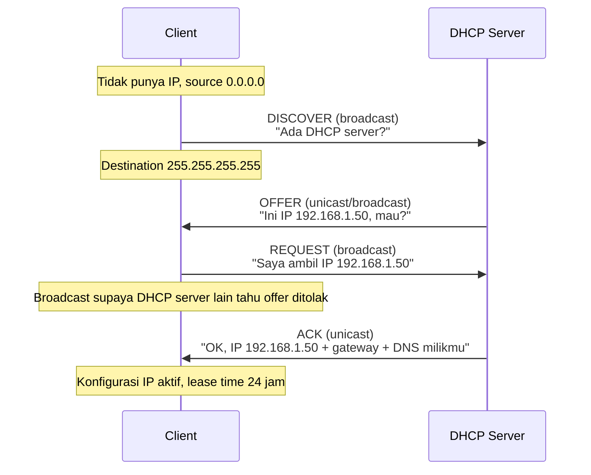
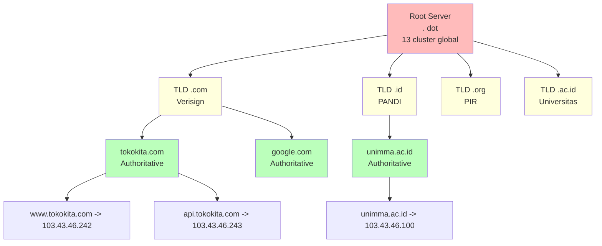
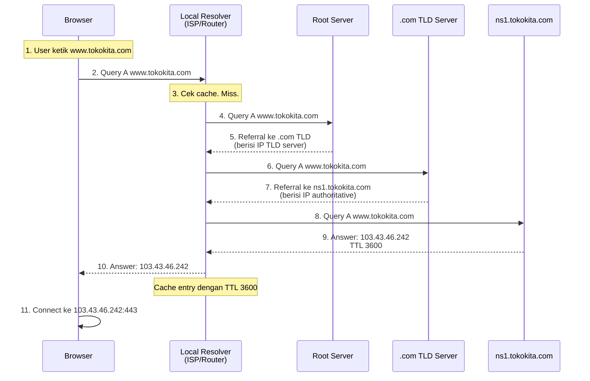
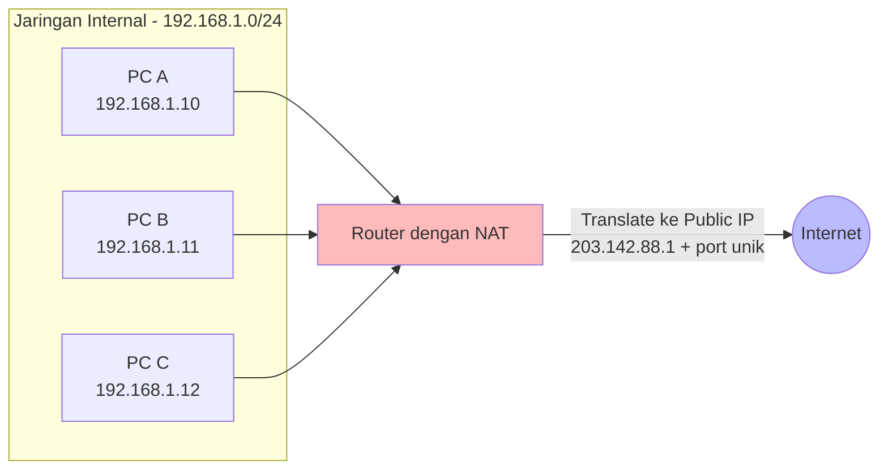
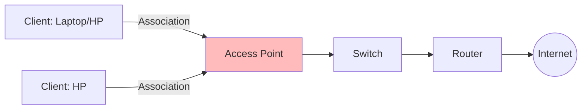
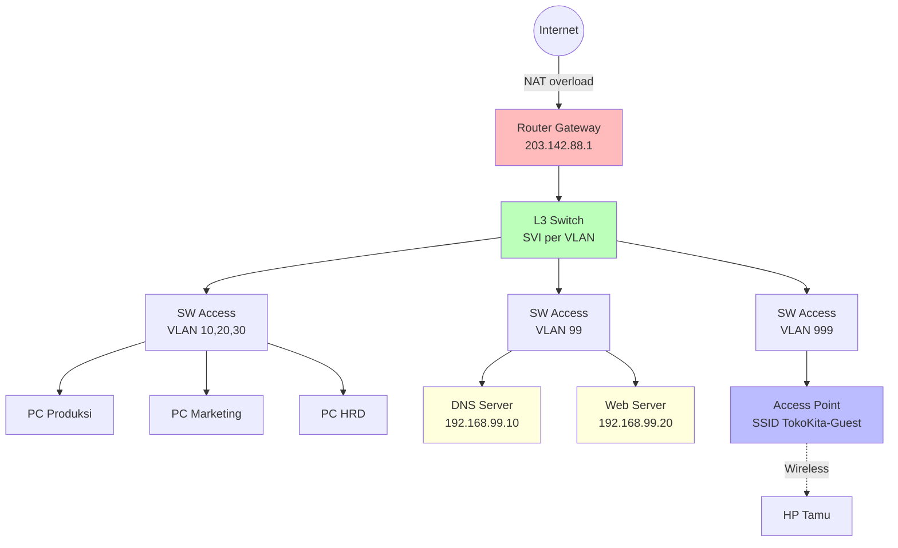

# 🌐 Bab 4: Network Services

## DHCP, DNS, NAT, dan Wireless

| | |
|:---|:---|
| **Bab** | 4 - Network Services |
| **Sub-CPMK** | 4.1, 4.2 & 4.3 |
| **CPMK** | CPMK-4 |
| **Pertemuan** | 3 x 150 menit |

---

## 🎯 Tujuan Pembelajaran Bab Ini

Setelah mempelajari Bab 4 ini, mahasiswa diharapkan mampu:

1. **Menjelaskan** cara kerja DHCP dengan proses DORA (Discover-Offer-Request-Acknowledge) dan mengonfigurasinya di router/server (Sub-CPMK 4.1).
2. **Menjelaskan** hierarki DNS (root-TLD-authoritative), jenis record DNS (A, AAAA, CNAME, MX, TXT, NS), dan mengonfigurasinya di server (Sub-CPMK 4.1).
3. **Mengonfigurasi** NAT statis, NAT dinamis, dan PAT (overload) pada router gateway, hingga host privat dapat mengakses jaringan publik (Sub-CPMK 4.2).
4. **Menjelaskan** standar wireless 802.11 (a/b/g/n/ac/ax) dan mengonfigurasi SSID dengan WPA2-PSK dan WPA2-Enterprise pada access point (Sub-CPMK 4.3).
5. **Mengintegrasikan** semua layanan jaringan dalam satu lab Packet Tracer yang komprehensif.
6. **Menyadari** dimensi spiritual dari pelayanan jaringan sebagai bentuk pelayanan umat (khidmat) dalam perspektif Islam.

> 📌 **Pemetaan Sub-CPMK:** Bab ini menjawab tiga Sub-CPMK yang menopang **CPMK-4** (Mengonfigurasi layanan jaringan DNS, DHCP, NAT dan wireless):
> - **Sub-CPMK 4.1** = DHCP & DNS - sub-bab 4.1-4.3
> - **Sub-CPMK 4.2** = NAT/PAT - sub-bab 4.4-4.5
> - **Sub-CPMK 4.3** = Wireless - sub-bab 4.6-4.7

---

# Bagian A: DHCP & DNS (Sub-CPMK 4.1)

## 4.1 DHCP (Dynamic Host Configuration Protocol)

### 4.1.1 Mengapa Butuh DHCP?

Tanpa DHCP, setiap perangkat yang masuk jaringan harus dikonfigurasi IP secara manual: IP address, subnet mask, default gateway, DNS server. Bayangkan kantor dengan 500 PC - administrator harus setting satu per satu. Lebih buruk lagi: jika ada perubahan DNS server, semua 500 PC harus diupdate.

**DHCP** mengotomatisasi ini. Saat perangkat colok kabel atau connect WiFi, DHCP server memberikan semua parameter jaringan secara otomatis. Manfaat:

- **Eliminasi konfigurasi manual**: plug-and-play, user tidak perlu paham IP.
- **Konsistensi**: semua host dapat konfigurasi seragam.
- **Penghematan IP**: IP dipinjamkan dengan **lease time** (mis. 24 jam), setelah host disconnect, IP bisa dipakai host lain.
- **Mobilitas**: user pindah ruangan, dapat IP baru otomatis sesuai subnet lokal.

### 4.1.2 Cara Kerja DHCP: Proses DORA

DHCP menggunakan UDP port 67 (server) dan 68 (client). Saat client baru masuk jaringan, terjadi 4-step **DORA**:



**Penjelasan setiap step:**

1. **DHCP DISCOVER** (Client -> broadcast): Client baru tidak punya IP. Source IP `0.0.0.0`, destination `255.255.255.255` (broadcast). Pesan: "Ada DHCP server di sini? Saya butuh IP."

2. **DHCP OFFER** (Server -> client): DHCP server yang mendengar DISCOVER merespons. Server menawarkan IP dari pool yang tersedia (mis. `192.168.1.50`), beserta subnet mask, lease time, dan parameter lain. Bisa unicast atau broadcast (tergantung implementasi).

3. **DHCP REQUEST** (Client -> broadcast): Client menerima satu atau multiple OFFER. Client pilih satu (biasanya yang pertama datang), lalu broadcast REQUEST untuk mengkonfirmasi pilihan. Broadcast agar DHCP server lain yang juga OFFER tahu bahwa OFFER-nya ditolak (IP bisa ditawarkan ke client lain).

4. **DHCP ACK** (Server -> client): Server konfirmasi. ACK berisi semua parameter final: IP, subnet mask, default gateway, DNS server, lease time, NTP server, dll. Client sekarang punya IP aktif.

### 4.1.3 DHCP Lease Time

**Lease time** adalah durasi client boleh memakai IP. Setelah lease habis, client harus renew atau lepaskan IP. Default Cisco: 1 hari.

Mekanisme renew:

- Pada **50% lease time**: client kirim DHCP REQUEST unicast ke server asal untuk perpanjang. Jika ACK, lease diperpanjang.
- Pada **87.5% lease time** (jika renew 50% gagal): client kirim REQUEST broadcast ke server mana saja. Jika dapat ACK dari server lain, dapat IP baru.
- Pada **100% lease time**: client lepas IP, kembali ke proses DORA dari awal.

Lease time ideal tergantung karakter jaringan:
- **Jaringan stabil (kantor)**: 8 jam (sesuai jam kerja) atau 24 jam.
- **Jaringan publik (kafe, bandara)**: 30-60 menit (rotasi cepat).
- **Jaringan IoT/data center**: 7 hari (perangkat tetap).

### 4.1.4 DHCP Relay

DHCP DISCOVER adalah broadcast. Router secara default tidak meneruskan broadcast, sehingga DHCP server di subnet berbeda tidak akan menerima DISCOVER client. Solusinya: **DHCP Relay** (ip helper).

```
! Di router interface yang menghadap client subnet
R1(config)# interface GigabitEthernet0/0
R1(config-if)# ip helper-address 192.168.99.10  ! IP DHCP server
R1(config-if)# exit
```

Saat router menerima DHCP broadcast di interface ini, router meneruskan sebagai unicast ke 192.168.99.10. DHCP server balas ke router, router teruskan ke client. DHCP relay memungkinkan 1 DHCP server pusat melayani multiple subnet.

### 4.1.5 Konfigurasi DHCP di Cisco Router

**Skenario:** Router R1 sebagai DHCP server untuk subnet 192.168.10.0/24 (VLAN 10 Produksi).

```
R1> enable
R1# configure terminal

! Exclude IP yang tidak boleh dipinjamkan (gateway, server, printer)
R1(config)# ip dhcp excluded-address 192.168.10.1 192.168.10.10
R1(config)# ip dhcp excluded-address 192.168.10.254

! Buat DHCP pool untuk VLAN 10
R1(config)# ip dhcp pool VLAN10-PRODUKSI
R1(dhcp-config)# network 192.168.10.0 255.255.255.0
R1(dhcp-config)# default-router 192.168.10.1
R1(dhcp-config)# dns-server 8.8.8.8 1.1.1.1
R1(dhcp-config)# domain-name tokokita.com
R1(dhcp-config)# lease 1  ! 1 hari
R1(dhcp-config)# exit

! Pool untuk VLAN 20 (Marketing)
R1(config)# ip dhcp excluded-address 192.168.20.1 192.168.20.10
R1(config)# ip dhcp pool VLAN20-MARKETING
R1(dhcp-config)# network 192.168.20.0 255.255.255.0
R1(dhcp-config)# default-router 192.168.20.1
R1(dhcp-config)# dns-server 8.8.8.8 1.1.1.1
R1(dhcp-config)# domain-name tokokita.com
R1(dhcp-config)# lease 1
R1(dhcp-config)# exit

R1(config)# exit
R1# write memory
```

**Verifikasi DHCP:**

```
! Lihat binding (IP yang sedang dipinjamkan)
R1# show ip dhcp binding
IP address       Hardware address        Lease expiration        Type
192.168.10.11    0090.2b3c.4d5e          Jul 16 2026 09:30 AM    Automatic
192.168.10.12    00d0.d3a8.9c10          Jul 16 2026 09:32 AM    Automatic
192.168.20.11    0001.4286.7e3a          Jul 16 2026 09:35 AM    Automatic

! Lihat konflik IP (jika ada)
R1# show ip dhcp conflict

! Lihat statistik DHCP
R1# show ip dhcp server statistics

! Lihat pool konfigurasi
R1# show ip dhcp pool

Pool VLAN10-PRODUKSI :
 Utilization mark (high/low)    : 100 / 0
 Subnet size (first/second)     : 0 / 0
 Total addresses                : 254
 Leased addresses               : 2
 Pending event                  : none
 1 subnet is currently in the pool :
 Current index        IP address range                    Leased addresses
 192.168.10.13        192.168.10.1     - 192.168.10.254    2
```

### 4.1.6 Konfigurasi DHCP Client di PC

Di Packet Tracer, klik PC -> Desktop -> IP Configuration -> pilih **DHCP**. PC akan otomatis DORA dan dapat IP.

Verifikasi di PC Command Prompt:

```
C:\> ipconfig /all

FastEthernet0 Connection:(default port)

   Connection-specific DNS Suffix..: tokokita.com
   Physical Address................: 0090.2B3C.4D5E
   Link-local IPv6 Address.........: FE80::290:2BFF:FE3C:4D5E
   IPv4 Address....................: 192.168.10.11
   Subnet Mask.....................: 255.255.255.0
   Default Gateway.................: 192.168.10.1
   DHCP Servers....................: 192.168.10.1
   DNS Servers.....................: 8.8.8.8
                                    1.1.1.1
```

Catat: IPv4 address, gateway, DNS server, semuanya otomatis dari DHCP. Tanpa intervensi manual.

### 4.1.7 DHCP Troubleshooting

| Gejala | Penyebab Umum | Solusi |
|:---|:---|:---|
| PC dapat IP `169.254.x.x` (APIPA) | DHCP server tidak merespons | Cek DHCP server aktif, pool tidak full, relay konfigurasi |
| PC tidak dapat IP sama sekali | Port switch down / VLAN mismatch | Cek `show interface`, access VLAN port |
| Sebagian PC dapat IP, sebagian tidak | Pool kehabisan IP | Tambah excluded-address atau kecilkan lease time |
| Dapat IP tapi tidak bisa ping gateway | Gateway bukan interface router | Pastikan `default-router` di pool = IP interface router |
| Dapat IP tapi tidak bisa resolve DNS | DNS server unreachable / salah | Test `nslookup`, cek `dns-server` di pool |
| IP conflict (dua PC sama IP) | Static IP manual nabrak DHCP pool | Tambah `excluded-address` untuk range static |

---

## 4.2 DNS (Domain Name System)

### 4.2.1 Mengapa Butuh DNS?

Manusia mengingat nama lebih baik dari angka. Anda ingat `google.com`, tapi sulit mengingat `142.250.193.78`. Bayangkan harus hafal IP untuk setiap website yang Anda kunjungi sehari-hari. Bayangkan juga: jika Google pindah server (IP berubah), jutaan user harus update bookmark mereka.

**DNS** adalah sistem terdistribusi yang menerjemahkan nama domain ke IP address. Sering disebut "phonebook internet". Manfaat:

- **User-friendly**: user pakai nama, bukan IP.
- **Stability**: IP bisa berubah, nama tetap.
- **Load balancing**: satu nama bisa resolve ke multiple IP (round-robin).
- **Service discovery**: CNAME ke service, tidak terikat IP spesifik.

### 4.2.2 Hierarki DNS

DNS terstruktur hierarkis seperti filesystem:



**Tingkatan hierarki:**

1. **Root** (`.`): 13 cluster server root global (a.root-servers.net sampai m.root-servers.net). Berisi referral ke TLD server. Anycast ke ratusan lokasi.
2. **TLD (Top-Level Domain)**: `.com`, `.id`, `.org`, `.net`, `.ac.id`, `.go.id`, dll. Dikelola oleh registry (Verisign untuk .com, PANDI untuk .id).
3. **Authoritative**: server DNS domain spesifik (mis. ns1.tokokita.com). Berisi record untuk domain tersebut.
4. **Subdomain**: www, mail, api, dll - sub-domain di bawah authoritative.

### 4.2.3 Cara Kerja DNS Resolution

Saat Anda buka `https://www.tokokita.com` di browser:



**Iterative vs Recursive:**

- **Recursive query** (Browser -> Resolver): resolver harus berikan jawaban final (IP atau error), tidak boleh "lihat ke sana".
- **Iterative query** (Resolver -> Root/TLD/Auth): server boleh beri referral ("saya tidak tahu, tapi tanya ke X").

Resolver melakukan iterative query ke Root, lalu TLD, lalu Authoritative, hingga dapat jawaban. Hasil jawaban di-cache dengan TTL (Time To Live).

### 4.2.4 Jenis DNS Record

| Tipe Record | Fungsi | Contoh |
|:---|:---|:---|
| **A** | Map nama ke IPv4 | `www.tokokita.com. IN A 103.43.46.242` |
| **AAAA** | Map nama ke IPv6 | `www.tokokita.com. IN AAAA 2001:db8::1` |
| **CNAME** | Alias ke nama lain | `blog.tokokita.com. IN CNAME tokokita.github.io.` |
| **MX** | Mail Exchange (email) | `tokokita.com. IN MX 10 mail.tokokita.com.` |
| **TXT** | Text arbitrary (SPF, DKIM, verifikasi) | `tokokita.com. IN TXT "v=spf1 include:_spf.google.com ~all"` |
| **NS** | Name Server (delegasi) | `tokokita.com. IN NS ns1.tokokita.com.` |
| **SOA** | Start of Authority | `tokokita.com. IN SOA ns1.tokokita.com. admin.tokokita.com. (...)` |
| **PTR** | Reverse DNS (IP ke nama) | `242.46.43.103.in-addr.arpa. IN PTR www.tokokita.com.` |
| **SRV** | Service locator | `_sip._tcp.tokokita.com. IN SRV 10 60 5060 sip.tokokita.com.` |

**TTL (Time To Live)**: setiap record punya TTL (detik). Resolver cache record selama TTL. Setelah TTL habis, resolver query ulang. TTL rendah (300s) = cepat propagate tapi beban server tinggi. TTL tinggi (86400s = 1 hari) = lambat propagate tapi efficient.

### 4.2.5 Public DNS vs Private DNS

- **Public DNS**: diakses internet, berisi record untuk domain publik. Contoh: Google `8.8.8.8`, Cloudflare `1.1.1.1`, OpenDNS `208.67.222.222`.
- **Private DNS**: hanya diakses jaringan internal. Mis. `ns1.tokokita.local` untuk record `server-payroll.tokokita.local` yang tidak exposed ke internet.

### 4.2.6 Tool DNS Lookup

```bash
# nslookup (Windows/Linux/Mac)
nslookup www.tokokita.com
nslookup -type=MX tokokita.com
nslookup www.tokokita.com 8.8.8.8  # query via specific DNS server

# dig (Linux/Mac, lebih detail)
dig www.tokokita.com
dig @8.8.8.8 www.tokokita.com
dig MX tokokita.com +short
dig AAAA www.tokokita.com

# host (sederhana)
host www.tokokita.com
host -t MX tokokita.com
```

Contoh output `dig www.tokokita.com`:

```
;; ANSWER SECTION:
www.tokokita.com.   3600  IN  A   103.43.46.242

;; Query time: 42 msec
;; SERVER: 8.8.8.8#53(8.8.8.8)
;; WHEN: Tue Jul 15 10:30:00 WIB 2026
;; MSG SIZE  rcvd: 64
```

### 4.2.7 Konfigurasi DNS Server di Packet Tracer

Packet Tracer menyediakan server yang bisa dijadikan DNS server. Setup:

1. Tambahkan server dari End Devices.
2. Klik server -> Services tab -> DNS.
3. Klik "On" untuk mengaktifkan DNS service.
4. Tambah record:

| Name | Type | Address |
|:---|:---|:---|
| www.tokokita.com | A Record | 192.168.10.100 |
| mail.tokokita.com | A Record | 192.168.10.101 |
| tokokita.com | CNAME | www.tokokita.com |

5. Set DNS server ini sebagai DNS di DHCP pool:

```
R1(config)# ip dhcp pool VLAN10-PRODUKSI
R1(dhcp-config)# dns-server 192.168.10.10  ! IP DNS server
R1(dhcp-config)# exit
```

6. Test dari PC:

```
C:\> nslookup www.tokokita.com
Server:  192.168.10.10
Address: 192.168.10.10

Name:    www.tokokita.com
Address: 192.168.10.100

C:\> ping www.tokokita.com
Pinging www.tokokita.com [192.168.10.100] with 32 bytes of data:
Reply from 192.168.10.100: bytes=32 time=1ms TTL=128
```

DNS resolution berhasil - PC resolve nama ke IP, lalu ping ke IP tersebut.

### 4.2.8 DNS Troubleshooting

| Gejala | Penyebab Umum | Solusi |
|:---|:---|:---|
| Ping IP berhasil, ping nama gagal | DNS server unreachable / salah | Cek `nslookup`, pastikan `dns-server` di DHCP benar |
| `nslookup` timeout | DNS server down / firewall block port 53 | Cek DNS service aktif, port 53 UDP/TCP open |
| `nslookup` return NXDOMAIN | Record tidak ada / typo nama | Cek record di DNS server |
| DNS resolve lambat | Cache miss berulang, TTL rendah, resolver jauh | Naikkan TTL, gunakan DNS dekat (public 1.1.1.1 cepat) |
| Hasil DNS berbeda antar user | Cache berbeda, split-horizon DNS | Konsistenkan konfigurasi, dokumentasikan split-horizon |
| Email ditandai spam | SPF/DKIM/DMARC record kurang | Tambah TXT record SPF, DKIM, DMARC |

### 4.2.9 DNS Security: DNSSEC dan DoH

DNS tradisional tidak terenkripsi, bisa di-spoof dan di-sniff. Beberapa ekstensi security:

- **DNSSEC**: tanda tangan digital pada record DNS. Mencegah spoofing. Didukung `.gov`, `.com`, dll.
- **DoH (DNS over HTTPS)**: DNS query via HTTPS port 443. Privatasi + bypass filter. Didukung Firefox, Chrome.
- **DoT (DNS over TLS)**: DNS query via TLS port 853. Lebih efisien dari DoH untuk enterprise.
- **DNS-over-QUIC**: generasi terbaru, pakai QUIC protocol.

Untuk lab D3, DNS tradisional cukup. DNS security dibahas lebih lanjut di mata kuliah Keamanan Sistem Informasi.

---
# Bagian B: NAT & PAT (Sub-CPMK 4.2)

## 4.3 Konsep NAT (Network Address Translation)

### 4.3.1 Mengapa Butuh NAT?

IPv4 address hanya 4,3 miliar, sementara perangkat internet jauh lebih banyak (estimasi 50+ miliar perangkat IoT di 2025). Tanpa NAT, IPv4 sudah habis bertahun-tahun lalu.

**NAT** adalah mekanisme di router yang menerjemahkan IP private (internal) ke IP public (external) saat packet keluar, dan sebaliknya saat packet masuk. NAT memungkinkan ratusan perangkat internal share 1 IP public.

Manfaat NAT:

- **Konservasi IPv4**: 1 IP public untuk ratusan host private.
- **Keamanan**: host internal tidak langsung expose ke internet. Inbound connection perlu explicit port forwarding.
- **Fleksibilitas**: ganti ISP tinggal ganti IP public di router, internal tidak perlu renumbering.

### 4.3.2 Jenis NAT

| Jenis | Cara Kerja | Use Case |
|:---|:---|:---|
| **Static NAT** | 1 IP private <-> 1 IP public (1-to-1 mapping tetap) | Server publik (web, email) yang butuh IP konsisten |
| **Dynamic NAT** | Sekumpulan IP private dipetakan ke pool IP public (1-to-1 dinamis) | Organisasi punya blok IP public |
| **PAT (Port Address Translation)** / NAT Overload | Banyak IP private <-> 1 IP public, dibedakan oleh port source | Router rumah/UMKM dengan 1 IP public ISP |
| **Port Forwarding** | 1 IP public + port tertentu -> 1 IP private + port | Akses server internal dari internet (mis. RDP, web) |



### 4.3.3 Cara Kerja PAT (NAT Overload)

PAT adalah jenis NAT paling umum di router rumah dan UMKM. 1 IP public melayani ratusan host internal, dibedakan oleh **source port** TCP/UDP.

**Contoh:** PC A (192.168.1.10) dan PC B (192.168.1.11) sama-sama browsing ke google.com (203.0.113.5:443).

| Sumber | Destination Sebelum NAT |
|:---|:---|
| 192.168.1.10:54321 | 203.0.113.5:443 |
| 192.168.1.11:54321 | 203.0.113.5:443 |

Keduanya pakai source port 54321 (acak). Router NAT translate:

| Sumber Setelah NAT | Destination Setelah NAT |
|:---|:---|
| 203.142.88.1:40001 | 203.0.113.5:443 |
| 203.142.88.1:40002 | 203.0.113.5:443 |

Router ganti source IP jadi IP public, ganti source port jadi port unik (40001, 40002). Router simpan mapping di **NAT table**. Saat balasan dari google.com masuk, router cek NAT table, translate balik.

```
NAT Table:
Inside Local            Inside Global          Outside Local          Outside Global
192.168.1.10:54321   203.142.88.1:40001   203.0.113.5:443        203.0.113.5:443
192.168.1.11:54321   203.142.88.1:40002   203.0.113.5:443        203.0.113.5:443
```

### 4.3.4 Konfigurasi PAT di Cisco Router

**Skenario:** Router R1 adalah gateway jaringan internal 192.168.1.0/24 ke internet. IP public di interface Serial0/0/0 = 203.142.88.1.

```
R1> enable
R1# configure terminal

! 1. Definisikan ACL untuk tentukan IP mana yang boleh NAT
R1(config)# access-list 1 permit 192.168.1.0 0.0.0.255

! 2. Buat NAT overload dengan ACL + interface public
R1(config)# ip nat inside source list 1 interface Serial0/0/0 overload

! 3. Tandai interface mana inside (internal) dan outside (public)
R1(config)# interface GigabitEthernet0/0
R1(config-if)# ip address 192.168.1.1 255.255.255.0
R1(config-if)# ip nat inside
R1(config-if)# no shutdown
R1(config-if)# exit

R1(config)# interface Serial0/0/0
R1(config-if)# ip address 203.142.88.1 255.255.255.252
R1(config-if)# ip nat outside
R1(config-if)# no shutdown
R1(config-if)# exit

R1(config)# exit
R1# write memory
```

**Verifikasi NAT:**

```
! Lihat NAT table aktif
R1# show ip nat translations
Pro  Inside global         Inside local          Outside local         Outside global
tcp 203.142.88.1:40001    192.168.1.10:54321   203.0.113.5:443       203.0.113.5:443
tcp 203.142.88.1:40002    192.168.1.11:54321   203.0.113.5:443       203.0.113.5:443

! Lihat statistik NAT
R1# show ip nat statistics
Total active translations: 2 (0 static, 2 dynamic; 2 extended)
Outside interfaces:
  Serial0/0/0
Inside interfaces:
  GigabitEthernet0/0
Hits: 2456  Misses: 0
CEF Translated packets: 2456, CEF Punted packets: 0
Expired translations: 12
Dynamic mappings:
-- Inside Source
[Id: 1] access-list 1 interface Serial0/0/0 refcount 2

! Clear NAT table (jika perlu)
R1# clear ip nat translation *
```

### 4.3.5 Static NAT (untuk Server Publik)

**Skenario:** Web server internal 192.168.1.100 harus accessible dari internet dengan IP public 203.142.88.5.

```
! Static NAT 1-to-1
R1(config)# ip nat inside source static 192.168.1.100 203.142.88.5
```

Sekarang akses `http://203.142.88.5` dari internet akan forward ke 192.168.1.100.

### 4.3.6 Port Forwarding

**Skenario:** Hanya 1 IP public (203.142.88.1), tapi butuh akses multiple server internal. Solusi: port forwarding.

| Port Public | Tujuan Internal | Service |
|:---|:---|:---|
| 80 | 192.168.1.100:80 | Web server |
| 443 | 192.168.1.100:443 | HTTPS |
| 25 | 192.168.1.101:25 | SMTP |
| 3389 | 192.168.1.200:3389 | RDP admin |

```
! Port forwarding via static NAT dengan port spesifik
R1(config)# ip nat inside source static tcp 192.168.1.100 80 203.142.88.1 80
R1(config)# ip nat inside source static tcp 192.168.1.100 443 203.142.88.1 443
R1(config)# ip nat inside source static tcp 192.168.1.101 25 203.142.88.1 25
R1(config)# ip nat inside source static tcp 192.168.1.200 3389 203.142.88.1 3389
```

### 4.3.7 NAT Troubleshooting

| Gejala | Penyebab Umum | Solusi |
|:---|:---|:---|
| Internal bisa ping IP public, tapi tidak bisa ping nama | DNS tidak di-NAT atau DNS server salah | Pastikan DNS server di DHCP pool benar |
| Internal tidak bisa browsing padahal gateway OK | NAT belum konfigurasi | Cek `show ip nat translations`, pastikan `inside`/`outside` benar |
| Internet bisa ping IP public tapi tidak bisa akses service | Port forwarding belum di-set / salah port | Cek `ip nat inside source static tcp ...` |
| NAT table penuh, koneksi baru gagal | Max entries reached, atau NAT timeout lama | Kecilkan NAT timeout, tingkatkan RAM router |
| Sebagian host bisa internet, sebagian tidak | ACL tidak cover subnet tertentu | Cek `access-list` NAT, pastikan cover semua subnet internal |

### 4.3.8 NAT dan IPv6

IPv6 dirancang dengan jumlah address yang sangat banyak (2^128), sehingga **NAT tidak perlu** untuk konservasi alamat. Setiap perangkat bisa dapat IPv6 global unik. Tapi ada pengecualian:

- **NAT66**: untuk translasi IPv6-ke-IPv6 (mis. merger organisasi dengan subnet berbeda).
- **NAT64/DNS64**: translasi IPv6 internal ke IPv4 internet, untuk transisi masa migrasi.

Best practice IPv6: hindari NAT, pakai SLAAC + firewall untuk keamanan. Tapi di Indonesia, mayoritas masih IPv4 + NAT karena belum full migrasi.

---

## 4.4 Wireless Networking (Sub-CPMK 4.3)

### 4.4.1 Standar 802.11

WiFi adalah teknologi wireless LAN yang distandarkan IEEE 802.11. Berikut standar utama:

| Standar | Tahun | Frekuensi | Max Speed | Range Indoor | Status |
|:---|:---|:---|---:|---:|:---|
| 802.11 | 1997 | 2.4 GHz | 2 Mbps | 20 m | Obsolete |
| 802.11b | 1999 | 2.4 GHz | 11 Mbps | 35 m | Obsolete |
| 802.11a | 1999 | 5 GHz | 54 Mbps | 35 m | Obsolete |
| 802.11g | 2003 | 2.4 GHz | 54 Mbps | 38 m | Legacy |
| **802.11n** (Wi-Fi 4) | 2009 | 2.4 + 5 GHz | 600 Mbps | 70 m | Common |
| **802.11ac** (Wi-Fi 5) | 2014 | 5 GHz | 3.5 Gbps | 35 m | Common |
| **802.11ax** (Wi-Fi 6/6E) | 2019/2021 | 2.4 + 5 + 6 GHz | 9.6 Gbps | 35 m | Modern |
| **802.11be** (Wi-Fi 7) | 2024 | 2.4 + 5 + 6 GHz | 46 Gbps | 35 m | Emerging |

**Insight:**
- 2.4 GHz: range lebih jauh, lebih banyak interferensi (Bluetooth, microwave, tetangga), lebih sedikit channel (3 non-overlapping).
- 5 GHz: range lebih pendek, lebih sedikit interferensi, lebih banyak channel (23 non-overlapping), kecepatan lebih tinggi.
- 6 GHz (Wi-Fi 6E/7): baru, sangat sedikit interferensi, banyak channel, hanya perangkat baru yang support.

### 4.4.2 Komponen Wireless



- **Client (STA - Station)**: perangkat dengan WiFi adapter (laptop, HP, IoT).
- **Access Point (AP)**: perangkat yang bridge wireless ke wired network.
- **SSID (Service Set Identifier)**: nama WiFi network (mis. "TokoKita-Guest"). Maks 32 karakter.
- **BSSID**: MAC address AP (untuk identifikasi unik).
- **ESSID**: SSID yang sama di multiple AP (roaming).

### 4.4.3 Mode Operasi Wireless

1. **Infrastructure mode**: client connect ke AP, AP connect ke wired network. Paling umum.
2. **Ad-hoc mode**: client connect langsung ke client (IBSS), tanpa AP. Mis. file share antar laptop.
3. **Mesh mode**: AP connect ke AP, form mesh network. Cocok untuk area luas (kampus, kota).
4. **Bridge mode**: 2 AP wireless connect untuk bridge 2 jaringan wired. Mis. gedung A ke gedung B.

### 4.4.4 Security Wireless: WEP, WPA, WPA2, WPA3

| Standar | Tahun | Cipher | Status |
|:---|:---|:---|:---|
| **WEP** | 1997 | RC4 (40/104 bit) | BROKEN, jangan pakai |
| **WPA** | 2003 | TKIP + RC4 | Obsolete |
| **WPA2** | 2004 | AES-CCMP | **Standar minimum 2026** |
| **WPA3** | 2018 | AES-GCMP + SAE | Rekomendasi modern |

**WPA2-PSK (Pre-Shared Key)**: satu password untuk semua user. Cocok untuk rumah/UMKM kecil. Password disimpan di AP dan di-set di setiap client.

**WPA2-Enterprise (802.1X)**: setiap user login dengan username/password sendiri via RADIUS server. Cocok untuk kantor, kampus. User bisa di-revoke tanpa ganti password semua orang.

**WPA3** memperbaiki kelemahan WPA2:
- **SAE (Simultaneous Authentication of Equals)**: ganti PSK, tahan offline dictionary attack.
- **Forward secrecy**: capture traffic lama tidak bisa di-decrypt jika password bocor nanti.
- **Encryption 192-bit** (WPA3-Enterprise).

### 4.4.5 Konfigurasi Wireless AP di Packet Tracer

Packet Tracer menyediakan AP (Access Point-PT) untuk simulasi wireless.

**Setup SSID dengan WPA2-PSK:**

1. Tambahkan AP dari Network Devices -> Wireless.
2. Klik AP -> Config tab -> Port 1 (wired ke switch).
3. Set SSID, authentication, dan password.

Alternatif via CLI (Cisco Aironet AP):

```
AP> enable
AP# configure terminal

! Masuk ke interface wireless (dot11Radio 0 untuk 2.4 GHz, dot11Radio 1 untuk 5 GHz)
AP(config)# interface Dot11Radio0
AP(config-if)# ssid TokoKita-WiFi
AP(config-if)# exit

! Konfigurasi SSID
AP(config)# dot11 ssid TokoKita-WiFi
AP(config-ssid)# authentication open
AP(config-ssid)# authentication key-management wpa  ! WPA2
AP(config-ssid)# wpa-psk ascii PasswordKuat2026!  ! Pre-shared key
AP(config-ssid)# guest-mode  ! broadcast SSID
AP(config-ssid)# exit

! Aktifkan interface
AP(config)# interface Dot11Radio0
AP(config-if)# encryption mode ciphers tkip  ! atau aes-ccmp
AP(config-if)# ssid TokoKita-WiFi
AP(config-if)# no shutdown
AP(config-if)# exit

AP(config)# exit
AP# write memory
```

### 4.4.6 Wireless Troubleshooting

| Gejala | Penyebab Umum | Solusi |
|:---|:---|:---|
| Client tidak lihat SSID | SSID hidden / AP mati / client jauh | Cek AP power, coba `guest-mode` untuk broadcast SSID |
| Client lihat SSID tapi tidak bisa connect | Password salah / cipher mismatch | Verifikasi password, pakai AES-CCMP konsisten |
| Connect tapi tidak dapat IP | DHCP server tidak reachable | Cek DHCP di subnet wireless, kabel AP ke switch |
| Connect dapat IP tapi tidak bisa internet | NAT/routing issue | Cek gateway, NAT, DNS |
| WiFi lambat / putus-putus | Interferensi / channel padat | Ubah channel, pakai 5 GHz, kurangi jarak |
| Sebagian client bisa, sebagian tidak | Standar 802.11 tidak support | Pastikan AP support 802.11n/ac/ax sesuai client |

### 4.4.7 Best Practice Wireless untuk UMKM

1. **Pisahkan SSID Guest dan Internal**:
   - "TokoKita-Staff" (WPA2-Enterprise atau PSK kuat) untuk karyawan, akses ke internal.
   - "TokoKita-Guest" (WPA2-PSK terpisah, captive portal opsional) untuk tamu, isolasi dari internal.
2. **Pakai 5 GHz jika memungkinkan**: lebih sedikit interferensi, kecepatan lebih tinggi.
3. **Ganti default password admin AP**: banyak AP pakai admin/admin, ganti segera.
4. **Update firmware AP**: CVE lama bisa di-exploit (mis. WPA2 KRACK attack).
5. **Disable WPS**: WPS rentan brute force PIN.
6. **Pakai WPA3 jika AP dan client support**: lebih aman dari WPA2.
7. **Coverage audit**: pakai tool seperti NetSpot, WiFi Analyzer untuk cek coverage dan interferensi.

---

## 4.5 Lab Integrated: DHCP + DNS + NAT + Wireless

Sub-bab ini adalah lab capstone Bab 4 yang menggabungkan semua layanan.

### 4.5.1 Skenario TokoKita dengan Wireless Guest

PT TokoKita ingin setup jaringan dengan:

- 3 VLAN internal: VLAN 10 (Produksi), 20 (Marketing), 30 (HRD).
- VLAN 99 (Management): untuk switch management.
- VLAN 999 (Guest): WiFi tamu, internet only, tidak bisa akses internal.
- DHCP untuk semua VLAN.
- DNS server internal untuk resolve `*.tokokita.local`.
- NAT overload ke internet via 1 IP public ISP.
- Web server internal `www.tokokita.local` accessible dari semua VLAN.

### 4.5.2 Topologi



### 4.5.3 Tabel Addressing

| VLAN | Network | Gateway | DHCP Pool |
|:---:|:---|:---|:---|
| 10 (Produksi) | 192.168.10.0/24 | 192.168.10.1 | 192.168.10.50-200 |
| 20 (Marketing) | 192.168.20.0/24 | 192.168.20.1 | 192.168.20.50-200 |
| 30 (HRD) | 192.168.30.0/24 | 192.168.30.1 | 192.168.30.50-200 |
| 99 (Mgmt) | 192.168.99.0/24 | 192.168.99.1 | static only |
| 999 (Guest) | 192.168.999.0/24 | 192.168.999.1 | 192.168.999.50-200 |
| WAN | 203.142.88.0/30 | 203.142.88.1 | - |

### 4.5.4 Langkah Implementasi

**Step 1: Setup L3 Switch sebagai gateway + DHCP server**

```
L3-SW(config)# ip routing

! VLAN + SVI
L3-SW(config)# vlan 10
L3-SW(config-vlan)# name Produksi
L3-SW(config-vlan)# exit
! (lanjut untuk VLAN 20, 30, 99, 999)

L3-SW(config)# interface Vlan10
L3-SW(config-if)# ip address 192.168.10.1 255.255.255.0
L3-SW(config-if)# exit
! (lanjut untuk SVI 20, 30, 99, 999)

! DHCP pool per VLAN
L3-SW(config)# ip dhcp excluded-address 192.168.10.1 192.168.10.49
L3-SW(config)# ip dhcp excluded-address 192.168.10.201 192.168.10.254
L3-SW(config)# ip dhcp pool VLAN10
L3-SW(dhcp-config)# network 192.168.10.0 255.255.255.0
L3-SW(dhcp-config)# default-router 192.168.10.1
L3-SW(dhcp-config)# dns-server 192.168.99.10
L3-SW(dhcp-config)# domain-name tokokita.local
L3-SW(dhcp-config)# exit
! (lanjut untuk VLAN 20, 30, 999)
```

**Step 2: Setup DNS Server**

- Tambahkan Server, IP static 192.168.99.10, gateway 192.168.99.1.
- Services -> DNS -> On.
- Tambah record:

| Name | Type | Address |
|:---|:---|:---|
| www.tokokita.local | A Record | 192.168.99.20 |
| mail.tokokita.local | A Record | 192.168.99.21 |
| dns.tokokita.local | A Record | 192.168.99.10 |

**Step 3: Setup Web Server**

- Tambahkan Server, IP static 192.168.99.20, gateway 192.168.99.1.
- Services -> HTTP -> On (default).

**Step 4: Setup Router Gateway dengan NAT**

```
R1(config)# interface GigabitEthernet0/0
R1(config-if)# ip address 203.142.88.1 255.255.255.252
R1(config-if)# ip nat outside
R1(config-if)# no shutdown
R1(config-if)# exit

R1(config)# interface GigabitEthernet0/1
R1(config-if)# ip address 10.0.0.1 255.255.255.252
R1(config-if)# ip nat inside
R1(config-if)# no shutdown
R1(config-if)# exit

! ACL cover semua internal subnet
R1(config)# access-list 1 permit 192.168.10.0 0.0.0.255
R1(config)# access-list 1 permit 192.168.20.0 0.0.0.255
R1(config)# access-list 1 permit 192.168.30.0 0.0.0.255
R1(config)# access-list 1 permit 192.168.99.0 0.0.0.255
R1(config)# access-list 1 permit 192.168.999.0 0.0.0.255

! NAT overload
R1(config)# ip nat inside source list 1 interface GigabitEthernet0/0 overload

! Default route ke ISP
R1(config)# ip route 0.0.0.0 0.0.0.0 203.142.88.2

! Static route ke internal (jika R1 bukan gateway untuk L3)
R1(config)# ip route 192.168.10.0 255.255.255.0 10.0.0.2
R1(config)# ip route 192.168.20.0 255.255.255.0 10.0.0.2
R1(config)# ip route 192.168.30.0 255.255.255.0 10.0.0.2
R1(config)# ip route 192.168.99.0 255.255.255.0 10.0.0.2
R1(config)# ip route 192.168.999.0 255.255.255.0 10.0.0.2
```

**Step 5: Setup Wireless AP untuk Guest**

- Tambah AP ke SW3 (VLAN 999 access).
- SSID: `TokoKita-Guest`, WPA2-PSK dengan password Guest123!.
- Set AP mode: access bridge.

**Step 6: Verifikasi End-to-End**

1. PC Produksi (DHCP) dapat IP 192.168.10.50, gateway 192.168.10.1, DNS 192.168.99.10.
2. PC Produksi ping `www.tokokita.local` -> resolve ke 192.168.99.20, ping berhasil.
3. PC Produksi buka browser `http://www.tokokita.local` -> web page muncul.
4. PC Produksi ping `8.8.8.8` (simulasi internet) -> berhasil via NAT.
5. HP Tamu connect WiFi `TokoKita-Guest`, dapat IP 192.168.999.50, bisa internet.
6. HP Tamu ping `192.168.10.50` -> GAGAL (isolasi guest dari internal, via ACL).

**ACL isolasi Guest (di L3 Switch):**

```
! Block guest ke internal, allow ke internet
L3-SW(config)# access-list 101 deny ip 192.168.999.0 0.0.0.255 192.168.10.0 0.0.0.255
L3-SW(config)# access-list 101 deny ip 192.168.999.0 0.0.0.255 192.168.20.0 0.0.0.255
L3-SW(config)# access-list 101 deny ip 192.168.999.0 0.0.0.255 192.168.30.0 0.0.0.255
L3-SW(config)# access-list 101 deny ip 192.168.999.0 0.0.0.255 192.168.99.0 0.0.0.255
L3-SW(config)# access-list 101 permit ip 192.168.999.0 0.0.0.255 any

! Apply di SVI VLAN 999 (inbound)
L3-SW(config)# interface Vlan999
L3-SW(config-if)# ip access-group 101 in
L3-SW(config-if)# exit
```

### 4.5.5 Tugas Lab Mandiri

Kerjakan dan submit file `.pkt` + laporan:

1. **Lab 1:** Implementasi topologi Bab 4.5.1 lengkap. Verifikasi semua 6 skenario test di atas.
2. **Lab 2:** Tambah WPA2-Enterprise (RADIUS) untuk VLAN Staff, sehingga karyawan login dengan username/password, bukan PSK shared.
3. **Lab 3 (Latihan Troubleshooting):** Dosen sengaja salah konfigurasi (mis. DNS server typo, ACL terlalu ketat, NAT inside/outside tertukar). Mahasiswa diagnose dan fix. Document steps.

---

## 🕌 Refleksi Islami: Pelayanan Jaringan sebagai Khidmat Umat

> *"Dan tolong-menolonglah kamu dalam (mengerjakan) kebajikan dan takwa, dan jangan tolong-menolong dalam berbuat dosa dan permusuhan."*
> *(QS. Al-Maidah [5]: 2)*

> *"Sebaik-baik manusia adalah yang paling bermanfaat bagi manusia lainnya."*
> *(HR. Ahmad, Thabrani)*

### Tiga Dimensi Spiritual Network Services

**Pertama, Pelayanan (Khidmat).** DHCP, DNS, NAT, dan wireless semuanya adalah "pelayan" jaringan. DHCP melayani permintaan IP, DNS melayani resolusi nama, NAT melayani translasi alamat, AP melayani koneksi wireless. Tanpa pelayanan ini, jaringan hanyalah kabel dan perangkat mati. Pelayanan inilah yang membuat jaringan "hidup" dan bermanfaat.

Begitu pula seorang muslim: *"Sebaik-baik manusia adalah yang paling bermanfaat bagi manusia lainnya"* (HR. Ahmad). Profesi network admin yang setup DHCP agar user mudah akses internet, konfigurasi DNS agar user tinggal ketik nama, deploy AP agar user bisa WiFi dimana-mana - semuanya adalah **khidmat** (pelayanan) kepada umat. Niat yang lurus menjadikan konfigurasi CLI yang membosankan sebagai amal jariyah.

**Kedua, Kemudahan (Taysir).** Allah berfirman: *"Allah menghendaki kemudahan bagimu, dan tidak menghendaki kesukaran bagimu."* (QS. Al-Baqarah: 185). DHCP adalah implementasi teknis prinsip taysir - user tidak perlu paham IP/subnet/gateway, tinggal colok kabel, dapat semua konfigurasi otomatis. DNS juga taysir - user tinggal ketik `tokokita.com`, tidak perlu hafal IP.

Network admin muslim harus memilih solusi yang **memudahkan user**, bukan yang menyusahkan. Beberapa pertimbangan:
- **DHCP lebih baik dari static** untuk device user (mudah pindah, mudah setup).
- **Nama DNS lebih baik dari IP** untuk dokumentasi (human-readable).
- **NAT + private IP lebih baik dari** semua IP public (hemat biaya, simplifikasi).
- **WPA2-PSK untuk tamu** lebih baik dari WPA2-Enterprise (tidak ribet check-in).

Tapi taysir tidak boleh mengorbankan keamanan. Tamu boleh mudah connect WiFi, tapi harus di-isolasi dari internal (ACL Guest). User mudah dapat IP, tapi harus ter-authentikasi (802.1X untuk staff). **Khidmat dengan tetap menjaga amanah.**

**Ketiga, Amanah Translasi (NAT sebagai Analogi).** NAT menerjemahkan IP private ke public. Tanpa NAT, perangkat internal tidak bisa komunikasi dengan internet. NAT adalah "jembatan" yang menyembunyikan kompleksitas internal dari dunia luar.

Inilah analogi peran seorang muslim di tengah masyarakat:
- **Penerjemah nilai**: penerjemah nilai Islam ke konteks modern. Tanpa penerjemah, nilai Islam terlihat asing dan tidak bisa diakses.
- **Jembatan ukhuwah**: yang menghubungkan komunitas muslim dengan non-muslim. Tanpa jembatan, terjadi isolasi dan misunderstanding.
- **Pelindung privat**: yang menjaga hal internal komunitas dari exposure yang tidak perlu. Privasi bukan penutupan, tapi batas yang sehat.

### Tiga Pertanyaan Reflektif Sebelum Setup Service

Sebelum Anda konfigurasi DHCP/DNS/NAT/Wireless di production, renungkan:

1. **Apakah saya sudah memilih solusi yang memudahkan user?** Kalau user masih harus call IT untuk dapat IP, mungkin DHCP belum benar. Kalau user masih harus hafal IP, mungkin DNS belum benar. *"Mudahkanlah dan jangan persulitkan."* (HR. Bukhari).
2. **Apakah saya sudah isolasi Guest dari Internal?** Tamu boleh diberi kemudahan WiFi, tapi tidak boleh akses ke server payroll. Amanah data internal harus dijaga.
3. **Apakah saya sudah dokumentasi semua service?** DHCP pool, DNS record, NAT rule, SSID/password - semua harus terdokumentasi. Junior admin harus bisa lanjutkan jika Anda resign. *"Sesungguhnya Allah mencatat segala sesuatu."* (QS. At-Talaq: 12).

Network services, dalam perspektif Islam, bukan sekadar konfigurasi teknis. Ia adalah latihan khidmat (pelayanan), taysir (kemudahan), dan amanah translasi. Mari membangun jaringan yang melayani umat dengan ikhlas.

---

## 📝 Ringkasan Bab 4

Bab 4 ini telah membahas network services sebagai jawaban atas tiga Sub-CPMK yang menopang CPMK-4. Berikut poin-poin kunci:

**Pertama, DHCP** mengotomatisasi konfigurasi IP client via proses DORA (Discover-Offer-Request-Acknowledge). UDP port 67/68. Konfigurasi di Cisco router via `ip dhcp pool`, `network`, `default-router`, `dns-server`, `lease`. DHCP Relay (`ip helper-address`) untuk DHCP server di subnet berbeda.

**Kedua, DNS** menerjemahkan nama domain ke IP. Hierarki: Root -> TLD -> Authoritative. Query recursive (client-resolver) vs iterative (resolver-server). Record: A (IPv4), AAAA (IPv6), CNAME (alias), MX (mail), TXT (text), NS (delegasi), PTR (reverse). Tool: `nslookup`, `dig`, `host`.

**Ketiga, NAT** menerjemahkan IP private ke public untuk konservasi IPv4. Jenis: Static (1-to-1 untuk server), Dynamic (pool), PAT/Overload (banyak-to-1 via port). Konfigurasi via `ip nat inside/outside`, `ip nat inside source list ACL interface OUTSIDE overload`. Port forwarding via `ip nat inside source static tcp LOCAL PORT PUBLIC PORT`.

**Keempat, Wireless 802.11**: standar WiFi (n=Wi-Fi 4, ac=Wi-Fi 5, ax=Wi-Fi 6, be=Wi-Fi 7). 2.4 GHz range jauh tapi interferensi, 5 GHz cepat tapi range pendek, 6 GHz baru dan bersih. Security: WEP/WPA obsolete, **WPA2 minimum**, WPA3 rekomendasi. WPA2-PSK (satu password) untuk rumah/UMKM, WPA2-Enterprise (RADIUS, username per user) untuk kantor.

**Kelima, lab capstone** menggabungkan DHCP + DNS + NAT + Wireless di topologi TokoKita dengan 5 VLAN (3 internal + management + guest). Verifikasi end-to-end: DHCP dapat IP, DNS resolve nama, NAT akses internet, ACL isolasi guest dari internal.

**Keenam, perspektif Islam** menempatkan network services sebagai latihan khidmat (pelayanan), taysir (kemudahan), dan amanah translasi (NAT sebagai analogi peran muslim di masyarakat). Tiga pertanyaan reflektif: mudahkan user, isolasi guest, dokumentasi service.

## 📚 Referensi Bab 4

1. RFC 2131. (1997). *Dynamic Host Configuration Protocol*. IETF.
2. RFC 2132. (1997). *DHCP Options and BOOTP Vendor Extensions*. IETF.
3. RFC 1035. (1987). *Domain Names - Implementation and Specification*. IETF.
4. RFC 3022. (2001). *Traditional IP Network Address Translator (Traditional NAT)*. IETF.
5. IEEE 802.11-2020. *IEEE Standard for Information Technology - Wireless LAN MAC and PHY Specifications*. IEEE.
6. Wi-Fi Alliance. (2024). *WPA3 Specification*. https://www.wi-fi.org/discover-wi-fi/security
7. Odom, W. (2020). *CCNA 200-301 Official Cert Guide, Volume 2*. Cisco Press.
8. Cisco Networking Academy. (2024). *Enterprise Networking, Security, and Automation (ENSA) v7*. Cisco Press.
9. Kurose, J. F., & Ross, K. W. (2021). *Computer Networking: A Top-Down Approach* (8th ed.). Pearson.
10. PANDI. (2024). *Pengelola Domain .id*. https://pandi.id
11. UNIMMA. (2026). *Dokumen Kurikulum KUR-D3TI-2026*. Universitas Muhammadiyah Magelang.

## 🔜 Yang Akan Dipelajari di Bab 5

Bab berikutnya adalah **Bab 5: Mikrotik RouterOS & Troubleshooting** yang mencakup dua Sub-CPMK terakhir (5.1, 5.2):

- **Sub-CPMK 5.1:** Mikrotik RouterOS. Anda akan belajar konfigurasi Mikrotik (yang populer di Indonesia, terutama untuk ISP dan UMKM): setup IP, gateway, DHCP server, firewall filter rules, NAT, bandwidth management (queue simple/queue tree).
- **Sub-CPMK 5.2:** Troubleshooting berlapis OSI. Anda akan belajar metodologi diagnosis dari Layer 1 (kabel) hingga Layer 7 (aplikasi), dengan tools `ping`, `traceroute`, `arp`, `nslookup`, `Wireshark`. Sertakan simulasi gangguan dan strategi perbaikan.

Sebelum lanjut ke Bab 5, pastikan Anda menguasai DHCP/DNS/NAT/Wireless dan telah menyelesaikan lab capstone Bab 4. Mikrotik yang akan dipelajari di Bab 5 mengimplementasikan semua layanan ini dengan sintaks RouterOS yang berbeda dari Cisco IOS, jadi pemahaman konsep adalah prerequisite.

---

**🔖 Bab 4 selesai. Bab 5 akan disusun setelah review.**

[⬆ Kembali ke Daftar Isi](./jarkom-README.md)

---
