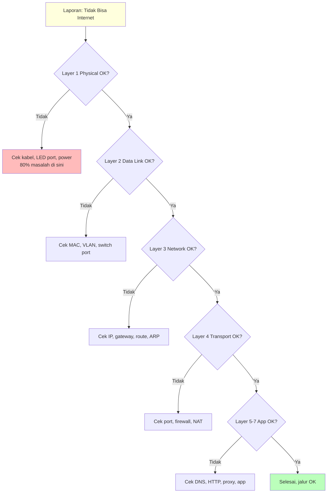

# 🌐 Bab 5: Mikrotik RouterOS & Troubleshooting

## Mikrotik RouterOS, Firewall, Bandwidth Management, dan Troubleshooting Berlapis OSI

| | |
|:---|:---|
| **Bab** | 5 - Mikrotik & Troubleshooting (Bab Terakhir) |
| **Sub-CPMK** | 5.1 & 5.2 |
| **CPMK** | CPMK-5 |
| **Pertemuan** | 2 x 150 menit |

---

## 🎯 Tujuan Pembelajaran Bab Ini

Setelah mempelajari Bab 5 ini, mahasiswa diharapkan mampu:

1. **Menjelaskan** apa itu Mikrotik RouterOS, perbedaannya dengan Cisco IOS, dan mengapa Mikrotik populer di Indonesia (Sub-CPMK 5.1).
2. **Mengoperasikan** Mikrotik via Winbox, WebFig, dan CLI untuk konfigurasi dasar (IP, gateway, DHCP, NAT).
3. **Mengonfigurasi** firewall Mikrotik (filter rules untuk input/forward/output, NAT masquerade) sesuai skenario jaringan kecil.
4. **Mengonfigurasi** bandwidth management dengan queue simple dan queue tree untuk QoS (Sub-CPMK 5.1).
5. **Mendiagnosis** gangguan konektivitas berlapis OSI (Layer 1-7) menggunakan `ping`, `traceroute`, `arp`, `nslookup`, dan Wireshark (Sub-CPMK 5.2).
6. **Memperbaiki** gangguan jaringan hingga layanan pulih sesuai indikator, dengan dokumentasi langkah troubleshooting.
7. **Menyadari** dimensi spiritual dari troubleshooting jaringan sebagai bentuk muhasabah dan perbaikan diri dalam perspektif Islam.

> 📌 **Pemetaan Sub-CPMK:** Bab ini adalah bab penutup yang menjawab dua Sub-CPMK terakhir, menopang **CPMK-5** (Mendiagnosis dan memperbaiki gangguan jaringan dasar):
> - **Sub-CPMK 5.1** = Mikrotik RouterOS - sub-bab 5.1-5.4
> - **Sub-CPMK 5.2** = Troubleshooting berlapis OSI - sub-bab 5.5-5.7

---

# Bagian A: Mikrotik RouterOS (Sub-CPMK 5.1)

## 5.1 Pengantar Mikrotik RouterOS

### 5.1.1 Apa itu Mikrotik?

**Mikrotik** adalah perusahaan teknologi Latvia yang memproduksi router dan perangkat jaringan dengan sistem operasi sendiri bernama **RouterOS**. Berbeda dengan Cisco yang mahal dan proprietary, Mikrotik menawarkan:

- **Harga terjangkau**: Router Mikrotik mulai dari ratusan ribu rupiah (hEX Lite) hingga jutaan (CCR series).
- **Fitur lengkap**: routing, firewall, VPN, hotspot, bandwidth management, wireless, containerization.
- **RouterOS license level** (Level 4 default, Level 6 untuk enterprise).
- **Komunitas besar di Indonesia**: Mikrotik sangat populer di ISP, UMKM, kampus, dan home-lab Indonesia.

Mikrotik adalah pilihan **de facto** untuk:
- **ISP RT/RW Net** di Indonesia (hampir 90% pakai Mikrotik).
- **UMKM kafe, kos, hotel** untuk WiFi hotspot + billing.
- **Lab kampus** untuk praktikum jaringan.
- **Sertifikasi MTCNA** (Mikrotik Training Center Network Associate) - setara CCNA untuk Mikrotik.

### 5.1.2 Cara Akses Mikrotik

Mikrotik bisa dikonfigurasi via beberapa cara:

| Metode | Port | Use Case |
|:---|:---|:---|
| **Winbox** (GUI Windows) | TCP 8291 | Paling populer, fitur lengkap, eksklusif Windows |
| **WebFig** (Web GUI) | TCP 80/443 | Cross-platform via browser |
| **CLI via SSH/Telnet** | TCP 22/23 | Otomasi script, remote Linux/Mac |
| **MAC Telnet** | Layer 2 | Akses tanpa IP (recovery saat misconfig IP) |
| **API** | TCP 8728/8729 | Integrasi aplikasi (PHP, Python) |

**Winbox** adalah tool GUI resmi Mikrotik yang paling umeng dipakai. Download gratis dari https://mikrotik.com/download. Winbox bisa berjalan di Linux/Mac via Wine.

### 5.1.3 Skenario Lab Mikrotik

Untuk praktik Mikrotik, ada 3 opsi:

1. **Mikrotik CHR (Cloud Hosted Router)**: image VM gratis (level license gratis), bisa jalan di VirtualBox/VMware/KVM. Cocok untuk lab tanpa hardware fisik.

2. **GNS3 dengan image RouterOS**: simulasi topologi kompleks dengan multiple Mikrotik.

3. **Mikrotik fisik** (hEX, hAP, RB951): perangkat asli, paling realistis tapi butuh biaya.

Untuk D3 TI UNIMMA, rekomendasi: **CHR di VirtualBox** untuk lab dasar (gratis, lengkap), **hEX fisik** untuk lab lanjutan (sekitar Rp 500 ribu).

### 5.1.4 Setup Awal Mikrotik CHR di VirtualBox

```bash
# Download CHR image dari Mikrotik
# https://www.mikrotik.com/download (CHR, raw image)

# Konversi raw ke VDI untuk VirtualBox
VBoxManage convertfromraw chr-7.14.img chr.vdi

# Buat VM baru di VirtualBox
# - RAM: 256 MB cukup
# - Disk: chr.vdi
# - Network: Bridged (agar dapat IP dari router rumah)

# Boot VM, login default:
# User: admin
# Password: (kosong, tekan Enter langsung)
```

Setelah login, setup IP:

```
[admin@MikroTik] > /ip address add address=192.168.1.2/24 interface=ether1
[admin@MikroTik] > /ip route add gateway=192.168.1.1
[admin@MikroTik] > /ip dns set servers=8.8.8.8,1.1.1.1
```

Setelah ini, Mikrotik bisa diakses via Winbox dari host (IP 192.168.1.2).

---

## 5.2 Konfigurasi Dasar Mikrotik

### 5.2.1 Konfigurasi via Winbox

Winbox menyediakan GUI lengkap untuk semua fitur Mikrotik. Setelah login:

1. **Identity**: System -> Identity, set nama router (mis. `MikroTik-TokoKita`).
2. **Password admin**: System -> Password, set password kuat.
3. **Interface**: lihat semua interface di sidebar Interfaces.
4. **IP Address**: IP -> Address, tambah IP per interface.
5. **Route**: IP -> Routes, set default gateway.
6. **DNS**: IP -> DNS, set DNS server + allow remote request (jika router juga DNS forwarder).
7. **DHCP Server**: IP -> DHCP Server, wizard setup.
8. **NAT**: IP -> Firewall, tab NAT, tambah masquerade rule.

### 5.2.2 Konfigurasi via CLI (Equivalent)

Berikut CLI equivalent untuk setup dasar Mikrotik sebagai gateway rumah/UMKM:

```
# Set identity
/system identity set name="MikroTik-TokoKita"

# Set password admin (WAJIB, default kosong)
/password
old password: (tekan Enter)
new password: ********
confirm password: ********

# Konfigurasi IP interface WAN (ether1 ke ISP)
/ip address add address=192.168.1.2/24 interface=ether1 comment="WAN-ISP"

# Konfigurasi IP interface LAN (ether2 ke switch internal)
/ip address add address=10.10.10.1/24 interface=ether2 comment="LAN-Internal"

# Default route ke ISP gateway
/ip route add dst-address=0.0.0.0/0 gateway=192.168.1.1 comment="Default-ISP"

# DNS server
/ip dns set servers=8.8.8.8,1.1.1.1 allow-remote-requests=yes

# DHCP Server untuk LAN
/ip pool add name=dhcp-pool-lan ranges=10.10.10.100-10.10.10.200
/ip dhcp-server add name=dhcp-lan interface=ether2 address-pool=dhcp-pool-lan lease-time=1d disabled=no
/ip dhcp-server network add address=10.10.10.0/24 gateway=10.10.10.1 dns-server=10.10.10.1,8.8.8.8 domain=tokokita.local

# NAT Masquerade (PAT) untuk LAN bisa akses internet
/ip firewall nat add chain=srcnat src-address=10.10.10.0/24 out-interface=ether1 action=masquerade comment="NAT-LAN-to-WAN"
```

### 5.2.3 Verifikasi Setup

```
# Lihat semua IP
[admin@MikroTik] > /ip address print
Flags: X - disabled, I - invalid, D - dynamic
 #   ADDRESS            NETWORK         INTERFACE
 0   192.168.1.2/24     192.168.1.0     ether1
 1   10.10.10.1/24      10.10.10.0      ether2

# Lihat route
[admin@MikroTik] > /ip route print
Flags: X - disabled, A - active, D - dynamic, C - connect, S - static, r - rip, b - bgp, o - ospf, m - mme, B - blackhole, U - unreachable, P - prohibit
 #      DST-ADDRESS        PREF-SRC        GATEWAY            DISTANCE
 0 A S  0.0.0.0/0                          192.168.1.1              1
 1 ADC  10.10.10.0/24      10.10.10.1      ether2                  0
 2 ADC  192.168.1.0/24     192.168.1.2     ether1                  0

# Lihat DHCP lease
[admin@MikroTik] > /ip dhcp-server lease print
 # ADDRESS         MAC-ADDRESS       HOST-NAME         STATUS    LAST-SEEN
 0 10.10.10.100    00:90:2B:3C:4D:5E PC-Produksi       bound     5m32s
 1 10.10.10.101    00:D0:D3:A8:9C:10 HP-Marketing      bound     4m21s

# Test dari Mikrotik
[admin@MikroTik] > /ping 8.8.8.8 count=4
SEQ HOST                                     SIZE TTL TIME       STATUS
  0 8.8.8.8                                   56  57 12ms321us
  1 8.8.8.8                                   56  57 11ms982us
  2 8.8.8.8                                   56  57 12ms111us
  3 8.8.8.8                                   56  57 12ms456us
  sent=4 received=4 packet-loss=0%

# Test DNS resolve
[admin@MikroTik] > /ping google.com count=4
  SEQ HOST                                     SIZE TTL TIME       STATUS
  0 142.250.193.78                             56  57 18ms234us
  ...
```

### 5.2.4 Backup dan Restore Konfigurasi

Best practice: backup konfigurasi sebelum dan setelah perubahan besar.

```
# Backup binary (full)
/system backup save name=tokokita-config-2026-07-15

# Export konfigurasi sebagai script (text, bisa dibaca)
/export file=tokokita-export-2026-07-15.rsc

# Restore dari backup binary
/system backup load name=tokokita-config-2026-07-15

# Atau import script (text edit dulu jika perlu)
/import file=tokokita-export-2026-07-15.rsc
```

Simpan backup di tempat aman (off-device). Jika Mikrotik rusak, restore ke perangkat baru dalam menit.

---

## 5.3 Firewall Mikrotik

### 5.3.1 Konsep Firewall Mikrotik

Mikrotik firewall berbasis **Netfilter** (sama seperti Linux iptables). Paket difilter di 3 chain utama:

- **INPUT**: packet masuk ke router sendiri (mis. dari internet ke Mikrotik).
- **FORWARD**: packet diteruskan router (mis. dari LAN ke internet atau sebaliknya).
- **OUTPUT**: packet keluar dari router sendiri (mis. dari Mikrotik ke DNS server).

Setiap chain punya rules berurutan. Packet dicocokkan ke rules dari atas ke bawah. Jika match, action dijalankan. Jika tidak match sampai akhir, default action (accept) diterapkan.

### 5.3.2 Default Mikrotik Firewall (Best Practice)

Berikut konfigurasi firewall standar untuk router UMKM:

```
# === INPUT CHAIN (ke router) ===

# 1. Accept established/related (koneksi yang sudah ada)
/ip firewall filter add chain=input connection-state=established,related action=accept comment="Accept established/related"

# 2. Drop invalid packet
/ip firewall filter add chain=input connection-state=invalid action=drop comment="Drop invalid"

# 3. Accept ICMP (ping) dari LAN saja
/ip firewall filter add chain=input protocol=icmp src-address=10.10.10.0/24 action=accept comment="Accept ICMP from LAN"

# 4. Accept Winbox/SSH/WebFig dari LAN saja
/ip firewall filter add chain=input src-address=10.10.10.0/24 protocol=tcp dst-port=8291,22,80,443 action=accept comment="Accept management from LAN"

# 5. Drop semua lainnya dari WAN
/ip firewall filter add chain=input in-interface=ether1 action=drop comment="Drop all from WAN"

# === FORWARD CHAIN (lintas router) ===

# 6. Accept established/related forward
/ip firewall filter add chain=forward connection-state=established,related action=accept comment="Accept forward established"

# 7. Drop invalid forward
/ip firewall filter add chain=forward connection-state=invalid action=drop comment="Drop forward invalid"

# 8. Accept LAN to WAN
/ip firewall filter add chain=forward src-address=10.10.10.0/24 out-interface=ether1 action=accept comment="Allow LAN to WAN"

# 9. Drop WAN to LAN (default deny)
/ip firewall filter add chain=forward in-interface=ether1 out-interface=ether2 action=drop comment="Drop WAN to LAN"

# === OUTPUT CHAIN (dari router) ===

# 10. Accept semua output dari router (router trusted)
/ip firewall filter add chain=output action=accept comment="Accept all output"
```

### 5.3.3 NAT (Network Address Translation)

Selain filter, firewall Mikrotik juga mengelola NAT. Untuk PAT (LAN share 1 IP WAN):

```
# Masquerade untuk LAN ke internet
/ip firewall nat add chain=srcnat src-address=10.10.10.0/24 out-interface=ether1 action=masquerade comment="Masquerade LAN to WAN"

# Port forwarding: akses RDP internal dari internet
/ip firewall nat add chain=dstnat dst-port=3389 protocol=tcp in-interface=ether1 action=dst-nat to-addresses=10.10.10.50 to-ports=3389 comment="Port Forward RDP"

# Port forwarding: web server internal
/ip firewall nat add chain=dstnat dst-port=80,443 protocol=tcp in-interface=ether1 action=dst-nat to-addresses=10.10.10.100 comment="Port Forward Web"
```

### 5.3.4 Connection Tracking

Mikrotik melacak koneksi aktif di `/ip firewall connection`. Berguna untuk troubleshooting:

```
# Lihat semua koneksi aktif
[admin@MikroTik] > /ip firewall connection print

# Filter koneksi ke IP tertentu
[admin@MikroTik] > /ip firewall connection print where dst-address~"8.8.8.8"

# Hitung jumlah koneksi per IP source (untuk detect abuse)
[admin@MikroTik] > /ip firewall connection print detail count-only where src-address~"10.10.10."
```

### 5.3.5 Mitigasi Serangan Dasar

**1. Anti Brute Force SSH/Winbox:**

```
# Drop IP yang gagal login 5x dalam 1 menit
/ip firewall filter
add chain=input protocol=tcp dst-port=22 src-address-list=ssh_blacklist action=drop comment="Drop SSH brute forcers"
add chain=input protocol=tcp dst-port=22 connection-state=new src-address-list=ssh_stage3 action=add-src-to-address-list address-list=ssh_blacklist address-list-timeout=1d
add chain=input protocol=tcp dst-port=22 connection-state=new src-address-list=ssh_stage2 action=add-src-to-address-list address-list=ssh_stage3 address-list-timeout=1m
add chain=input protocol=tcp dst-port=22 connection-state=new src-address-list=ssh_stage1 action=add-src-to-address-list address-list=ssh_stage2 address-list-timeout=1m
add chain=input protocol=tcp dst-port=22 connection-state=new action=add-src-to-address-list address-list=ssh_stage1 address-list-timeout=1m
```

**2. Anti DDoS TCP SYN Flood:**

```
/ip firewall filter
add chain=forward protocol=tcp tcp-flags=syn connection-state=new action=add-src-to-address-list address-list=ddos-target address-list-timeout=10s
add chain=forward protocol=tcp tcp-flags=syn connection-state=new src-address-list=ddos-target action=drop
```

**3. Block port scanner (nmap detect):**

```
/ip firewall filter
add chain=input protocol=tcp psd=21,3s,3,1 action=drop comment="Drop port scanner"
add chain=input protocol=tcp tcp-flags=fin,syn,rst,ack,rst action=drop comment="Drop SYN-RST scan"
add chain=input protocol=tcp tcp-flags=fin,syn,rst,ack,fin action=drop comment="Drop SYN-FIN scan"
```

---

## 5.4 Bandwidth Management (Queue)

### 5.4.1 Mengapa Butuh Bandwidth Management?

Tanpa QoS, satu user yang download torrent bisa menghabiskan seluruh bandwidth internet, sementara user lain tidak bisa browsing. Bandwidth management memastikan:

- **Fairness**: setiap user dapat share yang adil.
- **Priority**: voice/video call lebih prioritas dari download.
- **Cap**: limit per user agar tidak abuse (mis. maks 5 Mbps per user).

### 5.4.2 Jenis Queue di Mikrotik

| Jenis | Karakteristik | Use Case |
|:---|:---|:---|
| **Simple Queue** | Limit per IP/host dengan rate tetap, mudah konfigurasi | UMKM kecil, limit per karyawan |
| **Queue Tree** | Hierarki dengan prioritas, complex but powerful | ISP, enterprise dengan multiple kelas trafik |
| **PCQ (Per Connection Queue)** | Bagi bandwidth merata antar semua koneksi | Warnet, hotspot (fairness otomatis) |
| **Queue Type** | Konfigurasi algoritma (pfifo, bfifo, pcq, mq-pfifo) | Custom tuning |

### 5.4.3 Simple Queue

Konfigurasi paling sederhana: limit per IP.

```
# Limit PC Produksi (10.10.10.100) ke 10 Mbps download, 5 Mbps upload
/queue simple add name="PC-Produksi" target=10.10.10.100/32 max-limit=10M/5M

# Limit semua karyawan (10.10.10.0/24) share 50 Mbps
/queue simple add name="All-Staff" target=10.10.10.0/24 max-limit=50M/50M

# Queue dengan time-based (work hours lebih ketat)
/queue simple add name="Staff-Work-Hours" target=10.10.10.0/24 max-limit=20M/20M time=8h-17h,mon,tue,wed,thu,fri
/queue simple add name="Staff-After-Hours" target=10.10.10.0/24 max-limit=50M/50M time=17h-8h,mon,tue,wed,thu,fri,sat,sun
```

Format `max-limit=DOWN/UP`. Mis. `10M/5M` = 10 Mbps download, 5 Mbps upload.

### 5.4.4 Queue Tree (Advanced)

Queue tree memungkinkan prioritas antar jenis trafik. Contoh: voice call prioritas tinggi, web browsing medium, download file low.

```
# 1. Mark trafik berdasarkan jenis
/ip firewall mangle
add chain=prerouting protocol=udp dst-port=5060,10000-20000 action=mark-connection new-connection-mark=voip-conn
add chain=prerouting connection-mark=voip-conn action=mark-packet new-packet-mark=voip-pkt
add chain=prerouting protocol=tcp dst-port=80,443 action=mark-connection new-connection-mark=web-conn
add chain=prerouting connection-mark=web-conn action=mark-packet new-packet-mark=web-pkt
add chain=prerouting protocol=tcp dst-port=21,8080 action=mark-connection new-connection-mark=download-conn
add chain=prerouting connection-mark=download-conn action=mark-packet new-packet-mark=download-pkt

# 2. Buat queue type PCQ (fairness)
/queue type add name="pcq-download" kind=pcq pcq-classifier=dst-address
/queue type add name="pcq-upload" kind=pcq pcq-classifier=src-address

# 3. Buat queue tree parent (total 50 Mbps)
/queue tree add name="Total-Bandwidth" parent=ether2 max-limit=50M

# 4. Child queues dengan prioritas (lower = higher priority)
/queue tree add name="VoIP" parent=Total-Bandwidth packet-mark=voip-pkt priority=1 queue=pcq-download max-limit=10M
/queue tree add name="Web" parent=Total-Bandwidth packet-mark=web-pkt priority=3 queue=pcq-download max-limit=30M
/queue tree add name="Download" parent=Total-Bandwidth packet-mark=download-pkt priority=8 queue=pcq-download max-limit=10M
```

Hasil: VoIP selalu dapat prioritas tertinggi (maks 10 Mbps), Web medium (maks 30 Mbps), Download low (maks 10 Mbps). Total tidak melebihi 50 Mbps parent.

### 5.4.5 PCQ untuk Fairness Otomatis

PCQ (Per Connection Queue) membagi bandwidth merata antar semua koneksi aktif. Cocok untuk hotspot/warnet.

```
# Total 20 Mbps untuk hotspot, dibagi rata antar semua user aktif
/queue type add name="pcq-down" kind=pcq pcq-classifier=dst-address pcq-rate=0
/queue type add name="pcq-up" kind=pcq pcq-classifier=src-address pcq-rate=0

/queue tree add name="Hotspot-Down" parent=ether2 queue=pcq-down max-limit=20M
/queue tree add name="Hotspot-Up" parent=ether1 queue=pcq-up max-limit=20M
```

Jika 5 user aktif, masing-masing dapat ~4 Mbps. Jika 20 user aktif, masing-masing dapat ~1 Mbps. Otomatis adaptif.

### 5.4.6 Verifikasi Queue

```
# Lihat semua simple queue
[admin@MikroTik] > /queue simple print
 # NAME            TARGET           MAX-LIMIT       RATE
 0 PC-Produksi    10.10.10.100/32  10M/5M          3.2M/1.1M
 1 All-Staff      10.10.10.0/24    50M/50M         18.5M/8.2M

# Lihat traffic real-time per queue
[admin@MikroTik] > /queue simple monitor 0
   rate: 3.2Mbps/1.1Mbps
   bytes: 1234567890/987654321
   packets: 1234567/987654
```

Di Winbox, ada grafik real-time untuk visualisasi trafik per queue.

### 5.4.7 Lab Praktik Mikrotik

**Lab:** Setup Mikrotik CHR untuk UMKM TokoKita.

**Skenario:**

- WAN: ether1 ke ISP (IP dari DHCP ISP atau static 192.168.1.2/24).
- LAN: ether2 ke switch internal (IP 10.10.10.1/24).
- DHCP Server untuk LAN.
- NAT Masquerade LAN ke WAN.
- Firewall standar (input drop dari WAN, forward LAN-WAN allow).
- Simple Queue: boss (10.10.10.50) 20 Mbps, karyawan lain share 30 Mbps.
- Port forwarding: web server internal 10.10.10.100 port 80/443.

**Verifikasi:**

1. PC LAN dapat IP via DHCP, gateway 10.10.10.1, DNS 8.8.8.8.
2. PC LAN bisa ping `8.8.8.8` (NAT berfungsi).
3. PC LAN bisa browsing (DNS resolve + NAT).
4. Dari internet (simulasi), akses `http://192.168.1.2` -> web server internal (port forward).
5. Test queue: download file dari 2 PC, boss dapat 20 Mbps, karyawan share 30 Mbps.
6. Test firewall: dari WAN, coba SSH ke Mikrotik (harus drop), dari LAN SSH (harus allow).

Submit: export konfigurasi Mikrotik (`.rsc`), screenshot Winbox queue, hasil verifikasi.

---
# Bagian B: Troubleshooting Berlapis OSI (Sub-CPMK 5.2)

## 5.5 Metodologi Troubleshooting

### 5.5.1 Pendekatan Bottom-Up (Layer 1 ke Layer 7)

Metodologi paling efektif untuk troubleshooting jaringan adalah **bottom-up**: mulai dari Layer 1 (physical), naik ke Layer 7 (application). Alasannya: jika Layer 1 down, Layer 2-7 otomatis down. Perbaiki Layer 1 dulu sebelum analisa Layer 7.



### 5.5.2 Tool Troubleshooting per Layer

| Layer | Tool | Fungsi |
|:---:|:---|:---|
| 1 Physical | `show interface`, LED port, kabel tester | Cek link up/down, error counter |
| 2 Data Link | `show mac address-table`, `arp -a` | Cek MAC table, ARP resolution |
| 3 Network | `ping`, `traceroute`, `show ip route` | Cek konektivitas IP, routing |
| 4 Transport | `telnet IP port`, `netstat`, `nmap` | Cek port open, koneksi TCP |
| 5-7 App | `nslookup`, `dig`, `curl -v`, browser dev tool | Cek DNS, HTTP, app layer |
| All layers | Wireshark | Capture dan analisis paket detail |

---

## 5.6 Troubleshooting Layer per Layer

### 5.6.1 Layer 1: Physical

**Gejala umum:**
- LED port switch/PC tidak nyala.
- `show interface` menampilkan status `down` atau `err-disabled`.
- Koneksi putus-putus (intermittent).

**Diagnosis:**

```
! Di Cisco switch
SW1# show interface FastEthernet0/1
FastEthernet0/1 is down, line protocol is down (notconnect)
  Hardware is Fast Ethernet, address is 001a.2b3c.4d5e
  ...
  5 minute input rate 0 bits/sec, 0 packets/sec
  5 minute output rate 0 bits/sec, 0 packets/sec
     0 packets input, 0 bytes
     0 packets output, 0 bytes
     0 input errors, 0 CRC, 0 frame, 0 overrun, 0 ignored
     0 output errors, 0 collisions, 0 interface resets
```

Jika `down/down`: masalah kabel atau port lawan mati.

**Checklist Layer 1:**

1. **Kabel tertancap?** Cek fisik di kedua ujung.
2. **LED port menyala?** Hijau = link up, kuning = activity, off = no link.
3. **Kabel rusak?** Swap dengan kabel lain untuk verifikasi.
4. **Jenis kabel benar?** Straight-through untuk PC-switch, cross-over untuk PC-PC atau switch-switch (auto-MDIX modern mengatasi ini).
5. **Power perangkat?** Switch/AP/router menyala?
6. **Interface shutdown?** `no shutdown` di Cisco, atau enable di Mikrotik.
7. **Speed/duplex mismatch?** Pakai auto-negotiation atau set manual konsisten.

```
! Force speed dan duplex jika auto-negotiation bermasalah
SW1(config)# interface FastEthernet0/1
SW1(config-if)# speed 100
SW1(config-if)# duplex full
SW1(config-if)# no shutdown
```

**Insight:** 80% masalah jaringan rumah/kantor sebenarnya masalah Layer 1. Sebelum analisis paket yang rumit, cek dulu kabel.

### 5.6.2 Layer 2: Data Link

**Gejala umum:**
- LED link up tapi tidak bisa komunikasi.
- ARP table kosong atau tidak lengkap.
- Switch meneruskan frame ke port salah.

**Diagnosis:**

```
! Cek MAC table switch
SW1# show mac address-table

! Cek ARP di PC
C:\> arp -a
Interface: 192.168.1.10 --- 0x4
  Internet Address      Physical Address      Type
  192.168.1.1           00-1a-2b-3c-4d-5e     dynamic
  192.168.1.50          00-90-2b-3c-4d-5e     dynamic

! Cek ARP di router
R1# show arp
Protocol  Address          Age (min)  Hardware Addr   Type   Interface
Internet  10.0.0.1               -   0050.56ab.cd12  ARPA   GigabitEthernet0/0
Internet  10.0.0.2              12   0090.2b3c.4d5e  ARPA   GigabitEthernet0/0

! Cek VLAN port
SW1# show vlan brief
SW1# show interfaces FastEthernet0/1 switchport
Name: Fa0/1
Switchport: Enabled
Administrative Mode: static access
Operational Mode: static access
Administrative Access VLAN: 10
Operational Access VLAN: 10
```

**Checklist Layer 2:**

1. **Port di VLAN yang benar?** Cek `show vlan brief`.
2. **Trunk up?** Cek `show interfaces trunk`.
3. **MAC table diisi?** Switch belajar MAC source.
4. **ARP resolve?** PC dapat MAC gateway.
5. **VLAN mismatch?** Port access salah VLAN = isolasi.
6. **STP blocking?** Spanning tree block port untuk cegah loop.

### 5.6.3 Layer 3: Network

**Gejala umum:**
- Ping gateway timeout.
- Ping antar subnet gagal.
- Routing tidak konvergen.

**Diagnosis:**

```
! Ping gateway
C:\> ping 192.168.1.1
Pinging 192.168.1.1 with 32 bytes of data:
Request timed out.

! Traceroute
C:\> tracert 8.8.8.8
Tracing route to 8.8.8.8 over a maximum of 30 hops
  1     *     *     *     Request timed out.
  2  ...

! Cek IP config PC
C:\> ipconfig
IPv4 Address. . . . . . . . . . . : 192.168.1.10
Subnet Mask . . . . . . . . . . . : 255.255.255.0
Default Gateway . . . . . . . . . : 192.168.1.1

! Cek route di router
R1# show ip route
R1# show ip ospf neighbor
```

**Checklist Layer 3:**

1. **IP PC benar?** Cek `ipconfig` / `ip addr`.
2. **Subnet mask benar?** Bisa ping gateway kalau same subnet.
3. **Gateway benar?** Default gateway harus IP router.
4. **Gateway up?** Ping gateway, jika timeout cek `show interface` di router.
5. **Route ada?** `show ip route` di router, pastikan network tujuan terdaftar.
6. **OSPF neighbor up?** Cek `show ip ospf neighbor`, harus FULL.
7. **ACL block?** Cek access-list di interface.

### 5.6.4 Layer 4: Transport

**Gejala umum:**
- Ping berhasil tapi aplikasi gagal (mis. browsing gagal, SSH gagal).
- Koneksi TCP timeout.

**Diagnosis:**

```
! Test port via telnet
C:\> telnet www.tokokita.com 80
Trying 103.43.46.242...
Connection refused  ! port closed

! Test port via PowerShell
PS> Test-NetConnection -ComputerName www.tokokita.com -Port 443

! Di Linux: netcat
$ nc -zv www.tokokita.com 443
Connection to www.tokokita.com 443 port [tcp/https] succeeded!

! Cek port yang listen di server
$ ss -tlnp  ! Linux
$ netstat -an | findstr LISTEN  ! Windows

! Cek koneksi aktif
$ netstat -an | findstr ESTABLISHED
```

**Checklist Layer 4:**

1. **Service running?** `ss -tlnp` di server, pastikan port listen.
2. **Firewall block?** Cek iptables / Windows Firewall / cloud security group.
3. **Port salah?** HTTP=80, HTTPS=443, SSH=22, MySQL=3306, dst.
4. **NAT port forward benar?** Konversi port public ke internal benar.
5. **TCP wrapper?** `/etc/hosts.allow` / `hosts.deny` membatasi akses.

### 5.6.5 Layer 5-7: Application

**Gejala umum:**
- IP bisa ping, port terbuka, tapi aplikasi gagal (mis. web error 500, DNS tidak resolve).
- HTTP redirect loop, certificate error.

**Diagnosis:**

```
! DNS lookup
C:\> nslookup www.tokokita.com
C:\> nslookup www.tokokita.com 8.8.8.8  ! pakai DNS tertentu

! dig untuk detail lebih
$ dig www.tokokita.com
$ dig MX tokokita.com

! HTTP request dengan curl
$ curl -v https://www.tokokita.com/
$ curl -I https://www.tokokita.com/  ! header only

! Cek certificate TLS
$ openssl s_client -connect www.tokokita.com:443 -servername www.tokokita.com

! Browser DevTools (F12)
! - Tab Network: lihat request/response
! - Tab Console: error JavaScript
! - Tab Application: cookie, localStorage
```

**Checklist Layer 5-7:**

1. **DNS resolve?** `nslookup` kembalikan IP yang benar.
2. **HTTP status code?** 200=OK, 301/302=redirect, 404=not found, 500=server error.
3. **TLS valid?** Certificate tidak expired, hostname cocok.
4. **Proxy setting?** Browser pakai proxy yang benar (atau no proxy).
5. **Cookie session valid?** Login expired mungkin.
6. **CORS / CSP block?** Untuk web app modern.

### 5.6.6 Wireshark untuk Troubleshooting Deep

Jika tool dasar tidak menemukan masalah, Wireshark adalah senjata terakhir:

1. **Capture saat masalah terjadi** di interface relevan.
2. **Filter** berdasarkan IP / port / protocol.
3. **Follow TCP Stream** untuk lihat percakapan end-to-end.
4. **Analyze TCP flags**: SYN without SYN-ACK = server tidak respon; RST = koneksi direset; retransmission = packet loss.

Contoh analisis: user complaint "tidak bisa akses web X". Capture di PC user:

- Filter `http.host == "web-x.com"`.
- Lihat apakah ada DNS query (jika tidak, masalah DNS).
- Lihat apakah ada TCP SYN ke IP web X (jika tidak, masalah routing).
- Lihat apakah SYN-ACK kembali (jika tidak, masalah firewall web X atau internet).
- Lihat apakah HTTP GET dikirim (jika tidak, masalah browser/proxy).
- Lihat HTTP response code (403, 500, dll).

---

## 5.7 Studi Kasus Troubleshooting

### 5.7.1 Skenario 1: PC Tidak Bisa Internet

**Laporan:** "PC saya tidak bisa browsing, padahal kemarin masih bisa."

**Diagnosis Step-by-Step:**

**Step 1 - Layer 1:**

```
C:\> ipconfig
IPv4 Address. . . . . . . . . . . : 169.254.10.50  ! APIPA - DHCP gagal
Subnet Mask . . . . . . . . . . . : 255.255.0.0
Default Gateway . . . . . . . . . :  ! kosong
```

IP `169.254.x.x` = APIPA = DHCP tidak merespons. Kemungkinan: kabel putus, switch port mati, DHCP server down.

**Step 2 - Cek fisik:**

- Cek LED port PC: tidak nyala. **Root cause: kabel longgar.**
- Tancapkan kembali, LED hijau nyala.

**Step 3 - Release/renew DHCP:**

```
C:\> ipconfig /release
C:\> ipconfig /renew

C:\> ipconfig
IPv4 Address. . . . . . . . . . . : 192.168.1.50  ! dapat IP benar
Default Gateway . . . . . . . . . : 192.168.1.1
```

**Step 4 - Verifikasi:**

```
C:\> ping 192.168.1.1  ! ping gateway
Reply from 192.168.1.1: bytes=32 time=1ms TTL=255

C:\> ping 8.8.8.8  ! ping internet
Reply from 8.8.8.8: bytes=32 time=12ms TTL=57

C:\> ping google.com  ! ping nama = test DNS
Reply from 142.250.193.78: bytes=32 time=15ms TTL=57
```

**Solusi:** Kabel longgar, tancapkan kembali. Issue resolved.

### 5.7.2 Skenario 2: Sebagian Subnet Tidak Bisa Akses Server

**Laporan:** "VLAN 10 bisa akses server 192.168.99.10, tapi VLAN 20 tidak bisa."

**Diagnosis:**

**Step 1 - Layer 3 dari VLAN 20:**

```
PC-VLAN20> ping 192.168.99.10
Pinging 192.168.99.10 with 32 bytes of data:
Request timed out.

PC-VLAN20> ping 192.168.20.1  ! gateway VLAN 20
Reply from 192.168.20.1: bytes=32 time=1ms TTL=255

PC-VLAN20> tracert 192.168.99.10
Tracing route to 192.168.99.10 over a maximum of 30 hops
  1     1 ms     1 ms     1 ms  192.168.20.1
  2     *        *        *     Request timed out.  ! router tidak forward
```

Gateway bisa di-ping, tapi traceroute ke 192.168.99.10 stuck di router.

**Step 2 - Cek routing di L3 Switch:**

```
L3-SW# show ip route | include 192.168.99
C    192.168.99.0/24 is directly connected, Vlan99
```

Route ada, VLAN 99 SVI up.

**Step 3 - Cek ACL:**

```
L3-SW# show ip access-lists
Extended IP access list 101
    10 deny ip 192.168.20.0 0.0.0.255 192.168.99.0 0.0.0.255  ! BINGO! ACL block
    20 permit ip any any
```

**Root cause:** ACL 101 deny VLAN 20 ke VLAN 99 (mungkin salah konfigurasi, seharusnya hanya Guest yang di-block).

**Solusi:** Hapus atau modify ACL:

```
L3-SW(config)# ip access-list extended 101
L3-SW(config-ext-nacl)# no 10  ! hapus deny
L3-SW(config-ext-nacl)# exit
```

Verifikasi: PC VLAN 20 sekarang bisa ping 192.168.99.10.

### 5.7.3 Skenario 3: WiFi Connect tapi Tidak Bisa Browsing

**Laporan:** "Saya connect WiFi kampus, dapat IP, tapi browsing gagal."

**Diagnosis:**

**Step 1 - Cek IP:**

```
C:\> ipconfig
IPv4 Address. . . . . . . . . . . : 10.10.99.50
Default Gateway . . . . . . . . . : 10.10.99.1
DHCP Servers......................: 10.10.99.1
```

IP dapat, gateway ada.

**Step 2 - Ping gateway:**

```
C:\> ping 10.10.99.1
Reply from 10.10.99.1: bytes=32 time=2ms TTL=255
```

Gateway OK.

**Step 3 - Ping internet:**

```
C:\> ping 8.8.8.8
Reply from 8.8.8.8: bytes=32 time=15ms TTL=57
```

Internet OK, NAT berfungsi.

**Step 4 - Ping nama:**

```
C:\> ping google.com
Ping request could not find host google.com. Please check the name and try again.
```

DNS gagal! Cek DNS server:

```
C:\> nslookup google.com 8.8.8.8  ! pakai DNS Google langsung
Server:  dns.google
Address: 8.8.8.8
Non-authoritative answer:
Name:    google.com
Addresses:  142.250.193.78

C:\> nslookup google.com  ! pakai DNS default dari DHCP
DNS request timed out.
```

DNS Google bisa, DNS kampus (dari DHCP) timeout. **Root cause:** DNS server kampus down atau firewall block port 53 dari VLAN WiFi.

**Step 5 - Solusi sementara di PC:**

Ganti DNS manual ke 8.8.8.8 dan 1.1.1.1.

**Step 6 - Solusi permanen:**

Lapor admin kampus untuk fix DNS server. Sementara, admin bisa ganti `dns-server` di DHCP pool WiFi ke 8.8.8.8.

### 5.7.4 Template Dokumentasi Troubleshooting

Setiap troubleshooting harus didokumentasikan untuk pembelajaran:

```markdown
# Laporan Troubleshooting

## Informasi Insiden
- Tanggal: 15 Juli 2026, 10:30 WIB
- Pelapor: Andi (Marketing)
- Gejala: "Tidak bisa akses server payroll sejak pagi"

## Diagnosis
| Step | Layer | Test | Hasil | Kesimpulan |
|---|---|---|---|---|
| 1 | L1 | Cek kabel | OK | Bukan L1 |
| 2 | L2 | arp -a | Gateway ada | OK |
| 3 | L3 | ping gateway | OK | OK |
| 4 | L3 | ping server | Timeout | L3 issue |
| 5 | L3 | tracert server | Stuck di router | Routing/ACL |
| 6 | L3 | show ip route | Route ada | Bukan routing |
| 7 | L3 | show access-list | ACL block | ROOT CAUSE |

## Root Cause
ACL 101 deny VLAN 20 ke VLAN 99 (salah konfigurasi, seharusnya hanya Guest yang di-block).

## Solusi
Hapus baris deny di ACL 101:
`L3-SW(config-ext-nacl)# no 10`

## Verifikasi
- Ping dari PC Marketing ke server payroll: BERHASIL
- Aplikasi payroll: BERHASIL login

## Lessons Learned
- Sebelum apply ACL di production, test di lab.
- Dokumentasi ACL harus jelas: siapa boleh akses siapa.
- Sertakan rollback plan jika ACL bermasalah.

## Tindakan Pencegahan
- Code review semua perubahan ACL.
- Change management: jangan ubah ACL di jam kerja tanpa approval.
- Monitoring: alert jika ACL deny count naik signifikan.
```

### 5.7.5 Lab Simulasi Troubleshooting

Dosen menyiapkan beberapa skenario misconfig di lab Packet Tracer. Mahasiswa diagnose dan fix:

1. **Skenario A:** PC VLAN 10 tidak dapat IP (DHCP pool exclude salah).
2. **Skenario B:** Inter-VLAN routing gagal (sub-interface router typo).
3. **Skenario C:** OSPF neighbor stuck EXSTART (MTU mismatch).
4. **Skenario D:** Internet tidak bisa diakses (NAT inside/outside tertukar).
5. **Skenario E:** WiFi connect tapi tidak bisa browsing (DNS server typo).
6. **Skenario F:** Sebagian user bisa internet, sebagian tidak (ACL salah subnet).

Mahasiswa kerjakan minimal 3 skenario, dokumentasikan dengan template di atas, presentasikan ke kelas.

---

## 🕌 Refleksi Islami: Troubleshooting sebagai Muhasabah

> *"Hai orang-orang yang beriman, bertakwalah kepada Allah dan hendaklah setiap diri memperhatikan apa yang telah diperbuatnya untuk hari esok."*
> *(QS. Al-Hasyr [59]: 18)*

> *"Dan sungguh, Kami telah berulang-ulang (memberi peringatan) kepada manusia dalam Al-Qur'an ini. Namun kebanyakan manusia tidak mau menerima kecuali mengingkari."*
> *(QS. Al-Isra [17]: 41)*

### Tiga Dimensi Spiritual Troubleshooting

**Pertama, Muhasabah (Introspeksi).** Troubleshooting jaringan dimulai dengan introspeksi: "Apa yang salah? Di lapisan mana? Apa yang berubah?". Tanpa muhasabah, kita hanya akan "coba-coba" tanpa akar masalah.

Begitu pula muhasabah diri dalam Islam: setiap muslim dianjurkan introspeksi harian. Umar bin Khattab berkata: *"Hisablah diri kalian sebelum kalian dihisab (Allah), dan beautikan diri kalian sebelum kalian dihisab."* Saat insiden jaringan terjadi, jangan salahkan "hacker" atau "perangkat jelek". Cek dulu konfigurasi kita, log yang kita simpan, dokumentasi yang kita (tidak) tulis.

**Kedua, Sabar dan Sistematis.** Troubleshooting yang buruk = "coba restart dulu, kalau masih gagal coba reboot lagi, kalau masih gagal format install ulang". Pendekatan ini tidak sistematis, boros waktu, dan tidak belajar dari masalah.

Troubleshooting yang baik = bottom-up, Layer 1 dulu, naik perlahan. Butuh kesabaran. *"Dan mintalah pertolongan (kepada Allah) dengan sabar dan shalat."* (QS. Al-Baqarah: 45). Jangan buru-buru menyalahkan hardware sebelum cek kabel. Jangan buru-buru reboot server sebelum cek log.

**Ketiga, Amanah Dokumentasi.** Setiap insiden harus didokumentasikan: gejala, diagnosis, root cause, solusi, lessons learned. Tanpa dokumentasi, insiden yang sama akan terjadi lagi dan tim akan terus mengulang troubleshooting dari nol.

Ini implementasi sabda Nabi: *"Ikatlah untaimu, lalu tawakkal."* Dokumentasi adalah "ikat unta". Setelah kita ikat (dokumentasi), kita tawakkal (serahkan ke Allah hasilnya). Jika insiden serupa terjadi, kita sudah punya runbook.

### Tiga Pertanyaan Reflektif Saat Troubleshooting

Saat Anda dihadapkan pada insiden jaringan, renungkan:

1. **Apakah saya sudah cek Layer 1 sebelum Layer 7?** 80% masalah jaringan adalah Layer 1. Jangan pamer tool mahal jika kabel longgar.
2. **Apakah saya dokumentasi setiap langkah?** Setiap command, setiap output, setiap perubahan. Tanpa dokumentasi, kita tidak belajar dari insiden.
3. **Apakah saya jujur tentang root cause?** Jangan cover-up kesalahan konfigurasi dengan menyalahkan "vendor" atau "hacker". *"Hai orang-orang yang beriman, bertakwalah kepada Allah dan katakanlah perkataan yang benar."* (QS. Al-Ahzab: 70). Kejujuran adalah amanah profesi.

Troubleshooting jaringan, dalam perspektif Islam, bukan sekadar "fix the bug". Ia adalah latihan muhasabah, kesabaran sistematis, dan amanah dokumentasi. Mari menjadi network admin yang tidak hanya teknis cekatan, tetapi juga reflektif dan amanah.

---

## 📝 Ringkasan Bab 5

Bab 5 ini telah membahas Mikrotik RouterOS dan troubleshooting sebagai jawaban atas dua Sub-CPMK terakhir yang menopang CPMK-5. Berikut poin-poin kunci:

**Pertama, Mikrotik RouterOS** adalah sistem operasi router populer di Indonesia (ISP, UMKM, kampus). Diakses via Winbox (GUI Windows), WebFig (web), atau CLI (SSH/Telnet). Setup dasar: IP address, route, DNS, DHCP server, NAT masquerade - semua bisa via Winbox atau CLI.

**Kedua, firewall Mikrotik** berbasis Netfilter dengan 3 chain utama (INPUT, FORWARD, OUTPUT). Best practice: accept established/related, drop invalid, accept management dari LAN, drop semua dari WAN. NAT juga di firewall (masquerade untuk PAT, dst-nat untuk port forwarding).

**Ketiga, bandwidth management** via Simple Queue (limit per IP, mudah) atau Queue Tree (hierarki dengan prioritas, complex). PCQ (Per Connection Queue) untuk fairness otomatis antar user aktif. QoS penting agar satu user tidak monopoly bandwidth.

**Keempat, troubleshooting bottom-up** mulai dari Layer 1 (kabel, LED) ke Layer 7 (DNS, HTTP). 80% masalah jaringan adalah Layer 1 - jangan langsung analisa paket sebelum cek kabel. Tool per layer: `show interface`, `arp`, `ping`, `traceroute`, `telnet`, `nslookup`, Wireshark.

**Kelima, studi kasus troubleshooting** menunjukkan 3 skenario realistis: APIPA (kabel longgar), ACL block antar-VLAN (salah konfigurasi), DNS server down (DNS timeout). Setiap skenario butuh dokumentasi: gejala, diagnosis, root cause, solusi, verifikasi, lessons learned.

**Keenam, perspektif Islam** menempatkan troubleshooting sebagai muhasabah (introspeksi), sabar sistematis, dan amanah dokumentasi. Tiga pertanyaan reflektif saat troubleshooting: cek Layer 1 dulu, dokumentasi setiap langkah, jujur tentang root cause.

## 📚 Referensi Bab 5

1. MikroTik. (2024). *RouterOS Documentation*. https://help.mikrotik.com/docs
2. MikroTik. (2024). *MTCNA Syllabus*. https://mikrotik.com/training/courses
3. Cisco Systems. (2024). *Cisco IOS Configuration Fundamentals Command Reference*. https://www.cisco.com/c/en/us/td/docs/ios-xml/ios/
4. Odom, W. (2020). *CCNA 200-301 Official Cert Guide, Volume 2*. Cisco Press.
5. Wireshark Foundation. (2024). *Wireshark User's Guide*. https://www.wireshark.org/docs/wsug_html_chunked/
6. Stevens, W. R. (1994). *TCP/IP Illustrated, Volume 1: The Protocols*. Addison-Wesley.
7. RFC 2151. (1997). *A Primer On Internet and TCP/IP Tools and Utilities*. IETF.
8. RFC 1035. (1987). *Domain Names - Implementation and Specification*. IETF.
9. Negus, C., & Bresnahan, J. (2022). *Linux Bible* (10th ed.). Wiley.
10. UNIMMA. (2026). *Dokumen Kurikulum KUR-D3TI-2026*. Universitas Muhammadiyah Magelang.

---
# 🎓 PENUTUP EBOOK JARINGAN KOMPUTER

## Selamat! Anda Telah Menyelesaikan Mata Kuliah Jaringan Komputer

Ebook ini telah membawa Anda dalam perjalanan komprehensif dari fondasi jaringan komputer hingga troubleshooting. Mari kita ringkas perjalanan tersebut:

| Bab | Sub-CPMK | Topik Utama |
|:---:|:---|:---|
| **1** | 1.1, 1.2 | OSI 7 lapisan, TCP/IP 4 lapisan, enkapsulasi-dekapsulasi, Wireshark capture dan analisis |
| **2** | 2.1, 2.2 | IPv4 kelas A/B/C/D/E, private vs public IP, subnet mask & CIDR, FLSM, VLSM, IPv6 |
| **3** | 3.1, 3.2, 3.3 | Switch & MAC learning, VLAN 802.1Q, trunking, inter-VLAN routing (router-on-a-stick & L3 switch), static & default route, OSPF single-area |
| **4** | 4.1, 4.2, 4.3 | DHCP DORA, DNS hierarki & record, NAT/PAT, port forwarding, wireless 802.11 a/b/g/n/ac/ax, WPA2/WPA3 |
| **5** | 5.1, 5.2 | Mikrotik RouterOS, Winbox, firewall filter rules, queue simple/tree, troubleshooting berlapis OSI Layer 1-7 |

### 🚀 Roadmap Karir Network Engineering

Setelah lulus D3 TI UNIMMA dengan kompetensi jaringan komputer, berikut roadmap karir yang dapat dikejar:

**Entry Level (0-2 tahun)**

- **Junior Network Administrator**: konfigurasi switch/router, monitoring, troubleshooting dasar.
- **IT Support dengan Fokus Jaringan**: setup WiFi kantor, kabel UTP, basic firewalling.
- **Field Engineer ISP RT/RW**: instalasi Mikrotik + wireless backbone untuk ISP lokal.
- **Network Operations Center (NOC) Analyst**: monitoring 24/7, eskalasi insiden.

**Mid Level (2-5 tahun)**

- **Network Engineer**: design jaringan skala menengah, implementasi VLAN/OSPF/BGP dasar.
- **Mikrotik Consultant**: implementasi Mikrotik untuk UMKM, kampus, hotel.
- **Wireless Engineer**: design WiFi coverage area besar (kampus, mall, factory).
- **System Administrator dengan Networking**: manage hybrid network + server.

**Senior Level (5-10 tahun)**

- **Network Architect**: design jaringan enterprise multi-cabang, multi-cloud.
- **Senior Network Consultant**: client-facing consulting, project management.
- **Cloud Network Engineer**: VPC, transit gateway, direct connect di AWS/GCP/Azure.
- **Network Security Engineer**: firewall enterprise (Fortinet, Palo Alto), IPS/IDS.

### 📜 Sertifikasi yang Direkomendasikan

| Sertifikasi | Level | Fokus | Biaya | Prasyarat |
|:---|:---:|:---|:---:|:---|
| **MTCNA** (Mikrotik Training Center Network Associate) | Entry | Mikrotik dasar | ~Rp 3-5 juta | Tidak ada |
| **MTCRE** (Mikrotik Routing Engineer) | Mid | Mikrotik routing | ~Rp 4-6 juta | MTCNA |
| **MTCTCE** (Mikrotik Traffic Control Engineer) | Mid | Mikrotik QoS/bandwidth | ~Rp 4-6 juta | MTCNA |
| **CompTIA Network+** | Entry | Network fundamental | ~$370 | Tidak ada |
| **Cisco CCNA 200-301** | Entry-Mid | Cisco IOS, routing, switching | ~$300 | Tidak ada |
| **Cisco CCNP Enterprise** | Senior | Cisco advanced | ~$400/exam, 2 exam | CCNA recommended |
| **CWNA** (Certified Wireless Network Administrator) | Mid | Wireless 802.11 | ~$400 | Tidak ada |
| **Juniper JNCIA-Junos** | Entry | Juniper Networks | ~$200 | Tidak ada |

Untuk pemula fresh graduate D3 TI di Indonesia: mulai dengan **MTCNA** (paling murah, paling relevan untuk pasar Indonesia yang mayoritas Mikrotik) atau **CCNA** (lebih internasional, vendor-neutral untuk konsep). Setelah 1-2 tahun kerja, lanjut **MTCRE/MTCTCE** untuk Mikrotik spesialisasi, atau **CCNP** untuk Cisco track.

### 🌱 Komunitas dan Resources Berkelanjutan

**Komunitas Indonesia:**

- **Forum Mikrotik Indonesia**: https://forummikrotik.com - komunitas Mikrotik terbesar Indonesia.
- **ID-NOC** (Indonesia Network Operations Center): https://www.id-noc.org.
- **Cisco Learning Network Indonesia**: grup Facebook/Telegram aktif.
- **APJII** (Asosiasi Penyelenggara Jasa Internet Indonesia): https://apjii.or.id.
- **Komunitas Linux / Open Source Indonesia** (jaringan sering overlap dengan sysadmin).

**Blog dan Newsletter:**

- **Mikrotik Wiki & Forum**: https://wiki.mikrotik.com dan https://forum.mikrotik.com.
- **Cisco DevNet**: https://developer.cisco.com.
- **Network Chuck** (YouTube): tutorial jaringan yang engaging.
- **David Bombal** (YouTube): deep dive Cisco, Python network automation.
- **Eli the Computer Guy** (YouTube): tutorial legacy tapi fundamental.

**Books (advanced reading):**

- *"Computer Networking: A Top-Down Approach"* - Kurose & Ross (textbook standar universitas).
- *"TCP/IP Illustrated, Volume 1"* - W. Richard Stevens (klasik, mendalam).
- *"CCNA 200-301 Official Cert Guide"* - Wendell Odom (persiapan CCNA).
- *"Mikrotik RouterOS by Example"* - Stephen R. Discher (praktik Mikrotik).
- *"Network Warrior"* - Gary A. Donahue (real-world jaringan).

**Tools yang Wajib Dikuasai:**

- **Cisco Packet Tracer**: simulasi Cisco IOS (gratis untuk NetAcad).
- **GNS3**: simulator dengan image asli (Mikrotik, Cisco IOS, Juniper).
- **Wireshark**: packet analyzer (gratis, semua OS).
- **Winbox**: GUI Mikrotik (gratis).
- **nmap**: network scanner (gratis).
- **iperf3**: bandwidth testing (gratis).
- **Ansible / Netmiko**: network automation (skill differentiation).

### 🤲 Pesan Penutup

Jaringan komputer adalah bidang yang terus berkembang. Yang Anda pelajari hari ini mungkin tidak relevan 10 tahun lagi (mis. IPv4 digantikan IPv6, SDN menggantikan CLI manual). Tetapi **prinsip-prinsip fundamental** yang Anda kuasai melalui ebook ini: OSI layering, subnetting, routing, network services, troubleshooting sistematis - akan tetap relevan selama dekade.

Sebagai lulusan D3 TI UNIMMA yang muslim, Anda membawa beban ganda: kompetensi teknis yang setara lulusan global, plus akhlak dan etika Islam yang memandu setiap keputusan. Manfaatkan keduanya untuk berkontribusi pada Indonesia yang lebih terkoneksi dan adil secara digital - dimana UMKM di pelosok pun bisa akses internet yang andal, dimana sekolah desa pun bisa belajar online, dimana silaturahim antar Muslim tidak terhalang jarak.

> *"Balasan bagi orang-orang yang berbuat baik hanyalah kebaikan."* (QS. Ar-Rahman [55]: 60)

Selamat berjuang, semoga sukses, dan semoga ilmu yang Anda dapatkan menjadi amal jariyah yang berpanjangan. Aamiin.

---

### 📋 Ringkasan Statistik eBook Jaringan Komputer

| Metrik | Jumlah |
|:---|---:|
| Total Bab | 5 bab + README indeks |
| Total Kata | ~26.000 kata |
| Diagram Mermaid | 19 |
| Code Blocks (CLI Cisco IOS, Mikrotik RouterOS, Bash) | 100+ |
| Lab Praktik (Packet Tracer, Wireshark, Mikrotik CHR) | 15+ |
| Refleksi Islami (1 per bab) | 5 |
| Sub-CPMK Tercakup | 12 dari 12 (100%) |
| CPMK Tercakup | 5 dari 5 (100%) |

**Mata Kuliah:** OBE0502401 Jaringan Komputer (3 SKS)
**Kurikulum:** KUR-D3TI-2026
**Universitas:** Muhammadiyah Magelang (UNIMMA)
**Program Studi:** D3 Teknik Informatika
**Edisi:** 1, Juli 2026
**Lisensi:** Creative Commons Attribution-NonCommercial-ShareAlike 4.0 International (CC BY-NC-SA 4.0)

---

## 🕌 Al-Fatihah

Sebagai penutup, mari kita baca Al-Fatihah untuk mengharapkan keberkahan dari Allah atas ilmu yang telah disampaikan dalam ebook ini, semoga bermanfaat bagi penulis, pembaca, dan seluruh umat.

> *Bismillahirrahmanirrahim.*
> *Alhamdulillahi rabbil 'alamin.*
> *Arrahmanirrahim.*
> *Maliki yaumiddin.*
> *Iyyaka na'budu wa iyyaka nasta'in.*
> *Ihdinashiratal mustaqim.*
> *Shiratal ladzina an'amta 'alaihim, ghairil maghdhubi 'alaihim waladh dhallin.*

> *Aamiin.*

---

**🔖 Bab 5 selesai. eBook Jaringan Komputer LENGKAP.**

[⬆ Kembali ke Daftar Isi](./jarkom-README.md)

**Dibuat dengan ❤️ untuk mahasiswa D3 TI UNIMMA**
**Universitas Muhammadiyah Magelang, 2026**

---
